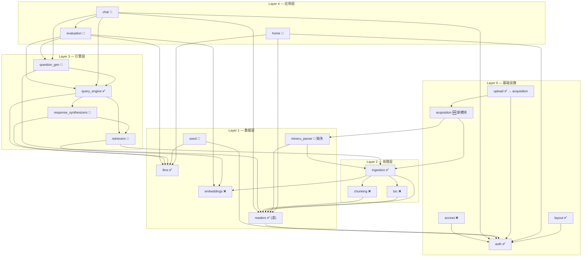

# Textbook-RAG v2 — 功能路线图：总览

> 对照 [module-manifest.md](../module-manifest.md) 每个功能点，标注实际实现状态。
> 格式沿用 manifest 的 Layout / UI / UX / Func 维度，用 ✅ ❌ 标注。

**图例** — ✅ 已实现 · ❌ 未实现

---

## 核心产品洞察

> **如果用户不知道问什么好问题，对话就是扯犊子。**
>
> `question_gen` 的定位不是"后台出题工具"，而是 **chat 的上游供给系统**：
> 1. **问题推荐 (Suggest)** — 用户打开对话时，基于书本章节推荐高价值问题
> 2. **问题质量识别 (Quality)** — 判断用户问题是否有深度（浅层复述 / 深度理解 / 跨章关联）
> 3. **重复检测 (Dedup)** — 识别"老客"（重复/相似问题），引导用户深入而非重复

---

## LlamaIndex 对齐原则

> **在开发任何功能之前，先查 LlamaIndex 是否已有对应能力。**
>
> 参考源码：`.github/references/llama_index/llama-index-core/llama_index/core/`
>
> **已对齐** — ingestion (`IngestionPipeline`) · retrievers (`QueryFusionRetriever`) · response_synthesizers (`get_response_synthesizer`) · query_engine (`RetrieverQueryEngine`) · evaluation (`FaithfulnessEvaluator` + `RelevancyEvaluator` + `CorrectnessEvaluator` + `BatchEvalRunner`)
>
> **需对齐** — question_gen 数据访问层（当前直接 ChromaDB API 绕过 LlamaIndex） · retrievers 缺 Reranker (`LLMRerank` / `SentenceTransformerRerank`) · evaluation 需扩展为统一评估中枢：问题深度用 `CorrectnessEvaluator` 自定义模板 + 去重用 `SemanticSimilarityEvaluator` + 5 维评估 (`ContextRelevancyEvaluator` / `AnswerRelevancyEvaluator`) + 反馈循环
>
> **不需对齐** — readers (MinerUReader 是自定义 Reader，LlamaIndex 无 MinerU 集成) · toc (纯文本解析) · 前端全部模块

---

## 依赖关系图



> 箭头方向：A → B = "A 依赖 B"。被依赖最多的模块最先完善。

---

## 实施路线

> 各 Sprint 详情见独立文件。总计 147 stories, ~401.5h（含 Sprint Demo 14 stories）。

| Sprint | 文件 | 目标 | 工时 | 状态 |
|--------|------|------|------|------|
| **Hotfix** | [10-sprint-hotfix.md](./10-sprint-hotfix.md) | **上传→摄取管线修通** (P0) | 20h (7 stories) | 🚧 6/7 |
| Sprint 1 | [01-sprint1.md](./01-sprint1.md) | 端到端用户旅程闭环 | 52h (17 stories) | ✅ 100% |
| Sprint 2 | [02-sprint2.md](./02-sprint2.md) | 问题生成闭环 + 评估中枢 + 引用UX + 持久化 | 78h (30 stories) | 🚧 21/30 |
| **Demo** | [12-sprint-demo.md](./12-sprint-demo.md) | **展示日冲刺** — 全书搜索+暖色主题+建议问题+Citation Score+Report MVP+Admin分离 | 10.5h (14 stories) | 🆕 |
| Sprint 3 | [03-sprint3.md](./03-sprint3.md) | 评估图表+反馈 + 多题型 + toc | 24h (8 stories) | ❌ |
| Sprint 4 | [04-sprint4.md](./04-sprint4.md) | 基建补全 | 29h (11 stories) | ❌ |
| Sprint 5 | [06-sprint5.md](./06-sprint5.md) | 智能检索 + 多步推理 (DeepTutor Tier 1) | 30h (10 stories) | ❌ |
| Sprint 6 | [07-sprint6.md](./07-sprint6.md) | 问题生成升级 + Web Search (DeepTutor Tier 2) | 28h (9 stories) | ❌ |
| Sprint 7 | [08-sprint7.md](./08-sprint7.md) | 架构升级 + 用户记忆 (DeepTutor Tier 3) | 40h (11 stories) | ❌ |
| Sprint 8 | [09-sprint8.md](./09-sprint8.md) | 多角色报告生成引擎 | 56h (17 stories) | ❌ |
| **Acquisition** | [11-sprint-acquisition.md](./11-sprint-acquisition.md) | **导入模块独立化 + 数据透明化** (5-Tab 设计) | 34h (13 stories) | 🚧 5/13 |

---

## 模块现状

> 各模块状态卡详见 [05-module-status.md](./05-module-status.md)

---

## 总览

```
完成度 (2026-04-09 更新)
├── ✅  完成 (5)       layout · auth · ingestion(读) · query_engine · llms
├── 🚧  部分实现 (9)   readers · home · seed · chat · retrievers · response_synthesizers · evaluation · question_gen · acquisition
├── 🆕  新建 (1)       report (Sprint Demo MVP)
└── ❌  缺前端 (4)     chunking · toc · embeddings · access

Sprint 分期 (147 Stories, ~401.5h)
├── Hotfix (P0, 1w, 7 stories, 20h)   管线修通 → 🚧 6/7 完成 (仅剩端到端验证 HF-07)
├── S1 (P0, 3w, 17 stories, 52h)      readers上传 · question_gen推荐 · chat流式+推荐 · query_engine前端 · response_synthesizers编辑  → ✅ 100%
├── S2 (P0→P1, 3w, 30 stories, 78h)   ✅qgen(5/5) ✅citation(7/7) ✅eval(5/5) ✅chat持久化(4/4) ❌retrievers(0/4) ❌home(0/3) ❌seed(0/2) → 🚧 21/30
├── Demo (P0, 1d, 14 stories, 10.5h)  全书搜索 · 暖色主题 · 建议问题 · Citation Score · Report MVP · Admin分离 → 🆕
├── Acquisition (P1, 2w, 13 stories, 34h)  5-Tab导入模块 (AQ-08 Pipeline Tab 进行中) → 🚧 5/13
├── S3 (P2, 3w, 8 stories, 24h)       evaluation图表+反馈循环 · question_gen多题型 · toc前端 → ❌
├── S4 (P3, 2w, 11 stories, 29h)      chunking前端 · embeddings前端 · llms增强 · access UI → ❌
├── S5 (P0, 2w, 10 stories, 30h)      StreamEvent统一流式 · smart_retrieve多查询 · Deep Solve多步推理 → ❌
├── S6 (P1, 2w, 9 stories, 28h)       Deep Question Mimic · Web Search fallback · Reason前端 → ❌
├── S7 (P2, 3w, 11 stories, 40h)      UnifiedContext · Tool/Capability插件 · 用户记忆 → ❌
└── S8 (P1, 3w, 17 stories, 56h)      多角色报告模板 · 数据收集+分析 · 图表可视化 · 报告合成+PDF导出 → ❌

关键路径 (十一条线)
├── ✅ 上传链: UploadZone → Books.pdfMedia(HF-01) ✅ → afterChange(HF-02) ✅ → PDF下载(HF-03) ✅ → MinerU解析(HF-04) ✅ → IngestionPipeline → ChromaDB → 可对话
├── ✅ 数据链: auth ✅ → readers ✅ → ingestion ✅ → 数据就绪
├── 🚧 检索链: ingestion ✅ → retrievers(S2 剩余) → query_engine ✅ → chat
├── ✅ 问题链: readers ✅ → question_gen ✅推荐 → chat ✅流式+推荐
├── ✅ 生成链: generator(S2-BE-06) ✅ → API(S2-BE-07) ✅ → 前端(S2-FE-09) ✅ → QuestionsPage(S2-FE-10) ✅
├── ✅ 引用链: Prompt段落化(CX-BE-01) ✅ → full_content(CX-BE-02) ✅ → AnswerBlock(CX-FE-02) ✅ → CitationChip(CX-FE-03) ✅ → 段落高亮(CX-FE-04) ✅
├── ✅ 持久化链: ChatSessions集合(CH-BE-01) ✅ → useChatHistory重构(CH-FE-01) ✅ → ChatPanel适配(CH-FE-02) ✅ → evaluation去重接入(CH-FE-03) ✅
├── 🚧 评估链: 5维评估(EV-BE-01) ✅ → 问题深度+去重(EV-BE-02) ✅ → 质量API(EV-BE-03) ✅ → 反馈循环(EV-BE-04) ❌ → 趋势仪表盘(EV-FE-02) ✅
├── ❌ 智能检索链: StreamEvent(S5) → smart_retrieve(S5) → Deep Solve(S5) → 前端trace(S5)
├── 🆕 报告链(MVP): Reports集合(Demo) → 生成API(Demo) → ReportPage(Demo) → Sidebar入口(Demo)  ← Sprint Demo MVP
├── ❌ 报告链(完整): 模板Registry(S8) → 数据收集(S8) → LLM分析+图表(S8) → 报告合成(S8) → PDF导出(S8) → 报告中心UI(S8)
└── ❌ 架构链: UnifiedContext(S7) → Tool/Capability注册(S7) → Orchestrator(S7) → Memory(S7)
```

---

## 待重构

### ~~Book → Document 全局重命名~~ — 取消

> 改名涉及 28+ 文件 + DB 迁移 + ChromaDB metadata key，成本过高。保留 Book 命名。

### ✅ shared/books 提取（已完成）

```
└── 完成: 统一 BookBase 类型 + fetchBooks API + useBooks hook + useBookSidebar hook
    ├── 模块: features/shared/books/
    └── 消费方: QuestionsPage / LibraryPage / BookPicker / ChatPage / ChatHeader / ChatInput / WelcomeScreen
```

### ✅ PdfViewer → shared/pdf/ 提取（已完成）

```
迁移
├── retrievers/components/PdfViewer.tsx   → shared/pdf/PdfViewer.tsx     ✅
├── retrievers/components/BboxOverlay.tsx → shared/pdf/BboxOverlay.tsx   ✅
├── 旧位置保留 re-export proxy（向后兼容）
└── 更新 import: chat/ChatPage                                           ✅
```

### answer/trace 模式删除（Sprint 3 [S3-FE-01] 执行）

```
删除
├── chat/panel/ModeToggle.tsx              删除组件
├── AppContext.tsx                          删除 chatMode: "answer" | "trace"
├── ChatPanel.tsx                          删除 TracePanel / ThinkingProcessPanel 渲染
└── 迁移: TracePanel → evaluation 模块独立页面 [S3-FE-01] [S3-FE-02]
```
