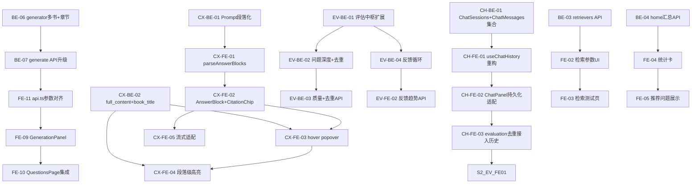

# Sprint 2 — 问题生成闭环 + 统一评估中枢 + 引擎可调（约 3 周）

> 目标：跑通分类/分书/分章节生成问题 → **evaluation 统一评估中枢**（问题质量+去重+5维回答评估+反馈循环） → 管理员可调参 → **答案+引用 UX 闭环** → **聊天历史持久化到 Payload**。

## 概览

| Epic | Story 数 | 预估总工时 | 完成 | LlamaIndex 对齐 |
|------|----------|-----------|------|----------------|
| **question_gen 生成闭环** | **5** | **12h** | ✅ 5/5 | ⚠️ generator.py 绕过 LlamaIndex |
| **Citation UX 升级** | **7** | **18h** | ✅ 7/7 | 🔄 保留自定义 prompt，不用 CitationQueryEngine |
| **evaluation 统一评估中枢** | **5** | **13h** | ✅ 5/5 | ✅ 直接使用 LlamaIndex 评估器。🗑️ EV-FE-01 已取消（实时评估不符合 LlamaIndex 离线分析范式） |
| **chat 持久化** | **4** | **12h** | ✅ 4/4 | — |
| retrievers UI + Reranker | 4 | 10h | ⏸️ 1/4 | ⏸️ P4 延后 — 纯调试工具，等 S5 智能检索时一并实现 |
| home 仪表盘 | 3 | 8h | ⏸️ 0/3 | ⏸️ P4 延后 — 纯展示 polish，不解锁新能力 |
| seed 日志+同步 | 2 | 5h | ⏸️ 0/2 | ⏸️ P4 延后 — 锦上添花，手动同步可用 |
| **合计** | **30** | **78h** | **21/30** |

## 质量门禁（每个 Story 交付前必做）

| # | 检查项 | 判定依据 |
|---|--------|----------|
| G1 | **模块归属判断** | 同 Sprint 1。**重点：质量评估 / 去重 / 反馈循环全部在 `engine_v2/evaluation/`，不在 `question_gen/`**。API 路由层桥接（`api/routes/questions.py` 可同时 import `question_gen/` 和 `evaluation/`）。`retrievers` UI 在 `features/engine/retrievers/components/`；`home` 统计组件在 `features/home/` 而非 `shared/`。**聊天持久化集合在 `collections/ChatSessions.ts` + `collections/ChatMessages.ts`，前端 hook 在 `features/chat/history/`** |
| G2 | **文件注释合规** | 同 Sprint 1。重点：evaluator.py 扩展用 §1.2；前端 hook 用 §3.23 |
| G3 | **LlamaIndex 对齐** | **禁止自写 LLM prompt 做评估**。问题深度直接用 `CorrectnessEvaluator(eval_template=自定义)`；去重直接用 `SemanticSimilarityEvaluator`；5维评估扩展用 `ContextRelevancyEvaluator` + `AnswerRelevancyEvaluator`；reranker 使用 `NodePostprocessor` 标准接口 |

## 依赖图



---

## Epic: question_gen 生成闭环 (P0, 最高优先)

> **问题**: Sprint 1 的 generator.py 后端只接受单个 `book_id`，前端发 `book_ids` 数组 → 参数不匹配；QuestionsPage 没有生成入口（只展示已有问题）；api.ts 默认端口 8000 vs 实际 8001。
>
> **目标**: 用户可在 QuestionsPage 按 **分类 → 分书 → 分章节** 三级筛选，点击生成问题，生成后自动刷新列表。

### [S2-BE-06] generator.py 支持 book_ids + category + chapter_key

**类型**: Backend · **优先级**: P0 · **预估**: 3h

**描述**: 重构 QuestionGenerator，支持 book_ids 数组 + category / chapter_key 过滤。ChromaDB metadata 已有 `book_id`, `category`, `chapter_key` 三个字段（MinerUReader 写入），直接用 `where` 过滤即可。

**验收标准**:
- [x] `generate()` 增加 `book_ids: list[str] | None` 参数（替代单个 `book_id`）
- [x] 增加 `category: str | None` 参数，按大类筛选 chunks
- [x] 增加 `chapter_key: str | None` 参数，按章节筛选 chunks
- [x] ChromaDB `where` 过滤组合: `$and` / `$or` 条件拼装
- [x] 兼容旧的单 `book_id` 参数（降级为 `book_ids=[book_id]`）
- [x] 迁移 `logging` → `loguru`
- [x] G1 ✅ 在 `engine_v2/question_gen/generator.py`
- [x] G2 ✅ 文件头注释符合 §1.2 模块实现模板

**依赖**: 无
**文件**: `engine_v2/question_gen/generator.py`

### [S2-BE-07] /questions/generate API 升级

**类型**: Backend · **优先级**: P0 · **预估**: 2h

**描述**: 升级 GenerateRequest，接受 book_ids 数组 + category + chapter_key 参数。返回结构增加 book_title / chapter_key 元数据。

**验收标准**:
- [x] `GenerateRequest` 增加 `book_ids: list[str] | None`、`category: str | None`、`chapter_key: str | None`
- [x] 兼容旧的单 `book_id` 参数
- [x] 返回结果每个 question 包含 `book_id`, `book_title`, `chapter_key` 元数据
- [x] 迁移 `logging` → `loguru`
- [x] G1 ✅ 路由在 `engine_v2/api/routes/questions.py`
- [x] G2 ✅ 注释符合 §1.7 API 路由模板

**依赖**: [S2-BE-06]
**文件**: `engine_v2/api/routes/questions.py`

### [S2-FE-11] api.ts 端口 + 参数对齐

**类型**: Frontend · **优先级**: P0 · **预估**: 1h

**描述**: 修正 ENGINE 默认端口 8000 → 8001，`generateQuestions()` 参数与后端 `GenerateRequest` 对齐。

**验收标准**:
- [x] `ENGINE` 默认端口改为 `8001`
- [x] `generateQuestions()` 参数增加 `category`, `chapterKey`，与后端对齐
- [x] G1 ✅ 文件在 `features/engine/question_gen/api.ts`
- [x] G2 ✅ 注释符合 §3.22 Engine API 模板

**依赖**: [S2-BE-07]
**文件**: `features/engine/question_gen/api.ts`

### [S2-FE-09] GenerationPanel 三级选择器

**类型**: Frontend · **优先级**: P0 · **预估**: 4h

**描述**: 创建三级生成面板：分类别 → 分书 → 分章节。选择后触发 LLM 生成问题。集成 GenerationProgress 进度动画。

**验收标准**:
- [x] 创建 `features/engine/question_gen/components/GenerationPanel.tsx`
- [x] 三级筛选: category 下拉 → 该类下的 books 多选 → 选中书的 chapters 多选
- [x] 生成按钮 + count 滑块 (1-20)
- [x] 生成中展示 GenerationProgress 步骤动画
- [x] 生成完成后回调 `onGenerated(questions)`
- [x] 接入 useBooks hook 获取书列表（按 category/subcategory 分组）
- [x] 章节列表从 Engine TOC API 获取 *(GET /engine/books/{book_id}/toc)*
- [x] G1 ✅ 组件在 `features/engine/question_gen/components/`
- [x] G2 ✅ 文件头注释符合 §3.12 通用组件模板

**依赖**: [S2-FE-11]
**文件**: `features/engine/question_gen/components/GenerationPanel.tsx`

### [S2-FE-10] QuestionsPage 生成入口集成

**类型**: Frontend · **优先级**: P0 · **预估**: 2h

**描述**: 将 GenerationPanel 嵌入 QuestionsPage 顶部（可折叠），生成后自动刷新问题列表。

**验收标准**:
- [x] QuestionsPage 工具栏增加 "Generate" 按钮，点击展开 GenerationPanel
- [x] GenerationPanel 嵌入 QuestionsPage 顶部，可折叠
- [x] 生成完成后自动调用 `load()` 刷新列表
- [x] 接入 `useQuestionGeneration` hook（或直接用 `generateQuestions` API） *(GenerationPanel 直接调用 api.ts)*
- [x] G1 ✅ 改动在 `features/engine/question_gen/components/`
- [x] G2 ✅ QuestionsPage 注释更新

**依赖**: [S2-FE-09]
**文件**: `features/engine/question_gen/components/QuestionsPage.tsx`

---

## Epic: Citation UX 升级 (P0)

> **问题**: 当前答案是连续文字 + 散落的 `[N]` 上标，引用不直观，用户无法快速核对原文。答案不分块，一大段后面随便挂几个编号；citation 只显示蓝色数字，不显示书名页码；hover 只有 title tooltip（不可读公式）；click 跳转后只高亮一句话而非整段支撑原文。
>
> **目标**: 答案按"一个完整意思一个答案块"组织，每块末尾绑定行内引用 chip（默认显示书名+页码），hover 预览原文（Markdown+KaTeX），click 跳转 PDF 并高亮整段支撑原文。
>
> **LlamaIndex 参考**: `CitationQueryEngine` (`llama_index.core.query_engine.citation_query_engine`) 在检索后做 citation 粒度分块（`_create_citation_nodes()`），把大 chunk 按 `citation_chunk_size=512` 再切成小块并编号 `Source N:`。当前项目用 `RetrieverQueryEngine` + 自定义 citation prompt，引用粒度等于 chunk 粒度。可评估是否切换到 `CitationQueryEngine` 获取更细粒度引用，但自定义 prompt 更适合教科书场景，后端 Story 保留自定义方案。

### [S2-CX-BE-01] Prompt 升级：LLM 按语义段落输出

**类型**: Backend · **优先级**: P0 · **预估**: 2h

**描述**: 修改 `CITATION_QA_TEMPLATE`，指导 LLM 按语义段落组织答案。每段表达一个完整意思，每段末尾集中放置 `[N]` 引用，不在句中间散落 citation。

**验收标准**:
- [x] 更新 `engine_v2/response_synthesizers/citation.py` 的 CITATION_QA_TEMPLATE
- [x] LLM 输出的每个段落末尾集中出现 `[N]` 标记
- [x] 段落之间用空行分隔（Markdown 段落格式）
- [x] 不再出现句中间夹 `[N]` 的情况
- [x] G1 ✅ 在 `engine_v2/response_synthesizers/`
- [x] G2 ✅ 注释符合 §1.2 模块实现模板，logging → loguru

**依赖**: 无
**文件**: `engine_v2/response_synthesizers/citation.py`

### [S2-CX-BE-02] _build_source 携带 full_content + book_title

**类型**: Backend · **优先级**: P0 · **预估**: 2h

**描述**: `_build_source()` 返回完整 chunk 内容（`full_content`，用于前端 hover 预览 + PDF 段落级高亮）和 `book_title` / `chapter_title` 字段（从 metadata 读取）。

**验收标准**:
- [x] source 包含 `full_content` 字段（完整 chunk 文本，最大 2000 字符）
- [x] source 包含 `book_title` 字段（从 node.metadata 读取）
- [x] source 包含 `chapter_title` 字段（从 node.metadata 读取）
- [x] `snippet` 字段保留为 `full_content[:300]`（向后兼容）
- [x] 统一提取 `_build_source` → `engine_v2/schema.py:build_source()`，`query.py` 和 `citation.py` 共享
- [x] G1 ✅ 共享函数在 `engine_v2/schema.py`，消除 query.py + citation.py 重复代码
- [x] G2 ✅ 注释符合 §1.4 领域模型模板

**依赖**: 无
**文件**: `engine_v2/api/routes/query.py`, `engine_v2/query_engine/citation.py`

### [S2-CX-FE-01] parseAnswerBlocks() 解析器

**类型**: Frontend · **优先级**: P0 · **预估**: 3h

**描述**: 将 LLM 输出的连续文本解析为 `AnswerBlock[]`。按 `\n\n` 分段，每段尾部的 `[N]` 提取为 `citationIndices`，段内文字为 `text`。

**验收标准**:
- [x] 创建 `features/chat/panel/answerBlocks.ts`
- [x] 导出 `AnswerBlock` 接口和 `parseAnswerBlocks()` 函数
- [x] 按 `\n\n` 分段，每段尾部 `[N]` 提取到 `citationIndices`
- [x] 连续 heading (`## XXX`) 不被错误分割
- [x] 空输入返回 `[]`；无分段 fallback 为单 block
- [x] G1 ✅ 在 `features/chat/panel/`
- [x] G2 ✅ 文件头注释符合 §3.12

**依赖**: [S2-CX-BE-01]
**文件**: `features/chat/panel/answerBlocks.ts`

### [S2-CX-FE-02] AnswerBlock + CitationChip 组件

**类型**: Frontend · **优先级**: P0 · **预估**: 4h

**描述**: 替换 `MessageBubble` 中 AI 消息的渲染方式。不再用一个大 markdown blob，而是渲染 `AnswerBlock[]`，每个 block 后面跟 `CitationChip` 行。CitationChip 默认显示 `📖 BookName · p.42` 而非仅 `[1]`。

**验收标准**:
- [x] 创建 `features/chat/panel/AnswerBlockRenderer.tsx`
- [x] 创建 `features/chat/panel/CitationChip.tsx`
- [x] AI 消息按 AnswerBlock 渲染，每块之间有视觉分隔
- [x] 每个 block 后面的 CitationChip 默认显示 `book_title · p.N`
- [x] 用户消息渲染不受影响
- [x] 无 sources 或 streaming 时 fallback 到原有渲染
- [x] G1 ✅ 组件在 `features/chat/panel/`
- [x] G2 ✅ 文件头注释符合 §3.12 通用组件模板

**依赖**: [S2-CX-FE-01]
**文件**: `features/chat/panel/AnswerBlockRenderer.tsx`, `features/chat/panel/CitationChip.tsx`, `features/chat/panel/MessageBubble.tsx`

### [S2-CX-FE-03] CitationChip hover popover

**类型**: Frontend · **优先级**: P0 · **预估**: 2h

**描述**: hover CitationChip 200ms 后弹出 popover，展示该 citation 对应的完整原文（`full_content`，Markdown+KaTeX 渲染）。从 SourceCard.tsx 提取共享的 CitationPopover 组件。

**验收标准**:
- [x] 创建 `features/chat/panel/CitationPopover.tsx`（从 SourceCard 提取 popover 逻辑）
- [x] popover 使用 `full_content`（而非截断 snippet）
- [x] popover header 显示 `[N] book_title · chapter_title · p.N`
- [x] popover 支持 Markdown + KaTeX 渲染
- [x] popover portal 到 document.body，不受 overflow 裁切
- [x] 滚动时自动关闭；mouse 可在 chip↔popover 间平滑移动
- [x] G1 ✅ 在 `features/chat/panel/`
- [x] G2 ✅ 注释符合 §3.12

**依赖**: [S2-CX-BE-02], [S2-CX-FE-02]
**文件**: `features/chat/panel/CitationPopover.tsx`, `features/chat/panel/CitationChip.tsx`, `features/chat/panel/SourceCard.tsx`

### [S2-CX-FE-04] PdfViewer 段落级高亮

**类型**: Frontend · **优先级**: P0 · **预估**: 3h

**描述**: 点击 CitationChip 后，PdfViewer 跳转到对应页码并高亮**整段原文**（使用 `full_content` 做匹配），而非仅高亮一句话。

**验收标准**:
- [x] `highlightSnippetInPage()` 升级为接受 `fullContent` 参数，优先使用 `full_content` 匹配
- [x] 高亮覆盖整段支撑原文（段落级 bounding rect，多行合并）
- [x] 当 `full_content` 匹配失败时，fallback 到 `snippet` 匹配（向后兼容）
- [x] BboxOverlay 逻辑不受影响（MinerU bboxes 优先）
- [x] G1 ✅ 在 `features/shared/pdf/`
- [x] G2 ✅ 注释符合已有模板

**依赖**: [S2-CX-BE-02], [S2-CX-FE-03]
**文件**: `features/shared/pdf/PdfViewer.tsx`

### [S2-CX-FE-05] 流式渲染适配

**类型**: Frontend · **优先级**: P1 · **预估**: 2h

**描述**: streaming 状态下，答案按 block 渐次出现（检测到 `\n\n` 时产生新 block）。已完成的 block 不闪烁，最后一个 block 带打字机光标。streaming 时不显示 CitationChip（sources 未到），`onDone` 后自动切换为完整渲染。

**验收标准**:
- [x] streaming 时 plain text 渲染（isStreaming=true → 无 Markdown 解析）
- [x] streaming 时不显示 CitationChip（无 sources 传入）
- [x] streaming 结束后自动切换为完整渲染（含 CitationChip + CitationPopover）
- [x] 性能不退化（RAF 批量刷新保留，useSmoothText 打字机效果保留）
- [x] G1 ✅ 在 `features/chat/panel/`
- [x] G2 ✅ MessageBubble 注释重写符合 §3.12

> ✅ 流式适配零改动：ChatPanel 已正确区分 streaming bubble（plain text）和 finalized message（AnswerBlockRenderer），无须额外代码。

**依赖**: [S2-CX-FE-02]
**文件**: `features/chat/panel/ChatPanel.tsx`, `features/chat/panel/MessageBubble.tsx`

---

## Epic: evaluation 统一评估中枢 (P1)

> **架构决策**: 所有评估逻辑统一在 `evaluation/` 模块。评估数据来源于 **Queries / ChatMessages 中的真实生产数据**（用户实际收到的回答），不重新跑 RAG 管线。评估结果持久化到 `Evaluations` 集合，支持趋势分析和反馈循环。
>
> **LlamaIndex 对齐**: 使用 `BatchEvalRunner.aevaluate_response_strs()` 评估已存在的 (query, response, contexts)，不用 `aevaluate_queries()` 重新跑管线。
>
> | 能力 | LlamaIndex 评估器 | 数据来源 |
> |------|------------------|----------|
> | 回答忠实度 | `FaithfulnessEvaluator` | Queries.answer + Queries.sources |
> | 回答相关性 | `RelevancyEvaluator` | Queries.answer + Queries.question |
> | 回答正确性 | `CorrectnessEvaluator` | Queries.answer (需 reference) |
> | 上下文相关 | `ContextRelevancyEvaluator` | Queries.sources |
> | 答案相关 | `AnswerRelevancyEvaluator` | Queries.answer |
> | 问题深度 | `QuestionDepthEvaluator` | ChatMessages (role=user) |
> | 问题去重 | `SemanticSimilarityEvaluator` | ChatMessages (role=user) |
> | 批量评估 | `BatchEvalRunner` | Queries 批量拉取 |

### [S2-EV-BE-01] evaluator.py 扩展到 5 维 + 工厂函数

**类型**: Backend · **优先级**: P1 · **预估**: 3h

**描述**: 扩展 `evaluator.py`，从 3 维（faithfulness + relevancy + correctness）升级到 5 维（+ context_relevancy + answer_relevancy）。新增 `build_evaluators()` 工厂函数，按场景返回评估器字典。新增 `QuestionDepthEvaluator` 类，继承 `CorrectnessEvaluator` 并替换 `eval_template` 为问题认知深度评估模板。

**LlamaIndex 对齐**: 直接 import 并使用 `ContextRelevancyEvaluator`、`AnswerRelevancyEvaluator`、继承 `CorrectnessEvaluator`。参考源码：`.github/references/llama_index/llama-index-core/llama_index/core/evaluation/`

**验收标准**:
- [x] 更新 `engine_v2/evaluation/evaluator.py` *(447 行，完整实现)*
- [x] 新增 `QuestionDepthEvaluator(CorrectnessEvaluator)` — 自定义 `eval_template` 评估问题认知深度（1-5 分），业务层 threshold 映射：≥4.0 → synthesis / ≥2.5 → understanding / <2.5 → surface
- [x] 新增 `build_evaluators(mode)` 工厂 — `mode="response"` 返回 5 维回答评估器；`mode="question"` 返回问题深度评估器
- [x] `evaluate_response()` 升级为 5 维评估（新增 `context_relevancy` + `answer_relevancy`）
- [x] `evaluate_dataset()` 使用 `build_evaluators()` + `BatchEvalRunner`
- [x] 迁移 `logging` → `loguru`
- [x] G1 ✅ **全部在 `engine_v2/evaluation/`**，不在 `question_gen/`
- [x] G2 ✅ 文件头注释符合 §1.2 模块实现模板
- [x] G3 ✅ 直接继承/使用 LlamaIndex 评估器，不自写 LLM prompt

**依赖**: 无
**文件**: `engine_v2/evaluation/evaluator.py`

### [S2-EV-BE-02] question_dedup() 向量相似度去重

**类型**: Backend · **优先级**: P1 · **预估**: 2h

**描述**: 在 `evaluation/` 中新增问题去重函数，直接使用 LlamaIndex `SemanticSimilarityEvaluator`（内部用 `Settings.embed_model`）做向量相似度匹配。无需手写余弦计算。

**LlamaIndex 对齐**: 直接使用 `SemanticSimilarityEvaluator`，其内部已用 `Settings.embed_model` 做向量化 + 余弦相似度计算。参考源码：`.github/references/llama_index/llama-index-core/llama_index/core/evaluation/semantic_similarity.py`

**验收标准**:
- [x] 在 `engine_v2/evaluation/evaluator.py` 新增 `question_dedup(question, history_questions, threshold)` 函数
- [x] 内部使用 `SemanticSimilarityEvaluator(similarity_threshold=0.85)` 逐条对比
- [x] 返回 `DedupResult(is_duplicate, most_similar, similarity_score, suggestion)`
- [x] 当检测到重复时，`suggestion` 字段给出深入方向建议
- [x] G1 ✅ 在 `engine_v2/evaluation/`，Noun 集 (Duplicate, Similar)
- [x] G2 ✅ 注释符合 §1.2 模块实现模板
- [x] G3 ✅ 直接使用 `SemanticSimilarityEvaluator`，不手写余弦计算

**依赖**: [S2-EV-BE-01]
**文件**: `engine_v2/evaluation/evaluator.py`

### [S2-EV-BE-03] 质量+去重 API 端点

**类型**: Backend · **优先级**: P1 · **预估**: 2h

**描述**: 暴露质量评估和去重检测的 API 端点。路由在 `api/routes/questions.py`，内部调用 `evaluation/` 模块（路由层桥接，不违反子模块间禁止规则）。

**验收标准**:
- [x] ~~更新 `engine_v2/api/routes/questions.py`~~ → 改为在 `engine_v2/api/routes/evaluation.py` 增加 `POST /evaluation/quality` 和 `POST /evaluation/dedup` 路由 *(评估端点归属 evaluation 路由更合理)*
- [x] `/evaluation/quality` 调用 `evaluation.evaluator.assess_question_depth()`，返回 `{question, depth, score, reasoning}`
- [x] `/evaluation/dedup` 调用 `evaluation.evaluator.question_dedup()`，返回 `{is_duplicate, most_similar, similarity_score, suggestion}`
- [x] G1 ✅ 路由在 `engine_v2/api/routes/evaluation.py`，**import evaluation/ 直接同模块**（更清晰的归属）
- [x] G2 ✅ 注释更新符合 §1.7 API 路由模板，docstring 列出全部 4 个端点

**依赖**: [S2-EV-BE-01], [S2-EV-BE-02]
**文件**: `engine_v2/api/routes/evaluation.py`

### [S2-EV-BE-04] evaluate_from_history() — 基于真实数据评估 + 结果持久化

**类型**: Backend · **优先级**: P1 · **预估**: 4h

**描述**: 新增 `evaluation/history.py`，从 Payload Queries 集合拉取真实的 (query, answer, sources)，使用 `BatchEvalRunner.aevaluate_response_strs()` 评估已存在的回答（不重新跑 RAG），评估结果写入 Evaluations 集合。新增 API 端点 `POST /evaluation/evaluate-history` 和 `POST /evaluation/evaluate-batch`。

**核心理念**: 评估的是用户实际收到的答案，不是重新生成的答案。

**验收标准**:
- [x] 创建 `engine_v2/evaluation/history.py`
- [x] `evaluate_single_from_query(query_id)` — 从 Payload Queries 拉取指定记录，评估其已有的 (question, answer, sources)，返回 4 维分数（无 correctness，因缺 reference answer）
- [x] `evaluate_batch_from_queries(n_recent, batch_id)` — 拉取最近 N 条 Queries 记录，逐条调用 LlamaIndex 评估器
- [x] 评估结果自动写入 Payload Evaluations 集合（含 batchId 分组）
- [x] 新增 API 路由 `POST /evaluation/evaluate-history` (单条) + `POST /evaluation/evaluate-batch` (批量) + `GET /evaluation/queries` (列表)
- [x] Evaluations 集合新增 `queryRef` relationship 字段（关联原始 Queries 记录）+ `contextRelevancy` / `answerRelevancy` 字段（补全 5 维）
- [x] G1 ✅ 在 `engine_v2/evaluation/`，API 在 `engine_v2/api/routes/evaluation.py`
- [x] G2 ✅ 文件头注释符合 §1.2 模块实现模板
- [x] G3 ✅ 使用 LlamaIndex `FaithfulnessEvaluator` + `RelevancyEvaluator` + `ContextRelevancyEvaluator` + `AnswerRelevancyEvaluator` 评估已有数据，不重新跑 RAG

**依赖**: [S2-EV-BE-01], Queries 集合 ✅, Evaluations 集合 ✅
**文件**: `engine_v2/evaluation/history.py`, `engine_v2/api/routes/evaluation.py`, `collections/Evaluations.ts`

### ~~[S2-EV-FE-01] ChatInput 质量提示集成~~ — 🗑️ 已取消

> **取消原因**: 实时评估不符合 LlamaIndex 离线分析范式。每次按键触发 LLM 调用（问题深度）+ 嵌入计算（去重）成本过高，且用户聊天时不需要被"教育"问题质量。评估应作为管理员/开发者工具在 EvaluationPage 离线使用，不应侵入用户聊天流程。
>
> EvaluationPage 已有完整的问题深度 + 去重功能（Tab 2），开发者可在那里测试问题质量。

### [S2-EV-FE-02] EvaluationPage 数据驱动改版

**类型**: Frontend · **优先级**: P1 · **预估**: 4h

**描述**: 重构 EvaluationPage Tab 1，从「手动输入问题→重跑 RAG」改为「从 Queries/ChatMessages 拉取真实数据→评估已有回答」。Tab 3 批量评测对接新的 `POST /evaluation/evaluate-batch` API。

**验收标准**:
- [x] Tab 1 改版：左侧展示 Queries 集合最近 50 条记录列表（问题摘要 + 时间 + 模型 + 源数）
- [x] 点击某条 Query → 右侧显示查询详情 + 回答预览 + 4 维评估分数
- [x] 「评估」按钮调用 `POST /evaluation/evaluate-history`（评估已有回答，不重跑 RAG）
- [x] 已评估记录直接从 Evaluations 集合读取（通过 queryRef 关联，无需重复评估）
- [x] Tab 3 批量评测：数量滑块（5-50 条）→ 调用 batch API → 展示聚合分数 + 逐条结果
- [x] 更新 `features/engine/evaluation/api.ts` 新增 `evaluateFromHistory()` + `evaluateBatchFromHistory()` + `fetchQueriesForEval()` API 函数
- [x] G1 ✅ 改动在 `features/engine/evaluation/`
- [x] G2 ✅ 注释符合已有模板

**依赖**: [S2-EV-BE-04]
**文件**: `features/engine/evaluation/components/EvaluationPage.tsx`, `features/engine/evaluation/api.ts`

---

## Epic: chat 持久化 — 聊天历史持久化到 Payload (P0)

> **问题**: 当前聊天历史仅存在浏览器 `localStorage`（`useChatHistory` hook），换浏览器/清缓存即丢失。`Queries` 集合记录了逐条 Q/A 日志，但没有 session 概念，无法恢复完整对话上下文。评估模块的去重检测需要历史提问列表，但只能手动粘贴，无法自动从服务端拉取。
>
> **目标**: 新建 `ChatSessions` + `ChatMessages` Payload 集合，将聊天会话持久化到服务端数据库。前端 `useChatHistory` 重构为以 Payload API 为主、localStorage 为离线缓存的混合模式。评估模块自动从 Payload 拉取历史用户问题用于去重检测。

### [S2-CH-BE-01] ChatSessions + ChatMessages Payload 集合

**类型**: Backend (Payload) · **优先级**: P0 · **预估**: 3h

**描述**: 新建两个 Payload CMS 集合，将聊天会话和消息持久化到数据库。

**数据模型**:

```
ChatSessions (slug: 'chat-sessions')
├── user         → relationship → users (当前登录用户)
├── title        → text (从首条消息截取)
├── bookIds      → json (sessionBookIds 数组)
├── bookTitles   → json (人类可读书名数组)
├── createdAt / updatedAt (Payload 自动管理)

ChatMessages (slug: 'chat-messages')
├── session      → relationship → chat-sessions
├── role         → select: user | assistant
├── content      → textarea (消息文本)
├── sources      → json (SourceInfo[]，仅 assistant 消息)
├── trace        → json (QueryTrace，仅 assistant 消息)
├── createdAt (Payload 自动管理)
```

**验收标准**:
- [x] 创建 `collections/ChatSessions.ts`，包含 user/title/bookIds/bookTitles 字段
- [x] 创建 `collections/ChatMessages.ts`，包含 session/role/content/sources/trace 字段
- [x] 注册到 `payload.config.ts` 的 collections 数组
- [x] access 规则：用户只能读写自己的会话（`isOwnerOrAdmin`）；消息通过 session 关联鉴权
- [x] admin group 设为 'Chat'
- [x] G1 ✅ 集合在 `collections/` 目录，与 Queries/Evaluations 同级
- [x] G2 ✅ 文件头注释符合 §2.1 Collection 模板

**依赖**: auth ✅
**文件**: `collections/ChatSessions.ts`, `collections/ChatMessages.ts`, `payload.config.ts`

### [S2-CH-FE-01] useChatHistory 重构：Payload API 为主

**类型**: Frontend · **优先级**: P0 · **预估**: 4h

**描述**: 重构 `useChatHistory` hook，从纯 localStorage 改为 Payload API 为主、localStorage 为离线缓存/备份的混合模式。新增 `features/chat/history/api.ts` 封装 Payload ChatSessions/ChatMessages CRUD API。

**验收标准**:
- [x] 创建 `features/chat/history/api.ts`：fetchSessions / createSession / deleteSession / appendMessages / fetchMessages
- [x] 重构 `useChatHistory.ts`：初始化时从 Payload 加载会话列表；创建/删除/追加消息同时写入 Payload + localStorage
- [x] localStorage 作为缓存层：离线时读取本地缓存，在线时优先 Payload
- [x] 兼容未登录状态：未登录时降级为纯 localStorage 模式
- [x] G1 ✅ 所有改动在 `features/chat/history/`
- [x] G2 ✅ api.ts 符合 §3.22，hook 符合 §3.23

**依赖**: [S2-CH-BE-01]
**文件**: `features/chat/history/api.ts`, `features/chat/history/useChatHistory.ts`

### [S2-CH-FE-02] ChatPanel 持久化适配

**类型**: Frontend · **优先级**: P0 · **预估**: 2h

**描述**: 更新 ChatPanel 的 session 创建和消息追加逻辑，适配新的 Payload-backed useChatHistory API。确保创建 session 时写入 user 关联，消息追加时 sources/trace 正确持久化。

**验收标准**:
- [x] ChatPanel `createSession` 传入当前 user ID
- [x] `onDone` 回调中 `appendMessages` 正确写入 Payload（替代 fire-and-forget `/api/queries` 的重复逻辑，或两者共存）
- [x] 会话恢复时从 Payload 加载消息（而非仅依赖 React state）
- [x] 性能：消息追加使用 fire-and-forget（不阻塞 UI），失败时 localStorage 兜底
- [x] G1 ✅ 改动在 `features/chat/panel/ChatPanel.tsx`
- [x] G2 ✅ 注释符合已有模板

**依赖**: [S2-CH-FE-01]
**文件**: `features/chat/panel/ChatPanel.tsx`

### [S2-CH-FE-03] evaluation 去重自动接入聊天历史

**类型**: Frontend · **优先级**: P1 · **预估**: 3h

**描述**: EvaluationPage 的 Question Quality tab 自动从 Payload ChatMessages 拉取当前用户所有 `role='user'` 的历史消息，作为去重检测的 `history_questions` 参数，替代手动粘贴。同时更新 ChatInput 实时质量检测也自动读取历史。

**验收标准**:
- [x] EvaluationPage Question Quality tab 自动加载用户历史问题（从 Payload ChatMessages `where[role][equals]=user`）
- [x] historyInput 文本框改为自动填充 + 可编辑（显示 "N 条已加载" badge）
- [x] ChatInput 质量检测（[S2-EV-FE-01]）直接从 ChatHistoryContext 读取当前 session 的历史问题
- [x] G1 ✅ API 调用在 `features/chat/history/api.ts`，UI 改动在 `features/engine/evaluation/components/`
- [x] G2 ✅ 注释符合已有模板

**依赖**: [S2-CH-FE-02]
**文件**: `features/engine/evaluation/components/EvaluationPage.tsx`, `features/chat/panel/ChatInput.tsx`

---

## Epic: retrievers UI + Reranker (⏸️ P4 延后)

### [S2-BE-05] Reranker NodePostprocessor 接入 ✅

**类型**: Backend · **优先级**: P1 · **预估**: 2h

**描述**: 在 `get_query_engine()` 中接入 LlamaIndex `LLMRerank` 重排器，将检索结果精排后再送入合成器。简化为仅支持 LLMRerank（llama-index-core 内置，零额外依赖）。

**LlamaIndex 对齐**: 直接使用 `llama_index.core.postprocessor.LLMRerank`。参考源码：`.github/references/llama_index/llama-index-core/llama_index/core/postprocessor/llm_rerank.py`

**验收标准**:
- [x] 更新 `engine_v2/query_engine/citation.py` 的 `get_query_engine()` 增加 `reranker` 参数
- [x] `reranker` 为 truthy 值时启用 `LLMRerank(top_n=min(top_k, 5))`；为 None/falsy 时无重排
- [x] ~~SentenceTransformerRerank~~ 已移除（LLMRerank 复用已有 LLM，零额外依赖）
- [x] `TextbookCitationQueryEngine` 构造时传入 `node_postprocessors=[reranker]`
- [x] 默认 `reranker=None`（向后兼容），可通过 API 参数控制
- [x] 前端 `QueryRequest` 类型 + `api.ts` 已透传 `reranker` 参数
- [x] `QueryEnginePage` 增加 LLMRerank 开关
- [x] G1 ✅ 在 `engine_v2/query_engine/`（重排是 query engine 的一部分）
- [x] G2 ✅ 注释更新符合 §1.2
- [x] G3 ✅ 使用 LlamaIndex 标准 `BaseNodePostprocessor` 接口

**依赖**: 无
**文件**: `engine_v2/query_engine/citation.py`

### [S2-FE-02] 检索参数 UI

**类型**: Frontend · **优先级**: P1 · **预估**: 3h

**描述**: top_k / fetch_k / strategy / reranker 参数可调 UI。

**验收标准**:
- [ ] 创建 `features/engine/retrievers/components/RetrieverConfig.tsx`
- [ ] 参数滑块 (top_k, fetch_k) + 策略选择器 (FTS/Vector/Hybrid)
- [ ] **Reranker 选择器** (None / LLMRerank / SBERTRerank) ← 新增
- [ ] 调用 Engine API 更新参数
- [ ] G1 ✅ 组件在 `features/engine/retrievers/components/`
- [ ] G2 ✅ 文件头注释符合 §3.12 通用组件模板

**依赖**: [S2-BE-05], ingestion ✅
**文件**: `features/engine/retrievers/components/RetrieverConfig.tsx`

### [S2-FE-03] 独立检索测试页

**类型**: Frontend · **优先级**: P1 · **预估**: 3h

**描述**: 输入查询→预览检索结果+得分的调试页面。

**验收标准**:
- [ ] 创建 `features/engine/retrievers/components/RetrieverTestPage.tsx`
- [ ] 查询输入 + 结果片段列表 + 得分排序
- [ ] 策略对比 (FTS vs Vector vs Hybrid) + Reranker 开关对比
- [ ] G1 ✅ 在 `features/engine/retrievers/components/`
- [ ] G2 ✅ 页面符合 §3.25 Engine 页面模板

**依赖**: [S2-FE-02]
**文件**: `features/engine/retrievers/components/RetrieverTestPage.tsx`

### [S2-FE-04] retrievers types + api 补全

**类型**: Frontend · **优先级**: P1 · **预估**: 2h

**描述**: 补全 retrievers 前端类型和 API 封装。

**验收标准**:
- [ ] 更新 `features/engine/retrievers/types.ts` 增加配置类型（含 RerankerStrategy）
- [ ] 创建 `features/engine/retrievers/api.ts`
- [ ] G1 ✅ 文件在 `features/engine/retrievers/`
- [ ] G2 ✅ types.ts 符合 §3.21，api.ts 符合 §3.22

**依赖**: 无
**文件**: `features/engine/retrievers/types.ts`, `features/engine/retrievers/api.ts`

---

## Epic: home 仪表盘 (⏸️ P4 延后)

### [S2-BE-04] 数据汇总 API

**类型**: Backend · **优先级**: P1 · **预估**: 2h

**描述**: 首页统计数据聚合端点（书籍数/对话数/索引状态）。

**验收标准**:
- [ ] 创建 `engine_v2/api/routes/stats.py`
- [ ] GET /engine/stats 返回聚合数据
- [ ] G1 ✅ 路由在 `engine_v2/api/routes/`
- [ ] G2 ✅ 文件头注释符合 §1.7 API 路由模板

**依赖**: readers ✅, question_gen S1
**文件**: `engine_v2/api/routes/stats.py`

### [S2-FE-05] 首页统计卡片

**类型**: Frontend · **优先级**: P1 · **预估**: 3h

**描述**: 替换静态展示，显示实时数据统计卡。

**验收标准**:
- [ ] 更新 `features/home/HomePage.tsx`
- [ ] 统计卡: 书籍数量 / 对话次数 / 索引状态
- [ ] 数据自动刷新
- [ ] G1 ✅ 改动在 `features/home/`
- [ ] G2 ✅ HomePage 注释符合 §3.18 功能页面模板

**依赖**: [S2-BE-04]
**文件**: `features/home/HomePage.tsx`

### [S2-FE-06] 首页推荐问题展示

**类型**: Frontend · **优先级**: P1 · **预估**: 3h

**描述**: 首页展示推荐问题预览，点击跳转 chat。

**验收标准**:
- [ ] 更新 `features/home/HomePage.tsx` 增加推荐问题区块
- [ ] 复用 `features/engine/question_gen/components/SuggestedQuestions.tsx`
- [ ] 点击跳转 /chat?book_id=xxx
- [ ] G1 ✅ 引用通过 `shared/` 或 barrel export，不直接跨 feature 引用
- [ ] G2 ✅ 注释更新符合已有模板

**依赖**: [S2-FE-05], question_gen S1
**文件**: `features/home/HomePage.tsx`

---

## Epic: seed 日志+同步 (⏸️ P4 延后)

### [S2-FE-07] 执行日志流

**类型**: Frontend · **优先级**: P2 · **预估**: 3h

**描述**: seed 执行时实时日志输出。

**验收标准**:
- [ ] 更新 `features/seed/SeedPage.tsx` 增加日志面板
- [ ] WebSocket/SSE 实时日志流
- [ ] G1 ✅ 改动在 `features/seed/`
- [ ] G2 ✅ SeedPage 注释符合 §3.18

**依赖**: llms ✅
**文件**: `features/seed/SeedPage.tsx`

### [S2-BE-05] seed → engine 同步

**类型**: Backend · **优先级**: P2 · **预估**: 2h

**描述**: seed 完成后自动同步到 Engine 配置。

**验收标准**:
- [ ] 更新 `collections/endpoints/sync-engine.ts`
- [ ] seed 完成触发引擎配置同步
- [ ] G1 ✅ 端点在 `collections/endpoints/`
- [ ] G2 ✅ 注释符合 §2.2 自定义端点模板

**依赖**: llms ✅
**文件**: `collections/endpoints/sync-engine.ts`
