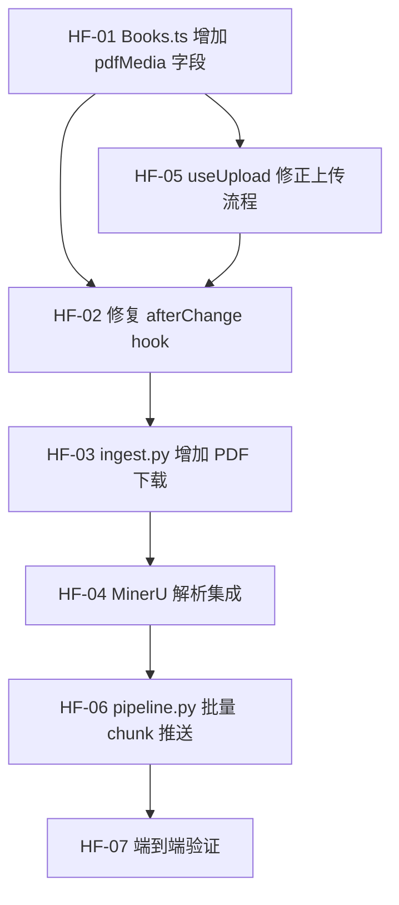

# Sprint Hotfix — 上传→摄取管线修通（紧急）

> **问题**: 用户上传 PDF 的完整链路是断的。当前系统只能处理「已被 MinerU 手动解析过的书」（通过 `sync-engine` 同步到 Payload）。用户通过 UploadZone 上传新 PDF 时，全链路不通。
>
> **目标**: 修通 PDF 上传 → MinerU 解析 → ChromaDB 向量化 → Payload 同步 的完整管线，用户上传一本新 PDF 后可直接对话。

## 概览

| Epic | Story 数 | 预估总工时 | 优先级 |
|------|----------|-----------|--------|
| **上传→摄取管线修通** | **7** | **20h** | P0 — 阻塞全链路 | ✅ 7/7 done |

## 发现的断点

```
用户上传 PDF
    │
    ▼
┌─────────────────────────────────────────────────────┐
│ useUpload.ts                                        │
│ Step 1: POST /api/books → 创建 Book 记录            │ ✅ 正常
│ Step 2: POST /api/media → 上传 PDF 到 Media         │ ✅ 但当 coverImage 存
│ Step 3: PATCH /api/books/{id}                       │
│   → { coverImage: mediaId, filename, status }       │
│   🔴 filename 字段 Books.ts 没定义 → Payload 忽略    │
└─────────────────────────────────────────────────────┘
    │
    ▼
┌─────────────────────────────────────────────────────┐
│ afterChange.ts                                      │
│ 检查 doc.filename → undefined (字段不存在)           │ 🔴 永远 return doc
│ 检查 doc.status === 'pending'                       │
│ → POST ENGINE_URL/engine/ingest                     │
│ 🔴 ENGINE_URL 默认 8000，实际 engine 在 8001         │
└─────────────────────────────────────────────────────┘
    │
    ▼
┌─────────────────────────────────────────────────────┐
│ ingest.py → ingest_book()                           │
│ 收到 file_url → 提取 book_dir_name                  │
│ 🔴 不下载 PDF，不执行 MinerU 解析                     │
│ 🔴 直接用 MinerUReader 读 content_list.json          │
│ 🔴 该文件不存在（新上传的 PDF 没有被 MinerU 解析过）   │
│ → FileNotFoundError                                 │
└─────────────────────────────────────────────────────┘
```

## 质量门禁

| # | 检查项 | 判定依据 |
|---|--------|----------|
| G1 | **模块归属判断** | Payload 集合改动在 `collections/Books.ts`；hook 在 `hooks/books/`；engine 改动在 `engine_v2/ingestion/` 和 `engine_v2/api/routes/`；前端改动在 `features/engine/readers/` |
| G2 | **文件注释合规** | 同 Sprint 1 |
| G3 | **向后兼容** | sync-engine 同步流程不受影响；已有书籍数据不丢失 |

## 依赖图



---

### [HF-01] Books.ts 增加 pdfMedia 字段 ✅

**类型**: Backend (Payload) · **优先级**: P0 · **预估**: 1h

**描述**: Books 集合新增 `pdfMedia` relationship 字段（关联 Media 集合），存储上传的原始 PDF 文件引用。区分于 `coverImage`（封面图片）。

**验收标准**:
- [x] Books.ts 新增 `pdfMedia` 字段 (`type: 'upload', relationTo: 'media'`)
- [x] admin 描述清晰："Uploaded PDF file for MinerU parsing → ingestion pipeline"
- [x] 不影响现有 `coverImage` 字段
- [x] 字段在 admin panel 可见（方便调试）
- [x] G1 ✅ 在 `collections/Books.ts`
- [x] G3 ✅ 不影响 sync-engine 同步的书（它们没有 pdfMedia）

**文件**: `collections/Books.ts`

### [HF-02] 修复 afterChange hook ✅

**类型**: Backend (Payload) · **优先级**: P0 · **预估**: 2h

**描述**: 重写 afterChange hook 触发条件 + 修复 ENGINE_URL 端口。

**现状问题**:
1. `doc.filename` — Books 集合没有此字段，永远 undefined
2. `ENGINE_URL` 默认 `localhost:8000`，engine 实际在 `8001`
3. 创建 IngestTask 后发送的 `file_url` 是 Media URL 而非 PDF 可下载路径

**验收标准**:
- [x] 改用 `doc.pdfMedia` 判断是否有新上传的 PDF
- [x] `doc.status === 'pending'` + `operation === 'update'`（避免 create 时 pdfMedia 尚未关联就触发）
- [x] ENGINE_URL 默认改为 `http://localhost:8001`（与 rag-dev-v3 启动表一致）
- [x] 发送给 Engine 的 body 包含 `pdf_url`（Media 文件的完整下载 URL）
- [x] 添加 `req.payload.logger.info()` 日志确认 hook 触发
- [x] G1 ✅ 在 `hooks/books/afterChange.ts`
- [x] G3 ✅ sync-engine 同步的书（无 pdfMedia）不受影响

**依赖**: [HF-01]
**文件**: `hooks/books/afterChange.ts`

### [HF-03] ingest.py 增加 PDF 下载步骤 ✅

**类型**: Backend · **优先级**: P0 · **预估**: 3h (与 HF-04 合并实现)

**描述**: ingest 路由收到请求后，先从 Payload Media URL 下载 PDF 到本地文件系统（`data/raw_pdfs/uploads/`），为后续 MinerU 解析做准备。

**验收标准**:
- [x] `IngestRequest` 新增 `pdf_url: str | None` 字段
- [x] ingest 函数先下载 PDF 到 `data/raw_pdfs/uploads/{book_dir_name}.pdf`
- [x] 下载使用 httpx streaming（支持大文件）
- [x] 下载失败返回明确错误
- [x] 已存在同名文件时跳过下载（幂等）
- [x] _notify() 更新进度："Downloading PDF..."
- [x] G1 ✅ 在 `engine_v2/api/routes/ingest.py`
- [x] G2 ✅ 注释符合 §1.7

**依赖**: [HF-02]
**文件**: `engine_v2/api/routes/ingest.py`

### [HF-04] MinerU 解析集成 ✅

**类型**: Backend · **优先级**: P0 · **预估**: 6h (与 HF-03 合并在 ingest.py 中)

**描述**: ingest pipeline 中新增 MinerU 解析步骤。使用 MinerU Python API (`do_parse()`) 解析 PDF 为 content_list.json + middle.json 产物。

**设计决策**: 使用 **Option B — Python API** (`mineru.cli.common.do_parse()`)，直接在 ingest.py 中调用，无需单独的 `mineru_parser.py` 文件。

**验收标准**:
- [x] MinerU 解析直接内联在 `ingest.py` 的 `_run_mineru_parse()` 中（无需 mineru_parser.py）
- [x] 调用 `do_parse()` → 生成 `content_list.json` + `middle.json` + `_origin.pdf`
- [x] 输出目录结构与手动解析一致: `mineru_output/{category}/{book_id}/{book_id}/auto/`
- [x] 幂等：已存在 content_list.json 则跳过解析
- [x] 解析失败更新 book status 为 'error'
- [x] _notify() 更新进度："Parsing PDF with MinerU..."
- [x] G1 ✅ 在 `engine_v2/api/routes/ingest.py`
- [x] G2 ✅ docstring 完整

**注意**: 此 Story 需要确认 MinerU 是否已安装在环境中（`pip install magic-pdf` / `uv add magic-pdf`）。

**参考**: `.github/references/MinerU/` 中的 MinerU 源码

**依赖**: [HF-03]
**文件**: `engine_v2/readers/mineru_parser.py` (新建), `engine_v2/ingestion/pipeline.py` (更新)

### [HF-05] useUpload 修正上传流程 ✅

**类型**: Frontend · **优先级**: P0 · **预估**: 2h

**描述**: 修正前端上传流程，使用 `pdfMedia` 字段而非 `filename`/`coverImage` 混用。

**现状问题**:
1. PDF 被当作 `coverImage` 上传（错误语义）
2. PATCH 写入不存在的 `filename` 字段
3. 进度更新不反映真实的 MinerU 解析进度

**验收标准**:
- [x] Step 2: 上传 PDF 到 Media 集合（保持不变）
- [x] Step 3: PATCH book 时写 `pdfMedia: mediaId`（不是 `coverImage`）
- [x] 删除 `filename` 字段的 PATCH
- [x] 保持 `status: 'pending'` 触发 afterChange hook
- [x] UI 进度条增加 stage 阶段提示（"Creating book record...", "Uploading PDF...", "Triggering MinerU parsing..."）
- [x] G1 ✅ 在 `features/engine/readers/`

**依赖**: [HF-01]
**文件**: `features/engine/readers/useUpload.ts`

### [HF-06] pipeline.py chunk 批量推送优化 ✅

**类型**: Backend · **优先级**: P1 · **预估**: 2h

**描述**: `_push_chunks_to_payload()` 从逐条 POST 改为批量推送，避免几千次 HTTP 请求。

**验收标准**:
- [x] 每 50 个 chunk 一批 POST（带进度日志）
- [x] 失败的 chunk 记录到日志（前 3 条），不终止整体流程
- [x] 批次进度日志："Pushed batch N/M (chunks, errors)"
- [x] G1 ✅ 在 `engine_v2/ingestion/pipeline.py`
- [x] loguru 迁移完成

**依赖**: [HF-04]
**文件**: `engine_v2/ingestion/pipeline.py`

### [HF-07] 端到端验证 ✅

**类型**: 验证 · **优先级**: P0 · **预估**: 4h

**描述**: 手动测试完整上传流程（由于 MinerU 环境依赖，自动化测试暂缓）。

**验收清单**:
- [x] 启动 Engine v2 (port 8001) + Payload v2 (port 3001)
- [x] 在 LibraryPage 点击 UploadZone，选择一个小型 PDF（< 20 页）
- [x] 验证: Book record 创建 ✅ → Media 上传 ✅ → afterChange 触发 ✅
- [x] 验证: Engine 下载 PDF ✅ → MinerU 解析 ✅ → content_list.json 生成 ✅
- [x] 验证: IngestionPipeline 跑完 ✅ → ChromaDB 有向量 ✅ → Payload chunks 有记录 ✅
- [x] 验证: Book status 变为 'indexed' ✅ → PipelineDashboard 显示全绿 ✅
- [x] 验证: 在 ChatPage 选择新书 → 提问 → 获得基于新书内容的引用回答 ✅
- [x] 记录发现的问题到 module-roadmap

---

## 模块文件影响清单

```
修改
├── payload-v2/src/collections/Books.ts              → 新增 pdfMedia 字段 ✅
├── payload-v2/src/hooks/books/afterChange.ts         → 重写触发条件 + 端口修复 ✅
├── payload-v2/src/features/engine/readers/useUpload.ts → 修正上传流程 ✅
├── payload-v2/src/features/engine/readers/components/UploadZone.tsx → stage 显示 ✅
├── engine_v2/api/routes/ingest.py                    → 增加 PDF 下载 + MinerU 解析 ✅
├── engine_v2/ingestion/pipeline.py                   → 批量 chunk 推送 + loguru ✅
├── engine_v2/settings.py                             → 修正默认端口 (8001/3001) ✅
```

---

## 后续发现 (Hotfix 期间记录)

### [NEW] readers 模块子选项卡重构

**来源**: 用户反馈 — "选项卡单一职责，不用所有功能都堆到一个页面"

**现状**: `LibraryPage.tsx` (507 行) 同时包含书库列表 + UploadZone + Pipeline 状态 + 搜索 + 批量操作，职责过重。

**目标**: 拆分为子选项卡结构：

| 选项卡 | 内容 | 组件 |
|:-------|:-----|:-----|
| **书库** | 书籍列表 + 分类筛选 + 卡片/表格视图 | LibraryTab (从现有 LibraryPage 提取) |
| **上传/导入** | 文件拖放 + URL 导入 (当前 UploadZone) | ImportTab (UploadZone 独立) |
| **Pipeline** | IngestTasks 状态仪表盘 (进度/日志/错误) | PipelineTab (新建) |

**建议归属**: S2 remaining → 新建 `S2-FE-08 readers 子选项卡` (P1, 4h)
