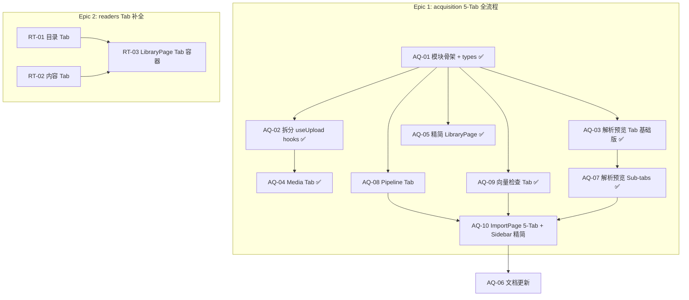

# Sprint Acquisition — 数据导入全流程一页化

> **来源**: Hotfix 期间发现 → [10-sprint-hotfix.md 后续发现](./10-sprint-hotfix.md#后续发现-hotfix-期间记录)
>
> **问题**: 文件上传 + URL 导入硬塞在 `readers/` 模块里，违反单一职责。用户上传 PDF 后需要在多个 sidebar 页面间跳转查看状态。
>
> **目标**:
> 1. 新建 `acquisition/` 独立模块
> 2. **一页 5 Tab 展示完整导入流程** — 上传 → 解析预览 → Media → Pipeline → 向量检查
> 3. sidebar 精简为 2 项：Import + Library（移除独立 Ingestion 入口）
> 4. readers 模块补全 Tab（书架 / 目录 / 内容）

## 概览

| Epic | Story 数 | 预估总工时 | 优先级 |
|------|----------|-----------|--------|
| **acquisition 5-Tab 全流程** | 10 | 26h | P1 | ✅ 10/10 done |
| **readers Tab 补全** | 3 | 8h | P1 | ✅ 3/3 (merged into ImportPage 7-Tab) |
| **合计** | **13** | **34h** | P1 |

## 设计原则

> **每个 Tab = 一个数据检查点 (checkpoint)**
>
> 每一步写入数据库/文件系统的数据，都有一个 Tab 能展示。
> 用户扫一眼就能判断该阶段是否就绪，数据是否正确，能否进入下一步。

## Sidebar 精简设计

> **合并前** (3 项): Import → Library → Ingestion
> **合并后** (2 项): Import → Library
>
> 用户上传 PDF 后，一页内看完上传状态、解析结果、Pipeline 进度、向量验证。无需跳转 sidebar。

```
Sidebar — Data Pipeline
├── 📥 Import  (/engine/acquisition)   ← 5 Tab 全流程
├── 📚 Library (/readers)               ← 3 Tab 数据检查
├── 🌱 Seed    (/seed)
└── (原 ⚙️ Ingestion 入口 → 移除)
```

## 📥 acquisition/ — 5 Tab 全流程设计

> 一页 = 完整导入数据流。用户扫一眼就知道上传到哪一步了。

### 页面布局 — 复用 SidebarLayout

> **强制使用 `shared/components/SidebarLayout` + `shared/books/useBookSidebar`。**
> 禁止手写 sidebar。和 readers (LibraryPage) 、question_gen (QuestionsPage) 保持一致。

```
┌──────────────┬─────────────────────────────────────┐
│              │  Import | Files | Parse | Pipeline | Vectors  │
│ SidebarLayout├─────────────────────────────────────┤
│              │                                     │
│ useBookSidebar│  Tab 内容（根据选中书切换）           │
│              │                                     │
│              │                                     │
└──────────────┴─────────────────────────────────────┘
```

**实现要点：**
- `ImportPage` 用 `SidebarLayout` 包住整个页面（和 LibraryPage / QuestionsPage 同模式）
- sidebar 数据来自 `useBooks()` + `useBookSidebar(books, { mode: 'by-book' })`
- `activeFilter` / `onFilterChange` 由 `ImportPage` 管理
- Tab bar 放在 `SidebarLayout` children 内部的顶部
- **Import Tab** 特殊：sidebar 仍然显示（保持布局一致），内容区全宽展示上传入口
- 切换 Tab 时选中的书不变

### Tab 定义

| Tab | 英文 | 中文 | 数据源 | 展示内容 |
|-----|------|------|--------|---------|
| ① | **Import** | 导入 | 操作入口 | 文件上传 + URL 导入（全宽，无 BookSidebar） |
| ② | **Files** | 文件 | `Payload: Media` | 选中书关联的 PDF 文件详情（大小/类型/上传时间） |
| ③ | **Parse** | 解析 | `filesystem: content_list.json` | 选中书的 MinerU 解析产物，**二级 sub-tabs 按类型分**（见下表） |
| ④ | **Pipeline** | 管线 | `Payload: Books.pipeline + IngestTasks` | 左右分屏：左栏 5 阶段纵向 Stepper + 右栏 Execute + Results（始终可见） |
| ⑤ | **Vectors** | 向量 | `ChromaDB` (via Engine API) | 选中书的向量数 / embedding 维度 / 随机 chunk 采样 |

> **Tab 顺序 = 数据流顺序**：上传 → 原始文件(Files) → MinerU产物(Parse) → Pipeline状态 → 最终向量(Vectors)

### Parse Tab — 二级 sub-tabs

> 去掉无意义的"总览"统计卡片，直接按内容类型分 tab 浏览真实数据，
> 用户可逐类检查解析质量。每个 sub-tab label 带数量 badge。

| Sub-tab | 数据过滤 | 展示内容 |
|---------|---------|----------|
| **Text** (N) | `content_type=text` | 文本内容列表：序号 / 页码 / text (截断 300 字) |
| **Image** (N) | `content_type=image` | 图片列表：序号 / 页码 / 缩略图预览 / alt text |
| **Table** (N) | `content_type=table` | 表格列表：序号 / 页码 / 表格渲染 or 文本降级 |
| **Equation** (N) | `content_type=equation` | 公式列表：序号 / 页码 / LaTeX 渲染 or 原文 |
| **Discarded** (N) | `content_type=discarded` | 被丢弃内容：序号 / 页码 / text / 丢弃原因 |

## 📚 readers/ — 3 Tab 数据检查

| Tab | 数据源 | 展示内容 | 布局 |
|-----|--------|---------|------|
| **书架** | `Payload: Books collection` | 左：分类侧栏筛选；右：books grid/table (title, authors, category, status, chunkCount, pipeline, updatedAt) | 2 栏 (现有 SidebarLayout) |
| **目录** | `Engine: /books/{id}/toc` | 左：书本选择；中：TOC 树 (id, level, title, pdf_page)；右：PDF 页面预览 | 3 栏 |
| **内容** | `Payload: Chunks collection` + `Engine: /books/{id}/chunks` | 左：书本+章节选择；右：chunk 列表 (text, pageNumber, contentType, sourceLocators, vectorized) | 2 栏 |

## 数据流 × Tab 完整对照

```
用户上传 PDF
    │
    ▼
acquisition/① 导入       → 操作入口 (文件上传 / URL 下载)
acquisition/② Media       → Payload Media ← PDF 文件记录
acquisition/③ 解析预览    → filesystem ← content_list.json / middle.json (MinerU 产物)
    ├── Text sub-tab      → content_type=text 过滤
    ├── Image sub-tab     → content_type=image 过滤 + 缩略图
    ├── Table sub-tab     → content_type=table 过滤 + 表格渲染
    ├── Equation sub-tab  → content_type=equation 过滤
    └── Discarded sub-tab → content_type=discarded 过滤
acquisition/④ Pipeline    → Payload Books.pipeline + IngestTasks ← 5 阶段 Stepper + Execute + Results
acquisition/⑤ 向量检查    → ChromaDB ← 向量数量 / 采样 / 维度
    │
    ▼
readers/书架              → Payload Books ← title / status / pipeline / chunkCount
readers/目录              → Engine TOC API ← 章节结构 (level / title / pdf_page)
readers/内容              → Payload Chunks ← chunk 文本 / 页码 / 类型 / 定位
```

## 依赖图



## 质量门禁

| # | 检查项 | 判定依据 |
|---|--------|----------|
| G1 | **模块归属** | Pipeline/向量检查 Tab 代码在 `features/engine/acquisition/`，不在 `ingestion/`；readers 改动在 `readers/` 目录 |
| G2 | **数据完整** | 每个 Tab 展示的字段与对应数据源 schema 完全对齐 |
| G3 | **向后兼容** | 现有功能不退化；`ingestion/` 前端目录可直接删除（Pipeline 功能在 acquisition 中全新实现） |
| G4 | **单一职责** | 每个 Tab 只展示一个数据源的数据 |

---

## Epic 1: acquisition 5-Tab 全流程 (10 stories, 24h)

### [AQ-01] 模块骨架 + 导入 Tab ✅

**类型**: Frontend · **优先级**: P1 · **预估**: 2h

**描述**: 创建 `acquisition/` 模块，包含 types.ts、index.ts，以及导入 Tab 主页面。导入 Tab 为 2 栏并排布局：左栏文件上传、右栏 URL 导入。

**验收标准**:
- [x] `acquisition/types.ts` — UploadPayload, UrlImportRequest, ImportState
- [x] `acquisition/index.ts` — 统一 re-export
- [x] `acquisition/components/ImportPage.tsx` — Tab 容器 (导入 / 解析预览 / Media)
- [x] 导入 Tab: 左栏 FileUploadCard + 右栏 UrlImportCard (2 栏并排)
- [x] 路由 `app/(frontend)/engine/acquisition/page.tsx`
- [x] AppSidebar dataPipelineLinks 首位插入 Import
- [x] messages.ts 新增 `navAcquisition: 'Import' / '导入'`
- [x] G1 ✅

**文件**:
```
新建
├── features/engine/acquisition/types.ts
├── features/engine/acquisition/index.ts
├── features/engine/acquisition/components/ImportPage.tsx
├── features/engine/acquisition/components/FileUploadCard.tsx
├── features/engine/acquisition/components/UrlImportCard.tsx
├── app/(frontend)/engine/acquisition/page.tsx
修改
├── features/layout/AppSidebar.tsx
├── features/shared/i18n/messages.ts
```

---

### [AQ-02] 拆分 useUpload → useFileUpload + useUrlImport ✅

**类型**: Frontend · **优先级**: P1 · **预估**: 2h

**描述**: 将 `readers/useUpload.ts` 的两条流程拆分为独立 hook。

**验收标准**:
- [x] `acquisition/useFileUpload.ts` — 文件上传逻辑 (Payload Media → afterChange)
- [x] `acquisition/useUrlImport.ts` — URL 导入逻辑 (Engine /ingest 直接调用)
- [x] 各自独立 state (uploading, progress, error, fileName, stage)
- [x] `readers/useUpload.ts` → 已完全移除 (无消费方)
- [x] `readers/components/UploadZone.tsx` → 已完全移除 (无消费方)
- [x] G3 ✅

**依赖**: [AQ-01]
**文件**:
```
新建
├── features/engine/acquisition/useFileUpload.ts
├── features/engine/acquisition/useUrlImport.ts
修改
├── features/engine/readers/useUpload.ts        → re-export
├── features/engine/readers/components/UploadZone.tsx → re-export
```

---

### [AQ-03] 解析预览 Tab (基础版) ✅

**类型**: Frontend + Backend · **优先级**: P1 · **预估**: 3h

**描述**: 展示 MinerU 解析产物基础版。新增 Engine API 端点读取 content_list.json 统计信息。

**数据源**: `filesystem: content_list.json` + `middle.json`

**展示字段** (基础版 — 混合展示, 已由 AQ-07 取代):
- content items 总数
- pages 总数 (from middle.json)
- 按 content_type 分类统计 (text / table / image / title)
- 内容采样表 (前 20 条 content items: text 截断, page_idx, type, bbox)

**验收标准**:
- [x] Engine API: `GET /engine/books/{book_id}/parse-stats` — 返回 items/pages/type 统计 + 采样
- [x] `acquisition/components/ParsePreviewTab.tsx` — 左栏书本选择，右栏统计 + 采样表
- [x] 空态: 未解析的书显示 "未找到 MinerU 解析数据"
- [x] G2 ✅ G4 ✅

**依赖**: [AQ-01]
**文件**:
```
新建
├── features/engine/acquisition/components/ParsePreviewTab.tsx
├── features/engine/acquisition/api.ts
修改
├── engine_v2/api/routes/books.py  → 新增 /parse-stats 端点
```

---

### [AQ-04] Media Tab ✅

**类型**: Frontend · **优先级**: P2 · **预估**: 1h

**描述**: 展示 Payload Media collection 中已上传的 PDF 文件。

**数据源**: `Payload: Media collection`

**展示字段**:
- filename, mimeType, filesize, createdAt
- 关联的 Book (通过 Books.pdfMedia 反查)
- 文件下载链接

**验收标准**:
- [x] `acquisition/components/MediaTab.tsx` — 左栏 Media 列表，右栏选中文件详情
- [x] 调用 Payload REST API: `GET /api/media?where[mimeType][equals]=application/pdf`
- [x] 关联 Book 显示 (预留 relatedBookId/Title 字段, 需 Books.pdfMedia 反查)
- [x] G4 ✅

**依赖**: [AQ-01]
**文件**:
```
新建
├── features/engine/acquisition/components/MediaTab.tsx
```

---

### [AQ-05] 精简 readers/LibraryPage ✅

**类型**: Frontend · **优先级**: P1 · **预估**: 1h

**描述**: 从 LibraryPage 移除 UploadZone 和 PipelineActions，只保留书架浏览。

**移除项**:
- `showUpload` state + `<UploadZone>` 折叠区
- toolbar Upload 按钮 → 改为 "导入" 链接跳转 `/engine/acquisition`
- PipelineActions import

**验收标准**:
- [x] LibraryPage 精简 (UploadZone 已移除)
- [x] 书架浏览功能不受影响
- [x] toolbar 有 "导入" 快捷链接 → `/engine/acquisition`
- [x] G3 ✅

**依赖**: [AQ-01]
**文件**:
```
修改
├── features/engine/readers/components/LibraryPage.tsx
```

---

### [AQ-06] 文档更新 ✅

**类型**: 文档 · **优先级**: P2 · **预估**: 1h

**验收标准**:
- [x] `05-module-status.md` 新增 acquisition 模块状态卡（含 5 Tab 描述）
- [x] `05-module-status.md` 更新 readers 状态卡 (新增 Tab 信息)
- [x] `05-module-status.md` ingestion 状态卡标注 "Pipeline/向量 Tab 已迁移至 acquisition"
- [x] messages.ts 新增所有 Tab 相关 i18n key
- [x] AppSidebar dataPipelineLinks 移除 ingestion 入口

---

### [AQ-07] 解析预览 Sub-tabs — 按内容类型浏览 ✅

**类型**: Frontend + Backend · **优先级**: P1 · **预估**: 4h

**描述**: 将 ParsePreviewTab 的"总览统计卡 + 混合采样表"重构为按内容类型分的二级 sub-tabs。去掉无意义的总览数字，让用户能逐类检查解析质量。

**数据源**: `filesystem: content_list.json` + `middle.json`

**设计**:
- 移除顶部 stats 卡片（光看数字无法判断质量）
- 新增 5 个 sub-tabs，每个 label 带数量 badge：
  - **Text** (N) — 文本内容列表
  - **Image** (N) — 图片列表 + 缩略图预览
  - **Table** (N) — 表格渲染 or 文本降级
  - **Equation** (N) — LaTeX 渲染 or 原文
  - **Discarded** (N) — 被丢弃内容 + 丢弃原因

**后端改动**:
- `GET /engine/books/{book_id}/parse-stats` 增加 query params:
  - `content_type` — 按类型过滤 (text / image / table / equation / discarded)
  - `limit` — 可调返回数量 (默认 50)
  - `offset` — 分页偏移
- 返回的 samples 增加 `imgPath` 字段 (image 类型时提供图片相对路径)

**验收标准**:
- [x] Backend: `/parse-stats` 支持 `content_type` / `limit` / `offset` 过滤
- [x] Sub-tab bar 在 ParsePreviewTab 右栏顶部，每个 tab 显示类型 + 数量 badge
- [x] Text tab: 文本列表 (序号 / 页码 / text 截断 300 字)
- [x] Image tab: 图片列表 (缩略图 + alt text + 页码)
- [x] Table tab: 表格内容 (尝试渲染为 HTML table，降级为 text)
- [x] Equation tab: 公式内容 (LaTeX 显示 or raw text)
- [x] Discarded tab: 被丢弃项 (text + 页码 + 丢弃原因)
- [x] 每个 sub-tab 支持"加载更多"分页
- [x] G2 ✅ G4 ✅

**依赖**: [AQ-03]
**文件**:
```
修改
├── features/engine/acquisition/components/ParsePreviewTab.tsx  → sub-tab 重构
├── features/engine/acquisition/api.ts    → fetchParseStats 增加过滤参数
├── features/engine/acquisition/types.ts  → ParseStats 增加 imgPath 等字段
├── engine_v2/api/routes/books.py         → /parse-stats 增加 content_type/limit/offset
```

---

### [AQ-08] Pipeline Tab — 三栏布局 + 管线 Stepper + 实时 Output ✅

**类型**: Frontend + Backend · **优先级**: P1 · **预估**: 8h

**描述**: acquisition 第 4 个 Tab 全新实现。**三栏布局**：左栏纵向 Pipeline Stepper（5 阶段 + 产出计数），中栏 Execute（步骤 + 进度 + 日志 + 暂停/取消），右栏 Output（实时数据库写入预览）。支持 Run All 顺序执行和单步执行。

**设计稿 Mockup**:


**数据源**: `Payload: Books.pipeline` + `Payload: IngestTasks` + `Engine: stage output APIs`

**当前问题 (代码审查发现)**:
1. ❌ `mapPayloadBook()` 未映射 `pipeline` 字段 → 状态永远 Pending
2. ❌ `triggerAction` 发送的 payload 与 Engine `IngestRequest` schema 不匹配
3. ❌ `IngestTasks.taskType` 只有 `ingest`/`full`，无法按阶段过滤
4. ❌ 前端直接调 Engine API 违反数据流架构

**三栏布局**:
```
┌──────────────────┬──────────────────────────┬──────────────────────────────┐
│ Pipeline Stages  │ Execute: BM25            │ Output: BM25                 │
│ (220px fixed)    │ (~300px flex)             │ (~400px flex)                │
│                  │                          │                              │
│ ✅ Chunked       │ 🔍 BM25      ⏳ Running  │ 📊 Output  1,247/3,500 ● Live│
│ │ 367 chunks     │ ✅ Build FTS5            │ ┌────────────────────────┐   │
│ ✅ TOC           │ ⏳ Calculate TF-IDF      │ │ # │ Chunk│ Text │TF│St│   │
│ │ 24 headings    │ ○  BM25 scoring          │ │ 1 │svm01│ SVM..│.03│✅│   │
│🔄 BM25 ←[active]│ ────────────────         │ │...│ ... │ ...  │...│✅│   │
│ ╎ 1,247/3,500    │ ████████░░░░ 45% · 2m    │ │1247│reg05│ L2..│.01│⏳│   │
│ ○  Embeddings —  │ ────────────────         │ └────────────────────────┘   │
│ ╎                │ [12:34] Building idx...  │                              │
│ ○  Vector    —   │ [12:34] Batch 4/10       │ Showing 1-20 of 3,500 [< >] │
│                  │                          │                              │
│ [▶ Run All     ] │ [⏸ Pause] [⏹ Cancel]    │                              │
│ [▶ Run BM25    ] │                          │                              │
└──────────────────┴──────────────────────────┴──────────────────────────────┘
```

**执行模式**:
- **Run All**: 顺序执行 Chunked → TOC → BM25 → Embeddings → Vector，任一阶段出错自动暂停
- **Run {Stage}**: 单步执行选中阶段，方便检查产出后再决定是否继续

**每阶段 Output 数据列**:

| Stage | 数据源 | 表格列 |
|-------|--------|--------|
| Chunked | Payload: Chunks | chunk_id · text · page · content_type · status |
| TOC | Engine | level · title · page_range · children |
| BM25 | Engine (new) | chunk_id · text · TF score · page |
| Embeddings | Engine (new) | chunk_id · text · dimensions · vector[0:4] |
| Vector | ChromaDB | chunk_id · text · collection · distance |

**前置修复 (P0)**:
- [x] `shared/books/api.ts` — `mapPayloadBook()` 增加 `pipeline` 字段映射 ✅
- [x] `shared/books/types.ts` — `BookBase` 增加 `pipeline?: PipelineInfo` 类型 ✅
- [x] `IngestTasks` collection — `taskType` 增加 5 个阶段选项 ✅

**前端验收标准**:
- [x] 三栏布局: `grid-template-columns: 220px 1fr 1.3fr` ✅
- [x] 左栏：垂直 Pipeline Stepper（5 节点 + 状态图标 + 连接线） ✅
- [x] 左栏：点击节点 → 中栏 + 右栏切换到该阶段 ✅
- [x] 左栏：底部 "Run All" + "Run {Stage}" 两个按钮 ✅
- [x] 中栏：步骤清单 + 进度条 + Task Log (terminal 风格) + [⏹ Cancel] ✅
- [x] 中栏 Embeddings 阶段：**模型选择器**下拉框 ✅
- [x] 右栏：Data Inspector（设计变更）— 点击步骤 IN/OUT 显示实时数据（PDF 元数据、content_list 采样、Payload chunks、ChromaDB 统计等），比原始 Output 表更灵活 ✅
- [x] Running 状态：每 3s 轮询 IngestTasks ✅
- [x] Run All 模式：SSE 驱动的自动推进（liveStepIdx + setActiveStage），Parse→Ingest 自动跟随 ✅
- [x] error 红色高亮 + 复制按钮 ✅
- [x] `ingestion/` 前端目录整体删除 ✅

**后端新增/修改 API**:

| 端点 | 方法 | 数据源 | 描述 |
|------|------|--------|------|
| `/engine/books/{id}/bm25-stats` | GET | Engine BM25 index | BM25 索引条目预览 |
| `/engine/books/{id}/embedding-stats` | GET | Engine embeddings | 嵌入向量预览 |
| `/engine/embeddings/models` | GET | Engine config | 可用 embedding 模型列表 + 当前默认模型 |
| `/engine/ingest` | POST | (修改) | `IngestRequest` 增加 `embed_model?: string` 参数 |

**文件**:
```
修改
├── features/shared/books/types.ts              → BookBase + PipelineInfo
├── features/shared/books/api.ts                → mapPayloadBook() 增加 pipeline
├── collections/IngestTasks.ts                  → taskType 增加 5 阶段选项
├── features/engine/acquisition/components/PipelineTab.tsx  → 全新重写 (三栏)
新增
├── engine_v2/api/routes/bm25.py                → GET /engine/books/{id}/bm25-stats
├── engine_v2/api/routes/embeddings_stats.py    → GET /engine/books/{id}/embedding-stats
删除
├── features/engine/ingestion/    (整个前端目录)
├── app/(frontend)/engine/ingestion/page.tsx
```

---

### [AQ-09] 向量检查 Tab + Engine API ✅

**类型**: Frontend + Backend · **优先级**: P1 · **预估**: 4h

**描述**: acquisition 的第 5 个 Tab，展示 ChromaDB 向量数据。需新增 Engine API。

**数据源**: `ChromaDB` (via Engine API)

**展示字段**:
- collection 总向量数
- 选中书的向量数 (where book_id filter)
- embedding 维度
- 随机采样 5 条: chunk text + metadata + vector 前 8 维预览

**验收标准**:
- [x] Engine API: `GET /engine/vectors/stats?book_id={id}` — 返回 count / dimensions / sample
- [x] `acquisition/components/VectorCheckTab.tsx` — 2 栏: 书本选择 / 向量统计 + 采样表
- [x] 向量数 vs chunk 数对比 (不一致时标黄)
- [x] G2 ✅ G4 ✅

**文件**:
```
新建
├── features/engine/acquisition/components/VectorCheckTab.tsx
├── engine_v2/api/routes/vectors.py  → GET /engine/vectors/stats
修改
├── engine_v2/api/app.py             → 注册 vectors router
├── features/engine/acquisition/types.ts  → VectorStats + VectorSample 类型
├── features/engine/acquisition/api.ts    → fetchVectorStats()
├── features/engine/acquisition/components/ImportPage.tsx → 5th tab
```

---

### [AQ-10] ImportPage 5-Tab 升级 + Sidebar 精简 ✅

**类型**: Frontend · **优先级**: P1 · **预估**: 2h

**描述**: 将 ImportPage 从 3-Tab 升级到 5-Tab，新增 Pipeline 和向量检查 Tab。同时从 AppSidebar dataPipelineLinks 移除 Ingestion 入口。

**验收标准**:
- [x] ImportPage Tab bar: Sources | Import | Files | Pipeline | Vectors （按数据流顺序，含 Sources Tab 额外新增）
- [x] `types.ts` 的 `ImportTab` 类型: `'sources' | 'import' | 'files' | 'pipeline' | 'vectors'`
- [x] AppSidebar 已移除 Ingestion 链接（adminLinks 不含 ingestion）
- [x] Tab 切换保持 URL 参数 (`?tab=sources|import|files|pipeline|vectors`)

**依赖**: [AQ-08], [AQ-09], [AQ-07]
**文件**:
```
修改
├── features/engine/acquisition/components/ImportPage.tsx  → 5-Tab (含 Sources)
├── features/engine/acquisition/types.ts                   → ImportTab 扩展
├── features/layout/AppSidebar.tsx                         → 移除 Ingestion 链接
├── features/shared/i18n/messages.ts                       → 新增 Tab i18n keys
```

---

## Epic 2: readers Tab 补全 (3 stories, 8h)

### [RT-01] 目录 Tab ✅ (merged into acquisition/TocTab)

**类型**: Frontend · **优先级**: P1 · **预估**: 3h

**描述**: readers 模块新增"目录"Tab，展示选中书的 TOC 数据。

**数据源**: `Engine: GET /books/{book_id}/toc`

**展示字段**:
- TOC 树: id, level, title, pdf_page
- 层级缩进显示
- 点击章节 → 右栏 PDF 跳转到对应页

**验收标准**:
- [x] `acquisition/components/TocTab.tsx` — TOC 树（含层级缩进、展开/折叠）
- [x] TOC tree 层级缩进 (level 1/2/3)
- [x] 未选书时显示提示
- [x] G2 ✅ G4 ✅
- [x] 已集成到 ImportPage 7-Tab（无需独立 readers 页面）

**文件**:
```
新建
├── features/engine/readers/components/TocTab.tsx
修改
├── features/engine/readers/components/LibraryPage.tsx  → 改为 Tab 容器
```

---

### [RT-02] 内容 Tab ✅ (merged into acquisition/ChunksTab)

**类型**: Frontend · **优先级**: P1 · **预估**: 3h

**描述**: readers 模块新增"内容"Tab，展示 Chunks collection 数据。

**数据源**: `Payload: Chunks collection` + `Engine: GET /books/{book_id}/chunks`

**展示字段**:
- chunk 列表: chunkId, text (截断), pageNumber, contentType, readingOrder, vectorized
- 按章节/页码筛选
- 点击 chunk → 展开完整文本 + sourceLocators

**验收标准**:
- [x] `acquisition/components/ChunksTab.tsx` — chunk 列表（含章节过滤、分页）
- [x] chunk 文本截断，点击展开
- [x] contentType 标签 (text / table / image / equation)
- [x] G2 ✅ G4 ✅
- [x] 已集成到 ImportPage 7-Tab（无需独立 readers 页面）

**文件**:
```
新建
├── features/engine/readers/components/ContentTab.tsx
```

---

### [RT-03] LibraryPage 清理 ✅ (orphan deleted, merged into ImportPage)

**类型**: Frontend · **优先级**: P1 · **预估**: 2h

**描述**: 将 LibraryPage 重构为 3-Tab 容器 (书架 / 目录 / 内容)，书架 Tab 复用现有 grid/table 逻辑。

**验收标准**:
- [x] LibraryPage 无路由、无 sidebar 链接 → 确认为孤儿组件 → 删除
- [x] useLibraryBooks hook（仅 LibraryPage 消费）→ 一并删除
- [x] readers/index.ts barrel export 已清理
- [x] 所有功能（书架浏览/TOC/Chunks）已在 ImportPage 7-Tab 中完整提供
- [x] G3 ✅ 无功能退化

**依赖**: [RT-01], [RT-02]
**文件**:
```
新建
├── features/engine/readers/components/BookshelfTab.tsx  (从 LibraryPage 提取)
修改
├── features/engine/readers/components/LibraryPage.tsx   → Tab 容器
```

---

## 模块文件影响清单

```
新建 (15 files)
├── features/engine/acquisition/types.ts                          ✅
├── features/engine/acquisition/api.ts                            ✅
├── features/engine/acquisition/index.ts                          ✅
├── features/engine/acquisition/useFileUpload.ts                  ✅
├── features/engine/acquisition/useUrlImport.ts                   ✅
├── features/engine/acquisition/components/ImportPage.tsx          ✅
├── features/engine/acquisition/components/FileUploadCard.tsx      ✅
├── features/engine/acquisition/components/UrlImportCard.tsx       ✅
├── features/engine/acquisition/components/ParsePreviewTab.tsx     ✅
├── features/engine/acquisition/components/MediaTab.tsx            ✅
├── features/engine/acquisition/components/PipelineTab.tsx         ← AQ-08 (全新)
├── features/engine/acquisition/components/VectorCheckTab.tsx      ← AQ-09 (全新)
├── features/engine/readers/components/TocTab.tsx                  ← RT-01
├── features/engine/readers/components/ContentTab.tsx              ← RT-02
├── features/engine/readers/components/BookshelfTab.tsx            ← RT-03
├── engine_v2/api/routes/vectors.py                               ← AQ-09
├── app/(frontend)/engine/acquisition/page.tsx                    ✅

修改 (8 files)
├── features/engine/acquisition/components/ImportPage.tsx   → 5-Tab 升级 (AQ-10)
├── features/engine/acquisition/types.ts                    → ImportTab 扩展 (AQ-10)
├── features/engine/readers/components/LibraryPage.tsx      → Tab 容器 (RT-03)
├── features/layout/AppSidebar.tsx                          → 移除 Ingestion 链接 (AQ-10)
├── features/shared/i18n/messages.ts                        → 新 Tab i18n keys (AQ-06)

删除 (AQ-08)
├── features/engine/ingestion/                              (整个前端目录)
├── app/(frontend)/engine/ingestion/page.tsx
├── engine_v2/api/routes/books.py                           → /parse-stats 过滤 (AQ-07)
├── engine_v2/api/app.py                                    → vectors router (AQ-09)

文档 (2 files)
├── .agent/workflows/rag-dev-v3/roadmap/05-module-status.md       ← AQ-06
├── .agent/workflows/rag-dev-v3/roadmap/11-sprint-acquisition.md  (本文件)
```

## 后端新增 API

| 端点 | 方法 | 数据源 | Story |
|------|------|--------|-------|
| `/engine/books/{id}/parse-stats` | GET | filesystem (content_list.json + middle.json) | AQ-03 ✅ |
| `/engine/books/{id}/parse-stats?content_type=X&limit=N&offset=N` | GET | filesystem (同上, 含过滤) | AQ-07 |
| `/engine/vectors/stats` | GET | ChromaDB | AQ-09 |
