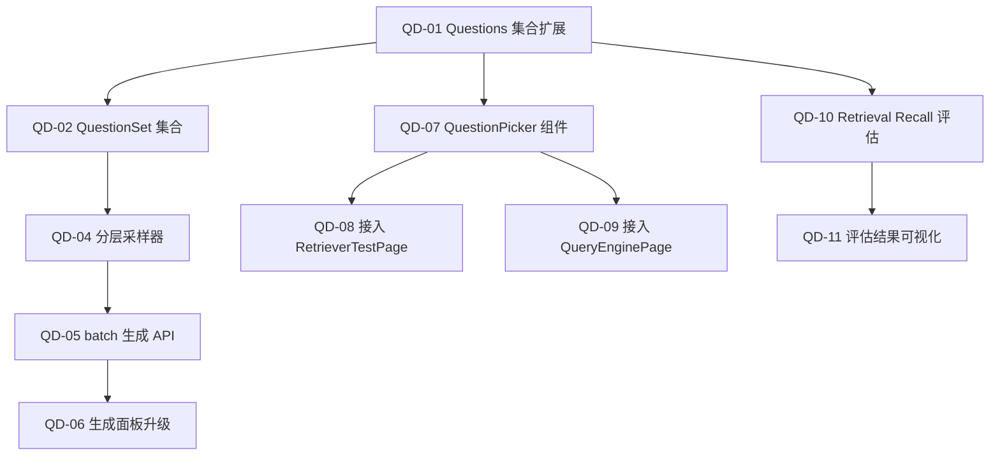

# Sprint QD — Question Dataset Pipeline（约 1.5 周）

> 目标：建立科学的 **Question Dataset 体系**，实现分层采样问题生成 → chunk 源追踪 → 跨模块共享选题 → 自动检索评估闭环。
>
> 解决的核心问题：多书多 chunk 场景下，如何系统化生成测试题，并让 Retriever / Query Engine / Evaluation 三个模块复用同一套题库。

## 概览

| Epic | Story 数 | 预估总工时 | 完成 | 对齐 |
|------|----------|-----------|------|------|
| **Question Set 数据模型** | 3 | 6h | ✅ 3/3 | LlamaIndex `LabelledRagDataset` |
| **分层采样生成** | 3 | 8h | ✅ 3/3 | LlamaIndex `RagDatasetGenerator` |
| **共享 QuestionPicker** | 3 | 6h | ✅ 3/3 | 前端组件复用 |
| **自动检索评估** | 2 | 5h | ✅ 2/2 | LlamaIndex evaluators |
| **合计** | **11** | **25h** | **✅ 11/11** |

## 质量门禁

| # | 检查项 | 判定依据 |
|---|--------|----------|
| G1 | **模块归属** | Question Set 集合在 `collections/QuestionSets.ts`；Questions 集合扩展字段。共享 picker 在 `features/shared/components/QuestionPicker.tsx`。采样逻辑在 `engine_v2/question_gen/sampler.py`。评估在 `engine_v2/evaluation/` |
| G2 | **注释合规** | 同 Sprint 2 §1.2 / §3.22 / §3.23 |
| G3 | **LlamaIndex 对齐** | 生成用 `RagDatasetGenerator` 模式（node → question + reference_answer + source_node_ids）；评估用 `RetrieverEvaluator` |

## 依赖图



---

## Epic 1: Question Set 数据模型 (P0)

### [QD-01] Questions 集合扩展 — 增加 sourceChunkId + referenceAnswer

**类型**: Backend + CMS · **优先级**: P0 · **预估**: 2h

**描述**: 在 Payload CMS 的 `Questions` 集合中新增关键字段，使每道题可追溯到生成它的原始 chunk，并保存参考答案用于自动评估。

**LlamaIndex 对齐**: 对应 `LabelledRagDataExample` 中的 `reference_answer` + `reference_contexts`。

**验收标准**:
- [ ] Questions 集合新增 `sourceChunkId: string` — 生成该题的原始 chunk node ID
- [ ] Questions 集合新增 `referenceAnswer: string` — LLM 基于 source chunk 生成的参考答案
- [ ] Questions 集合新增 `datasetId: relationship(QuestionSets)` — 所属题集
- [ ] 现有 Questions 数据向后兼容（新字段均 optional）
- [ ] G1 ✅ 在 `collections/Questions.ts`

**依赖**: 无
**文件**: `payload-v2/src/collections/Questions.ts`

### [QD-02] QuestionSet 集合 — 题集管理

**类型**: CMS · **优先级**: P0 · **预估**: 2h

**描述**: 新建 `QuestionSets` 集合，管理题集的元信息。一个 QuestionSet 是一批 Questions 的逻辑分组，可用于批量评估。

**验收标准**:
- [ ] 新建 `QuestionSets` 集合，字段：
  - `name: string` — 题集名（如 "v1-retriever-eval", "all-books-benchmark"）
  - `purpose: select` — `eval` | `benchmark` | `suggested` | `debug`
  - `bookIds: json` — 覆盖的书籍 ID 列表
  - `generationConfig: json` — 生成参数快照（采样策略、每书数量等）
  - `questionCount: number` — 关联 question 数（虚拟字段或手动维护）
  - `status: select` — `generating` | `ready` | `archived`
- [ ] 注册到 `payload.config.ts`
- [ ] G1 ✅ 在 `collections/QuestionSets.ts`

**依赖**: 无
**文件**: `payload-v2/src/collections/QuestionSets.ts`, `payload-v2/src/payload.config.ts`

### [QD-03] 前端 types + api — QuestionSet 数据层

**类型**: Frontend · **优先级**: P0 · **预估**: 2h

**描述**: 前端对 QuestionSet 和扩展后的 Question 字段的类型定义 + API 封装。

**验收标准**:
- [ ] `features/engine/question_gen/types.ts` 扩展 `Question` 增加 `sourceChunkId`, `referenceAnswer`, `datasetId`
- [ ] 新增 `QuestionSet` 类型定义
- [ ] `api.ts` 新增 `fetchQuestionSets()`, `createQuestionSet()`, `fetchQuestionsByDataset(datasetId)`
- [ ] G1 ✅ 在 `features/engine/question_gen/`

**依赖**: [QD-01], [QD-02]
**文件**: `features/engine/question_gen/types.ts`, `features/engine/question_gen/api.ts`

---

## Epic 2: 分层采样生成 (P1)

### [QD-04] 分层采样器 — StratifiedChunkSampler

**类型**: Backend · **优先级**: P1 · **预估**: 3h

**描述**: 从 ChromaDB 中按书 → 章节 → content_type 三级分层采样 chunks，保证生成的问题覆盖各书各章节各内容类型。

**LlamaIndex 对齐**: 类似 `RagDatasetGenerator` 的 node 采样策略，但增加了分层逻辑。

**验收标准**:
- [ ] 新建 `engine_v2/question_gen/sampler.py`
- [ ] `StratifiedChunkSampler.sample()` 接口：
  ```python
  def sample(
      book_ids: list[str] | None = None,
      k_per_book: int = 10,
      strategy: str = "stratified",  # "stratified" | "random" | "chapter_balanced"
  ) -> list[NodeWithScore]
  ```
- [ ] `stratified` 策略：按 content_type (text:60%, table:20%, image:20%) 分层
- [ ] `chapter_balanced` 策略：每章节均匀取 k 个
- [ ] `random` 策略：纯随机（baseline）
- [ ] 返回的 nodes 包含完整 metadata（book_id, chapter_key, page_idx, content_type）
- [ ] G1 ✅ 在 `engine_v2/question_gen/sampler.py`
- [ ] G3 ✅ 使用 LlamaIndex `VectorStoreIndex` 的 docstore 访问 nodes

**依赖**: 无
**文件**: `engine_v2/question_gen/sampler.py`

### [QD-05] batch 生成 API — /questions/generate-dataset

**类型**: Backend · **优先级**: P1 · **预估**: 3h

**描述**: 新建一键生成整个 Question Set 的 API。采样 chunks → 逐个生成 question + reference answer → 存入 QuestionSet。

**LlamaIndex 对齐**: 对应 `RagDatasetGenerator.generate_dataset_from_nodes()`。

**验收标准**:
- [ ] 新建 `POST /engine/questions/generate-dataset` 端点
- [ ] Request body：
  ```python
  class GenerateDatasetRequest(BaseModel):
      name: str                    # 题集名
      purpose: str = "eval"        # eval | benchmark | suggested
      book_ids: list[str] | None   # 覆盖书籍，None = 全部
      k_per_book: int = 10         # 每本书采样 chunk 数
      strategy: str = "stratified" # 采样策略
  ```
- [ ] 流程：创建 QuestionSet(status=generating) → 采样 → 对每个 chunk 生成 question + reference_answer → 保存 Questions(datasetId=set.id, sourceChunkId=chunk.id) → QuestionSet(status=ready)
- [ ] 生成时使用 SSE 推送进度（可选，或简单返回 job id）
- [ ] 每个生成的 question 记录 `sourceChunkId`（chunk node 的 `id_`）
- [ ] G1 ✅ 在 `engine_v2/api/routes/questions.py`

**依赖**: [QD-04], [QD-02]
**文件**: `engine_v2/api/routes/questions.py`, `engine_v2/question_gen/generator.py`

### [QD-06] 前端生成面板升级 — 一键生成题集

**类型**: Frontend · **优先级**: P1 · **预估**: 2h

**描述**: 在 QuestionsPage 增加 "生成题集" 功能，用户选择书籍 + 采样策略 → 一键生成一个 QuestionSet。

**验收标准**:
- [ ] QuestionsPage 新增 "Generate Dataset" 按钮
- [ ] 弹出配置 modal：选书、采样策略（stratified/chapter_balanced/random）、每书 chunk 数
- [ ] 调用 `POST /engine/questions/generate-dataset`
- [ ] 生成中显示进度，完成后自动刷新题目列表
- [ ] 题集筛选：下拉选择 QuestionSet，只显示该题集的问题
- [ ] G1 ✅ 在 `features/engine/question_gen/components/`

**依赖**: [QD-03], [QD-05]
**文件**: `features/engine/question_gen/components/GenerationPanel.tsx`

---

## Epic 3: 共享 QuestionPicker (P0)

### [QD-07] QuestionPicker 组件

**类型**: Frontend · **优先级**: P0 · **预估**: 3h

**描述**: 可复用的问题选择器组件，供 RetrieverTestPage / QueryEnginePage / EvaluationPage 共享使用。

**UI 设计**:
```
┌ QuestionPicker ──────────────────────────────┐
│ 📋 Select a test question        [Dataset ▼] │
│ ┌──────────────────────────────────────────┐  │
│ │ 🔍 Search questions...                   │  │
│ ├──────────────────────────────────────────┤  │
│ │ 📖 Book A                                │  │
│ │   ★4.2 What factors drive inflation...   │  │
│ │   ★3.8 How does unemployment affect...   │  │
│ │ 📖 Book B                                │  │
│ │   ★4.5 Compare Q1 and Q2 GDP growth...   │  │
│ │   ★3.1 What is the housing price tr...   │  │
│ └──────────────────────────────────────────┘  │
└──────────────────────────────────────────────┘
```

**验收标准**:
- [ ] 组件接口：
  ```tsx
  <QuestionPicker
    bookFilter?: string[]        // 按 bookId 过滤
    datasetFilter?: number       // 按 QuestionSet 过滤
    maxItems?: number            // 最大展示数 (default: 20)
    onSelect: (question: Question) => void  // 选中回调
    mode?: 'single' | 'multi'   // 单选(默认) / 多选(评估用)
    onSelectMulti?: (questions: Question[]) => void
  />
  ```
- [ ] 按书名分组展示，每题显示：score badge + 问题文本 + book/page 标签
- [ ] 顶部搜索框：模糊匹配问题文本
- [ ] Dataset 下拉：切换题集（all / specific dataset）
- [ ] 空态：显示 "No questions — run Question Gen to create some"
- [ ] G1 ✅ 在 `features/shared/components/QuestionPicker.tsx`

**依赖**: [QD-03]
**文件**: `features/shared/components/QuestionPicker.tsx`

### [QD-08] 接入 RetrieverTestPage

**类型**: Frontend · **优先级**: P0 · **预估**: 1.5h

**描述**: 在 RetrieverTestPage 左栏嵌入 QuestionPicker，选题后自动填入查询输入框。

**验收标准**:
- [ ] 在 query 输入框下方增加可折叠的 QuestionPicker 区域
- [ ] 选中问题后自动填入 textarea，并高亮提示 "Question from [dataset]"
- [ ] bookFilter 与页面的书籍筛选联动
- [ ] 若有 `sourceChunkId`，结果面板中高亮标注该 chunk 是否被检索到（✅ 命中 / ❌ 遗漏）
- [ ] G1 ✅ 在 `features/engine/retrievers/components/RetrieverTestPage.tsx`

**依赖**: [QD-07]
**文件**: `features/engine/retrievers/components/RetrieverTestPage.tsx`

### [QD-09] 接入 QueryEnginePage

**类型**: Frontend · **优先级**: P0 · **预估**: 1.5h

**描述**: 在 QueryEnginePage 左栏嵌入 QuestionPicker，选题后自动填入问题输入框。

**验收标准**:
- [ ] 在 question textarea 下方增加可折叠的 QuestionPicker 区域
- [ ] 选中问题后自动填入 textarea
- [ ] bookFilter 与页面的书籍筛选联动
- [ ] 若有 `referenceAnswer`，结果面板中可展开对比 "参考答案 vs 生成答案"
- [ ] G1 ✅ 在 `features/engine/query_engine/components/QueryEnginePage.tsx`

**依赖**: [QD-07]
**文件**: `features/engine/query_engine/components/QueryEnginePage.tsx`

---

## Epic 4: 自动检索评估 (P2)

### [QD-10] Retrieval Recall 自动评估

**类型**: Backend · **优先级**: P2 · **预估**: 3h

**描述**: 给定一个 QuestionSet，自动对每道题运行 Retriever，计算 source chunk 是否在检索结果中出现（Recall@K, MRR）。

**LlamaIndex 对齐**: 使用 `RetrieverEvaluator` + `HitRate` / `MRR` 指标。

**验收标准**:
- [ ] 新建 `POST /engine/evaluation/retrieval-eval` 端点
- [ ] Request: `{ dataset_id: number, top_k: int, reranker: bool }`
- [ ] 流程：取 QuestionSet 的所有 questions → 对每题 retrieve(question) → 检查 results 中是否包含 sourceChunkId
- [ ] 返回指标：
  ```json
  {
    "hit_rate": 0.85,      // sourceChunkId 在 top_k 中的比例
    "mrr": 0.72,           // Mean Reciprocal Rank
    "per_question": [...]  // 每题的 hit/miss 详情
  }
  ```
- [ ] 支持 `reranker=true` 参数，对比有无 LLMRerank 的效果差异
- [ ] G1 ✅ 在 `engine_v2/evaluation/`
- [ ] G3 ✅ 使用 LlamaIndex `RetrieverEvaluator`

**依赖**: [QD-01]
**文件**: `engine_v2/evaluation/retrieval_evaluator.py`, `engine_v2/api/routes/evaluation.py`

### [QD-11] 评估结果可视化

**类型**: Frontend · **优先级**: P2 · **预估**: 2h

**描述**: 在 Evaluation 页面增加 Retrieval Quality 面板，展示 hit_rate / MRR 指标和 per-question 详情。

**验收标准**:
- [ ] Evaluation 页面新增 "Retrieval Quality" tab 或 section
- [ ] 顶部卡片：Hit Rate (%) + MRR 得分 + 有无 Reranker 的对比
- [ ] 详情表格：Question | Source Chunk | Rank | Hit/Miss
- [ ] 支持按 book 筛选
- [ ] 一键 "Run Eval" 按钮 → 调用后端 → 实时展示结果
- [ ] G1 ✅ 在 `features/engine/evaluation/components/`

**依赖**: [QD-10]
**文件**: `features/engine/evaluation/components/RetrievalEvalPanel.tsx`
