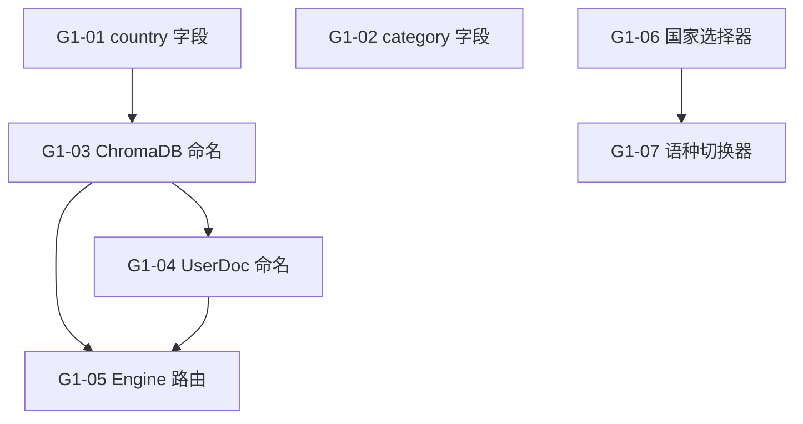

# Sprint G1 — 全球架构改造 (Global Template) 🔒 CLOSED

> 目标：把现有加拿大单国家 Consulting 系统改造为多国家通用架构，不破坏已有功能。
>
> 前置条件：无（v2 架构起点）
> **状态**: ✅ 7/7 — **已关闭** (2026-05-01)

## 概览

| Task | Story 数 | 预估总工时 | 说明 |
|------|----------|-----------|------|
| T1 数据模型扩展 | 2 | 2.5h | Persona 新增 country + category 字段 |
| T2 ChromaDB 命名改造 | 2 | 3h | 角色库 + 用户文档库多国家隔离 |
| T3 Engine 路由改造 | 1 | 2h | 查询/摄取接口支持 country 路由 |
| T4 前端选择器 | 2 | 3h | 国家选择器 + 语种切换器 |
| **合计** | **7** | **10.5h** |

## 质量门禁

| # | 检查项 | 判定依据 |
|---|--------|----------|
| G1 | 向后兼容 | 现有 `persona_{slug}` 命名的 collection 仍可读写，seed 数据不丢 |
| G2 | 数据隔离 | `ca_edu-school-planning` 和 `us_edu-school-planning` 是独立 collection |
| G3 | 不破坏现有功能 | 现有 Consulting 对话、OnboardingPage、ChatPage 行为不变 |
| G4 | 命名对齐 | country 字段使用 ISO 3166-1 alpha-2；category 使用 PRD v2 §三定义的 5 大类 |

---

## [G1-T1] 数据模型扩展

### [G1-01] ConsultingPersonas 新增 `country` 字段

**类型**: Backend (Payload)
**Epic**: 全球架构
**User Story**: 作为管理员，我需要为每个顾问角色标注所属国家，以便按国家过滤和展示角色
**优先级**: P0
**预估**: 1.5h

#### 描述

当前 `ConsultingPersonas` Collection 没有国家维度，所有角色默认服务加拿大。
新增 `country` select 字段，使用 ISO 3166-1 alpha-2 编码，支持后续多国家复制。
同时需要更新 Admin UI defaultColumns 以显示 country 列，方便管理员按国家筛选。

#### Schema 变更

```typescript
// payload-v2/src/collections/ConsultingPersonas.ts — fields 数组新增
{
  name: 'country',
  type: 'select',
  required: true,
  defaultValue: 'ca',
  options: [
    { label: '🇨🇦 Canada', value: 'ca' },
    { label: '🇺🇸 USA', value: 'us' },
    { label: '🇬🇧 UK', value: 'uk' },
    { label: '🇦🇺 Australia', value: 'au' },
  ],
  index: true,
  admin: { position: 'sidebar' },
}
```

#### 验收标准

- [ ] `country` 字段已添加，类型 `select`，required，defaultValue `ca`
- [ ] 字段加 `index: true`，admin position `sidebar`
- [ ] `defaultColumns` 包含 `country`
- [ ] Payload Admin 可按 country 筛选角色
- [ ] 现有角色数据不受影响（新字段 defaultValue=ca 自动填充）
- [ ] G1 ✅ 现有 Seed 数据在迁移后 country=ca
- [ ] G4 ✅ ISO 3166-1 alpha-2 编码

#### 依赖

- 无

#### 文件

- `payload-v2/src/collections/ConsultingPersonas.ts` (改造)

#### 检查命令

```bash
# Payload Admin 页面验证
curl -s http://localhost:3001/api/consulting-personas?limit=1 | jq '.docs[0].country'
# 期望输出: "ca"
```

---

### [G1-02] ConsultingPersonas 新增 `category` 字段

**类型**: Backend (Payload)
**Epic**: 全球架构
**User Story**: 作为用户，我需要按领域分类浏览顾问角色（留学/移民/落地/职场/法律）
**优先级**: P0
**预估**: 1h

#### 描述

PRD v2 §三将角色分为 5 大类：留学求学、移民身份、落地安家、职场就业、法律权益。
新增 `category` select 字段，供 Landing 页按类别分组展示，同时供 API 过滤。
需要同步更新 Seed 数据为现有 3 个角色补充 category。

#### Schema 变更

```typescript
// payload-v2/src/collections/ConsultingPersonas.ts — fields 数组新增
{
  name: 'category',
  type: 'select',
  required: true,
  defaultValue: 'legal',   // 现有角色多为 legal 类型
  options: [
    { label: '🎓 留学求学', value: 'education' },
    { label: '🛂 移民身份', value: 'immigration' },
    { label: '🏘️ 落地安家', value: 'living' },
    { label: '💼 职场就业', value: 'career' },
    { label: '⚖️ 法律权益', value: 'legal' },
  ],
  index: true,
  admin: { position: 'sidebar' },
}
```

#### 验收标准

- [ ] `category` 字段已添加，类型 `select`，required
- [ ] 5 个选项与 PRD v2 §三 一致
- [ ] `defaultColumns` 包含 `category`
- [ ] 现有 Seed 角色补充正确 category (lawyer→legal, compliance→legal, auditor→legal)
- [ ] API 可用 `where[category][equals]=education` 过滤
- [ ] G4 ✅ 分类值与 PRD v2 对齐

#### 依赖

- 无

#### 文件

- `payload-v2/src/collections/ConsultingPersonas.ts` (改造)
- `payload-v2/src/seed/consulting-personas.ts` (改造 — 补充 category)

#### 检查命令

```bash
curl -s 'http://localhost:3001/api/consulting-personas?where[category][equals]=legal' | jq '.totalDocs'
```

---

## [G1-T2] ChromaDB 命名改造

### [G1-03] ChromaDB 角色知识库命名改为 `{country}_{slug}`

**类型**: Backend (Engine)
**Epic**: 全球架构
**User Story**: 作为系统，我需要按国家隔离知识库数据，避免不同国家的政策信息混杂
**优先级**: P0
**预估**: 2h

#### 描述

当前 `get_collection_name()` 返回 `persona_{slug}`（如 `persona_lawyer`），无国家维度。
改造为 `{country}_{slug}` 格式（如 `ca_lawyer`），从 Payload CMS 读取角色的 `country` 字段拼接。
**关键**：必须兼容旧数据。如果 persona 没有 `country` 字段（旧数据），fallback 到 `persona_{slug}`。
同时需要更新 `ensure_persona_collection()` 和 `consulting_ingest()` 中的命名逻辑。

#### 实现方案

```python
# engine_v2/personas/registry.py — get_collection_name 改造
def get_collection_name(slug: str) -> str:
    """Derive ChromaDB collection name for a persona.
    
    Naming: {country}_{slug}  (e.g. ca_edu-school-planning)
    Fallback: persona_{slug}  (for legacy data without country)
    """
    persona = fetch_persona(slug)
    if persona:
        # 优先使用 CMS 中配置的名称
        if persona.get("chromaCollection"):
            return persona["chromaCollection"]
        # 新逻辑：country + slug
        country = persona.get("country", "")
        if country:
            return f"{country}_{slug}"
    return f"persona_{slug}"  # 兼容旧数据
```

**命名规则**:
```
ca_edu-school-planning     ← 加拿大选校顾问 (新)
ca_life-rental             ← 加拿大租房顾问 (新)
persona_lawyer             ← 旧角色 (兼容)
us_edu-school-planning     ← 美国选校顾问 (未来)
```

#### 验收标准

- [ ] `get_collection_name()` 支持 `{country}_{slug}` 格式
- [ ] 从 Payload 获取 persona 时读取 `country` 字段
- [ ] 兼容旧数据：`country` 为空时 fallback 到 `persona_{slug}`
- [ ] 已配置 `chromaCollection` 的角色优先使用配置值（向后兼容）
- [ ] `ensure_persona_collection()` 使用新命名
- [ ] 新建角色自动创建 `{country}_{slug}` collection
- [ ] G1 ✅ 旧 `persona_*` collection 仍可访问
- [ ] G2 ✅ 不同国家的 collection 物理隔离

#### 依赖

- [G1-01] country 字段已存在于 ConsultingPersonas

#### 文件

- `engine_v2/personas/registry.py` (改造 — `get_collection_name`, `ensure_persona_collection`)
- `engine_v2/api/routes/consulting.py` (改造 — `consulting_ingest` 命名逻辑)

#### 检查命令

```bash
# 验证新角色的 collection 名
python -c "
from engine_v2.personas.registry import get_collection_name
print(get_collection_name('edu-school-planning'))  # 期望: ca_edu-school-planning
"
```

---

### [G1-04] UserDocuments ChromaDB 命名加 country 前缀

**类型**: Backend (Engine + Payload)
**Epic**: 全球架构
**User Story**: 作为用户，我在不同国家顾问下上传的私有文档应互不干扰
**优先级**: P1
**预估**: 1h

#### 描述

当前用户私有文档 collection 命名为 `user_{userId}_{personaSlug}`。
改为 `user_{userId}_{country}_{personaSlug}`，与角色知识库的国家隔离保持一致。
需要修改 `user_collection_name()` 函数，并兼容旧命名（查询时先找新命名，没有则 fallback 旧命名）。

#### 实现方案

```python
# engine_v2/user_docs/manager.py — user_collection_name 改造
def user_collection_name(user_id: int | str, persona_slug: str, country: str = "ca") -> str:
    """Generate ChromaDB collection name for user private docs.
    
    New format: user_{userId}_{country}_{personaSlug}
    Legacy:     user_{userId}_{personaSlug}
    """
    return f"user_{user_id}_{country}_{persona_slug}"
```

#### 验收标准

- [ ] `user_collection_name()` 接受 `country` 参数（默认 `ca`）
- [ ] 新上传的用户文档走 `user_{userId}_{country}_{slug}` 命名
- [ ] 旧文档 `user_{userId}_{slug}` 仍可读取（查询时 fallback）
- [ ] 咨询路由的 `user_doc_ingest` / `user_doc_list` 传入正确 country
- [ ] G1 ✅ 旧数据不丢

#### 依赖

- [G1-03] 角色知识库命名改造完成

#### 文件

- `engine_v2/user_docs/manager.py` (改造 — `user_collection_name`)
- `engine_v2/api/routes/consulting.py` (改造 — 调用处传入 country)
- `payload-v2/src/collections/UserDocuments.ts` (改造 — `chromaCollection` description 更新)

---

## [G1-T3] Engine 路由改造

### [G1-05] Engine 查询路由支持 country 参数

**类型**: Backend (Engine)
**Epic**: 全球架构
**User Story**: 作为前端，我需要在咨询查询时指定目标国家，以便路由到正确的知识库
**优先级**: P0
**预估**: 2h

#### 描述

当前 `/engine/consulting/query` 和 `/query/stream` 仅通过 `persona_slug` 定位知识库。
需要新增 `country` 可选字段（默认 `ca`），使查询路由到 `{country}_{slug}` collection。
同时更新 `list_personas` 端点，支持 `country` query param 过滤。
`user_doc_ingest` 和 `user_doc_list` 也需要接受 `country` 参数。

#### Schema 变更

```python
# engine_v2/api/routes/consulting.py — PersonaQueryRequest 改造
class PersonaQueryRequest(BaseModel):
    persona_slug: str
    question: str
    top_k: int = TOP_K
    model: str | None = None
    provider: str | None = None
    country: str = "ca"   # ← 新增，ISO 3166-1 alpha-2

class UserDocIngestRequest(BaseModel):
    persona_slug: str
    doc_id: int
    pdf_filename: str
    force_parse: bool = False
    country: str = "ca"   # ← 新增
```

#### 验收标准

- [ ] `PersonaQueryRequest` 新增 `country` 字段（默认 `ca`）
- [ ] `/engine/consulting/query` 使用 `country` 拼接 collection 名
- [ ] `/engine/consulting/query/stream` 同步支持 `country`
- [ ] `/engine/consulting/personas` 支持 `?country=ca` query param
- [ ] `UserDocIngestRequest` 新增 `country` 字段
- [ ] `/engine/consulting/user-doc/ingest` 传入 country
- [ ] `/engine/consulting/user-doc/list` 支持 `?country=ca` 过滤
- [ ] 不传 `country` 时默认 `ca`，不影响现有调用方
- [ ] G3 ✅ 不传 country 的请求行为不变

#### 依赖

- [G1-03] ChromaDB 命名改造完成
- [G1-04] UserDocuments 命名改造完成

#### 文件

- `engine_v2/api/routes/consulting.py` (改造 — 6+ 个端点)

#### 检查命令

```bash
# 验证默认 country 行为
curl -s -X POST http://localhost:8001/engine/consulting/personas?country=ca | jq '.personas | length'
```

---

## [G1-T4] 前端选择器

### [G1-06] 前端新增国家选择器组件 + Context

**类型**: Frontend
**Epic**: 全球架构
**User Story**: 作为用户，我需要在界面顶部看到当前服务国家，并可以在支持的国家间切换
**优先级**: P1
**预估**: 2h

#### 描述

新建 `CountrySelector` 组件和 `CountryContext` 全局状态。
V1 阶段仅加拿大可选，但 UI 和数据流已就绪支持多国家。
选择国家后存入 localStorage + Context，所有 API 调用自动携带 `country` 参数。
需要在 Landing 页顶部导航和咨询页顶部导航中集成。

#### 实现方案

```
features/shared/components/CountrySelector.tsx  — 下拉菜单 (国旗 + 国名)
features/providers/CountryContext.tsx            — createContext + useCountry hook
features/providers/CountryProvider.tsx           — localStorage 持久化 + Provider
features/providers/Providers.tsx                 — 嵌套 CountryProvider
```

#### 验收标准

- [ ] 新文件 `features/shared/components/CountrySelector.tsx`
- [ ] 新文件 `features/providers/CountryContext.tsx`
- [ ] 新文件 `features/providers/CountryProvider.tsx`
- [ ] `Providers.tsx` 嵌套 `CountryProvider`
- [ ] 下拉菜单显示国旗 emoji + 国家中文名
- [ ] 选择后存入 localStorage `consultrag_country`
- [ ] V1 阶段仅加拿大可选（其他国家 disabled + "即将推出"提示）
- [ ] Landing 页 AppHeader / 咨询页 ChatPanel 顶部集成选择器
- [ ] `useCountry()` hook 返回 `{ country, setCountry }`
- [ ] G3 ✅ 不影响现有页面布局

#### 依赖

- 无（纯前端，不依赖后端改造）

#### 文件

- `payload-v2/src/features/shared/components/CountrySelector.tsx` (新增)
- `payload-v2/src/features/providers/CountryContext.tsx` (新增)
- `payload-v2/src/features/providers/CountryProvider.tsx` (新增)
- `payload-v2/src/features/providers/Providers.tsx` (改造 — 嵌套 CountryProvider)
- `payload-v2/src/features/home/HomePage.tsx` (改造 — 集成选择器)
- `payload-v2/src/features/chat/panel/ChatPanel.tsx` (改造 — 集成选择器)

#### 检查命令

```bash
npx tsc --noEmit  # cwd: payload-v2
```

---

### [G1-07] 前端新增语种切换器组件

**类型**: Frontend
**Epic**: 全球架构
**User Story**: 作为用户，我需要切换 AI 回答的语种，获得母语优先的咨询体验
**优先级**: P1
**预估**: 1h

#### 描述

新建 `LanguageSelector` 组件，让用户选择 AI 回答使用的语种。
选择后通过 consulting query 的 system prompt 附加语种指令（如"请使用英文回答"）。
V1 阶段支持中文（默认）和 English。

#### 实现方案

```
features/shared/components/LanguageSelector.tsx  — 下拉菜单 (语种名)
```

语种指令注入方式：在 `PersonaQueryRequest` 新增 `response_language` 字段，Engine 在 system prompt 末尾追加 `\n\n请使用{language}回答。`

#### 验收标准

- [ ] 新文件 `features/shared/components/LanguageSelector.tsx`
- [ ] 下拉选项: 中文(默认) / English
- [ ] 选择后存入 localStorage `consultrag_language`
- [ ] 前端 API 调用自动携带 `response_language` 参数
- [ ] Engine `PersonaQueryRequest` 新增 `response_language` 字段
- [ ] Engine 在 system prompt 末尾注入语种指令
- [ ] 切换到 English 后 AI 用英文回答
- [ ] V1 阶段 Français 等选项 disabled + "即将推出"

#### 依赖

- [G1-06] 国家选择器基础设施（共享 localStorage 和 Provider 模式）

#### 文件

- `payload-v2/src/features/shared/components/LanguageSelector.tsx` (新增)
- `payload-v2/src/features/chat/panel/ChatPanel.tsx` (改造 — 集成选择器)
- `engine_v2/api/routes/consulting.py` (改造 — `PersonaQueryRequest` + prompt 注入)

---

## 模块文件变更

```
payload-v2/src/
├── collections/
│   ├── ConsultingPersonas.ts               ← 改造 (新增 country + category 字段)
│   └── UserDocuments.ts                    ← 改造 (chromaCollection description 更新)
├── seed/
│   └── consulting-personas.ts              ← 改造 (现有角色补充 country + category)
└── features/
    ├── providers/
    │   ├── CountryContext.tsx               ← 新增
    │   ├── CountryProvider.tsx             ← 新增
    │   └── Providers.tsx                   ← 改造 (嵌套 CountryProvider)
    ├── shared/components/
    │   ├── CountrySelector.tsx             ← 新增
    │   └── LanguageSelector.tsx            ← 新增
    ├── home/
    │   └── HomePage.tsx                    ← 改造 (集成选择器)
    └── chat/panel/
        └── ChatPanel.tsx                   ← 改造 (集成选择器)

engine_v2/
├── personas/
│   └── registry.py                         ← 改造 (get_collection_name 支持 country)
├── user_docs/
│   └── manager.py                          ← 改造 (user_collection_name 支持 country)
└── api/routes/
    └── consulting.py                       ← 改造 (所有端点支持 country)
```

## 依赖图



> 箭头方向: A → B = "B 依赖 A"

## 执行顺序

| Phase | Tasks | Est. Time | 前置 | 备注 |
|-------|-------|-----------|------|------|
| **Phase 1** | G1-01, G1-02 | 2.5h | 无 | 可并行，纯 Payload Schema |
| **Phase 2** | G1-03 | 2h | Phase 1 | 需 country 字段已存在 |
| **Phase 3** | G1-04, G1-05 | 3h | Phase 2 | 可并行 |
| **Phase 4** | G1-06, G1-07 | 3h | 无 | 纯前端，可与 Phase 1-3 并行 |
