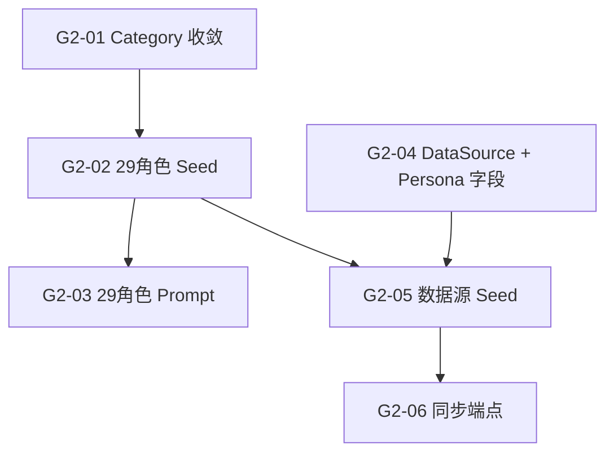

# Sprint G2 — 加拿大 29 角色全量上线

> 目标：29 个角色全量 Seed（全部启用）+ 系统 Prompt + 每角色 DataSource 数据源关联（公开 URL 自动爬取）。
>
> 前置条件：Sprint G1 ✅ 全球架构改造完成
> **状态**: 🟡 3/6 (G2-01 ✅ G2-02 ✅ G2-03 ✅ | G2-04 ❌ G2-05 ❌ G2-06 ❌)

## 核心原则

1. **所有 29 角色全部 `isEnabled: true`** — 无知识库的角色在 Chat 中显示 ⚠️ 警告（G1 已实现）
2. **知识库不用 Skill 内容** — 通过 DataSource 关联公开官方 URL，自动爬取 + 定时更新
3. **DataSource 关联 Persona** — 每个数据源绑定一个 Persona，爬取结果进入对应 `ca_{slug}` collection

---

## 概览

| Task | Story 数 | 预估总工时 | 状态 | 说明 |
|------|----------|-----------|------|------|
| T1 架构对齐 | 1 | 1h | ✅ | category 收敛 8 个（7+analysis） |
| T2 Seed 数据 | 1 | 2h | ✅ | 29 角色 Seed（26 启用） |
| T3 系统 Prompt | 1 | 6h | ✅ | 29 角色 Prompt 已编写 |
| T4 DataSource 关联 | 3 | 6h | ❌ | Persona 字段 + 数据源 Seed + 同步端点 |
| **合计** | **6** | **15h** | **3/6** |

## 质量门禁

| # | 检查项 | 判定依据 |
|---|--------|----------|
| G1 | category 7 个 | `ConsultingPersonas.ts` 的 category options 恰好 7 个 |
| G2 | Seed 幂等 | `npm run seed` 重复执行不创建重复角色（slug upsert） |
| G3 | 29 角色全部启用 | 所有角色 `isEnabled: true`，Admin 显示 29 个 |
| G4 | Prompt 结构一致 | 29 个 Prompt 全部包含：角色定义 · 回答规则 · 引用格式 · 免责声明 · 边界限制 |
| G5 | DataSource 关联 | 每个 P0 角色至少 2 个数据源，URL 均为可访问的公开官方页面 |
| G6 | ChromaDB 命名 | 所有角色使用 `ca_{slug}` 命名 |

---

## [G2-T1] 架构对齐

### [G2-01] ✅ ConsultingPersonas category 收敛为 7+1 个

**类型**: Backend (Payload)
**优先级**: P0
**预估**: 1h

#### 描述

当前 `ConsultingPersonas.ts` 的 `category` 字段有 11 个选项。
需要收敛为 PRD v2 定义的 7 个：`education / immigration / settlement / healthcare / finance / career / legal`。

#### 验收标准

- [x] `ConsultingPersonas.ts` category options 8 个（7 + analysis）
- [x] 选项值与 PRD v2 对齐
- [x] `defaultValue` 改为 `'settlement'`（最大类）

#### 文件

- `payload-v2/src/collections/ConsultingPersonas.ts` (改造)

---

## [G2-T2] Seed 数据

### [G2-02] ✅ 29 角色 Seed 数据（26 启用 / 3 待启用）

**类型**: Backend (Payload)
**优先级**: P0
**预估**: 2h

#### 描述

用 PRD v2 定义的 28 角色 + `ecdev-analyst`（共 29 个）替换现有角色。
**所有角色均 `isEnabled: true`**，无知识库的角色靠 Chat 端的 SSE warning 提示用户。
Seed 采用 slug upsert 模式（幂等）。

#### 完整角色清单（29 个，全部启用）

| # | slug | category | 说明 |
|---|------|----------|------|
| 1 | `edu-school-planning` | education | 🎓 院校规划 |
| 2 | `edu-visa-compliance` | education | 🎓 签证合规 |
| 3 | `edu-academic-rules` | education | 🎓 学术规则 |
| 4 | `edu-work-permit` | education | 🎓 工签衔接 |
| 5 | `edu-child-education` | education | 🎓 子女教育 |
| 6 | `imm-pathways` | immigration | 🛂 移民路径 |
| 7 | `imm-pr-renewal` | immigration | 🛂 PR 续签 |
| 8 | `imm-family` | immigration | 🛂 家庭团聚 |
| 9 | `life-rental` | settlement | 🏠 租房 |
| 10 | `life-driving` | settlement | 🏠 驾照 |
| 11 | `life-utilities` | settlement | 🏠 水电网络 |
| 12 | `life-home-buying` | settlement | 🏠 买房 |
| 13 | `life-car` | settlement | 🏠 买车 |
| 14 | `health-insurance` | healthcare | 🏥 医保 |
| 15 | `health-mental` | healthcare | 🏥 心理健康 |
| 16 | `health-childcare` | healthcare | 🏥 儿童保健 |
| 17 | `fin-banking` | finance | 💰 银行开户 |
| 18 | `fin-tax` | finance | 💰 税务 |
| 19 | `fin-investment` | finance | 💰 投资理财 |
| 20 | `fin-cost-saving` | finance | 💰 省钱攻略 |
| 21 | `career-resume` | career | 💼 简历 |
| 22 | `career-internship` | career | 💼 实习 |
| 23 | `career-transition` | career | 💼 转型 |
| 24 | `career-volunteer` | career | 💼 志愿者 |
| 25 | `legal-labor` | legal | ⚖️ 劳动法 |
| 26 | `legal-disputes` | legal | ⚖️ 纠纷 |
| 27 | `legal-consumer` | legal | ⚖️ 消费者权益 |
| 28 | `legal-basics` | legal | ⚖️ 法律常识 |
| 29 | `ecdev-analyst` | career | 💼 经济发展分析 |

#### 验收标准

- [x] Seed 包含 29 个角色
- [x] 26/29 角色 `isEnabled: true`（3 个暂无知识库: life-home-buying, life-car, imm-family）
- [x] 所有角色 `country: 'ca'`
- [x] `chromaCollection` 格式为 `ca_{slug}`
- [x] slug upsert 幂等
- [x] `npm run seed` 后 Admin 显示 29 个角色（26 启用）

#### 文件

- `payload-v2/src/seed/consulting-personas/` (重写)
- `payload-v2/src/seed/index.ts` (如需调整)

---

## [G2-T3] 系统 Prompt

### [G2-03] ✅ 29 角色系统 Prompt 编写

**类型**: Backend (Seed Data)
**优先级**: P0
**预估**: 6h

#### 描述

为 29 个角色各编写一份系统 Prompt，内联在 Seed 数据的 `systemPrompt` 字段中。
每份 Prompt 必须包含 5 个标准段落：角色定义、回答规则、引用格式、免责声明、边界限制。

**Prompt 模板结构** (每个角色必须包含):
```
## Role Definition
You are a professional {role_name} specializing in Canadian {domain} consulting.

## Response Rules
1. Only answer {domain}-related questions; politely decline out-of-scope
2. Base all advice on Canadian official policies; cite sources
3. Respond in the user's chosen language
4. Structure answers clearly with numbered points
5. Specify currency as CAD when discussing costs
6. {3+ domain-specific rules}

## Citation Format
When referencing knowledge base content, use [Source: Document §Section] format

## Disclaimer
⚠️ The above information is for reference only and does not constitute legal,
immigration, or financial advice. Please consult a licensed professional.

## Boundary Restrictions
- Do not provide specific legal representation
- Do not make decisions for users
- Do not guarantee policy timeliness
- {domain-specific boundaries}

## Context
{context_str}

## User Question
{query_str}
```

#### 验收标准

- [x] 29 个角色的 `systemPrompt` 字段已填充
- [x] 每个 Prompt 包含 5 个标准段落
- [x] 每个角色有至少 3 条领域特定的回答规则
- [x] Prompt 中包含 `{context_str}` 和 `{query_str}` 占位符

#### 文件

- `payload-v2/src/seed/consulting-personas/**/*.ts` (改造 — 填充 systemPrompt)

---

## [G2-T4] DataSource 关联知识库

> **核心变更**: 知识库灌入不再使用 Skill 内容，改为 DataSource 公开 URL 自动爬取。

### [G2-04] DataSource Collection 增加 Persona 关联字段

**类型**: Backend (Payload CMS)
**优先级**: P0
**预估**: 1h

#### 描述

在 `DataSources` Collection 新增 `persona` relationship 字段（optional），
让每个数据源可关联到一个 Consulting Persona。

爬取流程变更：
- **有 persona 关联**: 爬取的 PDF → 进入 `ca_{slug}` collection
- **无 persona 关联**: 爬取的 PDF → 进入通用 `books`（向后兼容）

同时增加 `autoSync` 布尔字段和 `syncInterval` 选择字段（daily / weekly / monthly）。

#### 验收标准

- [ ] `DataSources` Collection 有 `persona` 关系字段（optional, relationTo: consulting-personas）
- [ ] 有 `autoSync` 布尔字段（default: false）
- [ ] 有 `syncInterval` 选择字段
- [ ] Admin 后台可为数据源选择关联 Persona
- [ ] 已有数据源不受影响（向后兼容）

#### 文件

- `payload-v2/src/collections/DataSources.ts` (改造)

---

### [G2-05] 29 角色 DataSource Seed 数据

**类型**: Backend (Seed)
**优先级**: P0
**预估**: 4h

#### 描述

为 29 个角色各创建 2-5 个公开官方数据源 Seed 条目。
每个数据源包含：名称、URL、类型、关联 Persona、autoSync 配置。

**数据源选取原则**：
1. 必须是**公开可访问**的官方或权威网页（政府 `.gc.ca` / `.on.ca` / 机构官网）
2. 优先选择有 PDF 下载的页面
3. URL 可以是 HTML 页面（需爬取内容）或 PDF 直接下载链接
4. 每个角色覆盖其核心知识领域

#### 数据源清单（示例，非完整）

**🎓 Education (5 角色)**

| Persona | 数据源名称 | URL | 类型 |
|---------|-----------|-----|------|
| `edu-school-planning` | IRCC DLI 院校列表 | `canada.ca/en/immigration-refugees-citizenship/services/study-canada/study-permit/prepare/designated-learning-institutions-list.html` | HTML |
| `edu-school-planning` | OUAC 安省大学申请 | `ouac.on.ca/guide/` | HTML |
| `edu-school-planning` | EduCanada 留学指南 | `educanada.ca/` | HTML |
| `edu-visa-compliance` | IRCC 学签申请 | `canada.ca/en/immigration-refugees-citizenship/services/study-canada/study-permit.html` | HTML |
| `edu-visa-compliance` | IRCC 学签续签 | `canada.ca/en/immigration-refugees-citizenship/services/study-canada/extend-study-permit.html` | HTML |
| `edu-academic-rules` | Ontario Universities | `ontariouniversities.ca/` | HTML |
| `edu-work-permit` | IRCC PGWP | `canada.ca/en/immigration-refugees-citizenship/services/study-canada/work/after-graduation.html` | HTML |
| `edu-child-education` | Ontario School System | `ontario.ca/page/ontario-schools-kindergarten-grade-12` | HTML |

**🛂 Immigration (3 角色)**

| Persona | 数据源名称 | URL | 类型 |
|---------|-----------|-----|------|
| `imm-pathways` | IRCC Express Entry | `canada.ca/en/immigration-refugees-citizenship/services/immigrate-canada/express-entry.html` | HTML |
| `imm-pathways` | Ontario PNP (OINP) | `ontario.ca/page/ontario-immigrant-nominee-program-oinp` | HTML |
| `imm-pathways` | CRS 分数计算 | `canada.ca/en/immigration-refugees-citizenship/services/immigrate-canada/express-entry/eligibility/criteria-comprehensive-ranking-system.html` | HTML |
| `imm-pr-renewal` | IRCC PR Card 续签 | `canada.ca/en/immigration-refugees-citizenship/services/new-immigrants/pr-card.html` | HTML |
| `imm-family` | IRCC 家庭担保 | `canada.ca/en/immigration-refugees-citizenship/services/immigrate-canada/family-sponsorship.html` | HTML |

**🏠 Settlement (5 角色)**

| Persona | 数据源名称 | URL | 类型 |
|---------|-----------|-----|------|
| `life-rental` | Ontario RTA 法规 | `ontario.ca/laws/statute/06r17` | HTML |
| `life-rental` | Ontario Standard Lease | `ontario.ca/page/guide-ontarios-standard-lease` | HTML |
| `life-rental` | LTB 房东租客委员会 | `tribunalsontario.ca/ltb/` | HTML |
| `life-driving` | Ontario DriveTest | `drivetest.ca/` | HTML |
| `life-driving` | MTO 驾照要求 | `ontario.ca/page/get-g-drivers-licence-new-drivers` | HTML |
| `life-utilities` | Toronto Hydro 电力 | `torontohydro.com/for-home/rates-and-billing` | HTML |
| `life-utilities` | Enbridge Gas | `enbridgegas.com/residential` | HTML |
| `life-home-buying` | CMHC 买房指南 | `cmhc-schl.gc.ca/consumers/home-buying` | HTML |
| `life-car` | Ontario 买车指南 | `ontario.ca/page/buy-or-sell-used-vehicle-ontario` | HTML |

**🏥 Healthcare (3 角色)**

| Persona | 数据源名称 | URL | 类型 |
|---------|-----------|-----|------|
| `health-insurance` | OHIP 注册 | `ontario.ca/page/apply-ohip-and-get-health-card` | HTML |
| `health-insurance` | Ontario UHIP | `uhip.ca/` | HTML |
| `health-mental` | CMHA 心理健康 | `ontario.cmha.ca/` | HTML |
| `health-childcare` | Ontario 儿童福利 | `ontario.ca/page/child-care-subsidies` | HTML |

**💰 Finance (4 角色)**

| Persona | 数据源名称 | URL | 类型 |
|---------|-----------|-----|------|
| `fin-banking` | FCAC 银行入门 | `canada.ca/en/financial-consumer-agency/services/banking.html` | HTML |
| `fin-banking` | 新移民银行开户 | 各大银行 newcomer 页面 | HTML |
| `fin-tax` | CRA 个人税务 | `canada.ca/en/revenue-agency/services/tax/individuals.html` | HTML |
| `fin-tax` | CRA 新移民税务 | `canada.ca/en/revenue-agency/services/tax/international-non-residents/individuals-leaving-entering-canada-non-residents/newcomers-canada-immigrants.html` | HTML |
| `fin-investment` | OSC 投资基础 | `osc.ca/en/investors` | HTML |
| `fin-cost-saving` | Ontario Trillium Benefit | `ontario.ca/page/ontario-trillium-benefit` | HTML |

**💼 Career (4 + ecdev-analyst)**

| Persona | 数据源名称 | URL | 类型 |
|---------|-----------|-----|------|
| `career-resume` | Job Bank 求职 | `jobbank.gc.ca/` | HTML |
| `career-resume` | WES 加拿大简历 | `wes.org/advisor-blog/canadian-resume/` | HTML |
| `career-internship` | Ontario Co-op | `ontario.ca/page/co-op-education-tax-credit` | HTML |
| `career-transition` | IRCC 外国资质认证 | `canada.ca/en/immigration-refugees-citizenship/services/new-immigrants/prepare-life-canada/prepare-work/credential-assessment.html` | HTML |
| `career-volunteer` | Volunteer Canada | `volunteer.ca/` | HTML |
| `ecdev-analyst` | Ottawa 经济报告 | 现有 Data Sources (已有) | - |

**⚖️ Legal (4 角色)**

| Persona | 数据源名称 | URL | 类型 |
|---------|-----------|-----|------|
| `legal-labor` | Ontario ESA | `ontario.ca/document/employment-standard-act-policy-and-interpretation-manual` | HTML |
| `legal-labor` | Ontario 最低工资 | `ontario.ca/page/minimum-wage-workers` | HTML |
| `legal-disputes` | Ontario Small Claims | `ontario.ca/page/suing-and-being-sued` | HTML |
| `legal-consumer` | Ontario 消费者保护 | `ontario.ca/page/your-rights-when-signing-contract` | HTML |
| `legal-basics` | CLEO 法律入门 | `cleo.on.ca/en` | HTML |

#### 验收标准

- [ ] 29 个角色各有 2-5 个数据源
- [ ] 所有 URL 均为**真实可访问**的公开官方页面
- [ ] 数据源的 `persona` 字段已关联对应角色
- [ ] `npm run seed` 后 Admin Data Sources 页面可按 Persona 过滤
- [ ] `autoSync: true` + `syncInterval: 'weekly'` 为默认配置

#### 文件

- `payload-v2/src/seed/data-sources-persona.ts` (新建)
- `payload-v2/src/seed/index.ts` (注册)

---

### [G2-06] 数据源同步端点 + 自动灌入

**类型**: Backend (Engine)
**优先级**: P0
**预估**: 1h

#### 描述

在 Engine 中新增 `POST /engine/sources/sync-persona/{persona_slug}` 端点：

1. 读取该 Persona 关联的所有 DataSource
2. 对每个 URL 执行 discover → download → ingest
3. 爬取结果进入 `ca_{persona_slug}` ChromaDB collection
4. 更新 DataSource 的 `lastSynced` 和 `docsFound` / `docsIngested`

同时新增批量端点 `POST /engine/sources/sync-all`：
- 遍历所有有 persona 关联的 DataSource
- 按 Persona 分组执行同步

#### 验收标准

- [ ] `POST /engine/sources/sync-persona/{slug}` 可触发单角色同步
- [ ] `POST /engine/sources/sync-all` 可触发全量同步
- [ ] 爬取结果正确进入对应 `ca_{slug}` collection
- [ ] 重复爬取不创建重复向量（dedup by URL/filename）

#### 文件

- `engine_v2/api/routes/sources.py` (改造)
- `engine_v2/sources/sync.py` (新建)

---

## 依赖图



## 执行顺序

| Phase | Tasks | Est. Time | 前置 | 备注 |
|-------|-------|-----------|------|------|
| **Phase 1** | G2-01, G2-04 | 2h | G1 完成 | Category 收敛 + DataSource 字段（并行） |
| **Phase 2** | G2-02, G2-03 | 8h | Phase 1 | 29 角色 Seed + Prompt（最耗时） |
| **Phase 3** | G2-05 | 4h | Phase 1 + 2 | 数据源 URL 整理 + Seed |
| **Phase 4** | G2-06 | 1h | Phase 3 | 同步端点 |
