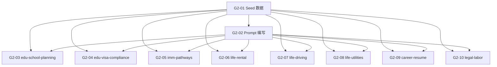

# Sprint G2 — 加拿大 P0 角色上线

> 目标：8 个 P0 角色的 Seed 数据 + 系统 Prompt + 知识库灌入，跑通加拿大全场景咨询。
>
> 前置条件：Sprint G1 ✅ 全球架构改造完成（country + category 字段、ChromaDB 命名）
> **状态**: ❌ 0/10

## 概览

| Task | Story 数 | 预估总工时 | 说明 |
|------|----------|-----------|------|
| T1 Seed + Prompt 基础 | 2 | 8h | 8 角色 Seed 数据 + 8 套系统 Prompt |
| T2 留学教育知识库 | 2 | 3h | 院校规划 + 签证合规 |
| T3 移民身份知识库 | 1 | 1.5h | 移民路径 |
| T4 落地安家知识库 | 3 | 4.5h | 租房 + 驾照 + 缴费 |
| T5 职场 + 法律知识库 | 2 | 3h | 简历 + 劳动权益 |
| **合计** | **10** | **20h** |

## 质量门禁

| # | 检查项 | 判定依据 |
|---|--------|----------|
| G1 | Seed 幂等 | `npm run seed` 重复执行不创建重复角色（slug upsert） |
| G2 | Prompt 结构一致 | 8 个 Prompt 文件全部包含：角色定义 · 回答规则 · 引用格式 · 免责声明 · 边界限制 |
| G3 | 知识库有数据 | 8 个 `ca_*` collection 的 `chunk_count > 0` |
| G4 | 不影响旧角色 | 现有 lawyer/compliance/auditor 角色及其 collection 不受影响 |

---

## [G2-T1] Seed + Prompt 基础

### [G2-01] 8 个 P0 角色 Seed 数据

**类型**: Backend (Payload)
**Epic**: 加拿大 P0 上线
**User Story**: 作为管理员，我需要预置 8 个加拿大 P0 咨询角色，让用户开箱即用
**优先级**: P0
**预估**: 2h

#### 描述

在现有 `seed/consulting-personas.ts` 基础上新建 v2 Seed 文件。
8 个角色覆盖 PRD v2 §三定义的 5 大类（留学 2 + 移民 1 + 落地 3 + 职场 1 + 法律 1）。
每个角色需要完整填充 G1 新增的 `country` 和 `category` 字段。
Seed 采用 slug upsert 模式（幂等），避免重复创建。

#### 实现方案

```typescript
// payload-v2/src/seed/consulting-personas-v2.ts
export const CONSULTING_PERSONAS_V2: PersonaSeedData[] = [
  {
    name: '目标国家院校 & 专业规划顾问',
    slug: 'edu-school-planning',
    country: 'ca',
    category: 'education',
    icon: 'graduation-cap',
    description: '帮你对比加拿大 DLI 院校、热门专业、学费、就业前景，定制选校方案',
    chromaCollection: 'ca_edu-school-planning',
    systemPrompt: '',  // G2-02 填充
    isEnabled: true,
    sortOrder: 1,
  },
  // ... 7 more personas
]
```

**完整角色清单**:

| # | slug | name | category | icon | sortOrder |
|---|------|------|----------|------|-----------|
| 1 | `edu-school-planning` | 目标国家院校 & 专业规划顾问 | education | `graduation-cap` | 1 |
| 2 | `edu-visa-compliance` | 留学签证 & 入境合规顾问 | education | `stamp` | 2 |
| 3 | `imm-pathways` | 移民基础路径 & 政策顾问 | immigration | `route` | 3 |
| 4 | `life-rental` | 租房住宿 & 合约常识顾问 | living | `home` | 4 |
| 5 | `life-driving` | 当地驾照 & 交通规则顾问 | living | `car` | 5 |
| 6 | `life-utilities` | 基础生活缴费顾问 | living | `zap` | 6 |
| 7 | `career-resume` | 通用简历 & 求职规划顾问 | career | `file-text` | 7 |
| 8 | `legal-labor` | 当地劳工基础权益顾问 | legal | `scale` | 8 |

#### 验收标准

- [ ] 新文件 `payload-v2/src/seed/consulting-personas-v2.ts`
- [ ] 8 个角色均包含: name / slug / country / category / icon / description / chromaCollection / sortOrder
- [ ] 所有角色 `country: 'ca'`
- [ ] `chromaCollection` 格式为 `ca_{slug}`
- [ ] `seed/index.ts` 注册 v2 Seed 调用
- [ ] slug upsert 模式：已存在则更新，不创建重复
- [ ] `npm run seed` 后 Payload Admin 显示 8 个新角色
- [ ] G1 ✅ 重复执行不创建重复数据
- [ ] G4 ✅ 旧角色 (lawyer/compliance/auditor) 不被删除

#### 依赖

- [G1-01] country 字段已存在
- [G1-02] category 字段已存在

#### 文件

- `payload-v2/src/seed/consulting-personas-v2.ts` (新增)
- `payload-v2/src/seed/index.ts` (改造 — 注册 v2 seed)

#### 检查命令

```bash
cd payload-v2 && npm run seed
curl -s 'http://localhost:3001/api/consulting-personas?where[country][equals]=ca&limit=20' | jq '.totalDocs'
# 期望: 8 (或 8 + 旧角色数)
```

---

### [G2-02] 8 个角色系统 Prompt 编写

**类型**: Backend (Engine)
**Epic**: 加拿大 P0 上线
**User Story**: 作为 AI 顾问，我需要明确的角色边界、回答规则和免责要求，确保回答专业且合规
**优先级**: P0
**预估**: 6h

#### 描述

为 8 个 P0 角色各编写一份系统 Prompt，存放在 `engine_v2/personas/prompts/ca/` 目录。
每份 Prompt 必须包含 5 个标准段落：角色定义、回答规则、引用格式、免责声明、边界限制。
Seed 数据中的 `systemPrompt` 字段引用对应文件内容（可在 seed 脚本中 fs.readFileSync 读取，或内联）。

**Prompt 模板结构** (每个角色必须包含):
```
## 角色定义
你是一名专业的{角色名}，专注于加拿大{领域}领域的咨询服务。

## 回答规则
1. 仅回答{领域}相关问题，超出范围礼貌拒绝并建议用户咨询对应顾问
2. 所有建议基于加拿大官方政策和法规，标注信息来源
3. 使用用户选择的语种回答
4. 回答结构清晰，分点列出
5. 涉及费用时标注货币单位 (CAD)

## 引用格式
引用知识库内容时使用 [来源: 文档名 §章节] 格式

## 免责声明
每条回答末尾附加：
「⚠️ 以上信息仅供参考，不构成法律/移民/财务建议。具体事务请咨询持牌专业人士。」

## 边界限制
- 不提供具体法律代理服务
- 不替用户做决定
- 不保证政策时效性，建议用户核实官方最新信息
```

#### 验收标准

- [ ] 新建目录 `engine_v2/personas/prompts/ca/`
- [ ] 8 个 `.txt` 文件: `edu-school-planning.txt` ~ `legal-labor.txt`
- [ ] 每个 Prompt 包含 5 个标准段落
- [ ] 每个角色的边界限制明确列出不回答的领域
- [ ] Prompt 中包含 `{context_str}` 和 `{query_str}` 占位符（供 LlamaIndex 注入）
- [ ] 每个角色有至少 3 条领域特定的回答规则
- [ ] Seed 数据 `systemPrompt` 字段引用对应 Prompt 文件内容
- [ ] G2 ✅ 8 个文件结构一致

#### 依赖

- [G2-01] Seed 数据已定义（知道哪 8 个角色）

#### 文件

- `engine_v2/personas/prompts/ca/edu-school-planning.txt` (新增)
- `engine_v2/personas/prompts/ca/edu-visa-compliance.txt` (新增)
- `engine_v2/personas/prompts/ca/imm-pathways.txt` (新增)
- `engine_v2/personas/prompts/ca/life-rental.txt` (新增)
- `engine_v2/personas/prompts/ca/life-driving.txt` (新增)
- `engine_v2/personas/prompts/ca/life-utilities.txt` (新增)
- `engine_v2/personas/prompts/ca/career-resume.txt` (新增)
- `engine_v2/personas/prompts/ca/legal-labor.txt` (新增)

---

## [G2-T2] 留学教育知识库

### [G2-03] 🎓 `edu-school-planning` 知识库灌入

**类型**: Data
**Epic**: 加拿大 P0 上线
**User Story**: 作为留学生，我需要查询 DLI 学校、专业对比、学费等信息来制定选校方案
**优先级**: P0
**预估**: 1.5h

#### 描述

从 `.agent/skills/education-school-selection/` 提取种子知识，整理为结构化 Markdown 文档。
通过 Engine `/engine/consulting/ingest` API 灌入 `ca_edu-school-planning` collection。
知识库应覆盖：DLI 院校列表、College vs University 区别、热门专业就业数据、学费对比。

#### 验收标准

- [ ] PDF/Markdown 文档已存放在 `data/raw_pdfs/consulting/edu-school-planning/`
- [ ] 调用 `/engine/consulting/ingest` 完成灌入
- [ ] ChromaDB collection `ca_edu-school-planning` 已创建，`chunk_count > 0`
- [ ] 测试查询 "加拿大 College 和 University 有什么区别" 返回相关结果
- [ ] G3 ✅ collection 有数据

#### 依赖

- [G2-01] Seed 数据已创建（角色在 Payload 中存在）
- [G2-02] Prompt 已编写（灌入后即可测试咨询质量）

#### 文件

- `data/raw_pdfs/consulting/edu-school-planning/*.pdf` (新增 — 知识文档)

#### 检查命令

```bash
curl -s http://localhost:8001/engine/consulting/status/edu-school-planning | jq '.chunk_count'
# 期望: > 0
```

---

### [G2-04] 🎓 `edu-visa-compliance` 知识库灌入

**类型**: Data
**Epic**: 加拿大 P0 上线
**User Story**: 作为留学生，我需要了解学签首签、续签流程和材料清单
**优先级**: P0
**预估**: 1.5h

#### 描述

知识库覆盖：学签(Study Permit)首签流程、大签续签、小签(Visa)续签、常见拒签原因、材料清单。
参考 Skill: `identity-visa`。

#### 验收标准

- [ ] 文档已存放在 `data/raw_pdfs/consulting/edu-visa-compliance/`
- [ ] ChromaDB collection `ca_edu-visa-compliance` 已创建，`chunk_count > 0`
- [ ] 测试查询 "学签首签需要准备什么材料" 返回相关结果
- [ ] G3 ✅ collection 有数据

#### 依赖

- [G2-01] Seed 数据已创建
- [G2-02] Prompt 已编写

#### 文件

- `data/raw_pdfs/consulting/edu-visa-compliance/*.pdf` (新增)

---

## [G2-T3] 移民身份知识库

### [G2-05] 🛂 `imm-pathways` 知识库灌入

**类型**: Data
**Epic**: 加拿大 P0 上线
**User Story**: 作为新移民/留学生，我需要了解 EE、PNP、LMIA 等移民路径的基本流程
**优先级**: P0
**预估**: 1.5h

#### 描述

知识库覆盖：Express Entry (EE) 流程、Provincial Nominee Program (PNP)、LMIA 工签转移民、留学移民路径、CRS 打分规则概览。
参考 Skill: `immigration-pr-application`。

#### 验收标准

- [ ] 文档已存放在 `data/raw_pdfs/consulting/imm-pathways/`
- [ ] ChromaDB collection `ca_imm-pathways` 已创建，`chunk_count > 0`
- [ ] 测试查询 "EE 快速通道怎么申请" 返回相关结果
- [ ] G3 ✅ collection 有数据

#### 依赖

- [G2-01] Seed 数据已创建
- [G2-02] Prompt 已编写

#### 文件

- `data/raw_pdfs/consulting/imm-pathways/*.pdf` (新增)

---

## [G2-T4] 落地安家知识库

### [G2-06] 🏘️ `life-rental` 知识库灌入

**类型**: Data
**Epic**: 加拿大 P0 上线
**User Story**: 作为新来者，我需要了解安省租房法规、标准租约条款和租客权利
**优先级**: P0
**预估**: 1.5h

#### 描述

知识库覆盖：安省 Residential Tenancies Act (RTA)、Ontario Standard Lease、涨租限制、Landlord and Tenant Board (LTB) 投诉流程、租客权利和义务。
参考 Skill: `housing-rental` + `legal-rental-contract`。

#### 验收标准

- [ ] 文档已存放在 `data/raw_pdfs/consulting/life-rental/`
- [ ] ChromaDB collection `ca_life-rental` 已创建，`chunk_count > 0`
- [ ] 测试查询 "房东可以随意涨房租吗" 返回相关结果
- [ ] G3 ✅ collection 有数据

#### 依赖

- [G2-01], [G2-02]

#### 文件

- `data/raw_pdfs/consulting/life-rental/*.pdf` (新增)

---

### [G2-07] 🏘️ `life-driving` 知识库灌入

**类型**: Data
**Epic**: 加拿大 P0 上线
**User Story**: 作为新来者，我需要了解 G1/G2/G 驾照考试流程和国际驾照换领规则
**优先级**: P0
**预估**: 1.5h

#### 描述

知识库覆盖：G1 笔试、G2 路考、G 路考规则、国际驾照换领流程、DriveTest 中心预约方式。
参考 Skill: `transportation-driving-license`。

#### 验收标准

- [ ] 文档已存放在 `data/raw_pdfs/consulting/life-driving/`
- [ ] ChromaDB collection `ca_life-driving` 已创建，`chunk_count > 0`
- [ ] 测试查询 "中国驾照可以直接换安省驾照吗" 返回相关结果
- [ ] G3 ✅ collection 有数据

#### 依赖

- [G2-01], [G2-02]

#### 文件

- `data/raw_pdfs/consulting/life-driving/*.pdf` (新增)

---

### [G2-08] 🏘️ `life-utilities` 知识库灌入

**类型**: Data
**Epic**: 加拿大 P0 上线
**User Story**: 作为新来者，我需要了解水电气开户流程和网络运营商对比
**优先级**: P0
**预估**: 1.5h

#### 描述

知识库覆盖：Toronto Hydro / Hydro One 电力开户、Enbridge 天然气开户、水费缴纳、TOU 分时电价说明、Rogers/Bell/Telus 网络运营商套餐对比。
参考 Skill: `housing-utilities`。

#### 验收标准

- [ ] 文档已存放在 `data/raw_pdfs/consulting/life-utilities/`
- [ ] ChromaDB collection `ca_life-utilities` 已创建，`chunk_count > 0`
- [ ] 测试查询 "Toronto 怎么开电力账户" 返回相关结果
- [ ] G3 ✅ collection 有数据

#### 依赖

- [G2-01], [G2-02]

#### 文件

- `data/raw_pdfs/consulting/life-utilities/*.pdf` (新增)

---

## [G2-T5] 职场 + 法律知识库

### [G2-09] 💼 `career-resume` 知识库灌入

**类型**: Data
**Epic**: 加拿大 P0 上线
**User Story**: 作为求职者，我需要了解加拿大简历格式、ATS 优化和 LinkedIn SEO 技巧
**优先级**: P0
**预估**: 1.5h

#### 描述

知识库覆盖：加拿大简历格式规范（vs 中国简历差异）、ATS (Applicant Tracking System) 优化技巧、LinkedIn 个人资料 SEO、Cover Letter 撰写模板。
参考 Skill: `career-resume`。

#### 验收标准

- [ ] 文档已存放在 `data/raw_pdfs/consulting/career-resume/`
- [ ] ChromaDB collection `ca_career-resume` 已创建，`chunk_count > 0`
- [ ] 测试查询 "加拿大简历和中国简历有什么区别" 返回相关结果
- [ ] G3 ✅ collection 有数据

#### 依赖

- [G2-01], [G2-02]

#### 文件

- `data/raw_pdfs/consulting/career-resume/*.pdf` (新增)

---

### [G2-10] ⚖️ `legal-labor` 知识库灌入

**类型**: Data
**Epic**: 加拿大 P0 上线
**User Story**: 作为劳动者，我需要了解 ESA 劳动法、最低工资、加班费和解雇赔偿规则
**优先级**: P0
**预估**: 1.5h

#### 描述

知识库覆盖：Ontario Employment Standards Act (ESA) 核心条款、最低工资标准、加班费计算、解雇通知期和遣散费、职场歧视投诉渠道、WSIB 工伤保险。
参考 Skill: `legal-labor-rights`。

#### 验收标准

- [ ] 文档已存放在 `data/raw_pdfs/consulting/legal-labor/`
- [ ] ChromaDB collection `ca_legal-labor` 已创建，`chunk_count > 0`
- [ ] 测试查询 "安省最低工资是多少" 返回相关结果
- [ ] G3 ✅ collection 有数据

#### 依赖

- [G2-01], [G2-02]

#### 文件

- `data/raw_pdfs/consulting/legal-labor/*.pdf` (新增)

---

## 模块文件变更

```
payload-v2/src/
└── seed/
    ├── consulting-personas-v2.ts           ← 新增 (8 角色 Seed)
    └── index.ts                            ← 改造 (注册 v2 Seed)

engine_v2/
└── personas/
    └── prompts/
        └── ca/                             ← 新增目录
            ├── edu-school-planning.txt     ← 新增
            ├── edu-visa-compliance.txt     ← 新增
            ├── imm-pathways.txt            ← 新增
            ├── life-rental.txt             ← 新增
            ├── life-driving.txt            ← 新增
            ├── life-utilities.txt          ← 新增
            ├── career-resume.txt           ← 新增
            └── legal-labor.txt             ← 新增

data/raw_pdfs/consulting/                   ← 新增目录树
├── edu-school-planning/*.pdf
├── edu-visa-compliance/*.pdf
├── imm-pathways/*.pdf
├── life-rental/*.pdf
├── life-driving/*.pdf
├── life-utilities/*.pdf
├── career-resume/*.pdf
└── legal-labor/*.pdf
```

## 依赖图



## 执行顺序

| Phase | Tasks | Est. Time | 前置 | 备注 |
|-------|-------|-----------|------|------|
| **Phase 1** | G2-01 | 2h | G1 完成 | Seed 数据定义 |
| **Phase 2** | G2-02 | 6h | Phase 1 | 8 个 Prompt 编写（最耗时） |
| **Phase 3** | G2-03 ~ G2-10 | 12h | Phase 1 + 2 | 8 个知识库可并行灌入 |
