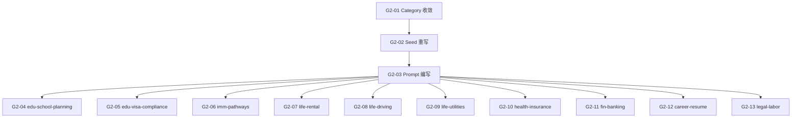

# Sprint G2 — 加拿大 P0 角色上线

> 目标：10 个 P0 角色的 Seed 数据 + 系统 Prompt + 知识库灌入，跑通加拿大 7 大类全场景咨询。
>
> 前置条件：Sprint G1 ✅ 全球架构改造完成（country + category 字段、ChromaDB 命名）
> **状态**: ❌ 0/12

## 概览

| Task | Story 数 | 预估总工时 | 说明 |
|------|----------|-----------|------|
| T1 架构对齐 | 2 | 3h | category 收敛 7 个 + Seed 重写 28 角色 |
| T2 系统 Prompt | 1 | 6h | 10 个 P0 角色 Prompt 编写 |
| T3 知识库灌入 | 10 | 15h | 10 个 P0 角色知识库灌入（可并行） |
| **合计** | **13** | **24h** |

## 质量门禁

| # | 检查项 | 判定依据 |
|---|--------|----------|
| G1 | category 7 个 | `ConsultingPersonas.ts` 的 category options 恰好 7 个 |
| G2 | Seed 幂等 | `npm run seed` 重复执行不创建重复角色（slug upsert） |
| G3 | Prompt 结构一致 | 10 个 Prompt 全部包含：角色定义 · 回答规则 · 引用格式 · 免责声明 · 边界限制 |
| G4 | 知识库有数据 | 10 个 `ca_*` collection 的 `chunk_count > 0` |
| G5 | ChromaDB 命名对齐 | 所有新角色使用 `ca_{slug}` 命名，不再用 `persona_{slug}` |

---

## [G2-T1] 架构对齐

### [G2-01] ConsultingPersonas category 收敛为 7 个

**类型**: Backend (Payload)
**优先级**: P0
**预估**: 1h

#### 描述

当前 `ConsultingPersonas.ts` 的 `category` 字段有 11 个选项（immigration / education / legal / career / living / finance / healthcare / housing / transportation / social / travel）。
需要收敛为 PRD v2 定义的 7 个：`education / immigration / settlement / healthcare / finance / career / legal`。

#### 验收标准

- [ ] `ConsultingPersonas.ts` category options 恰好 7 个
- [ ] 选项值与 PRD v2 §二 对齐
- [ ] `defaultValue` 改为 `'settlement'`（最大类）
- [ ] `defaultColumns` 保持包含 `category`
- [ ] G1 ✅

#### 文件

- `payload-v2/src/collections/ConsultingPersonas.ts` (改造)

---

### [G2-02] 28 角色 Seed 数据重写

**类型**: Backend (Payload)
**优先级**: P0
**预估**: 2h

#### 描述

用 PRD v2 §三定义的 28 角色替换现有 11 个宽泛角色。
ChromaDB collection 命名统一为 `ca_{slug}` 格式。
P1/P2 角色的 `isEnabled: false`，P0 角色 `isEnabled: true`。
Seed 采用 slug upsert 模式（幂等）。

#### 完整角色清单

| # | slug | category | P | isEnabled |
|---|------|----------|---|-----------|
| 1 | `edu-school-planning` | education | P0 | true |
| 2 | `edu-visa-compliance` | education | P0 | true |
| 3 | `edu-academic-rules` | education | P1 | false |
| 4 | `edu-work-permit` | education | P2 | false |
| 5 | `edu-child-education` | education | P2 | false |
| 6 | `imm-pathways` | immigration | P0 | true |
| 7 | `imm-pr-renewal` | immigration | P1 | false |
| 8 | `imm-family` | immigration | P2 | false |
| 9 | `life-rental` | settlement | P0 | true |
| 10 | `life-driving` | settlement | P0 | true |
| 11 | `life-utilities` | settlement | P0 | true |
| 12 | `life-home-buying` | settlement | P1 | false |
| 13 | `life-car` | settlement | P1 | false |
| 14 | `health-insurance` | healthcare | P0 | true |
| 15 | `health-mental` | healthcare | P1 | false |
| 16 | `health-childcare` | healthcare | P2 | false |
| 17 | `fin-banking` | finance | P0 | true |
| 18 | `fin-tax` | finance | P1 | false |
| 19 | `fin-investment` | finance | P2 | false |
| 20 | `fin-cost-saving` | finance | P2 | false |
| 21 | `career-resume` | career | P0 | true |
| 22 | `career-internship` | career | P1 | false |
| 23 | `career-transition` | career | P2 | false |
| 24 | `career-volunteer` | career | P2 | false |
| 25 | `legal-labor` | legal | P0 | true |
| 26 | `legal-disputes` | legal | P1 | false |
| 27 | `legal-consumer` | legal | P1 | false |
| 28 | `legal-basics` | legal | P2 | false |

#### 验收标准

- [ ] `consulting-personas.ts` 包含 28 个角色
- [ ] 所有角色包含: name / slug / country / category / icon / description / chromaCollection / sortOrder
- [ ] 所有角色 `country: 'ca'`
- [ ] `chromaCollection` 格式为 `ca_{slug}`（不再用 `persona_{slug}`）
- [ ] P0 角色 `isEnabled: true`，P1/P2 `isEnabled: false`
- [ ] slug upsert 模式：已存在则更新，不创建重复
- [ ] `npm run seed` 后 Payload Admin 显示 28 个角色（10 个启用）
- [ ] G2 ✅ G5 ✅

#### 文件

- `payload-v2/src/seed/consulting-personas.ts` (重写)
- `payload-v2/src/seed/index.ts` (如需调整)

---

## [G2-T2] 系统 Prompt

### [G2-03] 10 个 P0 角色系统 Prompt 编写

**类型**: Backend (Engine)
**优先级**: P0
**预估**: 6h

#### 描述

为 10 个 P0 角色各编写一份系统 Prompt，内联在 Seed 数据的 `systemPrompt` 字段中。
每份 Prompt 必须包含 5 个标准段落：角色定义、回答规则、引用格式、免责声明、边界限制。

**Prompt 模板结构** (每个角色必须包含):
```
## Role Definition
You are a professional {role_name} specializing in Canadian {domain} consulting.

## Response Rules
1. Only answer {domain}-related questions; politely decline and recommend the appropriate advisor for out-of-scope questions
2. Base all advice on Canadian official policies and regulations; cite sources
3. Respond in the user's chosen language
4. Structure answers clearly with numbered points
5. Specify currency as CAD when discussing costs
6. {3+ domain-specific rules}

## Citation Format
When referencing knowledge base content, use [Source: Document §Section] format

## Disclaimer
Append to every response:
"⚠️ The above information is for reference only and does not constitute legal, immigration, or financial advice. Please consult a licensed professional for specific matters."

## Boundary Restrictions
- Do not provide specific legal representation services
- Do not make decisions for users
- Do not guarantee policy timeliness; advise users to verify with official sources
- {domain-specific boundaries}

## Context
{context_str}

## User Question
{query_str}
```

#### 10 个 P0 角色 Prompt 要点

| slug | 核心领域 | 特殊回答规则 |
|------|---------|-------------|
| `edu-school-planning` | DLI 院校、专业、学费 | 对比表格、就业率数据 |
| `edu-visa-compliance` | 学签首签/续签、材料清单 | 拒签风险提示、材料 checklist |
| `imm-pathways` | EE、PNP、LMIA、CRS | CRS 打分参考、路径对比 |
| `life-rental` | RTA、标准租约、LTB | 法规条款号引用、租客权利 |
| `life-driving` | G1/G2/G 考试 | 考试流程图、国际驾照换领 |
| `life-utilities` | 水电气网开户 | 费用对比、TOU 电价说明 |
| `health-insurance` | OHIP、家庭医生 | 等待时间、Walk-in vs ER |
| `fin-banking` | 银行开户、信用卡 | 新移民优惠对比、信用建设 |
| `career-resume` | 加拿大简历格式、ATS | 中加简历差异、LinkedIn SEO |
| `legal-labor` | ESA、最低工资、加班费 | 法规条款号、投诉渠道 |

#### 验收标准

- [ ] 10 个 P0 角色的 `systemPrompt` 字段已填充
- [ ] 每个 Prompt 包含 5 个标准段落
- [ ] 每个角色有至少 3 条领域特定的回答规则
- [ ] 每个角色的边界限制明确列出不回答的领域
- [ ] Prompt 中包含 `{context_str}` 和 `{query_str}` 占位符
- [ ] G3 ✅

#### 依赖

- [G2-02] Seed 数据已定义（知道哪 10 个角色）

#### 文件

- `payload-v2/src/seed/consulting-personas.ts` (改造 — 填充 systemPrompt)

---

## [G2-T3] 知识库灌入

> 10 个 P0 角色的知识库灌入可并行执行。每个 Story 结构相同。

### [G2-04] 🎓 `edu-school-planning` 知识库灌入

**优先级**: P0 · **预估**: 1.5h · **对应 Skill**: `education-school-selection`

**知识库覆盖**: DLI 院校列表、College vs University 区别、热门专业就业数据、学费对比
**验收**: `ca_edu-school-planning` collection `chunk_count > 0`
**测试查询**: "加拿大 College 和 University 有什么区别"

---

### [G2-05] 🎓 `edu-visa-compliance` 知识库灌入

**优先级**: P0 · **预估**: 1.5h · **对应 Skill**: `identity-visa`

**知识库覆盖**: 学签首签流程、大签续签、小签续签、常见拒签原因、材料清单
**验收**: `ca_edu-visa-compliance` collection `chunk_count > 0`
**测试查询**: "学签首签需要准备什么材料"

---

### [G2-06] 🛂 `imm-pathways` 知识库灌入

**优先级**: P0 · **预估**: 1.5h · **对应 Skill**: `immigration-pr-application`

**知识库覆盖**: EE 流程、PNP、LMIA 工签转移民、留学移民路径、CRS 打分
**验收**: `ca_imm-pathways` collection `chunk_count > 0`
**测试查询**: "EE 快速通道怎么申请"

---

### [G2-07] 🏠 `life-rental` 知识库灌入

**优先级**: P0 · **预估**: 1.5h · **对应 Skill**: `housing-rental` + `legal-rental-contract`

**知识库覆盖**: 安省 RTA、Ontario Standard Lease、涨租限制、LTB 投诉
**验收**: `ca_life-rental` collection `chunk_count > 0`
**测试查询**: "房东可以随意涨房租吗"

---

### [G2-08] 🏠 `life-driving` 知识库灌入

**优先级**: P0 · **预估**: 1.5h · **对应 Skill**: `transportation-driving-license`

**知识库覆盖**: G1 笔试、G2 路考、G 路考、国际驾照换领、DriveTest 预约
**验收**: `ca_life-driving` collection `chunk_count > 0`
**测试查询**: "中国驾照可以直接换安省驾照吗"

---

### [G2-09] 🏠 `life-utilities` 知识库灌入

**优先级**: P0 · **预估**: 1.5h · **对应 Skill**: `housing-utilities` + `communication-internet-service`

**知识库覆盖**: Toronto Hydro 电力开户、Enbridge 天然气、TOU 电价、Rogers/Bell/Telus 对比
**验收**: `ca_life-utilities` collection `chunk_count > 0`
**测试查询**: "Toronto 怎么开电力账户"

---

### [G2-10] 🏥 `health-insurance` 知识库灌入

**优先级**: P0 · **预估**: 1.5h · **对应 Skill**: `healthcare-*` (6 个 skill)

**知识库覆盖**: OHIP 注册、家庭医生注册、Walk-in 就诊、药房买药、UHIP 保险
**验收**: `ca_health-insurance` collection `chunk_count > 0`
**测试查询**: "新移民怎么申请 OHIP"

---

### [G2-11] 💰 `fin-banking` 知识库灌入

**优先级**: P0 · **预估**: 1.5h · **对应 Skill**: `finance-banking` + `finance-credit-card`

**知识库覆盖**: 五大银行对比、新移民开户优惠、信用卡选择、信用分建设
**验收**: `ca_fin-banking` collection `chunk_count > 0`
**测试查询**: "新移民第一张信用卡选哪家银行"

---

### [G2-12] 💼 `career-resume` 知识库灌入

**优先级**: P0 · **预估**: 1.5h · **对应 Skill**: `career-resume` + `career-job-search`

**知识库覆盖**: 加拿大简历格式、ATS 优化、LinkedIn SEO、Cover Letter 模板
**验收**: `ca_career-resume` collection `chunk_count > 0`
**测试查询**: "加拿大简历和中国简历有什么区别"

---

### [G2-13] ⚖️ `legal-labor` 知识库灌入

**优先级**: P0 · **预估**: 1.5h · **对应 Skill**: `legal-labor-rights`

**知识库覆盖**: ESA 核心条款、最低工资、加班费、解雇通知期、WSIB 工伤
**验收**: `ca_legal-labor` collection `chunk_count > 0`
**测试查询**: "安省最低工资是多少"

---

## 依赖图



## 执行顺序

| Phase | Tasks | Est. Time | 前置 | 备注 |
|-------|-------|-----------|------|------|
| **Phase 1** | G2-01, G2-02 | 3h | G1 完成 | Category 收敛 + Seed 重写 |
| **Phase 2** | G2-03 | 6h | Phase 1 | 10 个 Prompt 编写（最耗时） |
| **Phase 3** | G2-04 ~ G2-13 | 15h | Phase 1 + 2 | 10 个知识库可并行灌入 |
