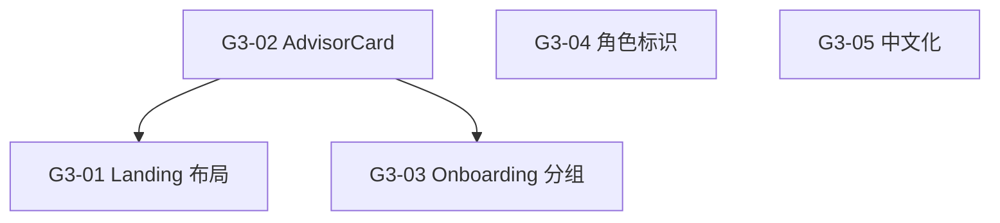

# Sprint G3 — Landing 页重构

> 目标：Landing 页改为 PRD v2 的 5 大类卡片 + 国家选择布局，Onboarding 按类分组，咨询页中文化。
>
> 前置条件：Sprint G1 ✅ 国家/语种选择器已完成
> **状态**: ❌ 0/5

## 概览

| Task | Story 数 | 预估总工时 | 说明 |
|------|----------|-----------|------|
| T1 Landing 重构 | 2 | 6h | 类目卡片布局 + 顾问小卡片组件 |
| T2 Onboarding 适配 | 1 | 2.5h | 按 5 大类分组展示角色 |
| T3 咨询页优化 | 2 | 3.5h | 角色/国家标识 + 全面中文化 |
| **合计** | **5** | **12h** |

## 质量门禁

| # | 检查项 | 判定依据 |
|---|--------|----------|
| G1 | 数据流方向 | 前端从 `/api/consulting-personas` 按 category 分组；不直接调 Engine |
| G2 | 响应式布局 | Desktop 3列 / Tablet 2列 / Mobile 1列 |
| G3 | 中文无遗漏 | 咨询页面所有 placeholder / toast / 按钮文案均为中文 |
| G4 | 不破坏认证流 | 登录 → Onboarding → 选角色 → 咨询 全流程不变 |

---

## [G3-T1] Landing 重构

### [G3-01] Landing 页 5 大类目卡片布局

**类型**: Frontend
**Epic**: Landing 页重构
**User Story**: 作为访客，我需要在首页按领域分类快速找到需要的咨询服务
**优先级**: P0
**预估**: 4h

#### 描述

当前 `HomePage` 是 SaaS 营销页面（Hero + Features + Pricing + CTA）。
需要重构为"咨询入口"模式：简化 Hero → 5 大类卡片网格 → 点击展开该类下的 P0 顾问小卡片。
数据源从 Payload API 获取已启用角色，按 `category` 分组渲染。
点击小卡片的【AI 免费咨询】按钮直接跳转 `/chat?mode=consulting&persona={slug}`。

#### 实现方案

```
┌─────────────────────────────────────────────┐
│  🌐 语种  |  🇨🇦 国家  |  ConsultRAG        │  ← AppHeader (已有)
├─────────────────────────────────────────────┤
│                                             │
│  全球跨境生活 AI 智能顾问                     │  ← Hero (简化: 一行标语 + 副标题)
│  选择你关心的领域，获得专业解答                │
│                                             │
├─────────────────────────────────────────────┤
│                                             │
│  🎓 留学求学    🛂 移民身份    🏘️ 落地安家    │  ← 5 大类卡片 (CSS Grid)
│                                             │
│  💼 职场就业    ⚖️ 法律权益                   │
│                                             │
├─────────────────────────────────────────────┤
│  (点击大卡后展开该类下的顾问小卡片)            │
│                                             │
│  ┌──────────┐  ┌──────────┐                 │  ← AdvisorCard 组件
│  │ 🎓 院校  │  │ 🎓 签证  │                 │
│  │ 规划顾问 │  │ 合规顾问 │                 │
│  │ 服务范围 │  │ 服务范围 │                 │
│  │[AI免费咨询]│ │[AI免费咨询]│                │
│  └──────────┘  └──────────┘                 │
│                                             │
├─────────────────────────────────────────────┤
│  Footer: 服务条款 | 隐私政策                  │  ← 已有
└─────────────────────────────────────────────┘
```

**数据获取**:
```typescript
// usePersonas hook 扩展
const { data } = useSWR(
  `/api/consulting-personas?where[country][equals]=${country}&where[isEnabled][equals]=true&sort=sortOrder`,
)
// 前端按 category 分组
const grouped = groupBy(data.docs, 'category')
```

#### 验收标准

- [ ] `HomePage.tsx` 重构为类目卡片布局
- [ ] 5 大类卡片正确展示：留学求学 / 移民身份 / 落地安家 / 职场就业 / 法律权益
- [ ] 数据从 Payload API 按 `category` 分组获取（带 `country` 过滤）
- [ ] 点击大卡片展开/折叠该类下顾问小卡片（CSS transition，300ms ease）
- [ ] 同时只展开一个类目（手风琴模式）
- [ ] 空类目（无启用角色）显示"即将推出"
- [ ] 响应式：Desktop 3列 / Tablet 2列 / Mobile 1列
- [ ] G1 ✅ 数据通过 Payload API 读取
- [ ] G2 ✅ 响应式布局

#### 依赖

- [G1-06] 国家选择器已集成到 AppHeader

#### 文件

- `payload-v2/src/features/home/HomePage.tsx` (改造 — 主体重构)
- `payload-v2/src/features/home/CategoryCard.tsx` (新增 — 大类卡片组件)

#### 检查命令

```bash
npx tsc --noEmit  # cwd: payload-v2
```

---

### [G3-02] 顾问小卡片组件

**类型**: Frontend
**Epic**: Landing 页重构
**User Story**: 作为访客，我需要看到每个顾问的名称、服务范围和入口按钮，快速开始咨询
**优先级**: P0
**预估**: 2h

#### 描述

新建 `AdvisorCard` 组件，作为 Landing 页类目展开后的子卡片。
卡片展示角色图标（lucide-react）、中文名称、一句话服务范围、【AI 免费咨询】按钮。
组件需要复用在 Landing 页和 Onboarding 页两处。

#### 实现方案

```typescript
// payload-v2/src/features/home/AdvisorCard.tsx
interface AdvisorCardProps {
  persona: {
    slug: string
    name: string
    icon: string
    description: string
    category: string
  }
  onSelect?: (slug: string) => void  // Onboarding 模式
}
```

#### 验收标准

- [ ] 新文件 `features/home/AdvisorCard.tsx`
- [ ] 显示角色图标（lucide-react `<Icon>` 动态渲染，从 persona.icon 读取）
- [ ] 显示角色名称（中文）
- [ ] 显示一句话服务范围（从 persona.description 截取前 50 字）
- [ ] 【AI 免费咨询】按钮 → 跳转 `/chat?mode=consulting&persona={slug}`
- [ ] 卡片 hover 效果：微上移 + 阴影增强
- [ ] 知识库为空时按钮显示"知识库准备中"并 disabled
- [ ] 响应式：卡片宽度自适应 Grid 容器
- [ ] G2 ✅ 响应式

#### 依赖

- 无（纯 UI 组件）

#### 文件

- `payload-v2/src/features/home/AdvisorCard.tsx` (新增)

---

## [G3-T2] Onboarding 适配

### [G3-03] Onboarding 页按 5 大类分组展示

**类型**: Frontend
**Epic**: Landing 页重构
**User Story**: 作为首次登录用户，我需要按领域分类选择我需要的顾问角色
**优先级**: P1
**预估**: 2.5h

#### 描述

当前 `OnboardingPage` 平铺展示所有角色卡片。
改为按 5 大类分组展示，每组有类目标题 + 图标。
复用 `AdvisorCard` 组件（传入 `onSelect` 回调替代直接跳转）。
保留原有的选中态高亮 + 确认按钮逻辑。

#### 实现方案

```typescript
// OnboardingPage.tsx 改造
const grouped = groupBy(personas, 'category')
const CATEGORY_ORDER = ['education', 'immigration', 'living', 'career', 'legal']
const CATEGORY_LABELS = {
  education: { label: '🎓 留学求学', icon: 'graduation-cap' },
  immigration: { label: '🛂 移民身份', icon: 'route' },
  // ...
}

{CATEGORY_ORDER.map(cat => (
  <section key={cat}>
    <h3>{CATEGORY_LABELS[cat].label}</h3>
    <div className="grid">
      {grouped[cat]?.map(p => (
        <AdvisorCard persona={p} onSelect={handleSelect} />
      ))}
    </div>
  </section>
))}
```

#### 验收标准

- [ ] `OnboardingPage.tsx` 改为按 category 分组渲染
- [ ] 5 个类目均有标题（emoji + 中文名）
- [ ] 每组内使用 `AdvisorCard` 渲染角色卡片
- [ ] 保留原有选中态高亮 + 确认按钮逻辑
- [ ] 空类目不显示
- [ ] 选择后正常写回 `Users.selectedPersona` + `isOnboarded: true`
- [ ] G4 ✅ 登录→Onboarding→咨询全流程通

#### 依赖

- [G3-02] AdvisorCard 组件已完成

#### 文件

- `payload-v2/src/features/onboarding/OnboardingPage.tsx` (改造)

---

## [G3-T3] 咨询页优化

### [G3-04] 咨询页顶部角色 + 国家标识

**类型**: Frontend
**Epic**: Landing 页重构
**User Story**: 作为用户，我需要在咨询页顶部清楚地看到当前在哪个国家、找哪个顾问
**优先级**: P1
**预估**: 1.5h

#### 描述

在 ChatPanel 顶部导航增加角色和国家标识，格式：`🇨🇦 加拿大 · 🎓 院校规划顾问`。
点击标识可返回 Landing 页类目选择（不是 Onboarding 页）。
国家/语种切换器应在顶部可用（复用 G1 的 CountrySelector + LanguageSelector）。

#### 验收标准

- [ ] ChatPanel 顶部显示当前国家旗帜 + 角色名
- [ ] 格式：`🇨🇦 加拿大 · 🎓 {角色名}`
- [ ] 角色名从当前 session 的 persona 数据读取
- [ ] 点击标识区域跳转到 Landing 页（`/`）
- [ ] 国家选择器和语种选择器可用
- [ ] Consulting 模式以外（普通 Chat）不显示此标识

#### 依赖

- [G1-06] CountrySelector 已完成

#### 文件

- `payload-v2/src/features/chat/panel/ChatPanel.tsx` (改造)

---

### [G3-05] 咨询页全面中文化

**类型**: Frontend
**Epic**: Landing 页重构
**User Story**: 作为中文用户，我需要咨询界面全部为中文，无英文残留
**优先级**: P1
**预估**: 2h

#### 描述

审查咨询相关所有页面的文案，将英文残留替换为中文。
涉及 ChatPanel、ChatInput、ChatMessage、WelcomeScreen、AppSidebar 等组件。
所有文案通过 `messages.ts` i18n 字典管理，不硬编码在组件中。

#### 中文化清单

| 组件 | 当前文案 | 目标文案 |
|------|---------|---------|
| ChatInput placeholder | "Ask a question..." | "请输入您的问题..." |
| WelcomeScreen | "Hello! How can I help?" | "您好！我是{角色名}，有什么可以帮您的？" |
| Error toast | "Failed to generate" | "抱歉，回答生成失败，请重试" |
| Copy button | "Copy" | "复制回答" |
| Clear button | "Clear chat" | "清空对话" |
| Citation label | "Sources" | "来源引用" |
| Sidebar consulting group | "Consulting" | "智能咨询" |
| Upload placeholder | "Upload PDF" | "上传 PDF 文档" |

#### 验收标准

- [ ] `features/providers/messages.ts` 补充所有咨询相关中文翻译
- [ ] ChatInput placeholder 改为中文
- [ ] WelcomeScreen 显示角色名
- [ ] 错误提示中文化
- [ ] 复制/清空按钮中文化
- [ ] Citation label 中文化
- [ ] AppSidebar 咨询组名中文化
- [ ] 上传区域文案中文化
- [ ] 全面审查后无英文残留
- [ ] G3 ✅ 全中文

#### 依赖

- 无

#### 文件

- `payload-v2/src/features/providers/messages.ts` (改造 — 补充中文)
- `payload-v2/src/features/chat/panel/ChatPanel.tsx` (改造)
- `payload-v2/src/features/chat/panel/ChatInput.tsx` (改造)
- `payload-v2/src/features/chat/panel/WelcomeScreen.tsx` (改造)
- `payload-v2/src/features/layout/AppSidebar.tsx` (改造)

---

## 模块文件变更

```
payload-v2/src/features/
├── home/
│   ├── HomePage.tsx                        ← 改造 (主体重构为类目卡片)
│   ├── CategoryCard.tsx                    ← 新增 (大类卡片组件)
│   └── AdvisorCard.tsx                     ← 新增 (顾问小卡片)
├── onboarding/
│   └── OnboardingPage.tsx                  ← 改造 (按 category 分组)
├── chat/panel/
│   ├── ChatPanel.tsx                       ← 改造 (角色/国家标识 + 中文化)
│   ├── ChatInput.tsx                       ← 改造 (placeholder 中文化)
│   └── WelcomeScreen.tsx                   ← 改造 (中文化)
├── layout/
│   └── AppSidebar.tsx                      ← 改造 (咨询组名中文化)
└── providers/
    └── messages.ts                         ← 改造 (补充中文翻译)
```

## 依赖图



## 执行顺序

| Phase | Tasks | Est. Time | 前置 | 备注 |
|-------|-------|-----------|------|------|
| **Phase 1** | G3-02 | 2h | 无 | 先做可复用组件 |
| **Phase 2** | G3-01, G3-03 | 6.5h | Phase 1 | 可并行，都依赖 AdvisorCard |
| **Phase 3** | G3-04, G3-05 | 3.5h | G1 完成 | 可并行 |
