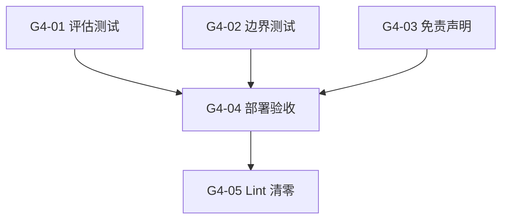

# Sprint G4 — 质量验收 + 部署

> 目标：确保 8 个 P0 角色回答质量达标（综合 ≥ 75），边界行为正确，免责合规，公网可访问。
>
> 前置条件：Sprint G2 ✅ + Sprint G3 ✅（8 角色数据就绪 + UI 重构完成）
> **状态**: ❌ 0/5

## 概览

| Task | Story 数 | 预估总工时 | 说明 |
|------|----------|-----------|------|
| T1 质量评估 | 2 | 4h | 8 角色评分 + 跨领域边界测试 |
| T2 安全合规 | 1 | 1h | 免责声明自动附加 |
| T3 部署验收 | 2 | 3h | ngrok 端到端验收 + lint 清零 |
| **合计** | **5** | **8h** |

## 质量门禁

| # | 检查项 | 判定依据 |
|---|--------|----------|
| G1 | 回答质量 | 8 个角色综合评分全部 ≥ 75（4 维加权） |
| G2 | 边界正确 | 每个角色至少 3 个跨领域问题被正确拒绝或引导 |
| G3 | 免责合规 | 每条 AI 回答末尾自动附加免责声明，无遗漏 |
| G4 | 公网可访问 | 外部用户通过 ngrok URL 可完成完整咨询体验 |

---

## [G4-T1] 质量评估

### [G4-01] 8 个角色评估测试 (综合 ≥ 75)

**类型**: QA
**Epic**: 质量验收
**User Story**: 作为产品负责人，我需要确认 8 个 P0 角色的回答质量达到上线标准
**优先级**: P0
**预估**: 3h

#### 描述

使用项目已有的 Evaluation 系统（`features/engine/evaluation/`）对每个角色进行质量评估。
每个角色准备 10 个测试问题，覆盖 3 类场景：高频常见问题(5)、模糊边界问题(3)、跨领域问题(2)。
4 维评分加权计算综合分，低于 75 分的角色需回退修改 Prompt 或补充知识库后重测。

#### 实现方案

**测试问题分类**:
```
常见问题 (5个): 用户最可能问的高频问题
  → 验证知识库覆盖度和回答完整性

边界问题 (3个): 模糊地带、需要准确定义的问题
  → 如 "College 和 University 的 Co-op 有什么区别"
  → 验证 Prompt 对细节的把控

跨领域问题 (2个): 明确不属于该角色领域的问题
  → 如 问院校顾问 "安省最低工资是多少"
  → 验证边界拒绝行为 (G4-02 单独评估)
```

**评分标准**:

| 维度 | 权重 | 及格线 | 说明 |
|------|------|--------|------|
| Relevance | 30% | ≥ 80 | 回答与问题的相关度 |
| Grounding | 30% | ≥ 75 | 回答是否基于知识库内容（有据可查） |
| Completeness | 20% | ≥ 70 | 回答是否完整覆盖问题各方面 |
| Clarity | 20% | ≥ 75 | 回答结构是否清晰、易于理解 |
| **综合** | **100%** | **≥ 75** | 加权平均 |

#### 验收标准

- [ ] 新建评估数据集 `data/eval/g4-p0-test-questions.json` (8 角色 × 10 题 = 80 题)
- [ ] 每个角色 10 个测试问题覆盖 3 类场景
- [ ] 使用现有 `/engine/evaluation/run` API 执行批量评估
- [ ] 8 个角色的 Relevance ≥ 80
- [ ] 8 个角色的 Grounding ≥ 75
- [ ] 8 个角色的 Completeness ≥ 70
- [ ] 8 个角色的 Clarity ≥ 75
- [ ] 8 个角色的综合评分 ≥ 75
- [ ] 不达标角色已回退修改并重测通过
- [ ] 评估结果记录在 Payload `Evaluations` Collection 中
- [ ] G1 ✅ 全部达标

#### 依赖

- [G2-01] ~ [G2-10] 所有角色 Seed + Prompt + 知识库完成
- [G3-01] ~ [G3-05] UI 重构完成（评估时可通过 UI 验证体验）

#### 文件

- `data/eval/g4-p0-test-questions.json` (新增 — 80 道测试题)

#### 检查命令

```bash
# 批量评估
curl -s -X POST http://localhost:8001/engine/evaluation/run \
  -H "Content-Type: application/json" \
  -d '{"dataset_id": "g4-p0-test"}' | jq '.summary'
```

---

### [G4-02] 角色边界测试 (跨领域拒绝)

**类型**: QA
**Epic**: 质量验收
**User Story**: 作为用户，我期望问错领域的问题时顾问能礼貌拒绝并引导我找正确的顾问
**优先级**: P0
**预估**: 1h

#### 描述

专门测试每个角色的边界行为：向一个角色提问不属于其领域的问题，验证是否：
1. 礼貌拒绝（不提供错误信息）
2. 明确推荐正确的顾问角色
3. 不泄露其他领域的知识库内容

每个角色至少 3 个跨领域测试用例。

#### 实现方案

| 被测角色 | 测试问题 | 期望行为 |
|---------|---------|---------|
| `edu-school-planning` | "安省最低工资是多少？" | 拒绝 → 推荐 `legal-labor` |
| `edu-school-planning` | "怎么申请 PR？" | 拒绝 → 推荐 `imm-pathways` |
| `life-driving` | "租房合约要注意什么？" | 拒绝 → 推荐 `life-rental` |
| `career-resume` | "EE 分数怎么算？" | 拒绝 → 推荐 `imm-pathways` |
| `life-rental` | "房东违约怎么告？" | 基础回答 + 推荐 `legal-labor` |
| `legal-labor` | "哪个学校好？" | 拒绝 → 推荐 `edu-school-planning` |
| `imm-pathways` | "简历怎么写？" | 拒绝 → 推荐 `career-resume` |
| `life-utilities` | "G2 路考怎么准备？" | 拒绝 → 推荐 `life-driving` |

#### 验收标准

- [ ] 每个角色至少 3 个跨领域测试用例
- [ ] 所有跨领域问题被正确拒绝（不提供错误领域答案）
- [ ] 拒绝回答中包含推荐的正确顾问名称
- [ ] 拒绝语气礼貌（"这个问题属于 XX 顾问的专业领域，建议您..."）
- [ ] 记录测试结果到 `data/eval/g4-boundary-test-results.md`
- [ ] G2 ✅ 全部边界测试通过

#### 依赖

- [G2-02] 所有角色 Prompt 已包含边界限制规则

#### 文件

- `data/eval/g4-boundary-test-results.md` (新增 — 测试结果记录)

---

## [G4-T2] 安全合规

### [G4-03] 免责声明自动附加

**类型**: Backend (Engine)
**Epic**: 质量验收
**User Story**: 作为平台，我需要确保每条 AI 回答都附带免责声明，降低法律风险
**优先级**: P0
**预估**: 1h

#### 描述

确保每条咨询回答末尾自动附加标准免责声明。
优先在系统 Prompt 层实现（G2-02 的 Prompt 已包含免责声明指令）。
作为兜底，在 Engine 的 consulting query 路由中进行 post-processing 检查：
如果回答末尾不包含"仅供参考"等关键词，自动追加免责声明。

#### 实现方案

```python
# engine_v2/api/routes/consulting.py — post-processing
DISCLAIMER = (
    "\n\n---\n"
    "⚠️ 以上信息仅供参考，不构成法律、移民或财务建议。"
    "具体事务请咨询持牌专业人士。"
)

def _ensure_disclaimer(answer: str) -> str:
    """Ensure disclaimer is appended to every consulting answer."""
    if "仅供参考" not in answer:
        return answer + DISCLAIMER
    return answer
```

#### 验收标准

- [ ] 每条 `/engine/consulting/query` 回答末尾含免责声明
- [ ] 每条 `/engine/consulting/query/stream` 最终回答含免责声明
- [ ] 免责声明格式统一：`⚠️ 以上信息仅供参考，不构成法律、移民或财务建议。具体事务请咨询持牌专业人士。`
- [ ] 前面有 `---` 分隔线
- [ ] 即使 LLM 忘记附加（Prompt 失效），后端兜底也会追加
- [ ] 连续对话不会出现双重免责声明
- [ ] G3 ✅ 无遗漏

#### 依赖

- [G2-02] Prompt 已包含免责指令（本 story 是兜底措施）

#### 文件

- `engine_v2/api/routes/consulting.py` (改造 — 添加 `_ensure_disclaimer` 后处理)

#### 检查命令

```bash
# 验证免责声明
curl -s -X POST http://localhost:8001/engine/consulting/query \
  -H "Content-Type: application/json" \
  -d '{"persona_slug":"edu-school-planning","question":"多伦多大学好吗"}' \
  | jq -r '.answer' | tail -3
# 期望包含: "仅供参考"
```

---

## [G4-T3] 部署验收

### [G4-04] ngrok 端到端部署验收

**类型**: DevOps
**Epic**: 质量验收
**User Story**: 作为外部用户，我需要通过公网 URL 完成从注册到咨询的完整体验
**优先级**: P0
**预估**: 2h

#### 描述

使用 ngrok 暴露本地服务到公网，模拟真实用户从零开始的完整体验。
验收覆盖：注册 → 登录 → Onboarding 选角色 → Landing 页浏览 → 选顾问 → 咨询对话 → 收到免责声明。
参考已有部署文档 `roadmap/archive/28-sprint-go-deployment.md`。

#### 验收标准

- [ ] ngrok HTTPS URL 可访问 Landing 页
- [ ] 新用户注册流程正常（email + password）
- [ ] 登录后自动跳转 Onboarding
- [ ] Onboarding 显示 5 大类 8 个角色
- [ ] 选择角色后进入咨询页
- [ ] Landing 页 5 大类卡片正确展示
- [ ] 8 个角色全部可点击进入咨询
- [ ] 咨询对话流式回答正常
- [ ] 回答末尾含免责声明
- [ ] 国家选择器显示加拿大
- [ ] 数据持久化（重启 ngrok 后数据不丢）
- [ ] Stripe 付费流程正常（如已配置）
- [ ] G4 ✅ 外部用户可完成完整体验

#### 依赖

- [G4-01] ~ [G4-03] 质量和合规验收通过

#### 文件

- 无新增文件（验收操作）

#### 检查命令

```bash
# 启动 ngrok
ngrok http 3001

# 验证健康检查
curl -s https://{ngrok-url}/api/users/me
```

---

### [G4-05] TypeScript + Python Lint 清零

**类型**: QA
**Epic**: 质量验收
**User Story**: 作为开发者，我需要确保代码质量达标，零 lint 错误
**优先级**: P1
**预估**: 1h

#### 描述

运行 TypeScript 编译检查和 Python Ruff lint，修复 G1-G3 新增代码引入的所有错误。
确保新增的组件、API 类型和 Seed 数据类型安全。

#### 验收标准

- [ ] `npx tsc --noEmit` (cwd: `payload-v2`) 零错误
- [ ] `uv run ruff check engine_v2/` 零错误
- [ ] `uv run ruff format --check engine_v2/` 零差异
- [ ] 新增的 `.tsx` 组件无 `any` 类型（除必要的第三方库类型）

#### 依赖

- [G1-01] ~ [G3-05] 所有代码改动完成

#### 文件

- 涉及 G1-G3 所有新增/改造文件（按 lint 报错修复）

#### 检查命令

```bash
# TypeScript
cd payload-v2 && npx tsc --noEmit

# Python
cd .. && uv run ruff check engine_v2/
uv run ruff format --check engine_v2/
```

---

## 模块文件变更

```
data/eval/
├── g4-p0-test-questions.json               ← 新增 (80 道测试题)
└── g4-boundary-test-results.md             ← 新增 (边界测试记录)

engine_v2/api/routes/
└── consulting.py                           ← 改造 (免责声明后处理)
```

## 依赖图



## 执行顺序

| Phase | Tasks | Est. Time | 前置 | 备注 |
|-------|-------|-----------|------|------|
| **Phase 1** | G4-01, G4-02 | 4h | G2 + G3 完成 | 可并行；不达标则回退 G2 修改 |
| **Phase 2** | G4-03 | 1h | Phase 1 结论 | 根据测试结果决定兜底策略 |
| **Phase 3** | G4-04 | 2h | Phase 1 + 2 | 端到端公网验收 |
| **Phase 4** | G4-05 | 1h | Phase 3 | 收尾，确保代码质量 |
