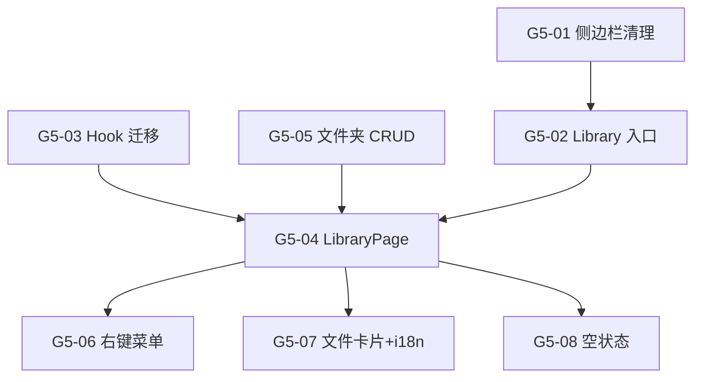

# Sprint G5 — 用户文档库 + 侧边栏整理 🟢 Tier 4

> 目标：(1) 新建用户 `/library` 页面（VS Code 风格目录树 + 用户自定义文件夹）(2) 侧边栏 Resources 清理
>
> 前置条件：Sprint G1 ✅ + G2 ✅ + UserDocuments Collection 已存在
> **注意**: 知识库数据源改造已合并到 G2-T4，本 Sprint 不再包含
> **状态**: ❌ 0/8
> **优先级**: 🟢 Tier 4 — 独立功能模块，不阻塞主线，可单独排期

---

## 背景与动机

### 问题 1: 用户缺少文件管理入口

用户文档上传嵌套在 `chat/panel/consulting/UserDocsPanel.tsx`（目前已注释掉），
用户没有独立页面来管理自己的私有文档。

### 问题 2: 侧边栏 Resources 面向用户暴露了管理功能

当前 Resources 区包含 Question Gen / Reports / Settings，其中 Question Gen 和 Reports
属于管理员功能，不应对普通用户可见。

---

## 现有基础设施（可直接复用）

| 层 | 组件 | 路径 | 状态 |
|----|------|------|------|
| Payload CMS | `UserDocuments` Collection | `collections/UserDocuments.ts` | ✅ |
| Engine API | `POST /engine/consulting/user-doc/ingest` | `consulting.py:476` | ✅ |
| Engine API | `GET /engine/consulting/user-doc/list` | `consulting.py:580` | ✅ |
| Engine API | `DELETE /engine/consulting/user-doc/{id}` | `consulting.py:639` | ✅ |
| UI 组件 | `SidebarLayout` (树形目录) | `shared/components/SidebarLayout.tsx` | ✅ |
| Hook | `useUserDocs()` | `chat/panel/consulting/useUserDocs.ts` | ✅ 需迁移 |

---

## 概览

| Task | Story 数 | 预估 | 说明 |
|------|----------|------|------|
| T1 侧边栏整理 | 2 | 1h | Resources 清理 + Library 入口 |
| T2 用户 Library 页面 | 6 | 7h | VS Code 风格目录树 + 右键菜单 + 上传 |
| **合计** | **8** | **8h** |

## 质量门禁

| # | 检查项 | 判定依据 |
|---|--------|----------|
| Q1 | 侧边栏清理 | 普通用户只看到 Library + Settings；Question Gen / Reports 归到 Admin |
| Q2 | Library 可达 | `/library` 正常渲染，未登录重定向 |
| Q3 | 目录树操作 | 展开/收起文件夹、右键菜单 → 上传/删除/新建文件夹 |
| Q4 | 上传端到端 | 拖放 PDF → Payload 存储 → Engine ingest → `indexed` 状态 |
| Q5 | TypeScript | `npx tsc --noEmit` 通过 |

---

## [G5-T1] 侧边栏整理

### [G5-01] Resources 区 Admin-only 清理

**类型**: Frontend (Layout)  **优先级**: P0  **预估**: 0.5h

#### 描述

**普通用户 Resources 区**: Library (新增) + Settings
**Admin 区**: 移入 Question Gen + Reports

#### 验收标准

- [ ] 普通用户侧边栏不显示 Question Gen、Reports
- [ ] Admin 侧边栏 Admin 区新增 Reports
- [ ] Settings 保留对所有用户可见

#### 文件

- `payload-v2/src/features/layout/AppSidebar.tsx` (改造)

---

### [G5-02] Library 侧边栏入口 + 路由

**类型**: Frontend (Layout + Route)  **优先级**: P0  **预估**: 0.5h

#### 验收标准

- [ ] 侧边栏显示 "Library" 入口（icon: FolderOpen）
- [ ] 点击跳转 `/library`，当前页高亮
- [ ] 未登录重定向 `/login`
- [ ] i18n: `navLibrary` key 已添加

#### 文件

- `payload-v2/src/features/layout/AppSidebar.tsx` (改造)
- `payload-v2/src/app/(frontend)/library/page.tsx` (新建)
- `payload-v2/src/features/shared/i18n/messages.ts` (新增 key)

---

## [G5-T2] 用户 Library 页面

### [G5-03] useUserDocs Hook 迁移 + usePersonas 抽取

**类型**: Frontend (Hook)  **优先级**: P0  **预估**: 1h

#### 描述

1. `chat/panel/consulting/useUserDocs.ts` → `shared/hooks/useUserDocs.ts`
2. `ChatPanel.tsx` persona 逻辑 → `shared/hooks/usePersonas.ts`
3. 更新原有 import

#### 文件

- `payload-v2/src/features/shared/hooks/useUserDocs.ts` (新建)
- `payload-v2/src/features/shared/hooks/usePersonas.ts` (新建)
- `payload-v2/src/features/chat/panel/consulting/useUserDocs.ts` (re-export)

---

### [G5-04] LibraryPage — VS Code 风格目录树

**类型**: Frontend (React)  **优先级**: P0  **预估**: 2h

#### 描述

基于 `SidebarLayout` 组件创建 `features/library/LibraryPage.tsx`。

**核心设计**: 目录树反映**用户自己的文件组织**，不是固定的系统分类。
用户上传文件时可选择放入哪个文件夹，也可以自建文件夹。

```
┌─ Sidebar (SidebarLayout) ──────────┬── Main Content ────────────┐
│ 📋 All                         12  │ 📁 My Library         3/20 │
│ ▼ 📂 租房资料                       │ ───────────────────────────│
│    📄 rental-agreement.pdf     ✅   │ ┌──────────────────────────┐│
│    📄 lease-template.pdf       ✅   │ │ 📄 Drop PDFs here        ││
│ ▼ 📂 简历求职                       │ └──────────────────────────┘│
│    📄 resume-v3.pdf            ⏳   │                             │
│ ▸ 📂 移民材料                   3   │  rental-agreement.pdf  ✅   │
│ ▸ 📂 税务                      2   │  📂 租房资料 · 156 chunks   │
│                                     │  May 1, 2026      [🗑]    │
│ ┄┄┄┄┄┄┄┄┄┄┄┄┄┄┄┄┄┄┄┄┄┄┄┄┄┄       │                             │
│ [+ 新建文件夹]                      │  lease-template.pdf    ✅   │
│                                     │  📂 租房资料 · 89 chunks    │
│                                     │  Apr 28, 2026     [🗑]    │
└─────────────────────────────────────┴─────────────────────────────┘
```

**目录树特点**:
- **动态生成** — 只显示用户实际创建/有文件的文件夹
- **用户自定义文件夹** — 新建、重命名、删除
- **不与 Persona 绑定** — 文件夹是用户自己的组织方式
- "All" 顶级节点显示所有文件

#### 文件

- `payload-v2/src/features/library/LibraryPage.tsx` (新建)
- `payload-v2/src/features/library/index.ts` (新建)

---

### [G5-05] 用户文件夹 CRUD（后端支持）

**类型**: Backend (Payload CMS)  **优先级**: P0  **预估**: 1h

#### 描述

在 `UserDocuments` 增加 `folder` text 字段（简单方案，前端动态聚合文件夹名）：

```typescript
{ name: 'folder', type: 'text', defaultValue: 'Uncategorized' }
```

- 新建文件夹 = 上传时写入新 folder 名
- 重命名 = 批量 PATCH folder 字段
- 删除文件夹 = 文件移到 "Uncategorized" 或同时删除

#### 文件

- `payload-v2/src/collections/UserDocuments.ts` (改造)

---

### [G5-06] 右键上下文菜单

**类型**: Frontend (React)  **优先级**: P1  **预估**: 1h

#### 描述

**文件夹右键**: Upload · Rename · Delete · Refresh
**文件右键**: Download · Move to folder · Re-ingest (error) · Delete
**空白区域右键**: Upload PDF · New folder

#### 文件

- `payload-v2/src/features/library/components/FileContextMenu.tsx` (新建)

---

### [G5-07] i18n + 文件卡片 + 上传区 + 配额

**类型**: Frontend (React + i18n)  **优先级**: P1  **预估**: 1.5h

#### 描述

1. **i18n keys** — `navLibrary`, `libraryTitle`, `libraryUploadHint`, `libraryEmpty`, `libraryNewFolder`
2. **`LibraryFileCard`** — 文件名、文件夹名、状态徽章、chunk 数、上传时间
3. **`LibraryDropZone`** — 拖放上传区（绑定当前文件夹）
4. **`StorageQuota`** — `{used}/{max}` 进度条

#### 文件

- `payload-v2/src/features/shared/i18n/messages.ts` (改造)
- `payload-v2/src/features/library/components/LibraryFileCard.tsx` (新建)
- `payload-v2/src/features/library/components/LibraryDropZone.tsx` (新建)
- `payload-v2/src/features/library/components/StorageQuota.tsx` (新建)

---

### [G5-08] 空状态 + 引导

**类型**: Frontend (React)  **优先级**: P1  **预估**: 0.5h

#### 描述

- 全局无文件：大图标 + "Upload your first document" 引导
- 当前文件夹无文件：简洁提示 + 上传按钮

#### 文件

- `payload-v2/src/features/library/components/LibraryEmptyState.tsx` (新建)

---

## 依赖图



## 执行顺序

| Phase | Tasks | Est. | 前置 | 备注 |
|-------|-------|------|------|------|
| **Phase 1** | G5-01, G5-02, G5-03, G5-05 | 3h | G1 ✅ | 侧边栏 + 路由 + Hook + 后端 |
| **Phase 2** | G5-04 | 2h | Phase 1 | LibraryPage 主组件 |
| **Phase 3** | G5-06, G5-07, G5-08 | 3h | Phase 2 | UI 打磨 |

---

## 架构对比: 用户 Library vs 管理员 Data Sources

| 维度 | Admin: Data Sources | User: Library |
|------|---------------------|---------------|
| **入口** | `/engine/acquisition` (Admin only) | `/library` (所有用户) |
| **组织方式** | 按 Persona 分数据源 | **用户自定义文件夹** |
| **数据来源** | URL 爬取 + 自动更新 | 用户手动上传 PDF |
| **存储** | `data/raw_pdfs/{category}/` | `data/raw_pdfs/user_private/{userId}/` |
| **向量库** | `ca_{slug}` (Persona KB) | `user_{userId}_{personaSlug}` (Private KB) |
| **权限** | Admin only | 文件 owner only |
| **UI 风格** | 数据源卡片 + Discover | VS Code 目录树 + 右键菜单 |
