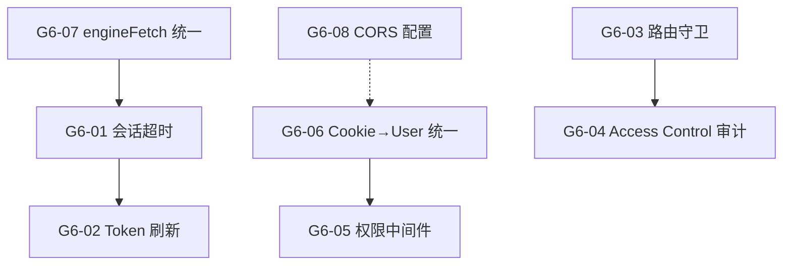

# Sprint G6 — 认证权限 + 会话管理 🟠 Tier 2/3

> 目标：Admin/User 权限彻底分离，会话超时自动登出，Engine 正确读取 Payload Cookie 鉴权。
>
> 前置条件：Sprint G1 ✅
> **状态**: ❌ 0/8
> **优先级**: 🟠 G6-03/04/05/06/07 鉴权核心 → Tier 2 | G6-01/02/08 会话管理 → Tier 3

---

## 背景与动机

当前系统存在以下认证/权限问题：

1. **权限未分离**: Admin 和 User 使用相同 session 策略，普通用户可访问部分管理功能
2. **无会话超时**: 登录后永不过期，安全风险
3. **Engine 跨端口鉴权脆弱**: 前端 (3001) → Engine (8001) 的 Cookie 传递依赖 `credentials: 'include'`，但浏览器同站策略在生产环境可能失败
4. **无自动登出**: 用户离开后 session 一直有效

---

## 概览

| Task | Story 数 | 预估 | 说明 |
|------|----------|------|------|
| T1 前端会话管理 | 3 | 3h | 超时检测 · 自动登出 · 刷新机制 |
| T2 角色权限分离 | 2 | 2h | 路由守卫 · API 权限中间件 |
| T3 Engine Cookie 鉴权 | 3 | 3h | Cookie 透传 · Token 验证 · 用户上下文 |
| **合计** | **8** | **8h** |

## 质量门禁

| # | 检查项 | 判定依据 |
|---|--------|----------|
| Q1 | 会话超时 | 用户 30 分钟无操作后自动跳转登录页 |
| Q2 | Admin 路由保护 | 普通用户访问 `/engine/*` 返回 403 或重定向 |
| Q3 | Engine 鉴权 | Engine 可从请求中解析出 Payload user，无 Cookie 时返回 401 |
| Q4 | Token 刷新 | 活跃用户 session 自动续期，不会意外登出 |
| Q5 | 生产环境兼容 | 跨域/同站部署均能正常鉴权 |

---

## [G6-T1] 前端会话管理

### [G6-01] 会话超时 + 自动登出

**类型**: Frontend (React)
**优先级**: P0
**预估**: 1.5h

#### 描述

实现客户端空闲检测：
- 监听 `mousemove` / `keydown` / `click` 事件重置计时器
- 30 分钟无操作 → 显示 "即将登出" 倒计时 Toast (60s)
- 倒计时结束 → 调用 logout API → 跳转 `/login`
- 任何交互 → 取消倒计时

配置项（可在 Settings 中调整）：
```typescript
const SESSION_TIMEOUT_MS = 30 * 60 * 1000  // 30 min
const LOGOUT_WARNING_MS = 60 * 1000        // 60s countdown
```

#### 验收标准

- [ ] 30 分钟无操作触发登出警告
- [ ] 警告期间有操作可取消
- [ ] 倒计时结束自动登出 + 跳转
- [ ] 多标签页共享超时状态（localStorage 同步）

#### 文件

- `payload-v2/src/features/shared/hooks/useSessionTimeout.ts` (新建)
- `payload-v2/src/features/shared/components/SessionTimeoutWarning.tsx` (新建)
- `payload-v2/src/app/(frontend)/layout.tsx` (集成)

---

### [G6-02] Token 自动刷新

**类型**: Frontend (API)
**优先级**: P1
**预估**: 1h

#### 描述

Payload CMS 的 JWT token 有有效期（默认 2h）。
在 token 即将过期时（剩余 < 10 min）自动调用 `POST /api/users/refresh-token` 续期。

#### 验收标准

- [ ] 活跃用户不会因 token 过期被登出
- [ ] 刷新失败时 fallback 到登出流程
- [ ] 刷新逻辑不产生重复请求（debounce）

#### 文件

- `payload-v2/src/features/shared/AuthProvider.tsx` (改造 — 添加 refresh 逻辑)

---

### [G6-03] 前端路由守卫增强

**类型**: Frontend (Next.js Middleware)
**优先级**: P0
**预估**: 0.5h

#### 描述

增强 Next.js middleware，区分 admin-only 和 authenticated 路由：

```
/engine/*      → admin only (role === 'admin')
/seed          → admin only
/library       → authenticated (any role)
/chat          → authenticated (any role)
/settings      → authenticated (any role)
/login         → public
/register      → public
/              → public
```

非 admin 用户访问 `/engine/*` → 重定向到 `/chat`

#### 验收标准

- [ ] 普通用户无法访问 `/engine/*` 和 `/seed`
- [ ] Admin 可访问所有页面
- [ ] 未登录用户重定向到 `/login`

#### 文件

- `payload-v2/src/middleware.ts` (改造)

---

## [G6-T2] 角色权限分离

### [G6-04] Payload API Access Control 审计

**类型**: Backend (Payload CMS)
**优先级**: P0
**预估**: 1h

#### 描述

审计所有 Collection 的 `access` 配置，确保权限正确：

| Collection | read | create | update | delete |
|-----------|------|--------|--------|--------|
| `users` | self + admin | public (register) | self + admin | admin |
| `consulting-personas` | public | admin | admin | admin |
| `user-documents` | owner + admin | authenticated | owner + admin | owner + admin |
| `books` | admin | admin | admin | admin |
| `data-sources` | admin | admin | admin | admin |
| `chat-sessions` | owner + admin | authenticated | owner + admin | owner + admin |

#### 验收标准

- [ ] 每个 Collection 的 access 函数已审计并修正
- [ ] 普通用户无法通过 API 读取其他用户的文档
- [ ] 普通用户无法修改 Persona / DataSource

#### 文件

- `payload-v2/src/collections/*.ts` (审计 + 修正)

---

### [G6-05] Engine API 权限中间件

**类型**: Backend (Engine)
**优先级**: P1
**预估**: 1h

#### 描述

在 Engine FastAPI 中创建权限中间件/装饰器，区分：

```python
@require_auth          # 任何已认证用户
@require_admin         # 仅 admin
@require_owner(user_id_param="user_id")  # 资源所有者
```

当前 Engine 部分端点未做权限检查。

#### 验收标准

- [ ] 所有 Engine 端点有明确的权限要求
- [ ] 无 Cookie/Token 时返回 401
- [ ] 普通用户无法调用 admin 端点（如 `/engine/sources/discover`）
- [ ] 用户只能操作自己的文档

#### 文件

- `engine_v2/api/middleware/auth.py` (改造)
- `engine_v2/api/routes/consulting.py` (应用装饰器)
- `engine_v2/api/routes/sources.py` (应用装饰器)

---

## [G6-T3] Engine Cookie 鉴权

### [G6-06] Cookie → User 解析统一

**类型**: Backend (Engine)
**优先级**: P0
**预估**: 1h

#### 描述

统一 Engine 从请求中提取用户身份的方式：

1. **Cookie 模式** (同域): 读取 `payload-token` cookie → 调用 Payload `/api/users/me` 验证
2. **Header 模式** (跨域): 读取 `Authorization: Bearer <token>` → 同上
3. **缓存**: 已验证的 token → user 映射缓存 5 分钟（避免每次请求都调 Payload）

```python
async def get_current_user(request: Request) -> dict:
    """Extract and validate user from Cookie or Bearer token."""
    token = request.cookies.get("payload-token") \
            or _extract_bearer(request.headers.get("authorization"))
    if not token:
        raise HTTPException(401, "Not authenticated")
    return await _validate_token(token)  # cached
```

#### 验收标准

- [ ] Engine 所有需要认证的端点都通过统一函数获取 user
- [ ] Cookie 和 Bearer 两种模式都支持
- [ ] Token 验证结果有短期缓存
- [ ] 无效 token 返回 401

#### 文件

- `engine_v2/api/middleware/auth.py` (改造)

---

### [G6-07] 前端 → Engine 请求鉴权统一

**类型**: Frontend (API)
**优先级**: P0
**预估**: 0.5h

#### 描述

创建 `engineFetch()` 工具函数，统一前端调用 Engine API 的鉴权：

1. 自动附加 `credentials: 'include'`（同域 Cookie）
2. 如果 Cookie 不可用（跨域），从 `document.cookie` 提取 `payload-token` 并设为 `Authorization: Bearer` header
3. 统一错误处理（401 → 跳转登录）

#### 验收标准

- [ ] 所有前端 → Engine 的 fetch 调用使用 `engineFetch()`
- [ ] 同域和跨域场景均能正确传递 token
- [ ] 401 响应自动触发登出

#### 文件

- `payload-v2/src/features/shared/engineFetch.ts` (新建)
- 所有 `features/*/` 中直接调 Engine 的 fetch 替换

---

### [G6-08] CORS + SameSite 生产配置

**类型**: Backend (Engine + Payload)
**优先级**: P1
**预估**: 0.5h

#### 描述

确保生产部署时 Cookie 能正确传递：

- Engine CORS: 允许 Payload 前端 origin
- Cookie SameSite: `Lax`（同站）或 `None; Secure`（跨站）
- Payload `serverURL` 正确配置

#### 验收标准

- [ ] 开发环境 (localhost:3001 → localhost:8001) 正常
- [ ] 生产环境 (同域反向代理) 正常
- [ ] Cookie 不泄露到第三方

#### 文件

- `engine_v2/main.py` (CORS 配置)
- `payload-v2/payload.config.ts` (Cookie 配置)

---

## 依赖图



## 执行顺序

| Phase | Tasks | Est. | 前置 | 备注 |
|-------|-------|------|------|------|
| **Phase 1** | G6-06, G6-07, G6-08 | 2h | - | Engine 鉴权基础（优先） |
| **Phase 2** | G6-03, G6-04, G6-05 | 2.5h | Phase 1 | 权限分离 |
| **Phase 3** | G6-01, G6-02 | 2.5h | Phase 2 | 会话管理 |
