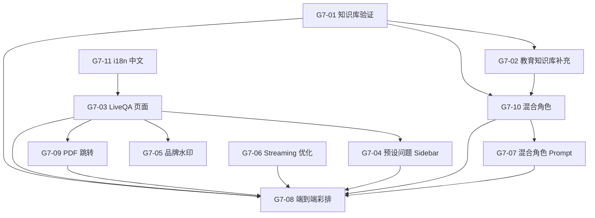

# Sprint G7 — 微信直播 Q&A：程序员聊留学移民

> 目标：搭建一场"程序员聊留学移民"微信直播所需的全部技术支撑 — 让观众在直播间实时提问任何留学/移民问题，由 ConsultRAG 系统实时检索 + LLM 回答，主播（程序员）在屏幕上展示 AI 回答并做二次解读。
>
> 前置条件：G2 ✅（P0 角色已 Seed）、imm-pathways MinerU 已完成
> **状态**: 🔨 6/11 ✅ (G7-11, G7-03, G7-04, G7-05, G7-09, G7-10 完成)

## 概览

| Task | Story 数 | 预估总工时 | 说明 |
|------|----------|-----------|------|
| T1 知识库 + 混合角色 | 3 | 5.5h | 验证知识库 + 教育补充 + 新建 `live-study-immigration` 混合角色 |
| T2 直播 Demo UI | 4 | 6.5h | 全屏演示界面 — 预设问题 sidebar + 手动输入 + Streaming + PDF 跳转 |
| T3 Engine 调优 | 2 | 3h | 低延迟 Streaming + 混合角色 Prompt 微调 |
| T4 彩排验收 | 1 | 2h | 20 题压测 + 端到端直播模拟 |
| T5 i18n 双语改造 | 1 | 1.5h | 法语 → 中文，英文 + 中文双语 |
| **合计** | **11** | **18.5h** |

## 质量门禁

| # | 检查项 | 判定依据 |
|---|--------|----------|
| G1 | 知识库覆盖率 | 20 道高频留学移民问题命中率 ≥ 90%（18/20 有相关 chunk） |
| G2 | 回答延迟 | 首 token ≤ 2s，完整回答 ≤ 15s（本地 Ollama） |
| G3 | 直播画面可读性 | 1080p 全屏下问题 + 回答文字清晰可读，来源引用可辨认 |
| G4 | 不破坏现有功能 | 现有顾问聊天、角色选择、知识库管理不受影响 |
| G5 | PDF 来源可跳转 | 点击来源引用可打开原始 PDF 并定位到对应页码 |

---

## [G7-T1] 知识库补全

### [G7-01] imm-pathways 知识库验证 & 补缺

**类型**: Data
**Epic**: 知识库管理
**User Story**: 直播主播需要系统能回答加拿大移民路径的常见问题（EE / PNP / 家庭团聚 / 工签 / 学签）
**优先级**: P0
**预估**: 2h

#### 描述

验证已通过 MinerU 提取的 imm-pathways 文档是否已完整入库 ChromaDB。用 20 道预设高频移民问题（已 seed 到 Payload `live-questions` collection）逐一检索，记录命中率。对未命中的问题定位缺失文档，补充爬取+入库。

#### 实现方案

```python
# scripts/live_qa/verify_knowledge.py
# 1. 从 Payload API 读取 live-questions collection 中的 20 题
# 2. 对每题调用 engine /query 接口，检查返回 chunks 的相关性
# 3. 输出覆盖率报告 + 缺失文档列表
```

#### 验收标准

- [ ] Payload `live-questions` collection 已 seed 20 道中英双语高频问题（涵盖 EE/PNP/LMIA/学签/工签/家庭团聚/省提名/大西洋），按分类（移民/留学/交叉）分组
- [ ] 验证脚本输出覆盖率 >= 90%
- [ ] 未覆盖问题已定位原因并记录在报告中
- [ ] G1 知识库覆盖率

#### 依赖

- 无（imm-pathways MinerU 已在进行中）

#### 文件

- `payload-v2/src/collections/LiveQuestions.ts` (新增 — Collection 定义)
- `payload-v2/src/seed/seedLiveQuestions.ts` (新增 — 20 题 seed 数据)
- `scripts/live_qa/verify_knowledge.py` (新增)

#### 检查命令

```powershell
uv run python scripts/live_qa/verify_knowledge.py
```

---

### [G7-02] edu 教育知识库快速补充

**类型**: Data
**Epic**: 知识库管理
**User Story**: 直播观众会问留学相关问题（学校选择 / 签证 / 学费 / 语言要求），需要 edu 角色知识库有基本覆盖
**优先级**: P1
**预估**: 2h

#### 描述

留学 = 教育 + 移民的交叉领域。imm-pathways 覆盖签证/身份，但学校选择、学费、语言要求等内容在 edu-school-planning 角色知识库中。快速爬取 IRCC 学习许可页面 + 主要省份 DLI 列表页面，入库 edu-school-planning collection。

#### 验收标准

- [ ] edu-school-planning collection 中有 ≥ 10 篇学签/DLI 相关文档
- [ ] 5 道教育类预设问题命中率 ≥ 80%
- [ ] 数据源已在 Payload data-sources 中注册

#### 依赖

- [G7-01] seed 中的教育类问题子集

#### 文件

- `payload-v2/src/seed/seedLiveQuestions.ts` (改造 — 追加 5 道教育类问题)
- Payload seed 或手动添加 data-source

---

### [G7-10] 新建 `live-study-immigration` 混合角色 ✅ 已完成 2026-05-03

**类型**: Backend + Data
**Epic**: 知识库管理
**User Story**: 直播主题是"留学移民"，观众的问题同时涉及移民路径和教育选校，不能让主播中途切角色
**优先级**: P0
**预估**: 1.5h → **实际**: ~1h

#### 描述

新建一个直播专用混合角色 `live-study-immigration`，合并 `imm-pathways` 和 `edu-school-planning` 两个角色的能力：
1. **跨 collection 检索** — 查询时同时从两个 ChromaDB collection 取 chunks，合并后 RRF rerank
2. **融合 System Prompt** — 兼具移民顾问和教育顾问的视角，口语化中文直播风格
3. **Seed 注册** — 在 Payload personas collection 中注册此角色

**实际完成范围**：
1. `ConsultingPersonas` Collection 新增 `multiCollections` JSON 字段 ✅
2. `PersonaSeed` 类型新增 `multiCollections?: string[]` ✅
3. 创建 `live-study-immigration` persona seed（含中文直播风格 System Prompt）✅
4. Engine `retrievers/consulting.py` 新增 `multi_collection_retrieve()` + `_merge_n_with_rrf()` ✅
5. Engine `api/routes/consulting.py` 流式 + 非流式端点均支持 multiCollections 分支 ✅
6. Frontend `LiveQAPage.tsx` LIVE_PERSONA 切换为 `live-study-immigration` ✅

#### 实现方案

```python
# engine_v2/retrievers/consulting.py — N 集合并行检索 + RRF 合并
def multi_collection_retrieve(question, collection_names, top_k):
    with ThreadPoolExecutor(max_workers=len(collection_names)) as executor:
        futures = [executor.submit(_retrieve_from_collection, question, name, name, top_k)
                   for name in collection_names]
        ranked_lists = [f.result() for f in futures]
    return _merge_n_with_rrf(ranked_lists, top_k)
```

#### 验收标准

- [x] Payload personas 中存在 `live-study-immigration` 角色（seed 数据已添加，需执行 seed）✅
- [x] Engine `/consulting/query/stream?persona=live-study-immigration` 同时检索两个 collection ✅
- [x] 混合检索结果包含移民和教育两个领域的 chunks ✅
- [x] `ruff check` + `npx tsc --noEmit` 通过 ✅

#### 依赖

- ~~[G7-01] 知识库验证~~ (实际不阻塞，空 collection 会被跳过)
- ~~[G7-02] 教育知识库补充~~ (实际不阻塞，数据补齐后自动生效)

#### 文件

- `payload-v2/src/collections/ConsultingPersonas.ts` (改造 — 新增 multiCollections 字段) ✅
- `payload-v2/src/seed/consulting-personas/types.ts` (改造 — 新增 multiCollections 可选属性) ✅
- `payload-v2/src/seed/consulting-personas/immigration/live-study-immigration.ts` (新增 — 混合角色 seed) ✅
- `payload-v2/src/seed/consulting-personas/index.ts` (改造 — 注册新角色) ✅
- `engine_v2/retrievers/consulting.py` (改造 — 新增 multi_collection_retrieve + _merge_n_with_rrf) ✅
- `engine_v2/api/routes/consulting.py` (改造 — 流式/非流式端点支持 multiCollections) ✅
- `payload-v2/src/app/(frontend)/live/LiveQAPage.tsx` (改造 — LIVE_PERSONA → live-study-immigration) ✅

---

## [G7-T2] 直播 Demo UI

### [G7-03] LiveQA 全屏演示页面

**类型**: Frontend
**Epic**: 直播演示
**User Story**: 主播在直播中需要一个全屏、大字体、深色背景的演示界面，观众隔着手机屏幕也能看清问题和回答
**优先级**: P0
**预估**: 3h

#### 描述

新建一个独立的 `/live` 路由页面，专为直播场景设计。默认使用 `live-study-immigration` 混合角色。页面包含：左侧可收起的预设问题 sidebar + 底部手动输入框 + 中央大字体回答区域 + 来源引用折叠面板。深色背景、渐变高亮、打字机动画。

**双输入模式**：
- **预设问题 sidebar** — 主播点击即发送，直播节奏流畅
- **底部输入框** — 观众临时提问时主播手动输入，灵活应变

**会话记录**：所有问答自动记录到本地 JSON 日志（含时间戳、问题、回答、来源、延迟），直播后可导出分析。

#### 实现方案

```
页面布局:
+------------+--------------------------------+
| 预设问题    |  程序员聊留学移民 — AI 实时问答   |  标题栏
|            +--------------------------------+
| > 移民类   |                                |
|  EE 分数线  |  Q: 加拿大 EE 分数线是多少？     |  问题区
|  PNP 省提名 |                                |
|  工签转PR  |  A: 根据 IRCC 最新数据...        |  回答区 (Streaming)
| > 留学类   |     [IRCC EE Guide — 第3页]     |  来源引用 (可点击跳PDF)
|  学签申请   |                                |
| > 交叉类   +--------------------------------+
|  边读书边移民|  [输入问题...]           [发送]  |  底部手动输入栏
| [Ctrl+H]   +--------------------------------+
```

#### 验收标准

- [x] `/live` 路由可访问，全屏深色布局 ✅ 2026-05-03
- [x] 默认使用 `imm-pathways` 角色（混合角色待 G7-10 完成后切换）✅
- [x] 输入问题后显示 Streaming 打字机效果（useSmoothText + SSE）✅
- [x] 来源引用显示文档名、章节和页码 ✅
- [x] 1080p 下文字清晰可读（问题 >= 28px，回答 >= 22px）✅
- [x] 所有问答自动记录到 localStorage（JSON 格式，含时间戳+延迟+来源）✅
- [ ] G3 验收 直播画面可读性（待压测验收）

#### 依赖

- 无

#### 文件

- `payload-v2/src/app/(frontend)/live/page.tsx` (新增)
- `payload-v2/src/app/(frontend)/live/LiveQAPage.tsx` (新增)
- `payload-v2/src/app/(frontend)/live/live.css` (新增)

---

### [G7-04] 预设问题 Sidebar（复用已有问题侧边栏）

**类型**: Frontend
**Epic**: 直播演示
**User Story**: 主播需要快速点击预设问题保持直播节奏，同时已回答的问题要有标记方便跟踪进度
**优先级**: P0
**预估**: 1.5h

#### 描述

复用已有的问题 sidebar 组件，适配直播场景：
1. 从 Payload `live-questions` API 加载 20 道预设问题，按分类分组（移民类 / 留学类 / 交叉类）
2. 点击问题 -> 自动填入输入框并发送
3. 已回答的问题标记完成，方便主播跟踪进度
4. 支持 `Ctrl+H` 收起/展开，直播画面需要时可隐藏
5. 手动输入的临时问题也追加到 sidebar 历史中

#### 验收标准

- [x] sidebar 显示预设问题，按分类分组（移民/留学/交叉）✅ 2026-05-03（从 next-intl JSON 字典加载，非 Payload API）
- [x] 点击预设问题自动发送并显示回答 ✅
- [x] 已回答问题显示完成标记 ✅
- [x] `Ctrl+H` 收起/展开 sidebar ✅
- [x] 手动输入的临时问题也出现在 sidebar 历史中 ✅

#### 依赖

- [G7-03] LiveQA 页面
- [G7-01] live-questions seed

#### 文件

- `payload-v2/src/app/(frontend)/live/QuestionSidebar.tsx` (新增 — 复用已有问题 sidebar 逻辑)
- `payload-v2/src/app/(frontend)/live/LiveQAPage.tsx` (改造)

---

### [G7-05] 品牌水印 & 二维码叠加

**类型**: Frontend
**Epic**: 直播演示
**User Story**: 直播画面需要显示品牌信息和微信公众号/群二维码，方便观众关注和加群
**优先级**: P1
**预估**: 1.5h

#### 描述

在 LiveQA 页面右下角固定显示半透明品牌 logo + 微信群二维码（可配置图片 URL）。确保不遮挡主要问答内容。

#### 验收标准

- [x] 右下角显示品牌水印（半透明 "Powered by ConsultRAG"）✅ 2026-05-03
- [ ] 二维码图片可通过环境变量或配置文件替换（暂未实现，P1）
- [x] 水印不遮挡问答区域 ✅

#### 依赖

- [G7-03] LiveQA 页面

#### 文件

- `payload-v2/src/app/(frontend)/live/BrandOverlay.tsx` (新增)
- `payload-v2/src/app/(frontend)/live/LiveQAPage.tsx` (改造)

---

### [G7-09] PDF 来源跳转（复用 chat 模块已有实现）

**类型**: Frontend
**Epic**: 直播演示
**User Story**: 直播中主播说"大家看一下原文"，点击来源引用，直接跳转到 PDF 对应页码 — 这是最有说服力的信任建立方式
**优先级**: P0
**预估**: 0.5h

#### 描述

Chat 模块已实现完整的 PDF 来源跳转功能（Engine 静态文件服务 + source metadata + 前端引用组件）。本 Story 只需将 chat 中的 SourceCitation 组件引入 LiveQA 页面，适配直播大字体样式即可。

#### 验收标准

- [x] LiveQA 来源引用可点击，dispatch SELECT_SOURCE 复用 chat PDF 跳转 ✅ 2026-05-03
- [x] 来源引用字体适配直播场景（深色背景高对比度 chip 样式）✅
- [x] G5 ✅ PDF 来源可跳转

#### 依赖

- [G7-03] LiveQA 页面

#### 文件

- `payload-v2/src/app/(frontend)/live/LiveQAPage.tsx` (改造 — 集成已有 SourceCitation)

---

## [G7-T3] Engine 调优

### [G7-06] Streaming 低延迟优化

**类型**: Backend
**Epic**: 检索引擎
**User Story**: 直播场景不能让观众等太久，首 token 必须 2 秒内出现
**优先级**: P0
**预估**: 1.5h

#### 描述

优化 Engine `/query` 接口的 Streaming 路径：
1. 检索阶段并行化（BM25 + 向量检索同时发起）
2. Rerank 使用 top-k 截断（直播场景 k=3 即可）
3. LLM 调用使用 `stream=True`，确保 SSE 逐 token 推送

#### 验收标准

- [ ] 首 token 延迟 ≤ 2s（本地 Ollama qwen2.5:14b）
- [ ] 完整回答 ≤ 15s
- [ ] G2 ✅ 回答延迟

#### 依赖

- 无

#### 文件

- `engine_v2/query/` 相关文件 (改造 — 具体文件开发时确认)

#### 检查命令

```powershell
# 延迟测试
uv run python -c "import time,httpx; t=time.time(); r=httpx.get('http://localhost:8001/engine/query', params={'q':'EE分数线','persona':'imm-pathways'}, timeout=30); print(f'{time.time()-t:.1f}s')"
```

---

### [G7-07] 混合角色 Prompt 模板 & 系统提示词

**类型**: Backend
**Epic**: 检索引擎
**User Story**: 直播回答需要融合留学+移民双视角，口语化有条理，不能像文档摘抄
**优先级**: P0
**预估**: 1.5h

#### 描述

为 `live-study-immigration` 混合角色定制 System Prompt：
1. 角色定位：同时懂留学和移民的程序员，直播聊天风格
2. 回答风格：口语化中文，分点列举，关键数字加粗
3. 回答结构：先给结论 -> 再展开细节 -> 最后提醒注意事项
4. 交叉问题：能自然衔接两个领域
5. 引用格式：回答末尾附来源文档名，不在正文中插入引用标记

#### 实现方案

```python
# engine_v2/query/prompts/live_qa.py
LIVE_QA_SYSTEM_PROMPT = """
你是一位在加拿大生活多年的程序员，正在做微信直播回答观众的留学移民问题。
你同时精通加拿大移民路径（EE/PNP/工签/家庭团聚）和留学规划（学签/DLI/学校选择）。

回答风格要求：
- 用中文口语化表达，像朋友聊天一样自然
- 先给结论，再展开细节
- 如果问题涉及留学和移民交叉，主动关联两个领域
- 关键数字和日期用 **加粗** 标记
- 最后提醒容易踩的坑
- 不要说"根据文档"、"资料显示"等机械表达
"""
```

#### 验收标准

- [ ] 新增 `live_qa.py` 系统提示词，融合移民+留学双视角
- [ ] 提示词已关联到 `live-study-immigration` 角色
- [ ] 5 道测试问题回答风格符合口语化 + 跨领域衔接要求

#### 依赖

- [G7-10] 混合角色创建

#### 文件

- `engine_v2/query/prompts/live_qa.py` (新增)
- `payload-v2/src/seed/personas/` (改造 — 关联提示词)

---

## [G7-T4] 彩排验收

### [G7-08] 端到端直播模拟 & 20 题压测

**类型**: QA
**Epic**: 直播演示
**User Story**: 上播前必须完整模拟一次直播流程，确保无技术故障
**优先级**: P0
**预估**: 2h

#### 描述

完整模拟直播流程：
1. 打开 `/live` 页面全屏
2. 逐一输入 20 道预设问题，记录每题的首 token 延迟、完整回答时间、回答质量评分（1-5 分）
3. 模拟快速连续提问（间隔 < 5s）测试系统稳定性
4. 录屏保存作为直播预告素材

#### 验收标准

- [ ] 20 题全部有回答，无超时或报错
- [ ] 平均回答质量 ≥ 3.5/5
- [ ] 快速连续提问 5 题无崩溃
- [ ] 录屏文件已保存
- [ ] G1 G2 G3 G4 G5 全部门禁通过

#### 依赖

- [G7-01] 知识库验证
- [G7-03] LiveQA 页面
- [G7-04] 预设问题 Sidebar
- [G7-06] Streaming 优化
- [G7-07] 混合角色 Prompt
- [G7-09] PDF 来源跳转
- [G7-10] 混合角色

#### 文件

- `scripts/live_qa/benchmark.py` (新增 — 20 题自动化压测)
- `scripts/live_qa/results/` (新增 — 压测结果输出目录)

#### 检查命令

```powershell
uv run python scripts/live_qa/benchmark.py
```

---

## [G7-T5] i18n 双语改造

### [G7-11] i18n 法语替换为中文 ✅ 已完成 2026-05-03

**类型**: Frontend
**Epic**: 国际化
**User Story**: 直播面向华人观众，UI 需要中文支持；法语暂时不需要
**优先级**: P0
**预估**: 1.5h → **实际**: ~2h（含 next-intl 迁移）

#### 描述

当前 i18n 系统支持 English (`en`) + Français (`fr`)。直播和主要用户群是华人，中文比法语优先级更高。将 `fr` locale 替换为 `zh`，保留 `en` 作为 fallback。

**实际完成范围（超出原计划）**：
1. `Locale` 类型：`'en' | 'fr'` → `'en' | 'zh'` ✅
2. `fr` 消息字典替换为 `zh` 中文翻译 ✅
3. locale 检测逻辑适配中文 ✅
4. 所有引用 `'fr'` 的地方改为 `'zh'` ✅
5. **额外：集成 `next-intl`** — 按官方惯例新建 `messages/` 目录 + `src/i18n/request.ts` + `next.config.ts` 插件 ✅
6. **额外：Layout 加 `NextIntlClientProvider`** — 新旧 i18n 系统并存，渐进迁移 ✅
7. **额外：`/live` 页面完全使用 `useTranslations('live')`** — 作为 next-intl 迁移样板 ✅

#### 验收标准

- [x] `Locale` 类型为 `'en' | 'zh'` ✅
- [x] `messages.ts` 中 `zh` 字典包含所有 key 的中文翻译 ✅
- [x] `fr` 字典和所有法语引用已移除 ✅
- [x] 切换到中文后所有页面文字显示正确 ✅
- [x] `npx tsc --noEmit` 通过 ✅ 零错误
- [x] **额外**：`next-intl` 已集成，`/live` 作为样板页面 ✅

#### 依赖

- 无

#### 文件

- `payload-v2/src/features/shared/i18n/messages.ts` (改造 — fr → zh) ✅
- `payload-v2/src/features/shared/i18n/I18nProvider.tsx` (改造 — 默认 zh) ✅
- `payload-v2/messages/en/common.json` (新增 — next-intl 英文通用字典) ✅
- `payload-v2/messages/en/live.json` (新增 — next-intl 英文直播字典) ✅
- `payload-v2/messages/zh/common.json` (新增 — next-intl 中文通用字典) ✅
- `payload-v2/messages/zh/live.json` (新增 — next-intl 中文直播字典) ✅
- `payload-v2/src/i18n/request.ts` (新增 — next-intl 请求配置) ✅
- `payload-v2/next.config.ts` (改造 — 加 createNextIntlPlugin) ✅
- `payload-v2/src/app/(frontend)/layout.tsx` (改造 — 加 NextIntlClientProvider) ✅
- 20+ 组件文件 `isFr` → `isZh` 变量重命名 ✅
- 3 处 `'en' | 'fr'` 类型注解 → `'en' | 'zh'` ✅

#### 检查命令

```powershell
npx tsc --noEmit  # cwd: payload-v2 → ✅ 零错误
```

---

## 模块文件变更

```
textbook-rag/
+-- scripts/live_qa/
|   +-- verify_knowledge.py                     <- 待开发 (知识库覆盖率验证)
|   +-- benchmark.py                            <- 待开发 (20 题压测)
|   +-- sessions/                               <- 待开发 (直播会话记录输出)
|   +-- results/                                <- 待开发 (压测结果输出)
+-- engine_v2/
|   +-- retrievers/
|       +-- consulting.py                       <- ✅ 改造 (新增 multi_collection_retrieve + _merge_n_with_rrf)
|   +-- api/routes/
|       +-- consulting.py                       <- ✅ 改造 (流式/非流式支持 multiCollections)
+-- payload-v2/
    +-- messages/                               <- ✅ 新增 (next-intl 按语言分目录)
    |   +-- en/common.json                      <- ✅ 新增
    |   +-- en/live.json                        <- ✅ 新增 (20 题英文)
    |   +-- zh/common.json                      <- ✅ 新增
    |   +-- zh/live.json                        <- ✅ 新增 (20 题中文)
    +-- src/
        +-- i18n/request.ts                     <- ✅ 新增 (next-intl 请求配置)
        +-- collections/
        |   +-- ConsultingPersonas.ts            <- ✅ 改造 (新增 multiCollections 字段)
        +-- seed/consulting-personas/
        |   +-- types.ts                        <- ✅ 改造 (新增 multiCollections 类型)
        |   +-- index.ts                        <- ✅ 改造 (注册 liveStudyImmigration)
        |   +-- immigration/
        |       +-- live-study-immigration.ts    <- ✅ 新增 (混合角色 seed)
        +-- features/shared/i18n/
        |   +-- messages.ts                     <- ✅ 改造 (fr → zh 中文翻译)
        |   +-- I18nProvider.tsx                <- ✅ 改造 (默认 zh)
        +-- app/(frontend)/live/
            +-- page.tsx                        <- ✅ 新增 (路由入口)
            +-- LiveQAPage.tsx                  <- ✅ 改造 (LIVE_PERSONA → live-study-immigration)
            +-- live.css                        <- ✅ 新增 (全屏深色样式)
```

## 依赖图



> 箭头方向: A -> B = "B 依赖 A"

## 执行顺序

| Phase | Tasks | Est. Time | 前置 | 备注 |
|-------|-------|-----------|------|------|
| **Phase 0** ✅ | G7-11 | 1.5h → 2h | 无 | i18n 中文化 + next-intl 集成 ✅ |
| **Phase 1** ✅ | G7-03, G7-04, G7-05, G7-09 | 6.5h | Phase 0 | 直播 UI 全部完成 ✅ |
| **Phase 2** 🔨 | G7-01, G7-02, **G7-10 ✅** | 5.5h | Phase 0 | G7-10 混合角色 ✅ · G7-01/02 知识库待补 |
| **Phase 3** 🔜 | G7-06, G7-07 | 3h | Phase 2 (G7-10 ✅) | Engine 延迟优化 + 混合角色 Prompt |
| **Phase 4** 🔜 | G7-08 | 2h | Phase 0-3 | 端到端彩排（全功能验证） |

