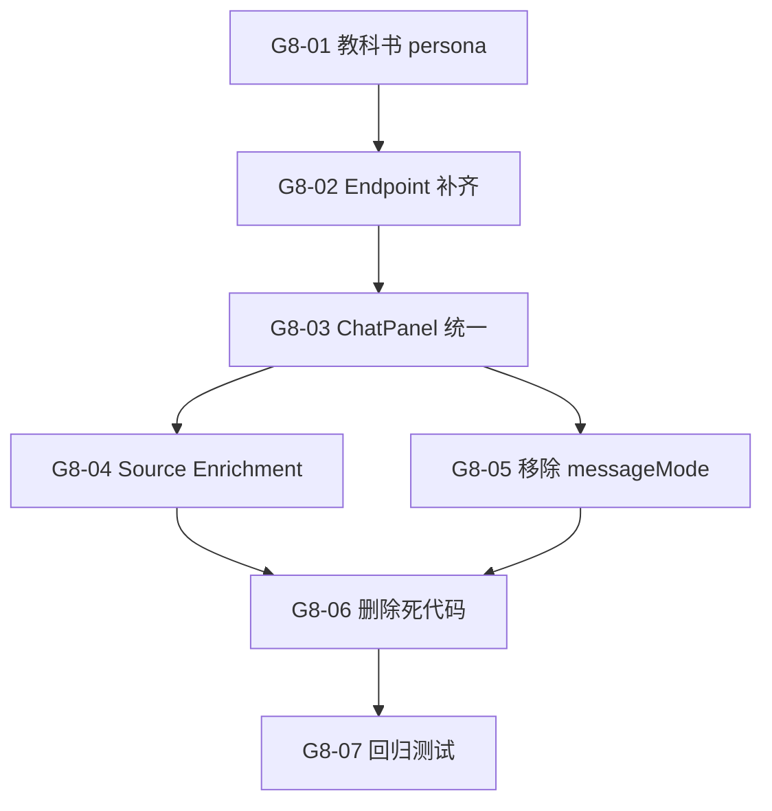

# Sprint G8 — 统一查询模式：砍掉 RAG 分支，只用 Consulting 流程

> 目标：消除 ChatPanel 中 RAG / Consulting 双模式分支，统一为 Consulting-only 流程。教科书查询变成一个 persona，所有查询走 `/engine/consulting/query/stream`，telemetry / source enrichment / session 逻辑只维护一套。
>
> 前置条件：G3 ✅（Landing Rebuild）、telemetry 已加入 consulting stream
> **状态**: ❌ 0/7

## 概览

| Task | Story 数 | 预估总工时 | 说明 |
|------|----------|-----------|------|
| T1 Backend 统一 | 2 | 3h | 教科书 persona 注册 + consulting endpoint 补齐 RAG 特性 |
| T2 Frontend 统一 | 3 | 5h | ChatPanel 砍掉 dual-mode + 统一 onDone + 清理遗留 |
| T3 清理 & 验证 | 2 | 2h | 删除死代码 + 回归测试 |
| **合计** | **7** | **10h** |

## 质量门禁

| # | 检查项 | 判定依据 |
|---|--------|----------|
| G1 | 功能不退化 | 现有 consulting 聊天功能完全不变 |
| G2 | 教科书查询可用 | 选择 textbook persona 后可查询已入库的教科书 |
| G3 | Telemetry 一致 | 所有 assistant 消息均显示 `llm_calls / input / output` |
| G4 | 无死代码 | `queryTextbookStream` / `query.py` stream endpoint / `messageMode` 判断分支全部移除 |
| G5 | 不破坏现有功能 | 角色选择、onboarding、session history 不受影响 |

---

## [G8-T1] Backend 统一

### [G8-01] 教科书 persona 注册

**类型**: Backend + Data
**Epic**: 查询引擎
**User Story**: 把教科书查询从独立的 RAG endpoint 变成一个 persona，统一入口
**优先级**: P0
**预估**: 1.5h

#### 描述

在 Payload `consulting-personas` collection 中注册一个 `textbook-reader` persona，其 `chromaCollection` 指向现有的教科书 ChromaDB collection。System prompt 延续现有的教科书 citation 风格。这样前端选择此 persona 后走 consulting 流程即可查教科书。

#### 实现方案

```typescript
// payload-v2/src/seed/consulting-personas/resources/textbook-reader.ts
export const textbookReader: PersonaSeed = {
  name: "Textbook Reader",
  slug: "textbook-reader",
  category: "resources",
  country: "global",
  icon: "📚",
  chromaCollection: "default",  // 现有教科书 collection
  systemPrompt: `You are an academic research assistant...`,
  greeting: "👋 Ask me about any uploaded textbook...",
}
```

#### 验收标准

- [ ] Payload personas 中存在 `textbook-reader` 角色
- [ ] Engine `/engine/consulting/query/stream?persona_slug=textbook-reader` 可正常检索教科书 chunks
- [ ] 返回结果包含 book_title / page_number / citation_index
- [ ] G2 ✅ 教科书查询可用

#### 依赖

- 无

#### 文件

- `payload-v2/src/seed/consulting-personas/resources/textbook-reader.ts` (新增)
- `payload-v2/src/seed/consulting-personas/index.ts` (改造 — 注册新 persona)

---

### [G8-02] Consulting endpoint 补齐 RAG 遗留特性

**类型**: Backend
**Epic**: 查询引擎
**User Story**: Consulting endpoint 需要支持 book_id 过滤、retrieval_mode 等原 RAG 专有参数
**优先级**: P0
**预估**: 1.5h

#### 描述

当前 consulting endpoint 按 `persona_slug` 路由到单一 collection，但教科书场景需要：
1. `book_id_strings` 过滤 — 用户在 sidebar 选定特定书籍后只查该书
2. retrieval stats（vector_hits / fts_hits）— 现有 consulting 只返回 `source_count`

在 `PersonaQueryRequest` 中增加可选的 `book_id_strings` 字段，consulting endpoint 在构建 query engine 时传入 metadata filter。

#### 实现方案

```python
# engine_v2/api/routes/consulting.py — PersonaQueryRequest 扩展
class PersonaQueryRequest(BaseModel):
    persona_slug: str
    question: str
    top_k: int = 5
    model: str | None = None
    provider: str | None = None
    country: str = "ca"
    response_language: str | None = None
    # G8-02: 支持教科书场景 book_id 过滤
    book_id_strings: list[str] | None = None
```

#### 验收标准

- [ ] `PersonaQueryRequest` 支持 `book_id_strings` 可选字段
- [ ] 传入 `book_id_strings` 时检索范围限制在指定书籍
- [ ] 不传 `book_id_strings` 时行为不变（全 collection 检索）
- [ ] retrieval_done 事件中 stats 包含 `vector_hits` / `fts_hits`

#### 依赖

- [G8-01] textbook-reader persona

#### 文件

- `engine_v2/api/routes/consulting.py` (改造 — PersonaQueryRequest + query engine filter)

---

## [G8-T2] Frontend 统一

### [G8-03] ChatPanel 统一为 Consulting-only

**类型**: Frontend
**Epic**: 聊天界面
**User Story**: 消除 ChatPanel 中 `if (messageMode === "consulting")` vs RAG 的双分支
**优先级**: P0
**预估**: 2.5h

#### 描述

这是核心改动。当前 ChatPanel.submitQuestion() 有两段并行的逻辑：

```
if (messageMode === "consulting" && personaSlug) {
  await queryConsultingStream(...)   // ~80 行
  return;
}
await queryTextbookStream(...)       // ~100 行
```

统一为只调 `queryConsultingStream`。原 RAG 路径中的 source enrichment (book_title 匹配) 逻辑移入 consulting 的 `onDone` 回调。`messageMode` 状态变量移除。

#### 验收标准

- [ ] ChatPanel 中不再存在 `messageMode` 状态变量
- [ ] 不再 import `queryTextbookStream`
- [ ] 所有查询统一走 `queryConsultingStream`
- [ ] Source enrichment (book_title) 逻辑在 consulting `onDone` 中正常工作
- [ ] Telemetry 在所有消息上显示
- [ ] G1 G3 ✅

#### 依赖

- [G8-01] textbook-reader persona
- [G8-02] consulting endpoint 补齐

#### 文件

- `payload-v2/src/features/chat/panel/ChatPanel.tsx` (改造 — 砍掉 RAG 分支)

---

### [G8-04] ConsultingQueryResponse 统一 source enrichment

**类型**: Frontend
**Epic**: 聊天界面
**User Story**: 教科书 persona 返回的 source 需要 book_title enrichment，但不能在 ChatPanel 里硬编码
**优先级**: P0
**预估**: 1.5h

#### 描述

原 RAG 模式在 `onDone` 中做了一段复杂的 `enrichedSources` 逻辑 (L493-L516)，把 backend source 的 book_id 映射到前端 books 列表的 title。统一后，这段逻辑需要迁移到 consulting 的 `onDone` 回调中，但仅在 persona 为 `textbook-reader` 类型时触发。

#### 验收标准

- [ ] textbook-reader persona 返回的 source 正确显示 book_title
- [ ] 非教科书 persona 的 source 不受影响
- [ ] CitationChip 点击可正常跳转 PDF

#### 依赖

- [G8-03] ChatPanel 统一

#### 文件

- `payload-v2/src/features/chat/panel/ChatPanel.tsx` (改造)
- `payload-v2/src/features/shared/consultingApi.ts` (改造 — ConsultingQueryResponse 补 trace 等)

---

### [G8-05] 移除 messageMode 相关 UI

**类型**: Frontend
**Epic**: 聊天界面
**User Story**: 清理模式切换 UI 残留（如有模式 toggle、条件渲染等）
**优先级**: P1
**预估**: 1h

#### 描述

搜索所有 `messageMode` / `"rag"` / `"textbook"` 引用，清除 sidebar 中的模式切换逻辑。session 创建时 `mode` 字段统一为 `"consulting"`。

#### 验收标准

- [ ] 全局搜索 `messageMode` 无结果
- [ ] Session history 中 `mode` 字段统一为 `"consulting"`
- [ ] UI 上无模式切换入口

#### 依赖

- [G8-03] ChatPanel 统一

#### 文件

- `payload-v2/src/features/chat/panel/ChatPanel.tsx` (改造)
- `payload-v2/src/features/chat/types.ts` (改造 — 移除 mode 相关类型)

---

## [G8-T3] 清理 & 验证

### [G8-06] 删除 RAG query endpoint 死代码

**类型**: Backend
**Epic**: 查询引擎
**User Story**: 没有前端调用方的 endpoint 是死代码，必须清理
**优先级**: P1
**预估**: 1h

#### 描述

前端统一后，以下代码不再有调用方：
1. `engine_v2/api/routes/query.py` — `/engine/query/stream` endpoint（前端已不调用）
2. `payload-v2/src/features/engine/query_engine/api.ts` — `queryTextbookStream()` 函数
3. `payload-v2/src/features/engine/query_engine/useQueryEngine.ts` — `useQueryEngine` hook（如不再被引用）

**注意**：`/engine/query`（同步版）保留，因为 evaluation pipeline 可能仍在使用。

#### 验收标准

- [ ] `queryTextbookStream` 函数已删除
- [ ] 前端不再 import `query_engine/api.ts` 中的 stream 函数
- [ ] Engine `/engine/query/stream` 已从 router 中移除（或标记 deprecated）
- [ ] `ruff check` + `tsc --noEmit` 通过
- [ ] G4 ✅ 无死代码

#### 依赖

- [G8-03] ChatPanel 统一
- [G8-05] messageMode 清理

#### 文件

- `engine_v2/api/routes/query.py` (改造 — 移除 stream endpoint)
- `payload-v2/src/features/engine/query_engine/api.ts` (改造 — 移除 queryTextbookStream)
- `payload-v2/src/features/engine/query_engine/useQueryEngine.ts` (改造或删除)
- `payload-v2/src/features/engine/query_engine/index.ts` (改造 — barrel export)

#### 检查命令

```powershell
uv run ruff check engine_v2/
npx tsc --noEmit  # cwd: payload-v2
```

---

### [G8-07] 端到端回归测试

**类型**: QA
**Epic**: 质量保障
**User Story**: 确认合并后所有核心功能正常
**优先级**: P0
**预估**: 1h

#### 描述

手动回归测试清单：
1. 选择任意 consulting persona → 提问 → 收到流式回答 + sources + telemetry
2. 选择 textbook-reader persona → 提问 → 收到教科书引用回答
3. 空知识库 persona → 收到 LLM 生成的"无结果"消息（非硬编码）
4. Session history 保存和加载正常
5. CitationChip 点击跳转 PDF 正常

#### 验收标准

- [ ] 5 项回归测试全部通过
- [ ] G1 G2 G3 G5 ✅ 全部门禁通过

#### 依赖

- [G8-06] 死代码清理

---

## 模块文件变更

```
textbook-rag/
+-- engine_v2/api/routes/
|   +-- consulting.py                          <- 改造 (PersonaQueryRequest 加 book_id_strings)
|   +-- query.py                               <- 改造 (移除 /query/stream endpoint)
+-- payload-v2/src/
    +-- seed/consulting-personas/
    |   +-- resources/textbook-reader.ts        <- 新增
    |   +-- index.ts                            <- 改造 (注册 textbook-reader)
    +-- features/chat/panel/
    |   +-- ChatPanel.tsx                       <- 改造 (砍掉 RAG 分支，统一 consulting)
    +-- features/chat/
    |   +-- types.ts                            <- 改造 (移除 mode 类型)
    +-- features/shared/
    |   +-- consultingApi.ts                    <- 改造 (补齐 response 类型)
    +-- features/engine/query_engine/
        +-- api.ts                              <- 改造 (移除 queryTextbookStream)
        +-- useQueryEngine.ts                   <- 改造或删除
        +-- index.ts                            <- 改造 (barrel export)
```

## 依赖图



> 箭头方向: A → B = "B 依赖 A"

## 执行顺序

| Phase | Tasks | Est. Time | 前置 | 备注 |
|-------|-------|-----------|------|------|
| **Phase 1** | G8-01, G8-02 | 3h | 无 | Backend 先行 |
| **Phase 2** | G8-03, G8-04, G8-05 | 5h | Phase 1 | Frontend 核心重构 |
| **Phase 3** | G8-06, G8-07 | 2h | Phase 2 | 清理 + 验证 |
