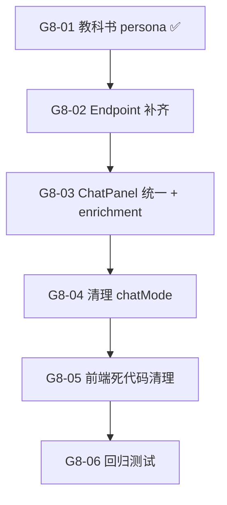

# Sprint G8 — 统一查询模式：砍掉 RAG 分支，只用 Consulting 流程

> 目标：消除 ChatPanel 中 RAG / Consulting 双模式分支，统一为 Consulting-only 流程。教科书查询变成一个 persona，所有查询走 `/engine/consulting/query/stream`，telemetry / source enrichment / session 逻辑只维护一套。
>
> 前置条件：G3 ✅（Landing Rebuild）、telemetry 已加入 consulting stream
> **状态**: 🟢 6/6 ✅ (完成 — query.py.deprecated, engine 去除 /engine/query 路由)

## 概览

| Task | Story 数 | 预估总工时 | 说明 |
|------|----------|-----------|------|
| T1 Backend 统一 | 2 | 1h | 教科书 persona 注册 + consulting endpoint 补齐 book_id |
| T2 Frontend 统一 | 2 | 2.5h | ChatPanel 砍掉 dual-mode (含 source enrichment) + 清理 chatMode |
| T3 清理 & 验证 | 2 | 1.5h | 前端死代码 + 回归测试 |
| **合计** | **6** | **~5h** |

## 质量门禁

| # | 检查项 | 判定依据 |
|---|--------|----------|
| G1 | 功能不退化 | 现有 consulting 聊天功能完全不变 |
| G2 | 教科书查询可用 | 选择 `edu-tech-learning` persona 后可查询 `textbook_chunks` |
| G3 | Telemetry 一致 | 所有 assistant 消息均显示 `llm_calls / input / output` |
| G4 | 前端无死代码 | `queryTextbookStream` import / `messageMode` 判断分支移除 |
| G5 | 不破坏现有功能 | 角色选择、onboarding、session history 不受影响 |

---

## [G8-T1] Backend 统一

### [G8-01] 教科书 persona 注册 ✅

**类型**: Backend + Data
**Epic**: 查询引擎
**User Story**: 把教科书查询从独立的 RAG endpoint 变成一个 persona，统一入口
**优先级**: P0
**预估**: 0.5h
**状态**: ✅ 完成

#### 描述

在 Payload `consulting-personas` 的 `education` 分类中注册 `edu-tech-learning` persona，
`chromaCollection` 指向 `textbook_chunks`（191k chunks），system prompt 延续教科书 citation 风格。

#### 实现

```typescript
// payload-v2/src/seed/consulting-personas/education/edu-tech-learning.ts
export const eduTechLearning: PersonaSeed = {
  name: "Tech Education",
  slug: "edu-tech-learning",
  country: "global",
  category: "education",
  icon: "book-open",
  chromaCollection: "textbook_chunks",
  // ... system prompt with citation format + disclaimer
}
```

#### 验收标准

- [x] Payload personas 中存在 `edu-tech-learning` 角色
- [x] `index.ts` barrel export 已注册
- [x] `tsc --noEmit` 通过
- [ ] Engine `/engine/consulting/query/stream?persona_slug=edu-tech-learning` 可正常检索教科书 chunks
- [ ] G2 ✅ 教科书查询可用

#### 文件

- `payload-v2/src/seed/consulting-personas/education/edu-tech-learning.ts` (新增 ✅)
- `payload-v2/src/seed/consulting-personas/index.ts` (改造 ✅)

---

### [G8-02] Consulting endpoint 补齐 book_id 过滤

**类型**: Backend
**Epic**: 查询引擎
**User Story**: Consulting endpoint 需要支持 book_id 过滤，用户在 sidebar 选定特定书籍后只查该书
**优先级**: P0
**预估**: 0.5h

#### 描述

在 `PersonaQueryRequest` 中增加可选的 `book_id_strings` 字段。
consulting endpoint 在构建 query engine 时传入 metadata filter。

> **注意**: `get_query_engine()` 已支持 `book_id_strings` 参数，只需穿透即可。

#### 实现要点

```python
# engine_v2/api/routes/consulting.py — PersonaQueryRequest 扩展
class PersonaQueryRequest(BaseModel):
    # ... existing fields ...
    # G8-02: 支持教科书场景 book_id 过滤
    book_id_strings: list[str] | None = None
```

传入 `get_query_engine()` 和 `_consulting_stream_generator()` 中的 engine 构建。

#### 验收标准

- [ ] `PersonaQueryRequest` 支持 `book_id_strings` 可选字段
- [ ] 传入 `book_id_strings` 时检索范围限制在指定书籍
- [ ] 不传 `book_id_strings` 时行为不变（全 collection 检索）

#### 依赖

- [G8-01] ✅ edu-tech-learning persona

#### 文件

- `engine_v2/api/routes/consulting.py` (改造 — PersonaQueryRequest + query engine filter)

---

## [G8-T2] Frontend 统一

### [G8-03] ChatPanel 砍掉 RAG 分支 + 统一 source enrichment

**类型**: Frontend
**Epic**: 聊天界面
**User Story**: 消除 ChatPanel 中双分支，统一为 consulting-only
**优先级**: P0
**预估**: 2h

#### 描述

当前 ChatPanel.submitQuestion() 有两段并行逻辑（均约 100 行）：

```
L302: const messageMode = existingSession?.mode ?? chatMode;
L351: if (messageMode === "consulting" && personaSlug) {
        await queryConsultingStream(...)   // L351-L463
        return;
      }
L476: await queryTextbookStream(...)       // L476-L605
```

**统一方案**：
1. 删除 L466-L605 的 `queryTextbookStream` 分支
2. consulting `onDone` 中吸收 source enrichment 逻辑（如 `textbook_chunks` metadata 缺 `book_title`）
3. consulting 调用增加 `book_id_strings` 参数传递
4. 删除 `messageMode` 局部变量的 mode 判断

> **source enrichment 需求验证**: 需确认 `textbook_chunks` metadata 是否已包含 `book_title`。
> 如果包含，enrichment 逻辑可以直接丢弃而非迁移。

#### 验收标准

- [ ] ChatPanel 中不再 import `queryTextbookStream`
- [ ] 所有查询统一走 `queryConsultingStream`
- [ ] Source enrichment 在 consulting `onDone` 中正常工作（或验证不再需要）
- [ ] Telemetry 在所有消息上显示
- [ ] G1 G3 ✅

#### 依赖

- [G8-01] ✅ edu-tech-learning persona
- [G8-02] consulting endpoint 补齐

#### 文件

- `payload-v2/src/features/chat/panel/ChatPanel.tsx` (改造 — 砍掉 RAG 分支)

---

### [G8-04] 清理 chatMode / messageMode 残留

**类型**: Frontend
**Epic**: 聊天界面
**User Story**: 清理 mode 状态残留，统一为 consulting-only
**优先级**: P1
**预估**: 0.5h

#### 描述

实际代码分析:
- `chatMode` 是 state (L79)，默认已经是 `"consulting"`
- `messageMode` 是 `submitQuestion` 内的派生局部变量 (L302)，不是 state
- `initialMode` 是 ChatPanel prop (L43/L53)
- **没有** 模式切换 toggle UI — 模式由 session history 决定

清理内容:
1. 移除 `chatMode` state + `setChatMode` 调用 (L79, L133, L626)
2. 移除 `initialMode` prop (L43, L53)
3. 移除 `ChatMode` type import (L22) — 如果不再被其他文件引用
4. `effectiveMode` 硬编码为 `"consulting"` 或移除
5. session 创建时 `mode` 字段固定为 `"consulting"` (L337)

#### 验收标准

- [ ] `chatMode` state 不存在
- [ ] `initialMode` prop 不存在
- [ ] Session history 中 `mode` 字段统一为 `"consulting"`
- [ ] `tsc --noEmit` 通过

#### 依赖

- [G8-03] ChatPanel 统一

#### 文件

- `payload-v2/src/features/chat/panel/ChatPanel.tsx` (改造)
- `payload-v2/src/features/chat/types.ts` (改造 — 如有 mode 类型)

---

## [G8-T3] 清理 & 验证

### [G8-05] 清理前端 RAG 死代码

**类型**: Frontend + Backend
**Epic**: 代码卫生
**User Story**: 移除不再有调用方的前端 textbook stream 代码
**优先级**: P1
**预估**: 0.5h

#### 描述

前端统一后，以下代码不再有调用方：
1. `payload-v2/src/features/engine/query_engine/api.ts` — `queryTextbookStream()` 函数
2. `payload-v2/src/features/engine/query_engine/useQueryEngine.ts` — `useQueryEngine` hook
3. `payload-v2/src/features/engine/query_engine/index.ts` — barrel export

> [!WARNING]
> **Backend endpoint 保留不删！**
> - `engine_v2/api/routes/query.py` 的 `/engine/query/stream` endpoint **保留**
> - 原因: evaluation pipeline (`evaluate_response()`) 和 benchmark scripts 依赖 `get_query_engine()`
> - 可标记 `@deprecated` 注释但不移除

#### 验收标准

- [ ] `queryTextbookStream` 函数已从前端移除
- [ ] 前端不再 import `query_engine/api.ts` 中的 stream 函数
- [ ] `tsc --noEmit` 通过
- [ ] Backend `/engine/query/stream` endpoint **保留**，添加 deprecated 注释
- [ ] G4 ✅ 前端无死代码

#### 依赖

- [G8-03] ChatPanel 统一
- [G8-04] chatMode 清理

#### 文件

- `payload-v2/src/features/engine/query_engine/api.ts` (改造 — 移除 queryTextbookStream)
- `payload-v2/src/features/engine/query_engine/useQueryEngine.ts` (改造或删除)
- `payload-v2/src/features/engine/query_engine/index.ts` (改造 — barrel export)

---

### [G8-06] 端到端回归测试

**类型**: QA
**Epic**: 质量保障
**User Story**: 确认合并后所有核心功能正常
**优先级**: P0
**预估**: 1h

#### 描述

回归测试清单：
1. 选择任意 consulting persona → 提问 → 收到流式回答 + sources + telemetry
2. 选择 `edu-tech-learning` persona → 提问 → 收到教科书引用回答
3. 空知识库 persona → 收到 LLM 生成的"无结果"消息（非硬编码）
4. Session history 保存和加载正常
5. CitationChip 点击跳转 PDF 正常

#### 验收标准

- [ ] 5 项回归测试全部通过
- [ ] G1 G2 G3 G5 ✅ 全部门禁通过

#### 依赖

- [G8-05] 前端死代码清理

---

## 模块文件变更

```
textbook-rag/
+-- engine_v2/api/routes/
|   +-- consulting.py                          <- 改造 (PersonaQueryRequest 加 book_id_strings)
|   +-- query.py                               <- 保留 (标记 deprecated，不删除)
+-- payload-v2/src/
    +-- seed/consulting-personas/
    |   +-- education/edu-tech-learning.ts     <- 新增 ✅
    |   +-- index.ts                            <- 改造 ✅
    +-- features/chat/panel/
    |   +-- ChatPanel.tsx                       <- 改造 (砍掉 RAG 分支，统一 consulting)
    +-- features/chat/
    |   +-- types.ts                            <- 改造 (清理 mode 类型)
    +-- features/shared/
    |   +-- consultingApi.ts                    <- 可能改造 (如需补 book_id_strings 参数)
    +-- features/engine/query_engine/
        +-- api.ts                              <- 改造 (移除 queryTextbookStream)
        +-- useQueryEngine.ts                   <- 改造或删除
        +-- index.ts                            <- 改造 (barrel export)
```

## 依赖图



> 箭头方向: A → B = "B 依赖 A"

## 执行顺序

| Phase | Tasks | Est. Time | 前置 | 备注 |
|-------|-------|-----------|------|------|
| **Phase 1** | G8-01 ✅, G8-02 | 0.5h | 无 | Backend 先行 |
| **Phase 2** | G8-03, G8-04 | 2.5h | Phase 1 | Frontend 核心重构 |
| **Phase 3** | G8-05, G8-06 | 1.5h | Phase 2 | 清理 + 验证 |
