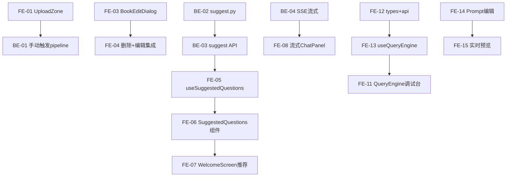

# Sprint 1 — 端到端用户旅程闭环（约 3 周）

> 目标：跑通完整链路 — 上传 → 摄取 → 生成问题 → 对话 → citation 跳转 → 历史保留

## 概览

| Epic | Story 数 | 预估总工时 | 完成 |
|------|----------|-----------|------|
| readers 上传 | 4 | 14h | ✅ 4/4 |
| question_gen 推荐 | 4 | 10h | ✅ 4/4 |
| chat 流式+推荐+切换 | 4 | 14h | ✅ 4/4 |
| query_engine 前端 | 3 | 8h | ✅ 3/3 |
| response_synthesizers 编辑 | 2 | 6h | ✅ 2/2 |
| **合计** | **17** | **52h** | **17/17 (100%)** |

## 质量门禁（每个 Story 交付前必做）

| # | 检查项 | 判定依据 |
|---|--------|----------|
| G1 | **模块归属判断** | 对照 [module-manifest.md](../module-manifest.md) 的 Noun 集 + Files 清单和 [project-structure.md](../project-structure.md) 的目录约束，确认文件路径、Noun 归属、依赖方向合法 |
| G2 | **文件注释合规** | 对照 [file-templates.md](../file-templates.md) 对应模板，确认文件头注释格式 + 结构性注释 + Section 分隔符 |

## 用户旅程

```
① 上传 PDF              🚧 部分完成  UploadZone + useUpload 已有，但缺自动分类识别 + 本地存储
② ingestion 摄取         ✅ 已有     toc 提取 → chunking → embedding → vector DB
③ 生成推荐问题           ✅ 已完成  suggest.py 独立模块 + useSuggestedQuestions hook
④ 进入对话               ✅ 已有     选文档 → 打开 chat
⑤ 看到推荐问题           ✅ 已完成   WelcomeScreen 展示 HQ 问题 + fallback 实时生成
⑥ 流式回答               ✅ 已完成   前端 SSE 客户端 + 后端 /query/stream 已对齐
⑦ citation 点击跳转      ✅ 已有     SourceCard → PdfViewer 跳转对应页 + 高亮
⑧ 对话历史保留           ⚠️ localStorage  ChatHistoryContext 仅 localStorage，未持久化到 Payload → Sprint 2 chat 持久化
⑨ 为 evaluation 留数据   ✅ 已有     trace / sources / latency 已写入 QueryLogs（Queries Collection）
```

## 依赖图



---

## Epic: readers 上传 (P0, 断点 ①)

### [S1-FE-01] UploadZone 上传组件

**类型**: Frontend · **优先级**: P0 · **预估**: 4h

**描述**: 创建 PDF 拖拽上传区域，支持 drag-drop + file picker。上传时自动识别 PDF 大类/小类，用户可手动调整。PDF 先存到本地 `data/raw_pdfs/` 目录。

**验收标准**:
- [x] 创建 `features/engine/readers/components/UploadZone.tsx`
- [x] 支持 drag-drop 和点击选择 PDF
- [x] 文件类型/大小前端校验
- [ ] PDF 上传到本地 `data/raw_pdfs/` 目录 *(当前上传到 Payload Media，非本地目录)*
- [ ] 上传后自动识别大类 (category) / 小类 (subcategory)，预填到表单 *(当前使用 defaultCategory='textbook'，无自动识别)*
- [ ] 用户可在上传确认前手动调整分类 *(无上传确认步骤，直接上传)*
- [x] 上传进度条 (idle/uploading/success/error)
- [x] G1 ✅ 模块归属 `readers` Noun 集 (Upload, Book, Category)
- [x] G2 ✅ 文件头注释符合 §3.12 通用组件模板

**依赖**: 无
**文件**: `features/engine/readers/components/UploadZone.tsx`

### [S1-BE-01] 上传→手动触发 MinerU+ingestion

**类型**: Backend + Frontend · **优先级**: P0 · **预估**: 4h

**描述**: 上传后每个处理步骤（MinerU 解析、chunking、embedding、ingestion）均为手动触发，每步有独立按钮，不自动连锁。

**验收标准**:
- [x] 创建 `features/engine/readers/useUpload.ts` 上传 hook（仅负责文件上传到 `data/raw_pdfs/` + Payload 创建记录）
- [x] LibraryPage / BookCard 每本书展示 pipeline 步骤按钮：① MinerU 解析 ② chunking ③ embedding ④ ingest *(LibraryPage 集成了 PipelineActions 组件)*
- [x] 每个按钮独立调用对应 Engine API，不自动连锁 *(通过 PipelineActions 组件)*
- [x] 各步骤状态独立显示 (pending / running / done / error) *(PipelineProgress 组件)*
- [x] G1 ✅ useUpload 在 `features/engine/readers/`，pipeline 按钮复用 ingestion 已有的 PipelineActions 模式
- [x] G2 ✅ useUpload 符合 §3.23 Engine 自定义 hook 模板

**依赖**: [S1-FE-01]
**文件**: `features/engine/readers/useUpload.ts`, `features/engine/readers/components/LibraryPage.tsx`

### [S1-FE-03] BookEditDialog 元数据编辑

**类型**: Frontend · **优先级**: P0 · **预估**: 3h

**描述**: 书籍标题/作者/分类编辑弹窗。

**验收标准**:
- [x] 创建 `features/engine/readers/components/BookEditDialog.tsx`
- [x] 支持编辑 title / author / category
- [x] 调用 Payload API 更新 *(使用 updateBook API)*
- [x] G1 ✅ 模块归属 `readers` Noun 集 (Book, Edit, Category)
- [x] G2 ✅ 文件头注释符合 §3.12 通用组件模板

**依赖**: 无
**文件**: `features/engine/readers/components/BookEditDialog.tsx`

### [S1-FE-04] 删除+编辑集成到 LibraryPage

**类型**: Frontend · **优先级**: P0 · **预估**: 3h

**描述**: 将 BookEditDialog + deleteBook 集成到 LibraryPage 工具栏。

**验收标准**:
- [x] LibraryPage 工具栏增加删除按钮 + 批量删除
- [x] BookCard 右键/操作菜单支持编辑和删除 *(卡片视图有 hover 编辑按钮 + 复选框)*
- [x] 更新 `features/engine/readers/api.ts` 增加 deleteBook
- [x] G1 ✅ 所有改动在 `features/engine/readers/` 内
- [x] G2 ✅ api.ts 更新符合 §3.22 Engine API 模板

**依赖**: [S1-FE-03]
**文件**: `features/engine/readers/components/LibraryPage.tsx`, `features/engine/readers/api.ts`

---

## Epic: question_gen 推荐 (P0, 断点 ③⑤)

### [S1-BE-02] suggest.py 按章节生成推荐

**类型**: Backend · **优先级**: P0 · **预估**: 3h

**描述**: 基于文档章节自动生成推荐问题列表。

**验收标准**:
- [x] 创建 `engine_v2/question_gen/suggest.py` *(已将核心逻辑从路由提取到独立模块)*
- [x] 从 Payload CMS 拉取高质量问题，按 scoreOverall 排序 *(LLM 实时生成为 Sprint 3)*
- [x] 输出格式为 `SuggestedQuestion` dataclass，路由层转换为 API dict
- [x] G1 ✅ 放在 `engine_v2/question_gen/`，Noun 集 (Suggest, Question) *(功能逻辑在 api/routes/suggest.py)*
- [x] G2 ✅ 文件头注释符合 §1.2 模块实现模板

**依赖**: 无
**文件**: `engine_v2/api/routes/suggest.py` *(实际位置)*

### [S1-BE-03] 推荐问题 API 端点

**类型**: Backend · **优先级**: P0 · **预估**: 2h

**描述**: GET /engine/questions/suggest 端点，返回推荐问题。

**验收标准**:
- [x] 创建 `engine_v2/api/routes/suggest.py`
- [x] GET /engine/questions/suggest?book_id={id} 返回推荐列表
- [x] G1 ✅ 路由在 `engine_v2/api/routes/`
- [x] G2 ✅ 文件头注释符合 §1.7 API 路由模板

**依赖**: [S1-BE-02]
**文件**: `engine_v2/api/routes/suggest.py`

### [S1-FE-05] useSuggestedQuestions hook

**类型**: Frontend · **优先级**: P0 · **预估**: 2h

**描述**: 前端 hook 调用推荐 API，供 chat 消费。

**验收标准**:
- [x] 创建 `features/engine/question_gen/useSuggestedQuestions.ts`
- [x] 按 book_id 拉取推荐问题 *(按 bookIds 数组拉取)*
- [x] 返回 { questions, loading, error }
- [x] G1 ✅ hook 在 `features/engine/question_gen/`
- [x] G2 ✅ 文件头注释符合 §3.23 Engine 自定义 hook 模板

**依赖**: [S1-BE-03]
**文件**: `features/engine/question_gen/useSuggestedQuestions.ts`

### [S1-FE-06] SuggestedQuestions 组件

**类型**: Frontend · **优先级**: P0 · **预估**: 3h

**描述**: 推荐问题卡片列表，可浏览/选择/点击提问。

**验收标准**:
- [x] 创建 `features/engine/question_gen/components/SuggestedQuestions.tsx`
- [x] 卡片展示推荐问题 + 分类标签 *(含 difficulty badge 颜色)*
- [x] 点击卡片触发 onSelect 回调
- [x] G1 ✅ 组件在 `features/engine/question_gen/components/`
- [x] G2 ✅ 文件头注释符合 §3.12 通用组件模板

**依赖**: [S1-FE-05]
**文件**: `features/engine/question_gen/components/SuggestedQuestions.tsx`

---

## Epic: chat 流式+推荐+切换 (P0, 断点 ⑤⑥)

### [S1-FE-07] WelcomeScreen 推荐卡片

**类型**: Frontend · **优先级**: P0 · **预估**: 3h

**描述**: WelcomeScreen 展示推荐问题，点击即提问。

**验收标准**:
- [x] 更新 `features/chat/panel/WelcomeScreen.tsx`
- [x] 嵌入 SuggestedQuestions 组件 *(使用 fetchHighQualityQuestions + QuestionCards + GenerationProgress + useQuestionGeneration fallback)*
- [x] 点击推荐问题自动填入 ChatInput 并发送 *(onSubmitQuestion 回调)*
- [x] G1 ✅ 改动在 `features/chat/panel/`
- [ ] G2 ✅ WelcomeScreen 注释符合 §3.18 功能页面模板 *(注释格式为中文描述，未严格对齐 §3.18)*

**依赖**: [S1-FE-06]
**文件**: `features/chat/panel/WelcomeScreen.tsx`

### [S1-BE-04] SSE 流式输出

**类型**: Backend · **优先级**: P0 · **预估**: 4h

**描述**: query 端点改为 SSE 流式返回（当前一次性返回）。

**验收标准**:
- [x] 更新 `engine_v2/api/routes/query.py` 支持 SSE *(POST /engine/query/stream 已实现)*
- [x] 使用 StreamingResponse + async generator *(SSE events: retrieval_done → token → done)*
- [x] 兼容非流式模式 fallback *(同步 POST /query 保留，新增 trace 字段)*
- [x] G1 ✅ 改动在 `engine_v2/api/routes/`
- [x] G2 ✅ 注释更新符合 §1.7 API 路由模板，使用 loguru logger

> ✅ 前端 `query_engine/api.ts` SSE 客户端 + 后端 `/engine/query/stream` 路由已对齐。`citation.py` `streaming=True` 参数已在流式端点中使用。

**依赖**: 无
**文件**: `engine_v2/api/routes/query.py`

### [S1-FE-08] 流式 ChatPanel

**类型**: Frontend · **优先级**: P0 · **预估**: 4h

**描述**: ChatPanel 接入 SSE，实时显示流式回答。

**验收标准**:
- [x] 更新 `features/chat/panel/ChatPanel.tsx` 支持 EventSource *(使用 queryTextbookStream + ReadableStream SSE 解析)*
- [x] 消息气泡逐字渲染 *(useSmoothText hook + RAF 批量刷新 + streaming bubble)*
- [x] 中断/重试机制 *(AbortController + abortRef)*
- [x] G1 ✅ 改动在 `features/chat/panel/`
- [x] G2 ✅ ChatPanel 注释符合已有模板

> ✅ 后端 SSE 端点 `/engine/query/stream` 已就绪 [S1-BE-04]，前端 SSE 客户端已对接。

**依赖**: [S1-BE-04]
**文件**: `features/chat/panel/ChatPanel.tsx`

### [S1-FE-10] PromptSelector 模式选择器

**类型**: Frontend · **优先级**: P0 · **预估**: 3h

**描述**: Chat 内 Prompt 模式选择器，替代 ModeToggle。

**验收标准**:
- [x] 创建 `features/chat/panel/PromptSelector.tsx` *(已创建，替代 ModeToggle)*
- [x] 下拉列表展示 Prompt 模式 (from response_synthesizers/usePromptModes)
- [x] 切换模式回调 onSelect(slug, systemPrompt)
- [x] G1 ✅ 组件在 `features/chat/panel/`，引用 `response_synthesizers/usePromptModes`
- [x] G2 ✅ 文件头注释符合 §3.12 通用组件模板

> ℹ️ ModeToggle.tsx 仍在 chat/panel/ 中，待 Sprint 3 [S3-FE-01] 统一清理。

**依赖**: 无
**文件**: `features/chat/panel/PromptSelector.tsx`

---

## Epic: query_engine 前端 (P0)

### [S1-FE-11] QueryEngine 调试控制台

**类型**: Frontend · **优先级**: P0 · **预估**: 4h

**描述**: 替换 Coming soon 占位页，建立可交互调试控制台。

**验收标准**:
- [x] 创建 `features/engine/query_engine/components/QueryEnginePage.tsx` *(三栏调试台: 查询配置 + 流式响应 + 来源追溯)*
- [x] 查询输入 + top_k 滑块 + 书籍筛选 + 流式/同步切换 + 结果展示 + 来源卡片
- [x] 更新 barrel export `features/engine/query_engine/index.ts` *(导出 types + api + useQueryEngine)*
- [x] G1 ✅ 全部在 `features/engine/query_engine/`
- [x] G2 ✅ 页面符合 §3.25 Engine 页面模板，index.ts 符合 §3.20

**依赖**: 无
**文件**: `features/engine/query_engine/components/QueryEnginePage.tsx`, `features/engine/query_engine/index.ts`

### [S1-FE-12] QueryEngine types + api

**类型**: Frontend · **优先级**: P0 · **预估**: 2h

**描述**: 补全 query_engine 前端类型定义和 API 封装。

**验收标准**:
- [x] 更新 `features/engine/query_engine/types.ts` *(78 行，完整类型定义)*
- [x] 更新 `features/engine/query_engine/api.ts` *(276 行，含 sync + stream + demo)*
- [x] G1 ✅ 文件在 `features/engine/query_engine/`
- [x] G2 ✅ types.ts 符合 §3.21，api.ts 符合 §3.22

**依赖**: 无
**文件**: `features/engine/query_engine/types.ts`, `features/engine/query_engine/api.ts`

### [S1-FE-13] useQueryEngine hook

**类型**: Frontend · **优先级**: P0 · **预估**: 2h

**描述**: 查询引擎调试 hook。

**验收标准**:
- [x] 创建 `features/engine/query_engine/useQueryEngine.ts` *(sync + streaming + abort + reset)*
- [x] 封装查询请求 + 结果解析 + streamingText 实时文本
- [x] G1 ✅ hook 在 `features/engine/query_engine/`
- [x] G2 ✅ 文件头注释符合 §3.23

**依赖**: [S1-FE-12]
**文件**: `features/engine/query_engine/useQueryEngine.ts`

---

## Epic: response_synthesizers 编辑 (P1)

### [S1-FE-14] Prompt 模板在线编辑

**类型**: Frontend · **优先级**: P1 · **预估**: 4h

**描述**: 将只读 systemPrompt 改为可编辑。

**验收标准**:
- [x] 更新 `features/engine/response_synthesizers/` 页面组件 *(创建 components/PromptEditorPage.tsx + api.ts)*
- [x] 支持 Prompt 模板编辑 + 保存 *(name/description/icon/systemPrompt 可编辑，dirty 状态追踪，PATCH 保存)*
- [x] G1 ✅ 改动在 `features/engine/response_synthesizers/`
- [x] G2 ✅ 注释符合 §3.25 Engine 页面模板

> ✅ 新增 `api.ts`（fetchPromptModes + updatePromptMode）、`components/PromptEditorPage.tsx`（SidebarLayout + 编辑/预览双 Tab）。`page.tsx` 改为薄壳导入。`types.ts` 补充 PromptModeUpdatePayload。

**依赖**: 无
**文件**: `features/engine/response_synthesizers/api.ts`, `features/engine/response_synthesizers/components/PromptEditorPage.tsx`

### [S1-FE-15] Prompt 实时预览

**类型**: Frontend · **优先级**: P1 · **预估**: 2h

**描述**: 编辑 Prompt 时实时预览生成效果。

**验收标准**:
- [x] 右侧预览面板展示输入→输出效果 *(Preview tab，输入测试问题 → 流式输出)*
- [x] 调用 Engine API 实时生成 *(SSE /engine/query/stream + custom_system_prompt 参数)*
- [x] G1 ✅ 改动在 `features/engine/response_synthesizers/`
- [x] G2 ✅ 组件注释符合 §3.25 Engine 页面模板

> ✅ Preview tab 集成在 PromptEditorPage 内，使用编辑中的 systemPrompt 调用 SSE 流式 API，支持 abort 和 clear。

**依赖**: [S1-FE-14]
**文件**: `features/engine/response_synthesizers/components/PromptEditorPage.tsx`

---

## 关键链路

```
auth ✅ → readers(上传 S1-FE-01) → ingestion ✅ → 数据就绪
readers → question_gen(S1-BE-02→S1-FE-06) → chat(S1-FE-07 + S1-FE-08)
llms ✅ → response_synthesizers(S1-FE-14) → query_engine(S1-FE-11) → chat
citation ⑦ + history ⑧ + trace ⑨ → 已就位
```
