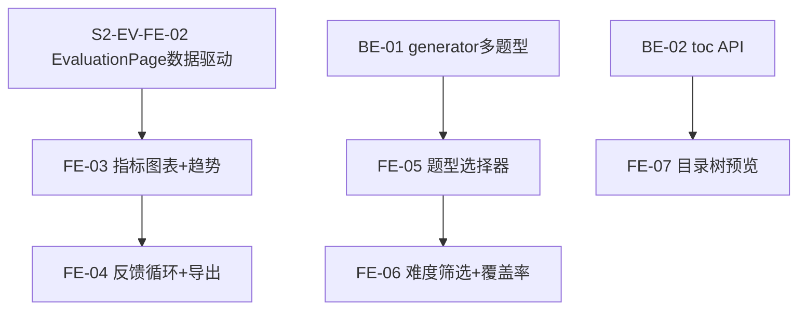

# Sprint 3 — 评估闭环 + 多题型 + toc（约 3 周）

> 目标：评估图表 + 调参反馈循环 + 多题型扩展 + 目录前端。

## 概览

| Epic | Story 数 | 预估总工时 | LlamaIndex 对齐 |
|------|----------|-----------|----------------|
| evaluation 图表+反馈循环 | **2** (另 2 已完成) | **8h** | ✅ 基于 Sprint 2 持久化的 Evaluations 数据做趋势分析 |
| question_gen 多题型 | 3 | 8h | 🔄 评估迁移到 RagDatasetGenerator 模式 |
| toc 前端 | 3 | 8h | — 与 LlamaIndex 无关 |
| **合计** | **8** (活跃) | **24h** |

## 质量门禁（每个 Story 交付前必做）

| # | 检查项 | 判定依据 |
|---|--------|----------|
| G1 | **模块归属判断** | 同 Sprint 1。重点：`evaluation` 图表在 `features/engine/evaluation/components/`；`toc` API 在 `engine_v2/api/routes/toc.py`；`question_gen` 多题型复用已有 generator.py |
| G2 | **文件注释合规** | 同 Sprint 1。重点：`evaluation` 图表用 §3.12；`toc` API 用 §1.7 |
| G3 | **LlamaIndex 对齐** | evaluation 图表消费 Evaluations 集合已有数据（Sprint 2 持久化）；question_gen 多题型扩展评估是否迁移到 `RagDatasetGenerator` |

## 依赖图

---

> ℹ️ Sprint 2 已完成 evaluation 后端 5 维评估 + 历史数据评估 + 结果持久化。Sprint 3 做趋势图表 + 反馈循环 + 导出。

## Epic: evaluation 图表 + 反馈循环 (P2)

> **前置条件**: Sprint 2 [S2-EV-BE-04] 完成后，Evaluations 集合中已有持久化的评估数据，可做趋势分析。

### ~~[S3-FE-01] TracePanel 迁移~~ — ✅ 已完成

> TracePanel / ThinkingProcessPanel 已在 `features/engine/evaluation/components/` 中。

### ~~[S3-FE-02] EvaluationPage 独立评估页~~ — ✅ 已完成

> EvaluationPage 已创建，三 Tab 布局已搭建（Sprint 2 实现）。Sprint 2 [S2-EV-FE-02] 将改版为数据驱动模式。

### [S3-FE-03] 评估指标图表 + 趋势

**类型**: Frontend · **优先级**: P2 · **预估**: 4h

**描述**: 基于 Evaluations 集合的持久化数据，展示 5 维雷达图 + 历史趋势折线图。

**验收标准**:
- [ ] 创建图表组件 (可在 `shared/components/charts/` 或 evaluation 内)
- [ ] 雷达图展示单条评估的 5 维分数
- [ ] 趋势折线图展示最近 N 次批量评估的 5 维均值变化
- [ ] 数据来源：Evaluations 集合 (按 batchId 分组聚合)
- [ ] G1 ✅ 通用图表在 `shared/components/charts/`，业务组件在 `evaluation/components/`
- [ ] G2 ✅ 图表组件符合 §3.14 图表组件模板

**依赖**: Sprint 2 [S2-EV-FE-02]
**文件**: `shared/components/charts/`, `features/engine/evaluation/components/`

### [S3-FE-04] 反馈循环 + 调参建议 + 导出

**类型**: Frontend + Backend · **优先级**: P2 · **预估**: 4h

**描述**: 基于 Evaluations 集合的大量评估数据，自动识别 RAG 管线瓶颈并给出调参建议。支持导出评估报告。

**验收标准**:
- [ ] 创建 `engine_v2/evaluation/feedback.py` — 从 Evaluations 集合聚合最近 N 条评估结果
- [ ] 瓶颈识别：context_relevancy 均值 <0.6 → "建议增加 top_k 或启用 Reranker"；answer_relevancy 均值 <0.6 → "建议优化 system prompt"；faithfulness 均值 <0.7 → "建议缩小 chunk_size"
- [ ] 前端展示调参建议卡片 + 导出 CSV/JSON 报告
- [ ] G1 ✅ 后端在 `engine_v2/evaluation/`，前端在 `features/engine/evaluation/components/`
- [ ] G2 ✅ 注释符合对应模板

**依赖**: Sprint 2 [S2-EV-BE-04] + [S2-EV-FE-02] (需有足够评估数据)
**文件**: `engine_v2/evaluation/feedback.py`, `features/engine/evaluation/components/`

---

## Epic: question_gen 多题型 (P2)

> **LlamaIndex 对齐决策点**: 此 Epic 是 generator.py 重构的最佳时机。当前 generator.py 直接用 `chromadb.collection.get()` 绕过 LlamaIndex 的 `VectorStoreIndex`，手写 JSON prompt + parse。建议趁多题型扩展之机，评估迁移到 `RagDatasetGenerator` 模式（`llama_index.core.llama_dataset.generator`）。参考源码：`.github/references/llama_index/llama-index-core/llama_index/core/llama_dataset/generator.py`
>
> 如果迁移成本过高，至少将 `_sample_chunks()` 的数据访问层从直接 ChromaDB API 改为 `VectorStoreIndex.as_retriever()` + `MetadataFilters`。

### [S3-BE-01] generator.py 多题型扩展

**类型**: Backend · **优先级**: P2 · **预估**: 4h *(从 3h 提升：含 LlamaIndex 对齐重构)*

**描述**: 在现有 generator.py 中扩展选择题/填空题生成。同时将 `_sample_chunks()` 的数据访问层从直接 ChromaDB API 迁移到 `VectorStoreIndex.as_retriever()` + `MetadataFilters`。

**验收标准**:
- [ ] 更新 `engine_v2/question_gen/generator.py` 增加题型参数
- [ ] 支持 open / multiple_choice / fill_blank 三种题型
- [ ] **将 `_sample_chunks()` 从 `chromadb.collection.get()` 迁移到 `VectorStoreIndex.as_retriever()` + `MetadataFilters`** ← LlamaIndex 对齐
- [ ] G1 ✅ 复用已有文件，不新建冗余模块
- [ ] G2 ✅ 注释更新符合 §1.2 模块实现模板
- [ ] G3 ✅ 数据访问通过 LlamaIndex VectorStoreIndex，不直接操作 ChromaDB

**依赖**: readers ✅
**文件**: `engine_v2/question_gen/generator.py`

### [S3-FE-05] 题型选择器

**类型**: Frontend · **优先级**: P2 · **预估**: 2h

**描述**: GenerationPanel 增加题型选择下拉。

**验收标准**:
- [ ] 更新 `features/engine/question_gen/components/GenerationPanel.tsx`
- [ ] 下拉选择 open / multiple_choice / fill_blank
- [ ] G1 ✅ 改动在 `features/engine/question_gen/components/`
- [ ] G2 ✅ 注释符合已有模板

**依赖**: [S3-BE-01]
**文件**: `features/engine/question_gen/components/GenerationPanel.tsx`

### [S3-FE-06] 难度筛选 + 覆盖率统计

**类型**: Frontend · **优先级**: P2 · **预估**: 3h

**描述**: 难度筛选器 + 章节覆盖率统计面板。

**验收标准**:
- [ ] QuestionsPage 增加难度筛选 (easy/medium/hard)
- [ ] 章节覆盖率进度条
- [ ] G1 ✅ 改动在 `features/engine/question_gen/components/`
- [ ] G2 ✅ 注释符合已有模板

**依赖**: [S3-FE-05]
**文件**: `features/engine/question_gen/components/QuestionsPage.tsx`

---

## Epic: toc 前端 (P3)

### [S3-BE-02] toc API 路由

**类型**: Backend · **优先级**: P3 · **预估**: 2h

**描述**: TOC CRUD API 端点。

**验收标准**:
- [ ] 创建 `engine_v2/api/routes/toc.py`
- [ ] GET /engine/toc/{book_id} 返回目录树
- [ ] G1 ✅ 路由在 `engine_v2/api/routes/`
- [ ] G2 ✅ 文件头注释符合 §1.7 API 路由模板

**依赖**: readers ✅
**文件**: `engine_v2/api/routes/toc.py`

### [S3-FE-07] 目录树预览 UI

**类型**: Frontend · **优先级**: P3 · **预估**: 4h

**描述**: 层级树展示目录 + 页码跳转。

**验收标准**:
- [ ] 创建 `features/engine/toc/components/TocPage.tsx`
- [ ] 层级树组件 (collapsible)
- [ ] 点击章节跳转对应 PDF 页
- [ ] G1 ✅ 在 `features/engine/toc/components/`
- [ ] G2 ✅ 页面符合 §3.25 Engine 页面模板

**依赖**: [S3-BE-02]
**文件**: `features/engine/toc/components/TocPage.tsx`

### [S3-FE-08] toc 模块骨架

**类型**: Frontend · **优先级**: P3 · **预估**: 2h

**描述**: 新建 toc 前端模块骨架文件。

**验收标准**:
- [ ] 创建 `features/engine/toc/index.ts` (barrel export)
- [ ] 创建 `features/engine/toc/types.ts`
- [ ] 创建 `features/engine/toc/api.ts`
- [ ] G1 ✅ 遵循 `features/engine/<module>/` 标准结构
- [ ] G2 ✅ index.ts 符合 §3.20，types.ts 符合 §3.21，api.ts 符合 §3.22

**依赖**: 无
**文件**: `features/engine/toc/index.ts`, `features/engine/toc/types.ts`, `features/engine/toc/api.ts`
