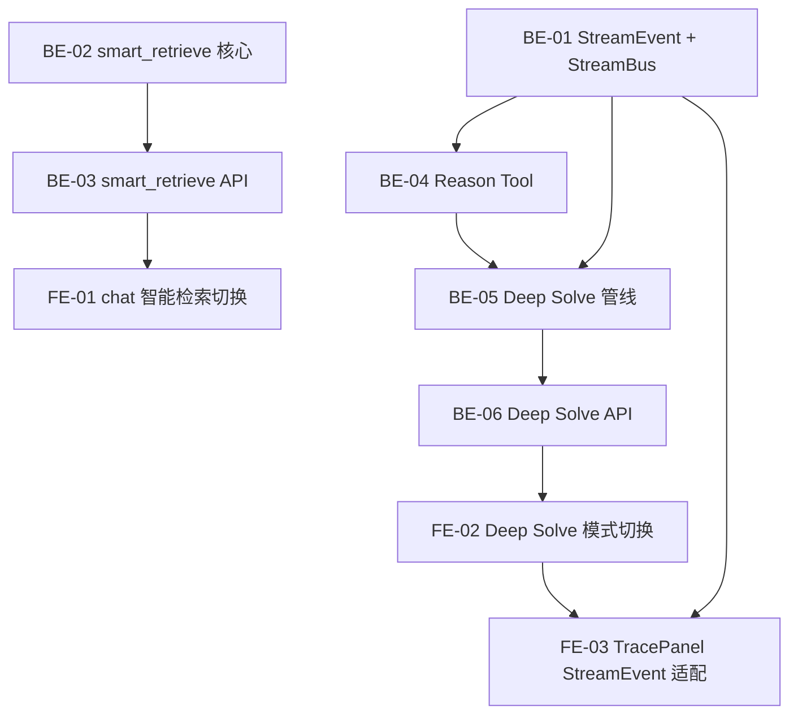

# Sprint 5 — 智能检索 + 多步推理（约 2 周）

> 目标：集成 DeepTutor 高 ROI 模块 — **smart_retrieve 多查询并行检索**、**StreamEvent 统一流式协议**、**Deep Solve 多步推理管线**。三者协同提升复杂问题回答质量 + 前端 trace 展示统一。
>
> 参考源码：`.github/references/deeptutor/deeptutor/`

## 概览

| Epic | Story 数 | 预估总工时 | DeepTutor 参考 |
|------|----------|-----------|---------------|
| StreamEvent 统一流式协议 | 3 | 8h | `core/stream.py` + `core/stream_bus.py` |
| smart_retrieve 多查询并行检索 | 3 | 8h | `services/rag/service.py` → `smart_retrieve()` |
| Deep Solve 多步推理管线 | 4 | 14h | `capabilities/deep_solve.py` + `agents/solve/` |
| **合计** | **10** | **30h** |

## 质量门禁

| # | 检查项 | 判定依据 |
|---|--------|----------|
| G1 | **模块归属判断** | `stream.py` / `stream_bus.py` 在 `engine_v2/core/`（新建）；`smart_retrieve` 在 `engine_v2/retrievers/`；Deep Solve 在 `engine_v2/agents/solve/`（新建）；Reason Tool 在 `engine_v2/tools/`（新建） |
| G2 | **文件注释合规** | Python 文件 §1.2 模块实现模板；新模块 §1.1 `__init__.py` 模板 |
| G3 | **LlamaIndex 对齐** | smart_retrieve 使用已有 `get_query_engine()` 做并行检索，不绕过 LlamaIndex；Deep Solve 使用 `RetrieverQueryEngine` 作为检索工具 |
| G4 | **DeepTutor 对齐** | 核心抽象（StreamEvent / StreamBus）保持接口兼容，便于后续直接复用 DeepTutor 更多模块 |

## 依赖图

---

## Epic: StreamEvent 统一流式协议 (P0)

> 从 DeepTutor 提取 StreamEvent + StreamBus 核心抽象，替代当前散碎的 SSE 格式。统一 chat 流式输出、evaluation trace、question_gen 进度 的事件格式。

### [S5-BE-01] StreamEvent + StreamBus 核心协议

**类型**: Backend · **优先级**: P0 · **预估**: 3h

**描述**: 从 DeepTutor `core/stream.py` + `core/stream_bus.py` 提取核心协议，适配到 textbook-rag 架构。保留语义事件类型（STAGE_START, THINKING, TOOL_CALL, TOOL_RESULT, CONTENT, SOURCES, PROGRESS, DONE 等），但简化为无 asyncio 队列版本（SSE push 替代）。

**验收标准**:
- [ ] 创建 `engine_v2/core/__init__.py`（新模块）
- [ ] 创建 `engine_v2/core/stream.py` — `StreamEventType` 枚举 + `StreamEvent` dataclass
- [ ] 创建 `engine_v2/core/stream_bus.py` — `StreamBus` 类，提供 `stage()`, `thinking()`, `content()`, `tool_call()`, `tool_result()`, `sources()`, `progress()`, `result()`, `error()`, `done()` 方法
- [ ] `StreamBus.to_sse()` 方法：将 StreamEvent 序列化为 SSE `data:` 行（NDJSON 格式，与 DeepTutor 兼容）
- [ ] 保持接口与 DeepTutor `StreamBus` 兼容（async context manager stage, source 参数）
- [ ] G1 ✅ 新建 `engine_v2/core/`
- [ ] G2 ✅ §1.2 + §1.1
- [ ] G4 ✅ 接口兼容 DeepTutor

**参考**: `deeptutor/core/stream.py` (71行) + `deeptutor/core/stream_bus.py` (260行)
**文件**: `engine_v2/core/stream.py`, `engine_v2/core/stream_bus.py`

### [S5-BE-02] query route SSE 迁移到 StreamEvent

**类型**: Backend · **优先级**: P0 · **预估**: 2h

**描述**: 将 `api/routes/query.py` 的 SSE streaming 从自定义格式迁移到 StreamEvent 协议。保持 `/engine/query/stream` 端点不变，但 SSE 事件改为 StreamEvent NDJSON。

**验收标准**:
- [ ] 更新 `engine_v2/api/routes/query.py` 的 stream 路由
- [ ] SSE 事件改为 `StreamEvent` NDJSON 格式（`{"type": "content", "data": "...", "source": "rag", "stage": "responding"}`)
- [ ] 保留 `stage_start` / `content` / `sources` / `done` 事件类型
- [ ] 新增 `tool_call` (检索开始) + `tool_result` (检索完成) 事件
- [ ] 前端 `useQueryEngine` hook 需适配新格式（向后兼容：识别新旧两种格式）
- [ ] G1 ✅ 在 `engine_v2/api/routes/`

**依赖**: [S5-BE-01]
**文件**: `engine_v2/api/routes/query.py`, `features/engine/query_engine/`

### [S5-FE-03] ThinkingProcessPanel StreamEvent 适配

**类型**: Frontend · **优先级**: P1 · **预估**: 3h

**描述**: 更新 `ThinkingProcessPanel` / `TraceComponents` 消费 StreamEvent 协议，用统一的事件类型渲染 trace 步骤，替代当前的自定义 trace 格式。

**验收标准**:
- [ ] 更新 `features/engine/evaluation/components/TraceComponents.tsx`
- [ ] 支持渲染 StreamEvent 的 `stage_start/end` → 折叠分组
- [ ] 支持渲染 `thinking` → 推理过程文本
- [ ] 支持渲染 `tool_call` + `tool_result` → 工具调用卡片
- [ ] 支持渲染 `progress` → 进度指示器
- [ ] 同时兼容旧的 trace 格式（渐进迁移）
- [ ] G1 ✅ 在 `features/engine/evaluation/components/`

**依赖**: [S5-BE-02]
**文件**: `features/engine/evaluation/components/TraceComponents.tsx`, `features/engine/evaluation/components/ThinkingProcessPanel.tsx`

---

## Epic: smart_retrieve 多查询并行检索 (P0)

> 从 DeepTutor `RAGService.smart_retrieve()` 提取多查询检索模式。LLM 将用户问题拆解为多个检索查询 → 并行搜索 → 结果去重聚合。直接提升 context_relevancy 和 faithfulness。

### [S5-BE-03] smart_retrieve 核心实现

**类型**: Backend · **优先级**: P0 · **预估**: 3h

**描述**: 在 `engine_v2/retrievers/` 新增 `smart_retrieve.py`，实现多查询并行检索 + 结果聚合。复用已有的 `get_hybrid_retriever()` 做底层检索。

**验收标准**:
- [ ] 创建 `engine_v2/retrievers/smart_retrieve.py`
- [ ] `generate_queries(context, n=3)` — 用 LLM 从用户问题生成 N 个多样化检索查询
- [ ] `smart_retrieve(question, max_queries=3)` — 并行执行多查询检索 → RRF 融合 → 去重
- [ ] 复用 `engine_v2/retrievers/hybrid.py` 的 `get_hybrid_retriever()` 做底层检索
- [ ] 结果去重：按 chunk_id 去重，保留最高分
- [ ] G1 ✅ 在 `engine_v2/retrievers/`
- [ ] G2 ✅ §1.2
- [ ] G3 ✅ 使用 LlamaIndex retriever，不直接操作 ChromaDB

**参考**: `deeptutor/services/rag/service.py` L229-L287 (`smart_retrieve` + `_generate_queries` + `_aggregate`)
**文件**: `engine_v2/retrievers/smart_retrieve.py`

### [S5-BE-04] smart_retrieve API 端点

**类型**: Backend · **优先级**: P0 · **预估**: 2h

**描述**: 新增 API 端点支持智能检索模式切换。在 `/engine/query/stream` 增加 `retrieval_mode` 参数（`standard` / `smart`）。

**验收标准**:
- [ ] 更新 `engine_v2/api/routes/query.py` 增加 `retrieval_mode` 参数
- [ ] `retrieval_mode="standard"` → 现有 `get_query_engine()` 路径
- [ ] `retrieval_mode="smart"` → `smart_retrieve()` → 自定义 query engine
- [ ] 流式输出正确发射 `tool_call` 事件（显示生成的多个检索查询）
- [ ] G1 ✅ 在 `engine_v2/api/routes/`

**依赖**: [S5-BE-03], [S5-BE-01]
**文件**: `engine_v2/api/routes/query.py`

### [S5-FE-01] chat 智能检索模式切换

**类型**: Frontend · **优先级**: P1 · **预估**: 3h

**描述**: ChatInput 增加检索模式切换（Standard / Smart），Smart 模式使用多查询并行检索。EvaluationPage 支持对比两种模式的评估分数。

**验收标准**:
- [ ] ChatInput 增加检索模式切换按钮/下拉（默认 Standard）
- [ ] Smart 模式发送 `retrieval_mode: "smart"` 到 stream API
- [ ] ThinkingProcessPanel 展示多查询生成步骤（从 StreamEvent tool_call 事件）
- [ ] G1 ✅ 改动在 `features/chat/panel/`

**依赖**: [S5-BE-04]
**文件**: `features/chat/panel/ChatInput.tsx`, `features/chat/panel/ChatPanel.tsx`

---

## Epic: Deep Solve 多步推理管线 (P1)

> 从 DeepTutor 提取多步推理能力。当用户问题需要深度分析（depth ≥ 4）时，自动升级为 Plan → ReAct → Write 三阶段管线。
>
> 核心创新点：与你已有的 `QuestionDepthEvaluator`（Sprint 2 实现）联动——当检测到 synthesis 级问题时自动触发 Deep Solve。

### [S5-BE-05] Reason Tool — 独立推理引擎

**类型**: Backend · **优先级**: P1 · **预估**: 3h

**描述**: 从 DeepTutor `tools/reason.py` 提取独立的深度推理工具。专用 system prompt 强制 step-by-step 推理链，适合数学推导/逻辑证明/概念辨析。

**验收标准**:
- [ ] 创建 `engine_v2/tools/__init__.py`（新模块）
- [ ] 创建 `engine_v2/tools/reason.py`
- [ ] `async reason(query, context="")` — 单次 LLM 深度推理调用
- [ ] 专用 system prompt 强制编号步骤推理（not synthesis style）
- [ ] 使用 `Settings.llm` 保持 LlamaIndex 对齐
- [ ] 返回 `{"query": str, "answer": str, "model": str}`
- [ ] G1 ✅ 新建 `engine_v2/tools/`
- [ ] G2 ✅ §1.2

**参考**: `deeptutor/tools/reason.py` (120行)
**文件**: `engine_v2/tools/reason.py`

### [S5-BE-06] Deep Solve 管线 — Plan → ReAct → Write

**类型**: Backend · **优先级**: P1 · **预估**: 6h

**描述**: 实现三阶段多步推理管线：① Planning（LLM 拆解用户问题为子问题）→ ② ReAct（逐个子问题：决定用 RAG 检索或 Reason 推理，收集证据）→ ③ Writing（综合所有证据写出最终答案）。全程通过 StreamBus 发射 trace 事件。

**验收标准**:
- [ ] 创建 `engine_v2/agents/__init__.py`（新模块）
- [ ] 创建 `engine_v2/agents/solve.py`
- [ ] `DeepSolvePipeline` 类，三阶段管线：
  - Planning: LLM 拆解问题 → 子问题列表
  - ReAct: 每个子问题 → 自动决定工具（`rag` 检索 / `reason` 推理）→ 收集证据
  - Writing: 综合所有证据 + 原始问题 → 最终答案
- [ ] 通过 `StreamBus` 发射 `stage_start/end`, `thinking`, `tool_call`, `tool_result`, `content` 事件
- [ ] 使用已有 `get_query_engine()` 做 RAG 检索 + `reason()` 做推理
- [ ] G1 ✅ 新建 `engine_v2/agents/`
- [ ] G3 ✅ RAG 检索通过 LlamaIndex QueryEngine

**参考**: `deeptutor/capabilities/deep_solve.py` (268行) + `deeptutor/agents/solve/`
**文件**: `engine_v2/agents/solve.py`

### [S5-BE-07] Deep Solve API + 自动路由

**类型**: Backend · **优先级**: P1 · **预估**: 2h

**描述**: 新增 Deep Solve API 端点。支持两种触发方式：① 手动（前端选择 Deep Solve 模式）；② 自动（后端用 `assess_question_depth()` 检测到 depth ≥ 4 时自动升级）。

**验收标准**:
- [ ] 新增 `POST /engine/solve` API 端点（SSE streaming, StreamEvent 格式）
- [ ] 在 `/engine/query/stream` 增加 `solve_mode` 参数（`auto` / `deep` / `standard`）
- [ ] `solve_mode="auto"` → 先评估问题深度，synthesis 级自动走 Deep Solve，其余走标准 RAG
- [ ] `solve_mode="deep"` → 强制 Deep Solve
- [ ] `solve_mode="standard"` → 现有 RAG（默认值，向后兼容）
- [ ] G1 ✅ 路由在 `engine_v2/api/routes/`

**依赖**: [S5-BE-06], [S5-BE-01]
**文件**: `engine_v2/api/routes/query.py` or `engine_v2/api/routes/solve.py`

### [S5-FE-02] Deep Solve 模式切换 + trace 展示

**类型**: Frontend · **优先级**: P1 · **预估**: 3h

**描述**: ChatInput 增加推理模式选择（Standard / Auto / Deep Solve）。Deep Solve 模式下展示三阶段 trace（Planning → ReAct → Writing），利用 S5-FE-03 的 StreamEvent 适配。

**验收标准**:
- [ ] ChatInput 增加推理模式选择（下拉或 toggle）
- [ ] Auto 模式时自动路由，用户无感知
- [ ] Deep Solve 模式时展示 trace 折叠面板（复用 ThinkingProcessPanel）
- [ ] trace 展示三阶段进度条 + 子问题列表 + 工具调用明细
- [ ] G1 ✅ 改动在 `features/chat/panel/`

**依赖**: [S5-BE-07], [S5-FE-03]
**文件**: `features/chat/panel/ChatInput.tsx`, `features/chat/panel/ChatPanel.tsx`
