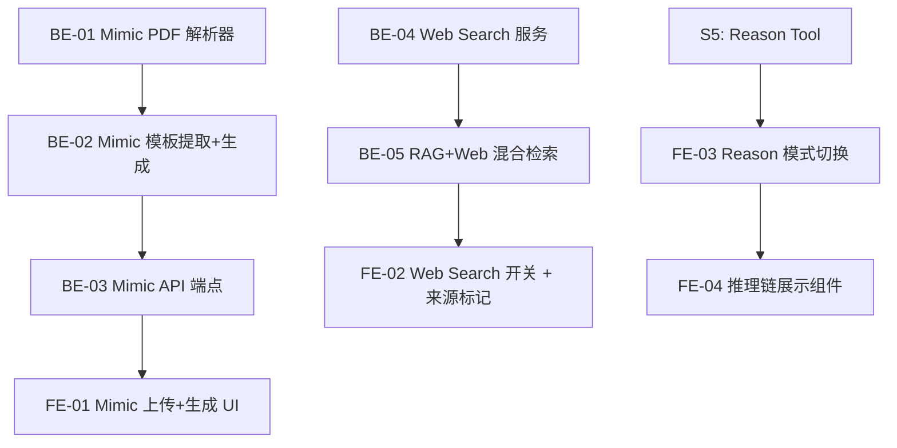

# Sprint 6 — 问题生成升级 + Web Search + Reason 链（约 2 周）

> 目标：集成 DeepTutor 中等价值模块 — **Deep Question Mimic 模式**（上传考卷模仿出题）、**Web Search fallback**（教科书外知识补充）、**Reason Tool 前端集成**。
>
> 参考源码：`.github/references/deeptutor/deeptutor/`

## 概览

| Epic | Story 数 | 预估总工时 | DeepTutor 参考 |
|------|----------|-----------|---------------|
| Deep Question Mimic 模式 | 4 | 14h | `capabilities/deep_question.py` + `agents/question/` |
| Web Search Fallback | 3 | 9h | `tools/web_search.py` + `services/search/` |
| Reason Tool 前端集成 | 2 | 5h | `tools/reason.py`（后端已在 S5 实现）|
| **合计** | **9** | **28h** |

## 质量门禁

| # | 检查项 | 判定依据 |
|---|--------|----------|
| G1 | **模块归属判断** | Mimic 模式扩展在 `engine_v2/question_gen/`；Web Search 在 `engine_v2/tools/web_search.py`；前端 UI 在各自 `features/engine/` 子目录 |
| G2 | **文件注释合规** | Python §1.2；前端 §3.12 |
| G3 | **LlamaIndex 对齐** | Web Search 作为独立 Tool，不与 LlamaIndex retriever 混合；Mimic 模式使用 MinerUReader（已有） |

## 依赖图

---

## Epic: Deep Question Mimic 模式 (P1)

> 从 DeepTutor `DeepQuestionCapability` 提取 Mimic 模式。用户上传真实考卷 PDF → 解析题目模板 → AI 模仿风格生成新练习题。适合教科书场景（学生上传期中考卷，系统生成同风格练习题）。

### [S6-BE-01] Mimic PDF 考卷解析器

**类型**: Backend · **优先级**: P1 · **预估**: 4h

**描述**: 新增考卷 PDF 解析能力。使用 MinerUReader（已有）解析考卷 PDF，然后用 LLM 从解析结果中提取题目模板（题型、难度、考点、格式）。

**验收标准**:
- [ ] 创建 `engine_v2/question_gen/mimic.py`
- [ ] `parse_exam_paper(pdf_path) -> list[ExamTemplate]` — 解析考卷 PDF，提取题目模板
- [ ] `ExamTemplate` dataclass：question_text, question_type (mcq/open/fill_blank), difficulty, topic_tags, format_pattern
- [ ] 复用已有 MinerUReader 做 PDF → Markdown 解析
- [ ] LLM 从 Markdown 中提取结构化题目列表
- [ ] G1 ✅ 在 `engine_v2/question_gen/`

**参考**: `deeptutor/capabilities/deep_question.py` L205-L265 (mimic mode)
**文件**: `engine_v2/question_gen/mimic.py`

### [S6-BE-02] Mimic 模板提取 + 新题生成

**类型**: Backend · **优先级**: P1 · **预估**: 4h

**描述**: 基于提取的考卷模板，结合教科书 RAG 内容，生成风格一致的新练习题。

**验收标准**:
- [ ] `generate_from_templates(templates, kb_chunks, n) -> list[GeneratedQuestion]`
- [ ] 每道新题保持原模板的题型、难度、格式
- [ ] 内容来自 RAG 检索的教科书 chunks（不同于原考卷内容）
- [ ] 自动用现有 `_score_questions()` 评分
- [ ] 支持 `max_questions` 参数限制生成数量
- [ ] G3 ✅ 知识检索通过 LlamaIndex retriever

**依赖**: [S6-BE-01]
**文件**: `engine_v2/question_gen/mimic.py`

### [S6-BE-03] Mimic API 端点

**类型**: Backend · **优先级**: P1 · **预估**: 2h

**描述**: 新增考卷模仿生成的 API 端点，支持 PDF 上传。

**验收标准**:
- [ ] `POST /engine/questions/generate-mimic` — 接受 multipart/form-data（PDF 文件 + book_ids + max_questions）
- [ ] 返回 StreamEvent 格式的 SSE 流，包含解析进度 + 生成进度 + 最终结果
- [ ] G1 ✅ 在 `engine_v2/api/routes/questions.py`

**依赖**: [S6-BE-02]
**文件**: `engine_v2/api/routes/questions.py`

### [S6-FE-01] Mimic 上传 + 生成 UI

**类型**: Frontend · **优先级**: P1 · **预估**: 4h

**描述**: GenerationPanel 新增 Mimic 模式 tab。用户上传考卷 PDF → 展示解析的题目模板 → 确认后生成新题。

**验收标准**:
- [ ] GenerationPanel 新增 "Mimic" 模式 tab（与 Custom 模式并列）
- [ ] PDF 上传区（复用 UploadZone 组件样式）
- [ ] 解析结果预览：展示提取的题目模板列表（题型、难度、考点）
- [ ] "Generate" 按钮触发基于模板的新题生成
- [ ] StreamEvent 进度展示（解析中 → 生成中 → 完成）
- [ ] G1 ✅ 在 `features/engine/question_gen/components/`

**依赖**: [S6-BE-03]
**文件**: `features/engine/question_gen/components/GenerationPanel.tsx` or `MimicPanel.tsx`

---

## Epic: Web Search Fallback (P2)

> 从 DeepTutor `tools/web_search.py` 提取 Web Search 能力。当 RAG 检索置信度不够时，自动 fallback 到 Web 搜索补充上下文。

### [S6-BE-04] Web Search 服务

**类型**: Backend · **优先级**: P2 · **预估**: 3h

**描述**: 实现轻量级 Web Search 服务，支持 DuckDuckGo（零配置）+ Tavily（高质量，需 API key）两种 provider。

**验收标准**:
- [ ] 创建 `engine_v2/tools/web_search.py`
- [ ] `async web_search(query, provider="duckduckgo", max_results=5) -> list[SearchResult]`
- [ ] `SearchResult` dataclass：title, url, snippet, content
- [ ] DuckDuckGo provider（零配置，用 `duckduckgo-search` 库）
- [ ] Tavily provider（可选，需 `TAVILY_API_KEY`）
- [ ] G1 ✅ 在 `engine_v2/tools/`

**参考**: `deeptutor/tools/web_search.py` + `deeptutor/services/search/`
**文件**: `engine_v2/tools/web_search.py`

### [S6-BE-05] RAG + Web 混合检索模式

**类型**: Backend · **优先级**: P2 · **预估**: 3h

**描述**: 在 query pipeline 中增加 Web Search fallback。当 RAG 检索到的 top chunk 平均分低于阈值时，自动补充 Web 搜索结果作为额外上下文。

**验收标准**:
- [ ] 更新 `engine_v2/api/routes/query.py` 增加 `web_fallback` 参数（默认 false）
- [ ] 当 `web_fallback=true` 且 RAG 检索平均 score < 0.3 时，执行 Web Search
- [ ] Web 搜索结果转换为 LlamaIndex `TextNode`，追加到检索结果中
- [ ] source 来源标记为 `"web"` 类型（区别于 `"textbook"`），前端可区分
- [ ] StreamEvent 中发射 `tool_call("web_search", ...)` 事件
- [ ] G3 ✅ Web 搜索结果转为 LlamaIndex Node 格式

**依赖**: [S6-BE-04]
**文件**: `engine_v2/api/routes/query.py`

### [S6-FE-02] Web Search 开关 + 来源标记

**类型**: Frontend · **优先级**: P2 · **预估**: 3h

**描述**: ChatInput 增加 Web Search 开关。CitationChip 区分教科书来源和 Web 来源（不同图标/颜色）。

**验收标准**:
- [ ] ChatInput 增加 "🌐 Web Fallback" toggle
- [ ] CitationChip 区分源类型：📖 textbook source vs 🌐 web source
- [ ] Web source 的 CitationPopover 展示 URL + 页面标题而非页码
- [ ] G1 ✅ 改动在 `features/chat/panel/`

**依赖**: [S6-BE-05]
**文件**: `features/chat/panel/ChatInput.tsx`, `features/chat/panel/CitationChip.tsx`

---

## Epic: Reason Tool 前端集成 (P2)

> Sprint 5 后端已实现 Reason Tool。此 Epic 补全前端 UI，让用户可以在需要深度推理时手动触发或查看推理链。

### [S6-FE-03] Reason 模式切换

**类型**: Frontend · **优先级**: P2 · **预估**: 2h

**描述**: ChatInput 增加推理模式指示。当 Deep Solve (S5) 自动触发 Reason Tool 时，在消息气泡中展示「深度推理」标签。

**验收标准**:
- [ ] AI 消息气泡增加模式标签：`💬 RAG` / `🧠 Deep Solve` / `🔬 Reasoning`
- [ ] 标签颜色区分不同模式
- [ ] G1 ✅ 改动在 `features/chat/panel/`

**依赖**: S5 Deep Solve 完成
**文件**: `features/chat/panel/AnswerBlockRenderer.tsx`

### [S6-FE-04] 推理链展示组件

**类型**: Frontend · **优先级**: P2 · **预估**: 3h

**描述**: 创建 ReasoningChain 组件，可折叠展示 step-by-step 推理链。从 StreamEvent `thinking` 事件渲染。

**验收标准**:
- [ ] 创建 `features/chat/panel/ReasoningChain.tsx`
- [ ] 可折叠展示编号推理步骤
- [ ] 支持 Markdown + KaTeX 渲染（数学推导）
- [ ] 默认折叠，用户可展开查看完整推理链
- [ ] G1 ✅ 在 `features/chat/panel/`

**依赖**: [S6-FE-03]
**文件**: `features/chat/panel/ReasoningChain.tsx`
