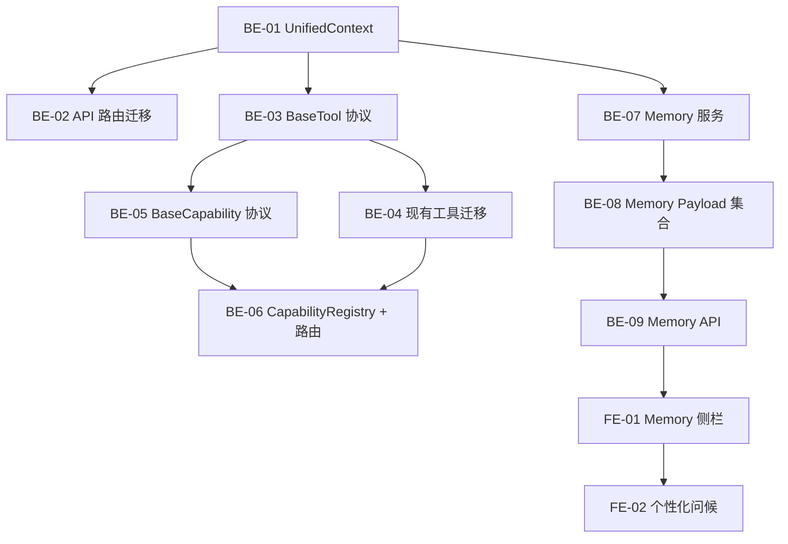

# Sprint 7 — 架构升级 + 用户记忆（约 3 周）

> 目标：实施 DeepTutor 架构级改造 — **UnifiedContext 统一上下文**、**Tool/Capability 两层插件架构**、**用户记忆系统**。这些是长期价值的基础设施投资，为后续持续集成 DeepTutor 能力打下架构基础。
>
> ⚠️ 此 Sprint 为架构重构，需在 Sprint 5-6 功能稳定后实施。
>
> 参考源码：`.github/references/deeptutor/deeptutor/`

## 概览

| Epic | Story 数 | 预估总工时 | DeepTutor 参考 |
|------|----------|-----------|---------------|
| UnifiedContext 统一上下文 | 3 | 10h | `core/context.py` |
| Tool/Capability 插件注册 | 4 | 16h | `core/tool_protocol.py` + `core/capability_protocol.py` + `runtime/registry/` |
| 用户记忆系统 | 4 | 14h | `services/memory/service.py` |
| **合计** | **11** | **40h** |

## 质量门禁

| # | 检查项 | 判定依据 |
|---|--------|----------|
| G1 | **模块归属判断** | UnifiedContext → `engine_v2/core/context.py`；Tool 协议 → `engine_v2/core/tool_protocol.py`；Capability 协议 → `engine_v2/core/capability_protocol.py`；注册表 → `engine_v2/runtime/registry/`（新建）；Memory → `engine_v2/services/memory/`（新建），前端在 `features/chat/memory/` |
| G2 | **文件注释合规** | Python §1.2；Payload 集合 §2.1 |
| G3 | **向后兼容** | 所有重构必须保持现有 API 端点不变。新架构作为内部重构，外部接口不破坏 |
| G4 | **DeepTutor 对齐** | 核心抽象接口（UnifiedContext 字段、BaseTool/BaseCapability 接口）与 DeepTutor 保持兼容 |

## 依赖图

---

## Epic: UnifiedContext 统一上下文 (P1)

> 从 DeepTutor `core/context.py` 提取 UnifiedContext。将散落在 API route 函数参数中的各种上下文（session, question, books, tools, config）统一为一个数据对象，在整个 engine 管线中流转。

### [S7-BE-01] UnifiedContext dataclass

**类型**: Backend · **优先级**: P1 · **预估**: 3h

**描述**: 定义 `UnifiedContext` dataclass，适配 textbook-rag 的领域模型。与 DeepTutor 的保持字段兼容，增加教科书特有字段。

**验收标准**:
- [ ] 创建 `engine_v2/core/context.py`
- [ ] `UnifiedContext` 字段：
  - `session_id: str` — ChatSession ID
  - `user_id: str | None` — 用户 ID
  - `user_message: str` — 当前问题
  - `conversation_history: list[dict]` — 对话历史
  - `book_ids: list[str]` — 关联书籍（textbook-rag 特有）
  - `enabled_tools: list[str] | None` — 启用的工具
  - `active_capability: str | None` — 活动能力（standard / deep_solve / smart_retrieve）
  - `retrieval_mode: str` — 检索模式（standard / smart）
  - `solve_mode: str` — 推理模式（standard / auto / deep）
  - `config_overrides: dict` — 参数覆盖（top_k, reranker, web_fallback 等）
  - `language: str` — 语言标记
  - `metadata: dict` — 扩展元数据
- [ ] `from_request()` 工厂方法：从 FastAPI Request + body 构造 UnifiedContext
- [ ] G4 ✅ 与 DeepTutor UnifiedContext 字段兼容

**参考**: `deeptutor/core/context.py` (59行)
**文件**: `engine_v2/core/context.py`

### [S7-BE-02] API 路由迁移到 UnifiedContext

**类型**: Backend · **优先级**: P1 · **预估**: 4h

**描述**: 逐步迁移 `api/routes/query.py`, `api/routes/evaluation.py`, `api/routes/questions.py` 使用 UnifiedContext。路由层构造 UnifiedContext，传入业务逻辑层。

**验收标准**:
- [ ] `query.py` 的 stream/sync 路由从散参数改为 `UnifiedContext`
- [ ] `evaluation.py` 的评估路由从散参数改为 `UnifiedContext`
- [ ] `questions.py` 的生成路由从散参数改为 `UnifiedContext`
- [ ] 所有现有 API 端点行为不变（纯内部重构）
- [ ] G3 ✅ 外部接口不变

**依赖**: [S7-BE-01]
**文件**: `engine_v2/api/routes/query.py`, `engine_v2/api/routes/evaluation.py`, `engine_v2/api/routes/questions.py`

### [S7-BE-03] chat WebSocket 端点（可选）

**类型**: Backend · **优先级**: P2 · **预估**: 3h

**描述**: 新增可选的 WebSocket 端点（与 SSE 并存），支持双向通信。消费 StreamBus 事件。为后续长连接场景（实时协作、持续推理）预留。

**验收标准**:
- [ ] 新增 `/engine/ws` WebSocket 端点
- [ ] 接收 JSON 消息 → 构造 UnifiedContext → 路由到 Capability
- [ ] StreamBus 事件通过 WebSocket 推送
- [ ] SSE 端点保留不变（向后兼容）
- [ ] G3 ✅ SSE 端点保留

**依赖**: [S7-BE-01], Sprint 5 StreamBus
**文件**: `engine_v2/api/routes/ws.py` (新建)

---

## Epic: Tool/Capability 两层插件架构 (P2)

> 从 DeepTutor 提取插件架构。将已有功能（RAG, Reason, Web Search, Deep Solve, Question Gen）注册为标准 Tool/Capability，新增功能只需实现接口 + 注册即可。

### [S7-BE-04] BaseTool 协议 + ToolRegistry

**类型**: Backend · **优先级**: P2 · **预估**: 4h

**描述**: 定义 `BaseTool` 抽象类 + `ToolRegistry` 注册表。现有的 RAG 检索、Reason、Web Search 重新包装为标准 Tool。

**验收标准**:
- [ ] 创建 `engine_v2/core/tool_protocol.py`
- [ ] `BaseTool` ABC：`name`, `description`, `execute(context, **kwargs) -> ToolResult`
- [ ] `ToolResult` dataclass：`content: str`, `sources: list`, `metadata: dict`, `success: bool`
- [ ] `ToolDefinition` — OpenAI function-calling 格式 schema（为未来 agent 调用预留）
- [ ] 创建 `engine_v2/runtime/__init__.py` + `engine_v2/runtime/registry.py`
- [ ] `ToolRegistry`：`register(tool)`, `get(name)`, `list_tools()`
- [ ] G4 ✅ 接口兼容 DeepTutor BaseTool

**参考**: `deeptutor/core/tool_protocol.py` (155行) + `deeptutor/runtime/registry/tool_registry.py`
**文件**: `engine_v2/core/tool_protocol.py`, `engine_v2/runtime/registry.py`

### [S7-BE-05] 现有工具迁移到 BaseTool

**类型**: Backend · **优先级**: P2 · **预估**: 3h

**描述**: 将 Sprint 5-6 实现的工具包装为标准 BaseTool。

**验收标准**:
- [ ] `RagTool(BaseTool)` — 包装 `get_query_engine().query()`
- [ ] `ReasonTool(BaseTool)` — 包装 `reason()`
- [ ] `WebSearchTool(BaseTool)` — 包装 `web_search()`
- [ ] 注册到 `ToolRegistry`
- [ ] 各工具提供 `ToolDefinition`（OpenAI function schema）
- [ ] G1 ✅ 工具在 `engine_v2/tools/`

**依赖**: [S7-BE-04]
**文件**: `engine_v2/tools/rag_tool.py`, `engine_v2/tools/reason.py`, `engine_v2/tools/web_search.py`

### [S7-BE-06] BaseCapability 协议

**类型**: Backend · **优先级**: P2 · **预估**: 3h

**描述**: 定义 `BaseCapability` 抽象类。将 Standard RAG, Deep Solve, Question Gen 注册为 Capability。

**验收标准**:
- [ ] 创建 `engine_v2/core/capability_protocol.py`
- [ ] `BaseCapability` ABC：`manifest: CapabilityManifest`, `async run(context, stream) -> None`
- [ ] `CapabilityManifest` dataclass：`name, description, stages: list[str], tools_used: list[str]`
- [ ] 现有管线包装为 Capability：`StandardRagCapability`, `DeepSolveCapability`, `QuestionGenCapability`
- [ ] G4 ✅ 接口兼容 DeepTutor BaseCapability

**参考**: `deeptutor/core/capability_protocol.py` (69行)
**文件**: `engine_v2/core/capability_protocol.py`

### [S7-BE-07] CapabilityRegistry + 统一路由

**类型**: Backend · **优先级**: P2 · **预估**: 6h

**描述**: 实现 CapabilityRegistry + 统一路由器。单一入口根据 `UnifiedContext.active_capability` 路由到对应 Capability。类似 DeepTutor 的 `ChatOrchestrator`。

**验收标准**:
- [ ] `CapabilityRegistry`：`register(capability)`, `get(name)`, `list_capabilities()`
- [ ] `Orchestrator` 类：接收 UnifiedContext → 解析 active_capability → 路由到对应 Capability → 管理 StreamBus 生命周期
- [ ] `/engine/query/stream` 改为经过 Orchestrator 路由（保持端点不变）
- [ ] 新增功能只需：① 实现 BaseCapability ② 注册到 registry ③ 不改路由代码
- [ ] G3 ✅ 外部接口不变

**依赖**: [S7-BE-06], [S7-BE-05], [S7-BE-02]
**参考**: `deeptutor/runtime/orchestrator.py` (122行)
**文件**: `engine_v2/runtime/orchestrator.py`, `engine_v2/runtime/registry.py`

---

## Epic: 用户记忆系统 (P2)

> 从 DeepTutor `services/memory/service.py` 提取用户记忆能力。双维度记忆：**学习摘要**（跟踪学了什么）+ **学习者画像**（偏好/水平/目标），实现个性化教学。

### [S7-BE-08] Memory 服务

**类型**: Backend · **优先级**: P2 · **预估**: 4h

**描述**: 实现双维度用户记忆服务。每次对话结束后自动更新。

**验收标准**:
- [ ] 创建 `engine_v2/services/__init__.py` + `engine_v2/services/memory.py`
- [ ] `MemoryService` 类：
  - `get_summary(user_id) -> str` — 获取用户学习摘要
  - `update_summary(user_id, conversation) -> str` — 基于最新对话更新摘要
  - `get_profile(user_id) -> LearnerProfile` — 获取学习者画像
  - `update_profile(user_id, conversation) -> LearnerProfile` — 更新画像
- [ ] `LearnerProfile` dataclass：`knowledge_level: str`, `preferred_style: str`, `learning_goals: list[str]`, `strengths: list[str]`, `weak_areas: list[str]`
- [ ] 摘要更新：LLM 将旧摘要 + 新对话 → 压缩为更新摘要（渐进式，不丢失历史信息）
- [ ] G1 ✅ 新建 `engine_v2/services/`

**参考**: `deeptutor/services/memory/service.py` (14KB)
**文件**: `engine_v2/services/memory.py`

### [S7-BE-09] Memory Payload 集合

**类型**: Backend (Payload) · **优先级**: P2 · **预估**: 2h

**描述**: 新建 Payload 集合存储用户记忆数据。

**验收标准**:
- [ ] 创建 `collections/UserMemories.ts`
- [ ] 字段：`user` (relationship → users), `summary` (textarea), `profile` (json: LearnerProfile), `lastConversationId` (text)
- [ ] 每用户一条记录，`afterChange` hook 无需
- [ ] access：用户只能读写自己的记忆
- [ ] G1 ✅ 集合在 `collections/`

**文件**: `collections/UserMemories.ts`, `payload.config.ts`

### [S7-BE-10] Memory API + 自动更新 hook

**类型**: Backend · **优先级**: P2 · **预估**: 4h

**描述**: Memory API 端点 + 对话结束时自动触发记忆更新。

**验收标准**:
- [ ] `GET /engine/memory` — 获取当前用户记忆（摘要 + 画像）
- [ ] `POST /engine/memory/update` — 手动触发记忆更新（传入最近 conversation_id）
- [ ] 在 query stream 的 `done` 事件后，fire-and-forget 触发 `update_summary()`
- [ ] 记忆上下文注入到 UnifiedContext.metadata（供 LLM system prompt 使用）
- [ ] G1 ✅ API 在 `engine_v2/api/routes/`

**依赖**: [S7-BE-08], [S7-BE-09]
**文件**: `engine_v2/api/routes/memory.py` (新建)

### [S7-FE-01] Memory 侧栏 + 个性化问候

**类型**: Frontend · **优先级**: P2 · **预估**: 4h

**描述**: ChatPage 侧栏展示用户学习摘要 + 知识画像。WelcomeScreen 基于画像个性化问候。

**验收标准**:
- [ ] 创建 `features/chat/memory/MemoryPanel.tsx`
- [ ] 展示学习摘要（Markdown 渲染）+ 知识水平标签 + 薄弱领域高亮
- [ ] WelcomeScreen 基于 `LearnerProfile` 个性化推荐（薄弱领域的问题优先推荐）
- [ ] ChatInput 下方展示 "Based on your learning history, try asking about..." 提示
- [ ] G1 ✅ 在 `features/chat/memory/`

**依赖**: [S7-BE-10]
**文件**: `features/chat/memory/MemoryPanel.tsx`, `features/chat/panel/WelcomeScreen.tsx`
