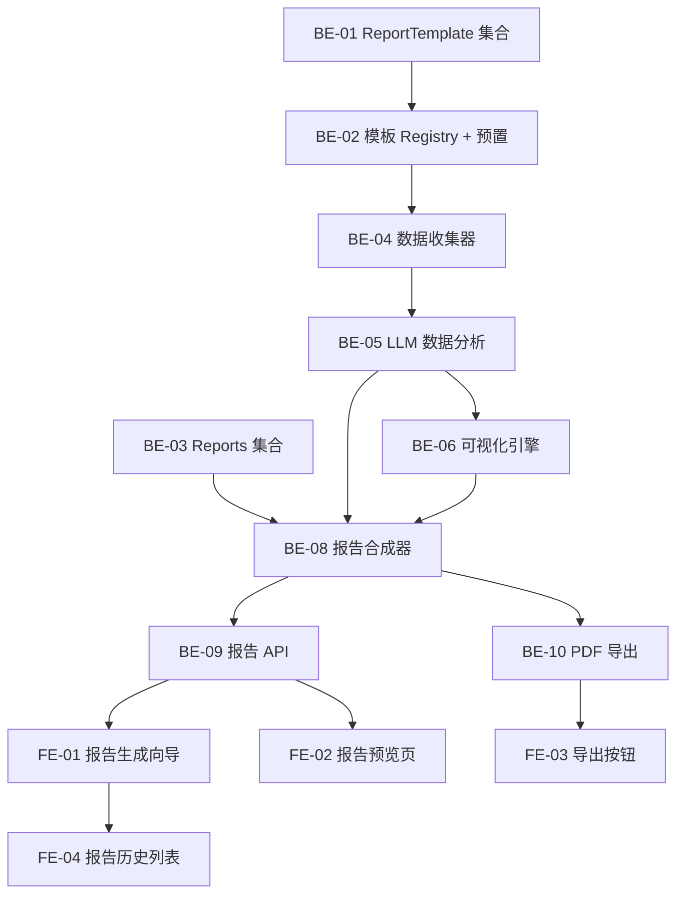

# Sprint 8 — 多角色报告生成引擎（约 3 周）

> 目标：构建 **ReportEngine** — 基于用户对话历史 + RAG 知识库 + 评估数据，按不同角色模板生成带图表的结构化报告。
>
> 核心理念：报告不是从零搜索（DeepTutor 方式），而是 **基于用户已积累的数据** 生成个性化分析。
>
> DeepTutor 复用：ReportingAgent 的章节编排逻辑 + CitationManager 引用管理 + code_executor 图表生成。
>
> 前置依赖：Sprint 5（StreamBus）+ Sprint 7（UnifiedContext + Memory）建议完成，但非强制。

## 概览

| Epic | Story 数 | 预估总工时 | 说明 |
|------|----------|-----------|------|
| 角色模板系统 | 3 | 8h | Payload 集合 + 模板 Registry + 预置模板 |
| 报告数据收集器 | 3 | 10h | 从 ChatMessages/Evaluations/Sources 收集 + LLM 分析 |
| 可视化引擎 | 3 | 10h | code_executor 图表 + 前端渲染 |
| 报告合成 + 导出 | 4 | 14h | 章节编排 + 引用管理 + PDF/Markdown 导出 |
| 前端报告中心 | 4 | 14h | 报告生成 UI + 模板选择 + 报告预览 + 历史 |
| **合计** | **17** | **56h** |

## 质量门禁

| # | 检查项 | 判定依据 |
|---|--------|----------|
| G1 | **模块归属** | 后端：`engine_v2/report/`（新建）；Payload 集合：`collections/ReportTemplates.ts` + `collections/Reports.ts`；前端：`features/engine/report/`（新建） |
| G2 | **文件注释** | Python §1.2；Payload §2.1；前端 §3.12 / §3.25 |
| G3 | **LlamaIndex 对齐** | 数据收集通过 LlamaIndex evaluator 获取评估分数；RAG 检索通过已有 query engine |
| G4 | **DeepTutor 复用** | 章节编排参考 `reporting_agent.py`；引用管理参考 `CitationManager`；图表生成参考 `code_executor.py` |

## 依赖图



---

## Epic: 角色模板系统 (P0)

> 角色模板决定了报告的结构、分析维度和可视化类型。Payload CMS 管理模板，支持预置 + 自定义。

### [S8-BE-01] ReportTemplates Payload 集合

**类型**: Backend (Payload) · **优先级**: P0 · **预估**: 3h

**描述**: 新建 ReportTemplates 集合，存储角色模板定义。每个模板定义：角色名称、报告结构、分析维度、图表类型。

**数据模型**:

```
ReportTemplates (slug: 'report-templates')
├── name         → text (e.g. "市场研究报告")
├── slug         → text (e.g. "market-research")
├── role         → select: analyst | student | researcher | consultant | custom
├── description  → textarea (模板描述)
├── icon         → text (emoji, e.g. "📊")
├── structure    → json ({
│     sections: [
│       { title: "Executive Summary", type: "summary", instruction: "..." },
│       { title: "Market Trends", type: "analysis", charts: ["line", "bar"] },
│       { title: "Risk Assessment", type: "evaluation", charts: ["radar"] },
│       { title: "Recommendations", type: "conclusion" }
│     ]
│   })
├── dataSources  → json (["chat_history", "evaluations", "sources", "rag_search"])
├── chartConfig  → json ({
│     default_charts: ["radar", "line", "bar", "heatmap"],
│     color_scheme: "professional" | "academic" | "minimal"
│   })
├── promptOverrides → json ({
│     system: "You are a senior market analyst...",
│     section_style: "data-driven, with specific numbers and trends",
│     citation_style: "inline" | "footnote" | "endnote"
│   })
├── isBuiltin    → checkbox (预置模板不可删除)
├── createdAt / updatedAt
```

**验收标准**:
- [ ] 创建 `collections/ReportTemplates.ts`
- [ ] 字段完整（name, slug, role, structure, dataSources, chartConfig, promptOverrides）
- [ ] access：所有登录用户可读，admin 可写
- [ ] admin group：'Reports'
- [ ] G1 ✅ 在 `collections/`

**文件**: `collections/ReportTemplates.ts`, `payload.config.ts`

### [S8-BE-02] 模板 Registry + 预置模板 seed

**类型**: Backend · **优先级**: P0 · **预估**: 3h

**描述**: 创建模板 Registry 服务 + 预置 6 个角色模板。

**预置模板**:

| slug | 角色 | 报告名称 | 核心章节 |
|:---|:---|:---|:---|
| `market-research` | analyst | 市场研究报告 | Executive Summary → 市场趋势 → 数据分析 → 风险评估 → 投资建议 |
| `competitive-analysis` | analyst | 竞品分析报告 | 概述 → SWOT 矩阵 → 维度对比表 → 市场定位 → 建议 |
| `study-notes` | student | 学习笔记 | 概念梳理 → 公式总结 → 重点标注 → 薄弱点 → 练习建议 |
| `exam-prep` | student | 考前复习报告 | 知识覆盖率 → 重点章节 → 模拟题 → 认知深度分析 |
| `literature-review` | researcher | 文献综述 | 研究背景 → 方法对比 → 核心发现 → 研究空白 → 未来方向 |
| `consulting-brief` | consultant | 咨询简报 | 现状诊断 → 数据洞察 → 方案对比 → 实施路径 → 风险缓解 |

**验收标准**:
- [ ] 创建 `engine_v2/report/templates.py` — `TemplateRegistry` 类
- [ ] 创建 `seed/report-templates.ts` — 预置 6 个模板 seed 数据
- [ ] `TemplateRegistry.get(slug)` / `list_by_role(role)` / `get_structure(slug)`
- [ ] G1 ✅ 后端在 `engine_v2/report/`；seed 在 `seed/`

**依赖**: [S8-BE-01]
**文件**: `engine_v2/report/templates.py`, `seed/report-templates.ts`

### [S8-BE-03] Reports Payload 集合

**类型**: Backend (Payload) · **优先级**: P0 · **预估**: 2h

**描述**: 存储生成的报告实例。

**数据模型**:

```
Reports (slug: 'reports')
├── user         → relationship → users
├── template     → relationship → report-templates
├── title        → text (报告标题)
├── content      → textarea (完整 Markdown 内容)
├── sections     → json (各章节内容 + 元数据)
├── charts       → json (图表数据 + 图片路径)
├── dataSummary  → json (使用了哪些数据源、多少条对话、评估分数等)
├── bookIds      → json (关联的知识库)
├── sessionIds   → json (引用的聊天会话)
├── status       → select: generating | completed | failed
├── pdfUrl       → text (导出 PDF 路径)
├── createdAt / updatedAt
```

**验收标准**:
- [ ] 创建 `collections/Reports.ts`
- [ ] access：用户只能读写自己的报告
- [ ] admin group：'Reports'

**文件**: `collections/Reports.ts`, `payload.config.ts`

---

## Epic: 报告数据收集器 (P0)

> 从用户已有的数据（对话、评估、引用源）中收集和分析，作为报告的输入。这是与 DeepTutor「从零搜索」的核心区别。

### [S8-BE-04] 多源数据收集器

**类型**: Backend · **优先级**: P0 · **预估**: 4h

**描述**: 根据报告模板的 `dataSources` 配置，从 Payload 各集合自动收集数据。

**验收标准**:
- [ ] 创建 `engine_v2/report/collector.py`
- [ ] `ReportDataCollector` 类，支持以下数据源：
  - `chat_history` → 从 ChatMessages 拉取指定 session 的对话（按 sessionIds 过滤）
  - `evaluations` → 从 Evaluations 拉取评估分数（5 维 + 问题深度）
  - `sources` → 从 Queries.sources 提取引用源统计（章节覆盖、频次）
  - `rag_search` → 执行新的 RAG 检索补充数据（可选）
  - `questions` → 从 question_gen 的已生成问题拉取
- [ ] `collect(template, user_id, book_ids, session_ids) -> ReportData`
- [ ] `ReportData` dataclass：conversations, evaluation_scores, source_stats, search_results, questions
- [ ] G1 ✅ 在 `engine_v2/report/`

**文件**: `engine_v2/report/collector.py`

### [S8-BE-05] LLM 数据分析器

**类型**: Backend · **优先级**: P0 · **预估**: 3h

**描述**: 对收集到的原始数据进行 LLM 分析，提取洞察和结论。

**验收标准**:
- [ ] 创建 `engine_v2/report/analyzer.py`
- [ ] `analyze_conversations(messages) -> ConversationInsights` — 提取对话主题、关键问题、知识空白
- [ ] `analyze_evaluations(scores) -> EvaluationInsights` — 5 维分数趋势、瓶颈识别、改善建议
- [ ] `analyze_sources(source_stats) -> CoverageInsights` — 章节覆盖率、热点章节、冷门章节
- [ ] 每个分析函数使用角色模板的 `promptOverrides.system` 定制分析风格
- [ ] G3 ✅ 评估分数通过 LlamaIndex evaluator 获取

**依赖**: [S8-BE-04]
**文件**: `engine_v2/report/analyzer.py`

### [S8-BE-06] 统计计算器（非 LLM）

**类型**: Backend · **优先级**: P1 · **预估**: 3h

**描述**: 纯计算统计指标，不依赖 LLM。为图表提供数据。

**验收标准**:
- [ ] 创建 `engine_v2/report/stats.py`
- [ ] `calc_evaluation_trends(evaluations) -> TimeSeriesData` — 5 维评估分数随时间变化
- [ ] `calc_chapter_coverage(sources, toc) -> CoverageMatrix` — 章节 × 对话次数 热力图数据
- [ ] `calc_depth_distribution(depths) -> DistributionData` — surface/understanding/synthesis 分布
- [ ] `calc_topic_frequency(messages) -> TopicRanking` — 对话主题频率排名
- [ ] `calc_session_stats(sessions) -> SessionSummary` — 总对话数/问题数/时间跨度

**依赖**: [S8-BE-04]
**文件**: `engine_v2/report/stats.py`

---

## Epic: 可视化引擎 (P1)

> 安全执行 Python 生成 matplotlib/seaborn 图表。复用 DeepTutor 的 `code_executor` 沙箱机制。

### [S8-BE-07] 图表生成器（code_executor 集成）

**类型**: Backend · **优先级**: P1 · **预估**: 4h

**描述**: 基于统计数据，用 code_executor 安全执行 matplotlib/seaborn 生成图表。

**验收标准**:
- [ ] 创建 `engine_v2/report/charts.py`
- [ ] `ChartGenerator` 类，内置图表模板：
  - `radar_chart(dimensions, scores)` → 5 维评估雷达图
  - `line_chart(time_series)` → 趋势折线图
  - `bar_chart(categories, values)` → 对比柱状图
  - `heatmap(matrix)` → 章节覆盖热力图
  - `pie_chart(distribution)` → 分布饼图
  - `table(rows, columns)` → 数据表格（Markdown）
- [ ] 每种图表有对应的 Python 代码模板（f-string 填充数据）
- [ ] 通过 `code_executor.run_code()` 安全执行，生成 PNG 图片
- [ ] 图片保存到 `data/reports/{report_id}/charts/`
- [ ] G4 ✅ 复用 DeepTutor code_executor 沙箱

**参考**: `deeptutor/tools/code_executor.py` (485行)
**文件**: `engine_v2/report/charts.py`

### [S8-BE-08] 图表样式主题

**类型**: Backend · **优先级**: P2 · **预估**: 2h

**描述**: 支持不同的图表颜色主题，与角色模板的 `chartConfig.color_scheme` 对应。

**验收标准**:
- [ ] `professional` — 商务蓝灰色系（分析师）
- [ ] `academic` — 学术经典配色（研究员）
- [ ] `minimal` — 简约黑白（咨询师）
- [ ] `vibrant` — 活力彩色（学生）
- [ ] 每个主题定义 primary/secondary/accent/background 颜色

**依赖**: [S8-BE-07]
**文件**: `engine_v2/report/charts.py`

### [S8-FE-05] 前端图表渲染（Recharts）

**类型**: Frontend · **优先级**: P1 · **预估**: 4h

**描述**: 前端使用 Recharts 渲染交互式图表（报告预览模式），与后端生成的静态 PNG 图表（PDF 导出模式）双轨并行。

**验收标准**:
- [ ] 创建 `features/engine/report/components/charts/` 目录
- [ ] `RadarChart` — 5 维评估雷达图（交互式 tooltip）
- [ ] `TrendChart` — 趋势折线图（可 hover 查看数值）
- [ ] `CoverageHeatmap` — 章节覆盖热力图
- [ ] `ComparisonTable` — 对比表格组件
- [ ] 数据格式与后端 `stats.py` 对齐

**依赖**: [S8-BE-06]
**文件**: `features/engine/report/components/charts/`

---

## Epic: 报告合成 + 导出 (P0)

> 章节编排逻辑参考 DeepTutor `ReportingAgent`：大纲生成 → 逐章撰写 → 引用管理 → 拼接。但数据来源改为用户已有数据。

### [S8-BE-09] 报告合成器

**类型**: Backend · **优先级**: P0 · **预估**: 6h

**描述**: 基于模板结构 + 分析洞察 + 图表，逐章节生成报告 Markdown。

**验收标准**:
- [ ] 创建 `engine_v2/report/composer.py`
- [ ] `ReportComposer` 类：
  - `compose(template, insights, charts, stats) -> Report`
  - 按模板 `structure.sections` 逐章节生成
  - 每个章节根据 `type` 选择生成策略：
    - `summary` → LLM 综合摘要
    - `analysis` → LLM 分析 + 嵌入图表
    - `evaluation` → 评估数据 + 雷达图
    - `comparison` → 对比表格 + 柱状图
    - `conclusion` → LLM 结论 + 建议
  - 引用管理：每个结论溯源到具体对话/引用源
- [ ] 通过 StreamBus 发射生成进度事件
- [ ] 结果写入 Reports 集合
- [ ] G4 ✅ 章节编排参考 DeepTutor ReportingAgent

**参考**: `deeptutor/agents/research/agents/reporting_agent.py` (1652行，核心逻辑)
**文件**: `engine_v2/report/composer.py`

### [S8-BE-10] 引用管理器

**类型**: Backend · **优先级**: P1 · **预估**: 2h

**描述**: 管理报告中的引用。与聊天中的 CitationChip 引用不同，报告引用需要标注 来源类型（对话/教科书/评估）。

**验收标准**:
- [ ] 创建 `engine_v2/report/citations.py`
- [ ] `ReportCitationManager` 类：
  - `add_chat_citation(session_id, message_id)` → `[C1]` 对话引用
  - `add_source_citation(book_id, page, snippet)` → `[S1]` 教科书引用
  - `add_eval_citation(evaluation_id, dimension)` → `[E1]` 评估数据引用
- [ ] `generate_references() -> str` — 生成分类 References 列表
- [ ] G4 ✅ 参考 DeepTutor CitationManager

**参考**: `deeptutor/agents/research/utils/citation_manager.py`
**文件**: `engine_v2/report/citations.py`

### [S8-BE-11] 报告生成 API

**类型**: Backend · **优先级**: P0 · **预估**: 3h

**描述**: 报告生成 + 查询 + 下载 API 端点。

**验收标准**:
- [ ] 创建 `engine_v2/api/routes/report.py`
- [ ] `POST /engine/report/generate` — SSE 流式输出（StreamEvent 格式），包含进度 + 逐章节内容
- [ ] `GET /engine/report/{id}` — 获取报告详情
- [ ] `GET /engine/report/list` — 当前用户的报告列表
- [ ] `GET /engine/report/{id}/download` — 下载 PDF/Markdown
- [ ] `GET /engine/report/templates` — 获取可用模板列表
- [ ] G1 ✅ 在 `engine_v2/api/routes/`

**依赖**: [S8-BE-09]
**文件**: `engine_v2/api/routes/report.py`

### [S8-BE-12] PDF 导出

**类型**: Backend · **优先级**: P2 · **预估**: 3h

**描述**: Markdown 报告转 PDF，嵌入图表图片。

**验收标准**:
- [ ] 创建 `engine_v2/report/export.py`
- [ ] `export_pdf(report_id) -> Path` — Markdown → PDF（使用 `weasyprint` 或 `pdfkit`）
- [ ] 嵌入图表 PNG 图片
- [ ] 支持封面页（报告标题 + 日期 + 角色 + 知识库列表）
- [ ] 支持页眉页脚
- [ ] PDF 保存到 `data/reports/{report_id}/report.pdf`

**依赖**: [S8-BE-09], [S8-BE-07]
**文件**: `engine_v2/report/export.py`

---

## Epic: 前端报告中心 (P1)

### [S8-FE-01] 报告生成向导

**类型**: Frontend · **优先级**: P1 · **预估**: 4h

**描述**: 三步向导：① 选择角色/模板 → ② 选择数据范围（书籍、会话、时间段）→ ③ 预览配置并生成。

**验收标准**:
- [ ] 创建 `features/engine/report/components/ReportWizard.tsx`
- [ ] Step 1: 角色/模板卡片选择（6 个预置 + 自定义）
- [ ] Step 2: 数据范围配置（书籍多选 + 会话多选 + 时间范围）
- [ ] Step 3: 预览配置摘要 + "Generate Report" 按钮
- [ ] 生成中展示 StreamEvent 进度（复用 ThinkingProcessPanel）
- [ ] G1 ✅ 在 `features/engine/report/components/`

**依赖**: [S8-BE-11]
**文件**: `features/engine/report/components/ReportWizard.tsx`

### [S8-FE-02] 报告预览页

**类型**: Frontend · **优先级**: P1 · **预估**: 4h

**描述**: 完整报告预览，支持 Markdown 渲染 + 交互式图表 + 引用点击跳转。

**验收标准**:
- [ ] 创建 `features/engine/report/components/ReportViewer.tsx`
- [ ] 左侧目录大纲（可折叠，点击跳转章节）
- [ ] 右侧报告内容（Markdown + KaTeX + 图表组件）
- [ ] 引用 `[C1]` `[S1]` `[E1]` 可点击，弹出引用详情 popover
- [ ] 图表区域渲染 Recharts 交互式图表（而非静态 PNG）
- [ ] G1 ✅ 在 `features/engine/report/components/`

**依赖**: [S8-FE-05], [S8-BE-11]
**文件**: `features/engine/report/components/ReportViewer.tsx`

### [S8-FE-03] 导出按钮 + 下载

**类型**: Frontend · **优先级**: P2 · **预估**: 2h

**描述**: 报告预览页顶部工具栏：导出 PDF / 导出 Markdown / 复制链接。

**验收标准**:
- [ ] 工具栏按钮：📄 PDF · 📝 Markdown · 🔗 复制链接
- [ ] PDF 下载调用 `/engine/report/{id}/download?format=pdf`
- [ ] Markdown 下载调用 `/engine/report/{id}/download?format=md`

**依赖**: [S8-BE-12]
**文件**: `features/engine/report/components/ReportViewer.tsx`

### [S8-FE-04] 报告历史列表页

**类型**: Frontend · **优先级**: P1 · **预估**: 4h

**描述**: 报告中心主页，展示用户生成的所有报告。

**验收标准**:
- [ ] 创建 `features/engine/report/components/ReportListPage.tsx`
- [ ] 报告卡片网格：标题 + 模板图标 + 日期 + 状态（generating/completed）
- [ ] 筛选：按角色/模板/时间 筛选
- [ ] 点击进入 ReportViewer
- [ ] "New Report" 按钮打开 ReportWizard
- [ ] G1 ✅ 在 `features/engine/report/components/`

**依赖**: [S8-BE-11]
**文件**: `features/engine/report/components/ReportListPage.tsx`

---

## 模块文件结构

```
engine_v2/report/                    ← 新建模块
├── __init__.py
├── templates.py                     ← 模板 Registry
├── collector.py                     ← 多源数据收集
├── analyzer.py                      ← LLM 数据分析
├── stats.py                         ← 统计计算（非 LLM）
├── charts.py                        ← 图表生成（code_executor）
├── composer.py                      ← 报告合成器
├── citations.py                     ← 引用管理
└── export.py                        ← PDF 导出

engine_v2/api/routes/report.py       ← API 端点

collections/ReportTemplates.ts       ← 模板集合
collections/Reports.ts               ← 报告实例集合
seed/report-templates.ts             ← 预置模板

features/engine/report/              ← 前端模块
├── index.ts
├── types.ts
├── api.ts
└── components/
    ├── ReportWizard.tsx             ← 三步生成向导
    ├── ReportViewer.tsx             ← 报告预览
    ├── ReportListPage.tsx           ← 历史列表
    └── charts/
        ├── RadarChart.tsx
        ├── TrendChart.tsx
        ├── CoverageHeatmap.tsx
        └── ComparisonTable.tsx
```
