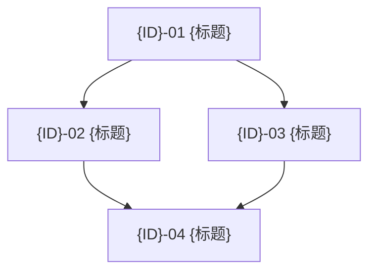

# Sprint 模板

> 本文件是 sprint 文件的**格式规范**，所有新建 sprint 文件必须严格遵守此结构。
> 放置路径：`roadmap/{序号}-sprint-{id}.md`

---

## 模板正文

````markdown
# Sprint {ID} — {标题}

> 目标：{一句话目标描述}
>
> 前置条件：{前置 Sprint 及其状态}
> **状态**: ❌ 0/{total_stories}

## 概览

| Task | Story 数 | 预估总工时 | 说明 |
|------|----------|-----------|------|
| T1 {任务组名} | {n} | {x}h | {一句话说明} |
| T2 {任务组名} | {n} | {x}h | {一句话说明} |
| T3 {任务组名} | {n} | {x}h | {一句话说明} |
| **合计** | **{total}** | **{total_hours}h** |

## 质量门禁

| # | 检查项 | 判定依据 |
|---|--------|----------|
| G1 | {检查维度} | {具体判定标准} |
| G2 | {检查维度} | {具体判定标准} |
| G3 | 不破坏现有功能 | {向后兼容说明} |
| G4 | 命名对齐 | {命名规则说明} |

---

## [{ID}-T1] {任务组标题}

### [{ID}-01] {Story 标题}

**类型**: Backend / Frontend / Data / QA / DevOps
**Epic**: {所属功能模块}
**User Story**: {对应的用户故事 ID 和标题}
**优先级**: P0 / P1 / P2
**预估**: {x}h

#### 描述

{2-5 句话说明 why + what。为什么需要这个改动，做什么。}

#### Schema 变更 / 实现方案

{如有数据模型或技术方案变更，用代码块展示}

```typescript
// 示例: 字段级 Schema 变更
{
  name: 'fieldName',
  type: 'select',
  required: true,
  options: [
    { label: 'Option A', value: 'a' },
    { label: 'Option B', value: 'b' },
  ],
  index: true,
}
```

#### 验收标准

- [ ] {具体可验证的条件 1}
- [ ] {具体可验证的条件 2}
- [ ] {具体可验证的条件 3}
- [ ] G{n} ✅ {对应质量门禁编号}

#### 依赖

- [{ID}-xx] {前置 story 标题}
- {或 "无"}

#### 文件

- `path/to/file.ts` (新增 / 改造)
- `path/to/another.ts` (改造)

#### 检查命令

```bash
# 示例
npx tsc --noEmit
curl -s http://localhost:8001/engine/health | jq .
```

---

### [{ID}-02] {Story 标题}

{... 同上格式 ...}

---

## [{ID}-T2] {任务组标题}

### [{ID}-03] {Story 标题}

{... 同上格式 ...}

---

## 模块文件变更

```
project-root/
├── path/to/
│   ├── fileA.ts                    ← 改造 (说明)
│   └── fileB.ts                    ← 新增
├── path/to/
│   ├── fileC.ts                    ← 新增
│   └── fileD.ts                    ← 改造 (说明)
└── config.ts                       ← 改造 (注册新模块)
```

## 依赖图



> 箭头方向: A → B = "B 依赖 A"

## 执行顺序

| Phase | Tasks | Est. Time | 前置 | 备注 |
|-------|-------|-----------|------|------|
| **Phase 1** | {ID}-01, {ID}-02 | {x}h | 无 | 可并行 |
| **Phase 2** | {ID}-03 | {x}h | Phase 1 | 依赖 {说明} |
| **Phase 3** | {ID}-04, {ID}-05 | {x}h | Phase 2 | 收尾集成 |
````

---

## 格式规则

### Story 必填字段

| 字段 | 说明 | 示例 |
|------|------|------|
| **类型** | Backend / Frontend / Data / QA / DevOps | `Backend (Payload)` |
| **Epic** | 所属功能模块 | `用户管理` |
| **User Story** | PRD 中的用户故事 | `US-001 用户注册` |
| **优先级** | P0 (必做) / P1 (重要) / P2 (可选) | `P0` |
| **预估** | 小时数 | `2h` |

### Story 必填段落

| 段落 | 何时可省略 |
|------|-----------|
| `#### 描述` | **不可省略** — 至少 2 句话 |
| `#### Schema 变更 / 实现方案` | 无数据模型或技术方案变更时可省略 |
| `#### 验收标准` | **不可省略** — 至少 3 个 checkbox |
| `#### 依赖` | 无依赖时写 `- 无` |
| `#### 文件` | **不可省略** — 列出所有新增/改造文件 |
| `#### 检查命令` | 无明确检查命令时可省略 |

### Sprint 必填段落

| 段落 | 何时可省略 |
|------|-----------|
| `## 概览` | **不可省略** |
| `## 质量门禁` | Sprint 内 Story ≤ 3 个时可省略 |
| `## 模块文件变更` | Sprint 内 Story ≤ 3 个时可省略 |
| `## 依赖图` | Story 间无依赖时可省略 |
| `## 执行顺序` | **不可省略** |

### 状态标记

| 标记 | 含义 |
|------|------|
| `❌ 0/N` | 未开始 |
| `🚧 x/N` | 进行中 |
| `✅ N/N` | 已完成 (同时更新 `已完成` 日期) |
| `⏸️` | 暂停 / 后续阶段 |

### 命名规范

- Sprint 文件: `{序号}-sprint-{id}.md` (如 `30-sprint-g1-global-template.md`)
- Story ID: `[{SprintID}-{序号}]` (如 `[G1-01]`, `[GO-MU-04]`)
- Task 组 ID: `[{SprintID}-T{序号}]` (如 `[G1-T1]`, `[GO-MU-T2]`)
