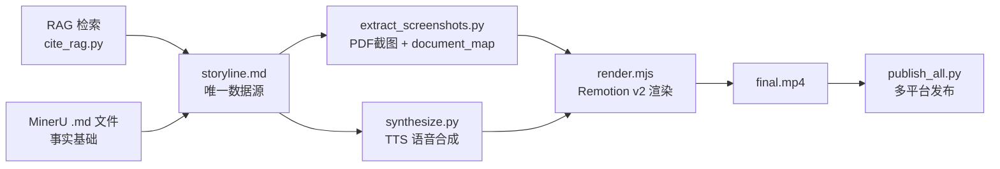

# 短视频生产工作流 v2

从 RAG 知识库 + MinerU 文档截图，生成「截图高亮+直接解释」风格的横屏短视频。

**v2 vs v1 核心变化**:
- **证据先行** — 台词先读截图数据、再给解读（不是先下结论再找证据）
- **截图高亮引导视线** — 截图+高亮框已经在做指向工作，台词不需要「你看这页/原文写了」
- **一引用一slide** — 每个 slide 只有一张截图，避免多图切换异常
- **MinerU .md 文件为事实基础** — 写台词时读本地 `.md` 文件（省 token），不看 PNG 图片
- **简化 Slide 类型** — 只有 `cover` / `argument` / `citation` / `preview`，废弃 `highlight` / `evidence`

## 核心理念

> **证据先行 > 解释清楚 > 引用准确 > 格式约束**
> 
> 本频道的风格是「截图高亮+直接解释」，不是「我先下结论再找证据」。
> 截图和高亮框已经在引导观众视线，台词不需要再说「你看这页/原文写了」。
> 台词顺序：**先读出截图中的关键数据 → 再给解读/结论**。
> 唯一不能妥协的是：**每句事实断言必须有引用支撑（无引用不台词）**。

### 六大铁律

| # | 规则 | 指标目标 |
| - | ---- | -------- |
| 1 | **3 秒钩子** — 前 3 秒必须抛出痛点问题或反直觉事实 | 3s播放率 ≥ 50% |
| 2 | **逻辑链完整** — 每个判断有因果，不跳步不断链 | 完播率 ≥ 20% |
| 3 | **无引用不台词** — 每句事实断言必须有引用支撑，没有引用写「待查」 | 编造数据 = 0 |
| 4 | **台词覆盖引用** — 引用里的关键数字/条件/时间窗不能漏 | 引用覆盖率 100% |
| 5 | **证据先行** — 先读截图数据，再给解读结论 | 100% 遵守 |
| 6 | **禁止重复** — 同一句话/观点/数据点不得跨 slide 重复 | 跨页重复 = 0 |
| 7 | **一引用一slide** — 每个 slide 只有一张截图，多引用拆成多个 slide | 多图切换 = 0 |
| 8 | **无指向废话** — 禁止「你看/原文写了/这页明确」，截图高亮已引导视线 | 指向语 = 0 |
| 9 | **台词匹配画面** — 台词只能描述当前屏幕上展示的截图内容，不能说图上没有的东西 | 音画不匹配 = 0 |
| 10 | **台词只管当前 slide** — 禁止引用其他 slide 内容、预告后续视频、或用「后面会讲/下面拆」等跨页引导语。每条台词独立服务当前画面 | 跨页引导语 = 0 |

**技术栈**: Remotion v2 (React + TypeScript) + Edge TTS（默认 zh-CN-YunyangNeural）+ MinerU (PyMuPDF)

```
定题 → 系列规划 → RAG 数据探索 → storyline.md(引用+台词)
  → 截图提取 (extract_screenshots.py → 回写 bbox/pageSize 到 storyline.md)
  → TTS → Remotion v2 渲染 (直接读 storyline.md) → final.mp4
```

> **storyline.md 是唯一数据源**。`extract_screenshots.py` 不再生成 `document_map.json`，
> 而是将 `**bbox**` 和 `**pageSize**` 直接回写到 `![截图]` 行之后。
> `render.mjs` 从 storyline.md 直接解析所有数据（台词、截图路径、bbox 坐标）。

---

## Step 0: 定题

Agent 收到主题后，确认参数：

| 参数 | 默认值 | 说明 |
| ---- | ------ | ---- |
| 画面比例 | 16:9 landscape | 横屏视频号 |
| 时长 | **不设硬上限，逻辑链完整优先** | 参考 60-120 秒 |
| slides 数 | **8-12 张** | 含封面和结尾 |
| 受众 | 华人海外生活 | 内容定位 |
| TTS | Edge TTS (`zh-CN-YunyangNeural`) | 备选: 火山引擎咪仔 / CosyVoice / 腾讯云 |
| 频道名 | **海外生活指南** | 所有 storyline 作者字段必须使用 |
| 主题色 | gold | 可选: ocean, forest, ruby, arctic, dusk, ember |

**痛点驱动选题**：列 4-6 个受众最关心的问题 → 不预设答案 → RAG 数据决定内容。

---

## Step 0.3: 主题分层研究 → `{slug}-research.md`

**执行者**: Agent

> 💡 先定范围，再分层（5 步逻辑链：数据→问题→原因→风险→方案），再探数据，最后拆视频。

📖 **详细规范**：[research-guide.md](references/research-guide.md)

### ⏭️ 跳过条件

> 如果视频内容**全部来自一个已知 MinerU 页面**（如 `immigrate-canada` 总览页），
> 直接读本地 `.md` 文件写 storyline，**跳过 RAG 检索**。
>
> 判断标准：所有引用指向同一个 URL → 不需要跨源搜索 → 跳过本步。

### 执行 RAG 检索（多源视频）

```powershell
# // turbo
# cwd: textbook-rag/
uv run .agent/workflows/short-video/scripts/cite_rag.py `
  --queries data/short-videos/{slug}/{slug}-research.md `
  --collection ca_federal `
  --output data/short-videos/{slug}/sources.json
```

### 完成条件

**多源视频**:
- `{slug}-research.md` 存在，含查询表 + 5 步逻辑链
- `sources.json` 存在（cite_rag.py 产出）
- 每个数据点有 `.md` 路径 + 完整 URL 来源

**单源视频（跳过 RAG）**:
- 已确认所有内容来自同一个 MinerU 页面
- 直接在 storyline.md 中写 `**本地**` 路径即可

---

## Step 0.5: 系列规划（大主题必须）

**触发条件**: 主题信息点 > 3 个，单集逻辑链无法完整覆盖

### 拆分原则

1. **每集 1 个核心问题** — 观众看完能记住 1 件事
2. **每集独立成篇** — 不看其他集也能理解
3. **集尾钩子** — 预告下集内容，引导关注
4. **命名规范**: `{slug}-ep{N}`

---

## Step 2: storyline.md — 唯一数据源

> ⚠️ **storyline.md 是整条视频的唯一数据源 (Single Source of Truth)。**
> 所有数据必须来自 Step 0.3 的 sources.json + MinerU 本地 `.md` 文件。

📖 **v2 格式规范**：[storyline-spec-v2.md](remotion-v2/references/storyline-spec-v2.md)

### v2 Slide 类型

| type | 用途 | 说明 |
|------|------|------|
| `cover` | 封面 | `**副标题**`, `**钩子数字**`, `**钩子单位**`，**纯标题页不含引用和截图** |
| `argument` | 论点页 | 截图模式：一个引用+一组台词；**表格模式：markdown 表格+台词，无截图** |
| `citation` | 引用来源 | 4 列表格（中文名/英文名/说明/链接），展示给观众 |
| `preview` | 互动收尾 | `**内容**`，下期预告 |

> ⚠️ `highlight` 和 `evidence` 类型已废弃。总结性内容直接放在最后一个 `argument` 的台词末尾。
> ⚠️ **截图模式：一个 slide 只能有一组引用+台词**。多引用必须拆成多个独立 slide。
> ⚠️ **表格模式：不需要截图/引用块，直接写 markdown 表格**。适用于介绍类/总览类视频。

### v2 引用块格式（截图模式）

每个引用必须包含 4 个字段（v1 没有 `**本地**`）：

```markdown
**引用 1**: "从RAG源文件逐字复制的英文原文"
**来源**: https://official-url
**本地**: federal-ircc/en/immigration-refugees-citizenship/path/to/file

**台词**:
[直接读出截图中的关键数据]。
[用大白话解读/给判断]。
```

> ⚠️ `**本地**` 字段指向 `mineru_output/` 下的本地文件夹路径，用于 `extract_screenshots.py` 定位 PDF。
> `![截图]` 行在 Step 3 后由 `extract_screenshots.py` 自动生成/更新，初稿可留空或写占位符。

### v2 表格模式（介绍类/总览类视频）

当视频内容是项目介绍、分类对比、清单总览等，用 **表格模式** 替代截图：

```markdown
## [argument] slide 标题

**章节**: 章节名

| 中文名 | 英文名 | 缩写 | 开始日期 | 结束日期 | 状态 |
| ------ | ------ | ---- | -------- | -------- | ---- |
| 快速通道 | Express Entry | EE | 2015-01-01 | — | 开放 |

**台词**:
[解释表格内容]。
```

#### 表格列名规范

| 列名 | 说明 | 必选 |
| ---- | ---- | ---- |
| 中文名 | 项目中文名 | 是 |
| 英文名 | 项目英文全称（官方名称，不缩写） | 是 |
| 缩写 | 常用缩写（如 EE/PNP/AIP），无缩写写 — | 是 |
| 开始日期 | 项目启动日期，格式 YYYY-MM-DD 或 YYYY，不确定写 — | 是 |
| 结束日期 | 暂停/关闭日期，格式同上，仍开放写 — | 按需 |
| 状态 | 开放/暂停/关闭，纯文字不加 emoji | 是 |
| 分类 | 项目所属大类（如工作类/地区类） | 按需 |

> ⚠️ **两表字段名统一** — 同一视频内多个表格，共用列名（中文名/英文名/缩写/开始日期/结束日期/状态）。
> ⚠️ **不加 emoji** — 状态列写纯文字（开放/暂停/关闭），不用 ✅ ⏸ ❌。
> ⚠️ **英文名写全称** — 如 `Provincial Nominee Program` 而非 `PNP`，缩写单独一列。
> ⚠️ **日期格式统一** — YYYY-MM-DD（精确到日）或 YYYY-MM（精确到月）或 YYYY（仅知年份），不用中文格式。
> ⚠️ **同类不独占 slide** — 介绍类视频把多个类别合并到一张大表，不要每个类别单独一页。
> ⚠️ **不需要总结 slide** — 介绍类视频不需要「对号入座」总结页，表格本身就是总结。

#### render.mjs 路由逻辑

- 有 `cropImages`（截图）→ `EvidenceSlide`
- 无 `cropImages` 且有 `table`（表格）→ `ContentSlide`（自适应密度逐行 fade in）
- ContentSlide 自动缩字号适配：normal → dense → xDense → xxDense → xxxDense

### ⭐ 台词写作流程（关键变化）

> **v2 规则：写台词时读 MinerU 的 `.md` 文件，不看 PNG 图片。**
> **v2.1 规则：先通写全篇台词，再分配到各 slide。编辑任何 slide 台词后，必须重读全篇检查连贯性。**

#### 通写优先（防止改了一处忘改关联处）

> ⚠️ **台词必须作为一个整体来写和改，不能逐 slide 孤立编辑。**
>
> 痛点：逐 slide 改台词容易断链 — 前面铺垫了「三条路」，后面改成了「两种情况」，但忘了回去改铺垫。

**初稿流程**:
1. 读完所有 MinerU `.md` 源文件，提取全部数据点
2. **先写一份连贯的完整台词稿**（不分 slide，像写演讲稿一样通篇写完）
3. 确认逻辑链完整、上下文衔接自然后，再按引用拆分到各 slide

**编辑流程**:
1. 改任何一个 slide 的台词后，**必须从头到尾重读一遍全篇台词**
2. 检查改动是否影响了其他 slide 的铺垫/承接/措辞
3. 如果改了概念名称、分类方式、数字等，**全文搜索替换**确保一致

#### 数据来源

1. 找到引用对应的 MinerU `.md` 源文件：
   ```
   data/mineru_output/{**本地**字段路径}/{最后一段同名}/auto/{最后一段}.md
   ```
   例如 `**本地**: federal-ircc/en/immigration-refugees-citizenship/services/immigrate-canada/atlantic-immigration`
   → 读取 `data/mineru_output/federal-ircc/en/.../atlantic-immigration/atlantic-immigration/auto/atlantic-immigration.md`

2. 从 `.md` 文件中提取关键数据点
3. 写台词时遵循 **证据先行** 风格：读 → 解读（截图高亮已引导视线，台词不用「指」）
4. 确保台词充分覆盖引用内容（关键数字/条件/时间窗不能漏）

### 台词风格对照

| ❌ 不要这样 | ✅ 这样写 |
|---|---|
| "你看这页，上面写了2026年1月起暂停。" | "创业签证，2026年1月1日起暂停。这条路走不通了。" |
| "原文写的很清楚，TEER 0和1要CLB 7。" | "TEER 0和1是管理和专业岗，要CLB 7，对应雅思四项6分。" |
| "年报里明确写了，EE底下管着三个子项目" | "EE底下管着FSW、FSTP、CEC三个子项目。" |

### 完成条件

- `storyline.md` 存在且格式合规
- 第一页是 `[cover]`，**纯标题页不含引用和截图**，含 3 秒钩子（≤ 3 句台词）
- **每个 slide 只有一组引用+台词**（多引用已拆成独立 slide）
- **所有数字/日期/费用来自 MinerU `.md` 源文件原文**
- 每个引用块有 `**引用**` + `**来源**` + `**本地**`
- 每页有 `**台词**`（证据先行风格，无指向性废话）
- 台词充分覆盖引用内容
- **全篇台词连贯性通过**（从头到尾读一遍，逻辑链无断裂、概念/数字/分类前后一致）
- `[citation]` 引用来源 slide 存在（`[preview]` 之前）
- slides ≤ 12（不含引用来源页）

---

## Step 2.5: 硬核度审计 (Quality Gate)

**执行者**: Agent 自检

> **核心问题**: 台词是在**直接解释截图内容**还是在**赞美截图本身**？证据先行了吗？

### v2 审计清单

- [ ] **一引用一slide？**（每个 slide 只有一组引用+台词？多引用已拆成独立 slide？）
- [ ] **cover 无截图？**（封面是纯标题页，不含引用和截图？）
- [ ] **证据先行？**（台词先读数据、再给解读？）
- [ ] **无指向性废话？**（没有「你看这页/原文写的很清楚/上面写了」？）
- [ ] **无引用不台词？**（每句事实断言都有配套引用？）
- [ ] **台词充分覆盖引用？**（引用里的关键数字/时间窗/条件没漏？）
- [ ] **引用文本逐字来自 MinerU `.md`？**（不是凭记忆改写的？）
- [ ] **年份准确？**（引用数据的年份 vs 当前年份，台词标清了？）
- [ ] **概念首次出现有解释？**（EE、TEER、CLB 等缩写第一次提到时解释了？）
- [ ] 封面台词 ≤ 3 句？
- [ ] 口语化？（大声念一遍，像不像老顾问在聊天？）
- [ ] 没有跨 slide 重复的台词/观点？
- [ ] **全篇台词连贯性？**（从 cover 到 preview 通读一遍：铺垫→展开→收束逻辑链完整？概念名称/分类方式/数字前后一致？改过的 slide 与上下文衔接自然？）
- [ ] **`**本地**` 路径都指向真实存在的 MinerU 目录？**
- [ ] **台词只管当前 slide？**（没有「后面会讲/下面拆/下期讲」等跨页引导语？`[preview]` 除外）

### 判定等级

| 等级 | 条件 | 动作 |
| ---- | ---- | ---- |
| 🟢**硬核** | 全部通过 | 继续 Step 3 |
| 🟡**科普** | 1-2 项不及格 | 修改 storyline 后重新审计 |
| 🔴**水文** | 3+ 项不及格 | 回 Step 2 重写 |

---

## Step 3: 截图提取 → `pages/` + `document_map.json` ⭐ NEW

> ⚠️ **这是 v2 新增的关键步骤。** 从 MinerU 输出中自动提取 PDF 页面截图 + zoom 高亮目标。

```powershell
# // turbo
# cwd: textbook-rag/
uv run .agent/workflows/short-video/remotion-v2/scripts/extract_screenshots.py `
  --storyline data/short-videos/{slug}/storyline.md `
  --mineru-root data/mineru_output `
  --output data/short-videos/{slug}/pages
```

### 功能

1. 解析 storyline.md 中的引用（URL + 引用文本 + `**本地**` 路径）
2. 通过 `**本地**` 路径 → MinerU 输出目录映射
3. 在 `middle.json` 中搜索引用文本 → 定位 bbox (PDF points) + page_idx
4. 基于 section heading 做 section 级裁切（不是单 bbox）
5. **多栏布局侧面板检测** — 自动识别 canada.ca 等页面的 Status/Processing time 右侧浮动面板，纳入高亮范围
6. 用 PyMuPDF 渲染裁切区域为高清 PNG
7. 输出 `document_map.json`（页面图片路径 + zoom_targets 高亮坐标）

### 输出文件

```text
data/short-videos/{slug}/pages/
├── {url-slug}_p{page_idx}.png          # 整页截图
├── document_map.json                    # 页面+zoom目标元数据
```

### document_map.json 结构

```json
{
  "pages": {
    "page-key": {
      "image": "pages/xxx.png",
      "source_url": "https://...",
      "source_label": "IRCC",
      "page_size_pts": [960.0, 792.0],
      "image_size_px": [3334, 2750],
      "crop_y_offset": 0.0
    }
  },
  "zoom_targets": [
    {
      "slide_index": 1,
      "page_key": "page-key",
      "image": "pages/xxx.png",
      "bbox": [x1, y1, x2, y2],
      "section_bounds": [top, bottom],
      "page_size": [w, h],
      "label_zh": "章节标签",
      "trigger_line": 2,
      "citation_text": "引用文本前60字...",
      "content_type": "text",
      "source_label": "IRCC",
      "layout_source": "middle.json"
    }
  ]
}
```

### 完成条件

- `pages/` 目录存在，含 PNG 截图
- `pages/document_map.json` 存在
- storyline.md 中的 `![截图]` 路径已更新为实际 PNG 路径

---

## Step 5: 语音合成 → `narration/`

> 💡 **智能断句**：`synthesize.py` 内部已集成智能断句正则，自动按句末标点分拆。

### 方式A: TTS 自动合成（台词迭代阶段用，快速预览）

```powershell
# // turbo
# cwd: textbook-rag/
uv run .agent/workflows/short-video/scripts/synthesize.py `
  --storyline data/short-videos/{slug}/storyline.md `
  --output data/short-videos/{slug}/narration/ `
  --backend edge `
  --voice zh-CN-YunyangNeural `
  --gap 300 --slide-gap 800 --fade 80
```

### 方式B: 真人录音（台词定稿后用，品质最高）

```powershell
# // turbo
# cwd: textbook-rag/
uv run .agent/workflows/short-video/scripts/record.py `
  --storyline data/short-videos/{slug}/storyline.md `
  --output data/short-videos/{slug}/narration/ `
  --whisper-model medium
```

交互操作: ⏎ 开始/停止录音 | r 重录 | p 播放 | s 跳过 | q 中止

📖 **TTS 备选引擎 + 音频管线 + 配置**：[tts-guide.md](references/tts-guide.md)

### 完成条件

- `narration/narration.wav` 存在
- `narration/timestamps.json` 存在

---

## Step 6: Remotion v2 渲染 → `output/final.mp4`

> ⚠️ v2 使用 `remotion-v2/` 目录下的渲染器，不是旧的 `remotion/`。

```powershell
# // turbo
# cwd: textbook-rag/
node .agent/workflows/short-video/remotion-v2/render.mjs --data data/short-videos/{slug}
```

### render.mjs 自动完成

1. 从 `storyline.md` 解析 slides + narration 台词
2. 读取 `document_map.json` 的 zoom_targets → 注入 bbox 高亮坐标到 cropImages
3. 匹配 `timestamps.json` 的 slide_index（支持长度不一致的贪心匹配）
4. 复制 `narration.wav` + PNG 截图到 `public/`
5. 计算章节时间轴（优先读 `**章节**:` 字段，回退自动计算）
6. 调用 `npx remotion render` 输出 `final.mp4`

### v2 渲染组件

| 组件 | 职责 |
|------|------|
| `CoverSlide.tsx` | 封面 — 钩子数字 + 副标题 |
| `ContentSlide.tsx` | 内容页 — 表格/要点列表/CTA (v1 帧动画) |
| `EvidenceSlide.tsx` | 证据截图页 — 自适应白色框体 + bbox 裁切铺满 (类似表格展示) |
| `HighlightSlide.tsx` | 总结高亮页 |
| `SubtitleBar.tsx` | 底部卡拉OK字幕 |
| `ChapterTimeline.tsx` | 顶部章节进度条 |

#### EvidenceSlide 布局策略

```
┌─────────────────────────────┐
│    ChapterTimeline (48px)    │
├─────────────────────────────┤
│       Title (居中)           │  与 ContentSlide 同位置
│  ┌───────────────────────┐  │
│  │                       │  │
│  │  bbox 内容铺满白色框   │  │  框体宽高比自适应 bbox
│  │  (类似表格展示)        │  │  bbox 仅用于定位裁切
│  │                       │  │  不显示红框
│  └───────────────────────┘  │
├─────────────────────────────┤
│    SubtitleBar (160px)       │
└─────────────────────────────┘
```

- **自适应框体**: 框体宽高比根据 bbox 内容自动调整，窄高内容→窄高框，宽矮内容→宽矮框
- **最小尺寸约束**: 框体最小高度 35%、最小宽度 45%，防止极端宽高比导致细条框体
- **bbox 仅定位**: bbox 坐标用于计算裁切区域和缩放，不渲染红色高亮框
- **白色圆角框**: `background: rgba(255,255,255,0.97)` + `borderRadius: 12` + 阴影
- **自适应留白**: 根据 bbox 宽高比动态调整 padding（极宽内容增加垂直 padding 20%，极高内容增加水平 padding 20%，正常内容对称 5%）

### 主题色系统

在 storyline.md 元数据区设置 `**模板**: competitor-{color}`：

| 主题 | 色系 |
|------|------|
| `gold` (默认) | 金色系 |
| `ocean` | 蓝绿色系 |
| `forest` | 绿色系 |
| `ruby` | 红色系 |
| `arctic` | 冰蓝色系 |
| `dusk` | 紫色系 |
| `ember` | 橙色系 |

### 完成条件

- `output/final.mp4` 存在
- 时长合理（逻辑链完整优先）
- 截图裁切正确（bbox 内容居中铺满白色框体，无偏移）

---

## Step 7: 检查 & 发布

```powershell
# // turbo
ffprobe -v quiet -show_entries format=duration,size -of csv=p=0 `
  data/short-videos/{slug}/output/final.mp4
```

### 发布前检查清单

- [ ] 逻辑链完整，无跳步断链
- [ ] 前 3 秒是钩子（非寒暄）
- [ ] 每个论点有截图证据支撑
- [ ] 截图高亮区域与台词内容对应
- [ ] 声音自然，数字/英文混排无机器人感
- [ ] 结尾 `[preview]` 固定三段式：通用互动 + 下期预告 + 关注CTA
- [ ] `[preview]` 不询问观众个人移民/财务数据

### 发布

> ⚠️ **逐平台发布** — 每个平台单独一条命令，用户逐条运行。

#### 中文平台

```powershell
# 1️⃣ 视频号（⚠️ 每次发布前都需要重新扫码登录）
uv run .agent/workflows/short-video/scripts/publish_all.py --login weixin
uv run .agent/workflows/short-video/scripts/publish_all.py `
  --video data/short-videos/{slug}/output/final.mp4 `
  --storyline data/short-videos/{slug}/storyline.md `
  --platforms weixin

# 2️⃣ 小红书（⚠️ 手动发布 — 禁止自动化）
uv run .agent/workflows/short-video/scripts/publish_all.py `
  --video data/short-videos/{slug}/output/final.mp4 `
  --storyline data/short-videos/{slug}/storyline.md `
  --platforms xiaohongshu --dry-run

# 3️⃣ 抖音
uv run .agent/workflows/short-video/scripts/publish_all.py `
  --video data/short-videos/{slug}/output/final.mp4 `
  --storyline data/short-videos/{slug}/storyline.md `
  --platforms douyin

# 4️⃣ B站
uv run .agent/workflows/short-video/scripts/publish_all.py `
  --video data/short-videos/{slug}/output/final.mp4 `
  --storyline data/short-videos/{slug}/storyline.md `
  --platforms bilibili

# 5️⃣ 快手
uv run .agent/workflows/short-video/scripts/publish_all.py `
  --video data/short-videos/{slug}/output/final.mp4 `
  --storyline data/short-videos/{slug}/storyline.md `
  --platforms kuaishou
```

#### 国际平台

```powershell
# 6️⃣ YouTube
uv run .agent/workflows/short-video/publish/publish_all.py `
  --video data/short-videos/{slug}/output/final.mp4 `
  --storyline data/short-videos/{slug}/storyline.md `
  --platforms youtube

# 7️⃣ TikTok
uv run .agent/workflows/short-video/publish/publish_all.py `
  --video data/short-videos/{slug}/output/final.mp4 `
  --storyline data/short-videos/{slug}/storyline.md `
  --platforms tiktok

# 8️⃣ LinkedIn
uv run .agent/workflows/short-video/publish/publish_all.py `
  --video data/short-videos/{slug}/output/final.mp4 `
  --storyline data/short-videos/{slug}/storyline.md `
  --platforms linkedin

# 9️⃣ Instagram
uv run .agent/workflows/short-video/publish/publish_all.py `
  --video data/short-videos/{slug}/output/final.mp4 `
  --storyline data/short-videos/{slug}/storyline.md `
  --platforms instagram
```

📖 **平台详情 + 合规规则 + 登录命令**：[publishing-guide.md](references/publishing-guide.md)

---

## 架构说明

### v2 Pipeline 全流程



### Scripts

| 脚本 | 位置 | 输入 | 输出 |
| ---- | ---- | ---- | ---- |
| `cite_rag.py` | `scripts/` | research.md | sources.json |
| `extract_screenshots.py` | `remotion-v2/scripts/` | storyline.md + mineru_output | pages/*.png + document_map.json |
| `synthesize.py` | `scripts/` | storyline.md + .env | narration.wav + timestamps.json |
| `record.py` | `scripts/` | storyline.md + 麦克风 | narration.wav + timestamps.json |
| `render.mjs` | `remotion-v2/` | storyline.md + narration/ + pages/ | final.mp4 |
| `publish_all.py` | `scripts/` | final.mp4 + storyline.md | 中文平台发布 |
| `publish_all.py` | `publish/` | final.mp4 + storyline.md | 国际平台发布 |

**脚本间零依赖** — 每个脚本独立运行，通过文件系统通信。

### Remotion v2 组件架构

```text
remotion-v2/src/
├── Root.tsx              # Remotion 入口
├── ShortVideo.tsx        # 主合成器 (slide 切换 + 音频同步)
├── theme.ts              # 7 套主题色系
├── fonts.ts              # 字体配置
├── types.ts              # TypeScript 类型定义
├── components/
│   ├── CoverSlide.tsx    # 封面 (钩子数字 + 副标题)
│   ├── ContentSlide.tsx  # 内容页 (表格/要点/CTA)
│   ├── EvidenceSlide.tsx # 证据截图 (自适应框体 + bbox 裁切铺满)
│   ├── HighlightSlide.tsx # 总结高亮
│   ├── SubtitleBar.tsx   # 底部卡拉OK字幕
│   └── ChapterTimeline.tsx # 顶部章节进度条
└── utils/
    ├── progressive.ts    # 逐步揭示动画
    └── words.ts          # 字数/时间计算
```

### 参考文档

| 文档 | 内容 |
| ---- | ---- |
| [storyline-spec-v2.md](remotion-v2/references/storyline-spec-v2.md) | v2 storyline 格式 + 11 条铁律 + 完整示例 |
| [research-guide.md](references/research-guide.md) | RAG 查询工程 + 研究规范 |
| [audit-checklist.md](references/audit-checklist.md) | 硬核度审计标准 + 模式表 |
| [tts-guide.md](references/tts-guide.md) | TTS 规范 + 声音 + 配置 |
| [publishing-guide.md](references/publishing-guide.md) | 多平台发布 + 合规 |

---

## 文件结构

```text
data/short-videos/{slug}/
├── {slug}-research.md           # Step 0.3: 分层研究 (Agent)
├── sources.json                 # Step 0.3: RAG 检索结果 (Script)
├── storyline.md                 # Step 2: 唯一数据源 (Skill)
│   └── 包含: slide数据 + 引用 + 本地路径 + 台词
├── pages/                       # Step 3: 截图提取 (Script) ⭐ NEW
│   ├── *.png                    # PDF 页面截图
│   └── document_map.json        # zoom 目标元数据
├── narration/                   # Step 5: TTS (自动从台词生成)
│   ├── narration.wav
│   └── timestamps.json
└── output/                      # Step 6: 最终视频
    └── final.mp4

data/mineru_output/              # MinerU 抓取的本地镜像 ⭐ 事实基础
├── federal-ircc/
│   └── en/immigration-refugees-citizenship/
│       └── services/immigrate-canada/
│           └── atlantic-immigration/
│               └── atlantic-immigration/auto/
│                   ├── atlantic-immigration.md    # ← 读这个写台词
│                   ├── atlantic-immigration_middle.json
│                   └── atlantic-immigration_origin.pdf
├── prov-ontario/
├── prov-bc/
└── ...

.agent/workflows/short-video/
├── references/                  # 共享参考文档
│   ├── research-guide.md
│   ├── storyline-spec.md        # v1 格式 (保留兼容)
│   ├── audit-checklist.md
│   ├── tts-guide.md
│   └── publishing-guide.md
├── remotion-v2/                 # ⭐ v2 渲染引擎
│   ├── package.json
│   ├── render.mjs               # 渲染入口 (解析 storyline + bbox 注入)
│   ├── references/
│   │   └── storyline-spec-v2.md # v2 格式规范
│   ├── scripts/
│   │   └── extract_screenshots.py  # PDF 截图提取
│   └── src/                     # React 组件
│       ├── ShortVideo.tsx
│       ├── theme.ts
│       └── components/
├── remotion/                    # v1 渲染引擎 (保留兼容)
├── scripts/                     # 共享脚本 (TTS/发布等)
│   ├── cite_rag.py
│   ├── synthesize.py
│   ├── record.py
│   └── publish_all.py
├── publish/                     # 国际平台发布
├── workflow.md                  # v1 工作流 (保留)
└── workflow-v2.md               # 本文件
```

---

## v1 → v2 迁移指南

| 维度 | v1 | v2 |
|------|----|----|
| 台词风格 | 解读型（论点先行） | 证据先行（读→解读，无指向语） |
| 事实来源 | sources.json 引用原文 | MinerU `.md` 本地文件 |
| 截图 | 无（纯文字 slide） | 自动从 PDF 提取 + bbox 高亮 |
| Slide 类型 | cover/argument/evidence/highlight/citation/preview | cover/argument/citation/preview |
| 渲染器 | `remotion/render.mjs` | `remotion-v2/render.mjs` |
| 新增 Step | — | Step 3 截图提取 |
| 引用块格式 | `**引用**` + `**来源**` | `**引用**` + `**来源**` + `**本地**` + `![截图]` |
| 章节标签 | 自动计算 | 优先 `**章节**:` 手动定义 |
| 主题色 | 固定 gold | 7 套可选（gold/ocean/forest/ruby/arctic/dusk/ember） |
