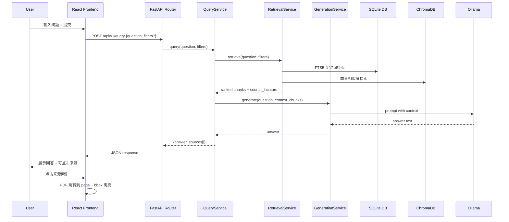

# Textbook RAG Web — 系统架构文档

## 文档信息

- 版本: 1.0
- 角色: Senior Architect
- 日期: 2026-03-07
- 输入: `docs/requirements/requirements.md`, `docs/requirements/prd.md`
- 状态: Draft

---

## 1. 架构概述

### 1.1 设计原则

| 原则 | 说明 | 教材依据 |
|------|------|----------|
| **依赖规则 (Dependency Rule)** | 内层（领域/用例）不依赖外层（框架/驱动）；所有源码依赖只能指向内圈 | Martin, *Clean Architecture* Ch22 — "source code dependencies must point only inward" |
| **关注点分离** | 前端（React+TS）与后端（FastAPI+Python）通过 HTTP API 解耦，各自可独立测试和部署 | Martin, *Clean Architecture* Ch16 — Independence; Percival & Gregory, *Architecture Patterns with Python* Ch4 — Service Layer |
| **Repository 模式** | 数据访问抽象为 Repository 接口，业务逻辑不直接操作 SQLite 或 ChromaDB | Percival & Gregory, *Architecture Patterns with Python* Ch2 — Repository Pattern |
| **最小可行复杂度** | MVP 阶段不引入消息队列、缓存层或微服务拆分，单进程部署 | Winters et al., *Software Engineering at Google* — time/scale/trade-offs |
| **渐进增强** | bbox 高亮为增强能力，页码跳转为基线；缺 bbox 时降级到页码定位 | PRD §4.1 FR-006; Krug, *Don't Make Me Think* — progressive disclosure |

### 1.2 架构图

```
┌─────────────────────────────────────────────────────────────────┐
│                        Browser (Desktop)                        │
│  ┌──────────────────────┐  ┌──────────────────────────────────┐ │
│  │   PDF Viewer (Left)  │  │   Q&A Chat Panel (Right)         │ │
│  │   - react-pdf        │  │   - Question input               │ │
│  │   - bbox overlay     │  │   - Answer + source citations    │ │
│  │   - page navigation  │  │   - Clickable source locators    │ │
│  └──────────┬───────────┘  └──────────────┬───────────────────┘ │
│             │ click source                 │ POST /api/v1/query  │
│             └──────────────┬───────────────┘                    │
└────────────────────────────┼────────────────────────────────────┘
                             │ HTTP (JSON)
┌────────────────────────────┼────────────────────────────────────┐
│                     FastAPI Backend                              │
│  ┌─────────────────────────┴──────────────────────────────────┐ │
│  │                     API Router Layer                        │ │
│  │  /api/v1/query  /api/v1/books  /api/v1/books/{id}/pdf      │ │
│  └─────────────────────────┬──────────────────────────────────┘ │
│  ┌─────────────────────────┴──────────────────────────────────┐ │
│  │                     Service Layer                          │ │
│  │  QueryService ─── RetrievalService ─── GenerationService   │ │
│  └────────┬──────────────────┬───────────────────┬────────────┘ │
│  ┌────────┴────────┐ ┌──────┴───────┐ ┌─────────┴───────────┐ │
│  │  SQLite Repo    │ │ ChromaDB Repo│ │  Ollama Client      │ │
│  │  (FTS + meta)   │ │ (vectors)    │ │  (LLM inference)    │ │
│  └────────┬────────┘ └──────┬───────┘ └─────────┬───────────┘ │
└───────────┼─────────────────┼───────────────────┼──────────────┘
            │                 │                   │
     ┌──────┴──────┐   ┌─────┴──────┐    ┌───────┴───────┐
     │  SQLite DB  │   │  ChromaDB  │    │ Ollama Server │
     │  (FTS5)     │   │  (persist) │    │ (local LLM)   │
     └─────────────┘   └────────────┘    └───────────────┘
```

---

## 2. 技术选型

### 2.1 后端技术栈

| 层 | 选型 | 理由 |
|---|------|------|
| 语言 | **Python 3.12+** | 仓库现有语言；ML/NLP 生态丰富 |
| Web 框架 | **FastAPI 0.135+** | 已在 pyproject.toml；原生异步、自动 OpenAPI 文档、Pydantic 校验 |
| ASGI 服务器 | **Uvicorn** | FastAPI 标配 |
| 向量数据库 | **ChromaDB 0.5+** | 已在依赖中；嵌入式、零运维、Python 原生 |
| 嵌入模型 | **sentence-transformers 3.0+** | 已在依赖中；离线运行、高质量中英文嵌入 |
| 关系数据库 | **SQLite 3** (existing) | 已有完整 schema；FTS5 全文检索；嵌入式零部署 |
| LLM 推理 | **Ollama 0.4+** (本地) | 已在依赖中；本地模型推理、隐私友好 |
| PDF 处理 | **PyMuPDF (fitz) 1.24+** | 已在依赖中；页面渲染、文本提取、bbox 计算 |
| 数据校验 | **Pydantic v2** | FastAPI 内置 |
| 日志 | **Loguru** | 已在依赖中 |
| Linting | **Ruff** | 已在开发依赖中 |
| 测试 | **pytest 8+** | 已在开发依赖中 |

**教材依据**:
- Lubanovic, *FastAPI: Modern Python Web Development* — FastAPI 路由、依赖注入、中间件、SSE
- Percival & Gregory, *Architecture Patterns with Python* — Repository, Service Layer, Unit of Work
- Kreibich, *Using SQLite* — WAL 模式、FTS5、嵌入式数据库并发
- Ramalho, *Fluent Python* — 数据模型、异步模式

### 2.2 前端技术栈

| 层 | 选型 | 理由 |
|---|------|------|
| 框架 | **React 18+** | 组件化生态成熟；PDF 渲染库支持好 |
| 语言 | **TypeScript 5+** | 类型安全；大型前端项目可维护性 |
| 构建工具 | **Vite 5+** | 快速 HMR；.env.example 已配置 VITE_API_ORIGIN |
| PDF 渲染 | **react-pdf** (基于 pdf.js) | 成熟、社区大、支持页码跳转与自定义覆盖层 |
| 状态管理 | **React Context + useReducer** | MVP 阶段状态简单，无需 Redux/Zustand |
| HTTP 客户端 | **fetch API** | 原生、轻量 |
| UI 样式 | **Tailwind CSS 3+** | 实用优先、快速原型 |
| 代码组织 | **Feature-based** | React 社区主流，按功能区域分 `features/`，共享件提取到顶层 |

**教材依据**:
- Flanagan, *JavaScript: The Definitive Guide* Ch10 — 模块系统：一个模块封装一组相关功能，按内聚性分组
- Basarat, *TypeScript Deep Dive* — 类型系统、泛型、接口设计
- Simpson, *YDKJS: Async & Performance* — Promise 模式、异步数据加载
- Krug, *Don't Make Me Think* — 双栏布局可用性、导航一致性

### 2.3 数据库

| 存储 | 用途 | 说明 |
|------|------|------|
| **SQLite** (`data/textbook_rag.sqlite3`) | 结构化元数据 + FTS5 全文检索 | 已有 `books`, `chapters`, `pages`, `chunks`, `source_locators`, `chunk_fts` 表 |
| **ChromaDB** (嵌入式持久化) | 向量相似度检索 | 与 chunks 表通过 `chroma_document_id` 关联 |

不引入 Redis 或 PostgreSQL — 单用户/演示场景，SQLite WAL 模式足够。

**教材依据**:
- Kreibich, *Using SQLite* — FTS5 排序、WAL 并发模型
- Kleppmann, *Designing Data-Intensive Applications* — 存储引擎选择、嵌入式 vs 客户端-服务端

### 2.4 基础设施

| 类型 | 选型 | 理由 |
|------|------|------|
| 部署 | 本地开发优先；VS Code Tasks 启动 | MVP 阶段不做容器化 |
| CI | 无（本地 lint + test） | 课程项目规模 |
| 静态文件 | Vite build → FastAPI `StaticFiles` 或独立 dev server | 开发时前后端分离运行，构建后可合并 |

---

## 3. 系统组件

### 3.1 组件列表

| 组件 | 职责 | 所在目录 |
|------|------|----------|
| **API Router** | HTTP 路由定义、请求/响应校验 | `backend/app/routers/` |
| **Query Service** | 编排检索 → 生成 → 来源定位的完整问答流程 | `backend/app/services/query_service.py` |
| **Retrieval Service** | 混合检索：FTS5 关键词 + ChromaDB 向量 → 结果融合排序 | `backend/app/services/retrieval_service.py` |
| **Generation Service** | 调用 Ollama 生成基于检索结果的回答 | `backend/app/services/generation_service.py` |
| **Book Repository** | SQLite CRUD：books, chapters, pages | `backend/app/repositories/book_repo.py` |
| **Chunk Repository** | SQLite + FTS5：chunks, source_locators | `backend/app/repositories/chunk_repo.py` |
| **Vector Repository** | ChromaDB 向量检索封装 | `backend/app/repositories/vector_repo.py` |
| **Schemas** | Pydantic 请求/响应模型 | `backend/app/schemas/` |
| **PDF Viewer** | React 组件：PDF 页面渲染、页码导航、bbox 高亮覆盖 | `frontend/src/features/pdf-viewer/` |
| **Chat Panel** | React 组件：问题输入、回答展示、来源索引列表 | `frontend/src/features/chat/` |
| **Source Card** | React 组件：可点击的来源位置索引卡片 | `frontend/src/features/source/` |
| **App Shell** | 双栏布局容器、全局状态、路由 | `frontend/src/App.tsx` |

### 3.2 组件交互



---

## 4. 数据架构

### 4.1 现有数据模型

数据库已存在完整 schema（`data/textbook_rag.sqlite3`）：

```
books (1 row)
├── book_assets (8 rows) — PDF 文件、图片等资产
├── chapters (1 row) — 章节层级
├── pages (441 rows) — 每页尺寸、编号
├── chunks (3514 rows) — 文本块（段落/标题/表格等）
│   ├── source_locators (3514 rows) — bbox 定位数据
│   └── chunk_fts (3514 rows) — FTS5 全文索引
└── (ChromaDB) — 向量索引 (via chroma_document_id)
```

**关键关系**:
- `chunks.book_id` → `books.id`
- `chunks.chapter_id` → `chapters.id`
- `chunks.primary_page_id` → `pages.id`
- `source_locators.chunk_id` → `chunks.id`
- `source_locators.page_id` → `pages.id`
- `chunks.chroma_document_id` → ChromaDB document ID

### 4.2 数据流

```
教材 PDF
  ↓ (离线预处理 — MinerU + scripts/)
SQLite (结构化元数据 + FTS5) + ChromaDB (向量)
  ↓ (运行时查询)
FastAPI Services → 混合检索 → Ollama 生成 → JSON response
  ↓
React Frontend → 展示 + PDF 定位
```

数据在系统中以只读方式流动（写入仅发生在离线预处理阶段）。MVP 不支持在线教材上传。

---

## 5. API 设计

### 5.1 API 规范

- 基础路径: `/api/v1`
- 格式: JSON
- 错误格式: `{ "detail": "..." }` (FastAPI 默认)
- 分页: 基于 `limit` + `offset`

### 5.2 API 列表

#### 核心 API

| 方法 | 路径 | 说明 | 优先级 |
|------|------|------|--------|
| `POST` | `/api/v1/query` | 提交问题，返回回答 + 来源 | P0 |
| `GET` | `/api/v1/books` | 获取书籍列表 | P0 |
| `GET` | `/api/v1/books/{book_id}` | 获取书籍详情（含章节目录） | P0 |
| `GET` | `/api/v1/books/{book_id}/pdf` | 获取 PDF 文件流 | P0 |
| `GET` | `/api/v1/books/{book_id}/pages/{page_num}` | 获取指定页元数据 | P1 |

#### 5.2.1 `POST /api/v1/query`

**请求**:
```json
{
  "question": "What is backpropagation?",
  "filters": {
    "book_ids": [1],
    "chapter_ids": [],
    "content_types": []
  },
  "top_k": 5
}
```

**响应**:
```json
{
  "answer": "Backpropagation is an algorithm for computing gradients...",
  "sources": [
    {
      "source_id": "src_abc123",
      "book_id": 1,
      "book_title": "Deep Learning",
      "chapter_title": "Deep Feedforward Networks",
      "page_number": 197,
      "snippet": "The back-propagation algorithm...",
      "bbox": {
        "x0": 72.0,
        "y0": 340.0,
        "x1": 540.0,
        "y1": 420.0
      },
      "confidence": 0.92
    }
  ],
  "retrieval_stats": {
    "fts_hits": 12,
    "vector_hits": 8,
    "fused_count": 5
  }
}
```

#### 5.2.2 `GET /api/v1/books`

**响应**:
```json
{
  "books": [
    {
      "id": 1,
      "book_id": "goodfellow_deep_learning",
      "title": "Deep Learning",
      "authors": "Goodfellow, Bengio, Courville",
      "page_count": 800,
      "chapter_count": 20,
      "chunk_count": 3514
    }
  ]
}
```

#### 5.2.3 `GET /api/v1/books/{book_id}/pdf`

- Content-Type: `application/pdf`
- 支持 Range 请求（大文件分段加载）
- 返回 `book_assets` 表中 `asset_kind = 'source_pdf'` 对应文件

---

## 6. 安全架构

### 6.1 认证

MVP 不实现认证。系统仅用于本地开发/演示。

### 6.2 授权

不适用（无用户系统）。

### 6.3 数据安全

| 关注点 | 措施 |
|--------|------|
| SQL 注入 | 所有数据库查询使用参数化语句（`?` 占位符），不拼接字符串 |
| XSS | React 默认转义输出；回答文本使用安全的 Markdown 渲染 |
| 路径穿越 | PDF 文件服务通过 `book_assets` 表映射查找，不接受用户路径输入 |
| CORS | 仅允许 `VITE_API_ORIGIN` 配置的前端来源 |
| 请求校验 | Pydantic 模型对所有入参做类型和范围校验 |

**教材依据**:
- Zalewski, *The Tangled Web* — 同源策略、XSS 防护
- Gourley & Totty, *HTTP: The Definitive Guide* — CORS、内容协商

---

## 7. 部署架构

### 7.1 环境

| 环境 | 说明 |
|------|------|
| **Local Dev** | 前端 Vite dev server (port 5173) + 后端 Uvicorn (port 8000) |
| **Local Build** | 前端构建产物由 FastAPI `StaticFiles` 托管，单端口 |

### 7.2 部署流程

```
开发模式:
  Terminal 1: cd frontend && npm run dev     → localhost:5173
  Terminal 2: uv run uvicorn backend.app.main:app --reload  → localhost:8000

构建模式:
  cd frontend && npm run build
  # 产物在 frontend/dist/
  uv run uvicorn backend.app.main:app  → localhost:8000 (含静态文件)
```

VS Code Tasks 已配置（`.vscode/tasks.json`）支持一键启动。

---

## 8. 目录结构

```
textbook-rag/
├── backend/
│   ├── app/
│   │   ├── __init__.py
│   │   ├── main.py              # FastAPI app 入口
│   │   ├── config.py            # 配置（环境变量、路径）
│   │   ├── routers/
│   │   │   ├── __init__.py
│   │   │   ├── query.py         # POST /api/v1/query
│   │   │   └── books.py         # GET /api/v1/books, /books/{id}, /books/{id}/pdf
│   │   ├── services/
│   │   │   ├── __init__.py
│   │   │   ├── query_service.py      # 问答编排
│   │   │   ├── retrieval_service.py  # 混合检索
│   │   │   └── generation_service.py # LLM 生成
│   │   ├── repositories/
│   │   │   ├── __init__.py
│   │   │   ├── book_repo.py     # books/chapters/pages CRUD
│   │   │   ├── chunk_repo.py    # chunks + FTS5 + source_locators
│   │   │   └── vector_repo.py   # ChromaDB 封装
│   │   └── schemas/
│   │       ├── __init__.py
│   │       ├── query.py         # QueryRequest, QueryResponse
│   │       └── books.py         # BookSummary, BookDetail
│   └── tests/
│       ├── __init__.py
│       ├── test_query_router.py
│       └── test_retrieval_service.py
├── frontend/
│   ├── package.json
│   ├── tsconfig.json
│   ├── vite.config.ts
│   ├── index.html
│   ├── src/
│   │   ├── main.tsx
│   │   ├── App.tsx              # 双栏布局容器
│   │   ├── api/
│   │   │   └── client.ts        # API 调用封装
│   │   ├── components/          # 共享/通用 UI 组件
│   │   │   └── Loading.tsx
│   │   ├── features/            # 业务功能模块（模块内自包含）
│   │   │   ├── chat/            # 问答交互功能
│   │   │   │   ├── ChatPanel.tsx
│   │   │   │   ├── MessageBubble.tsx
│   │   │   │   └── useChat.ts
│   │   │   ├── pdf-viewer/      # PDF 阅读功能
│   │   │   │   ├── PdfViewer.tsx
│   │   │   │   ├── BboxOverlay.tsx
│   │   │   │   └── usePdfNavigation.ts
│   │   │   └── source/          # 来源展示功能
│   │   │       └── SourceCard.tsx
│   │   ├── hooks/               # 共享 hooks
│   │   │   └── useApi.ts
│   │   └── types/               # 共享类型
│   │       └── api.ts           # 响应类型定义
│   └── public/
├── data/
│   ├── textbook_rag.sqlite3     # 主数据库 (已有)
│   └── mineru_output/           # MinerU 预处理结果 (已有)
├── textbooks/
│   ├── topic_index.json         # 主题索引 (已有)
│   └── README.md
├── scripts/                     # 离线预处理脚本 (已有)
├── docs/
│   ├── requirements/
│   │   ├── requirements.md
│   │   └── prd.md
│   └── architecture/
│       └── system-architecture.md  ← 本文档
├── .env.example
├── pyproject.toml
└── .vscode/
    ├── tasks.json
    └── launch.json
```

**教材依据**:
- Martin, *Clean Architecture* Ch22 — Dependency Rule: routers → services → repositories，外层依赖内层
- Percival & Gregory, *Architecture Patterns with Python* — Repository Pattern (Ch2), Service Layer (Ch4)

---

## 9. 扩展性考虑

| 场景 | 扩展路径 |
|------|----------|
| 新增教材 | 运行 `scripts/` 离线处理 → 自动写入 SQLite + ChromaDB |
| 切换 LLM | 替换 `GenerationService` 中的 Ollama 调用为 OpenAI/其他 API |
| 添加缓存 | 在 `RetrievalService` 层引入内存缓存或 Redis |
| 用户系统 | 添加 FastAPI 中间件 + users 表 |
| 容器化 | 添加 Dockerfile + docker-compose.yml |
| 流式回答 | `GenerationService` 改用 SSE/WebSocket 推送 |

---

## 10. 教材引用汇总

| 教材 | 引用章节/概念 | 影响的架构决策 |
|------|---------------|----------------|
| Martin, *Clean Architecture* | Ch22 Dependency Rule, Ch16 Independence, Ch18 Boundary Anatomy | 分层架构、依赖方向、组件边界 |
| Percival & Gregory, *Architecture Patterns with Python* | Ch2 Repository, Ch4 Service Layer, Ch11 Event-Driven | Repository 模式、Service 编排层 |
| Lubanovic, *FastAPI: Modern Python Web Development* | 全书 — 路由、依赖注入、Pydantic、SSE | 后端框架选型与 API 设计 |
| Kreibich, *Using SQLite* | FTS5, WAL mode, embedded database | 数据库选型保留、全文检索策略 |
| Kleppmann, *Designing Data-Intensive Applications* | Ch3 Storage engines, Ch7 Transactions | SQLite vs PostgreSQL 决策 |
| Flanagan, *JavaScript: The Definitive Guide* | Ch13 Async, Ch15 Web APIs | 前端技术栈选型 |
| Basarat, *TypeScript Deep Dive* | 类型系统、泛型 | TypeScript 选型 |
| Krug, *Don't Make Me Think* | 导航一致性、前进式披露 | 双栏 UI 布局、渐进增强策略 |
| Zalewski, *The Tangled Web* | 同源策略、XSS | 安全架构 |
| Winters et al., *Software Engineering at Google* | Time/scale/trade-offs | 最小可行复杂度原则 |
