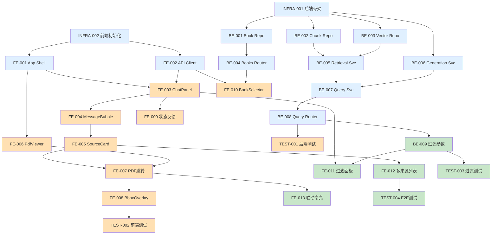

# Textbook RAG Web — 开发任务清单 (Sprint Plan)

## 文档信息

- 版本: 1.0
- 角色: Tech Lead (Charlie)
- 日期: 2026-03-07
- 输入: `docs/requirements/prd.md`, `docs/architecture/system-architecture.md`

---

## 概览

- Epic 数量: 4
- Story 总数: 28
- 预估总工时: ~52h
- Sprint 划分: 3 个 Sprint

---

## Sprint 总览

| Sprint | 目标 | Story 数 | 预估 |
|--------|------|----------|------|
| Sprint 1 | 后端核心 + 前端骨架 — 能跑通 API 调用 | 12 | ~20h |
| Sprint 2 | 问答闭环 + PDF 定位 — MVP 完成 | 10 | ~20h |
| Sprint 3 | 过滤/增强 + 打磨 — P1 功能 | 6 | ~12h |

---

## Epic 列表

| Epic | 说明 | 来源 |
|------|------|------|
| EPIC-01 | 阅读与导航 | PRD §5 |
| EPIC-02 | 问答与检索 | PRD §5 |
| EPIC-03 | 来源定位与核验 | PRD §5 |
| EPIC-04 | 过滤与上下文联动 | PRD §5 |

---

## Sprint 1 — 后端核心 + 前端骨架

目标: 后端 API 可运行、前端双栏布局可加载、书籍列表可展示。

| ID | 标题 | 类型 | Epic | 优先级 | 预估 | 依赖 | 状态 |
|----|------|------|------|--------|------|------|------|
| INFRA-001 | 后端项目骨架搭建 | Backend | — | P0 | 2h | — | pending |
| INFRA-002 | 前端项目初始化 | Frontend | — | P0 | 2h | — | pending |
| BE-001 | Book Repository 实现 | Backend | EPIC-01 | P0 | 2h | INFRA-001 | pending |
| BE-002 | Chunk Repository + FTS5 检索 | Backend | EPIC-02 | P0 | 2h | INFRA-001 | pending |
| BE-003 | Vector Repository (ChromaDB) | Backend | EPIC-02 | P0 | 2h | INFRA-001 | pending |
| BE-004 | Books Router (GET /books, /books/{id}, /books/{id}/pdf) | Backend | EPIC-01 | P0 | 2h | BE-001 | pending |
| BE-005 | Retrieval Service (混合检索 + 融合排序) | Backend | EPIC-02 | P0 | 2h | BE-002, BE-003 | pending |
| BE-006 | Generation Service (Ollama 调用) | Backend | EPIC-02 | P0 | 1h | INFRA-001 | pending |
| BE-007 | Query Service (编排检索→生成→来源) | Backend | EPIC-02 | P0 | 1h | BE-005, BE-006 | pending |
| BE-008 | Query Router (POST /query) | Backend | EPIC-02 | P0 | 1h | BE-007 | pending |
| FE-001 | App Shell 双栏布局 | Frontend | EPIC-01 | P0 | 1h | INFRA-002 | pending |
| FE-002 | API Client 封装 | Frontend | — | P0 | 1h | INFRA-002 | pending |

---

## Sprint 2 — 问答闭环 + PDF 定位 (MVP)

目标: 用户可以完成完整的 "提问 → 查看回答 → 点击来源 → PDF 跳转 + 高亮" 闭环。

| ID | 标题 | 类型 | Epic | US | 优先级 | 预估 | 依赖 | 状态 |
|----|------|------|------|-----|--------|------|------|------|
| FE-003 | ChatPanel 问题输入 + 提交 | Frontend | EPIC-02 | US-001 | P0 | 2h | FE-001, FE-002 | pending |
| FE-004 | MessageBubble 回答展示 | Frontend | EPIC-02 | US-001 | P0 | 1h | FE-003 | pending |
| FE-005 | SourceCard 来源元数据展示 | Frontend | EPIC-03 | US-002 | P0 | 2h | FE-004 | pending |
| FE-006 | PdfViewer 基础渲染 + 页码导航 | Frontend | EPIC-01 | US-005 | P0 | 3h | FE-001 | pending |
| FE-007 | 来源点击 → PDF 页码跳转 | Frontend | EPIC-03 | US-003 | P0 | 2h | FE-005, FE-006 | pending |
| FE-008 | BboxOverlay 区域高亮 | Frontend | EPIC-03 | US-004 | P0 | 2h | FE-007 | pending |
| FE-009 | 加载/错误/空结果状态反馈 | Frontend | EPIC-02 | US-008 | P0 | 2h | FE-003 | pending |
| FE-010 | BookSelector 书籍选择 | Frontend | EPIC-01 | US-005 | P0 | 1h | FE-002, BE-004 | pending |
| TEST-001 | 后端 API 单元测试 | Testing | — | — | P0 | 2h | BE-008 | pending |
| TEST-002 | 前端组件基础测试 | Testing | — | — | P0 | 2h | FE-008 | pending |

---

## Sprint 3 — 过滤 + 增强 (P1)

目标: 支持书名/章节过滤、多来源对比、上下文联动。

| ID | 标题 | 类型 | Epic | US | 优先级 | 预估 | 依赖 | 状态 |
|----|------|------|------|-----|--------|------|------|------|
| BE-009 | 查询过滤参数支持 (book_ids, chapter_ids, content_types) | Backend | EPIC-04 | US-006 | P1 | 2h | BE-008 | pending |
| FE-011 | 过滤面板 (书名/章节下拉) | Frontend | EPIC-04 | US-006 | P1 | 2h | FE-003, BE-009 | pending |
| FE-012 | 多候选来源列表展示 | Frontend | EPIC-03 | US-007 | P1 | 2h | FE-005 | pending |
| FE-013 | 来源与 PDF 联动高亮当前选中 | Frontend | EPIC-04 | US-010 | P1 | 2h | FE-007 | pending |
| TEST-003 | 后端过滤功能测试 | Testing | — | — | P1 | 2h | BE-009 | pending |
| TEST-004 | 端到端闭环测试 | Testing | — | — | P1 | 2h | FE-012 | pending |

---

## 依赖关系图

> 颜色说明: 蓝色 = Sprint 1, 橙色 = Sprint 2, 绿色 = Sprint 3

---

## Story 详情

### [INFRA-001] 后端项目骨架搭建

**类型**: Backend
**优先级**: P0
**预估**: 2h

#### 描述

创建 `backend/app/` 目录结构，包含 FastAPI 入口、配置、空 router/service/repository/schema 包。配置 CORS 中间件、数据库连接工具函数。

#### 验收标准

- [ ] `backend/app/main.py` 创建，FastAPI app 实例可启动
- [ ] `backend/app/config.py` 创建，读取环境变量和路径配置
- [ ] `backend/app/routers/`, `services/`, `repositories/`, `schemas/` 目录及 `__init__.py` 创建
- [ ] CORS 中间件已配置，允许 `VITE_API_ORIGIN`
- [ ] `uv run uvicorn backend.app.main:app` 可启动且返回 200

#### 文件

- `backend/app/main.py`
- `backend/app/config.py`
- `backend/app/__init__.py`
- `backend/app/routers/__init__.py`
- `backend/app/services/__init__.py`
- `backend/app/repositories/__init__.py`
- `backend/app/schemas/__init__.py`

---

### [INFRA-002] 前端项目初始化

**类型**: Frontend
**优先级**: P0
**预估**: 2h

#### 描述

使用 Vite + React + TypeScript 初始化 `frontend/` 项目。安装 Tailwind CSS、react-pdf。配置 Vite proxy 到后端。

#### 验收标准

- [ ] `npm create vite` 初始化完成
- [ ] Tailwind CSS 配置完成
- [ ] `react-pdf` 安装
- [ ] `vite.config.ts` 配置 API proxy 到 `http://127.0.0.1:8000`
- [ ] `npm run dev` 可启动且浏览器可访问
- [ ] `npm run build` 无错误

#### 文件

- `frontend/package.json`
- `frontend/vite.config.ts`
- `frontend/tsconfig.json`
- `frontend/tailwind.config.js`
- `frontend/src/main.tsx`

---

### [BE-001] Book Repository 实现

**类型**: Backend
**Epic**: EPIC-01
**优先级**: P0
**预估**: 2h

#### 描述

封装 SQLite 数据库访问，提供 books/chapters/pages 查询方法。使用参数化查询防止 SQL 注入。

#### 验收标准

- [ ] `list_books()` 返回所有书籍摘要
- [ ] `get_book(book_id)` 返回书籍详情 + 章节列表
- [ ] `get_pdf_path(book_id)` 返回 PDF 文件路径
- [ ] 所有 SQL 使用 `?` 占位符
- [ ] `uv run ruff check backend/`  无错误

#### 依赖

- INFRA-001

#### 文件

- `backend/app/repositories/book_repo.py`

---

### [BE-002] Chunk Repository + FTS5 检索

**类型**: Backend
**Epic**: EPIC-02
**优先级**: P0
**预估**: 2h

#### 描述

封装 chunks 表和 chunk_fts 全文检索，以及 source_locators 来源定位数据。

#### 验收标准

- [ ] `search_fts(query, filters, limit)` 执行 FTS5 MATCH 检索并返回 chunk + source_locator
- [ ] `get_source_locators(chunk_ids)` 批量获取 bbox 数据
- [ ] 支持 book_id / chapter_id / content_type 过滤条件
- [ ] 所有 SQL 使用参数化查询

#### 依赖

- INFRA-001

#### 文件

- `backend/app/repositories/chunk_repo.py`

---

### [BE-003] Vector Repository (ChromaDB)

**类型**: Backend
**Epic**: EPIC-02
**优先级**: P0
**预估**: 2h

#### 描述

封装 ChromaDB 客户端，提供向量相似度检索接口。

#### 验收标准

- [ ] `search_vectors(query_text, top_k, filters)` 返回相似文档 ID + 距离分数
- [ ] ChromaDB 集合使用持久化存储路径
- [ ] 与 chunks 表通过 `chroma_document_id` 可关联

#### 依赖

- INFRA-001

#### 文件

- `backend/app/repositories/vector_repo.py`

---

### [BE-004] Books Router

**类型**: Backend
**Epic**: EPIC-01
**优先级**: P0
**预估**: 2h

#### 描述

实现 GET `/api/v1/books`、`/api/v1/books/{book_id}`、`/api/v1/books/{book_id}/pdf` 三个端点。

#### 验收标准

- [ ] GET `/api/v1/books` 返回书籍列表 JSON
- [ ] GET `/api/v1/books/{book_id}` 返回书籍详情（含章节）
- [ ] GET `/api/v1/books/{book_id}/pdf` 返回 PDF 文件流 (application/pdf)
- [ ] 不存在的 book_id 返回 404
- [ ] Pydantic schema 校验响应格式

#### 依赖

- BE-001

#### 文件

- `backend/app/routers/books.py`
- `backend/app/schemas/books.py`

---

### [BE-005] Retrieval Service (混合检索)

**类型**: Backend
**Epic**: EPIC-02
**优先级**: P0
**预估**: 2h

#### 描述

混合检索编排：并行调用 FTS5 关键词检索 + ChromaDB 向量检索，Reciprocal Rank Fusion 融合排序，返回排序后的 chunks + source_locators。

#### 验收标准

- [ ] `retrieve(question, filters, top_k)` 返回融合排序后的 chunks
- [ ] 每个结果包含来源元数据（book_title, chapter_title, page_number, bbox）
- [ ] FTS5 和向量检索分数通过 RRF 融合
- [ ] top_k 参数控制返回数量

#### 依赖

- BE-002, BE-003

#### 文件

- `backend/app/services/retrieval_service.py`

---

### [BE-006] Generation Service (Ollama)

**类型**: Backend
**Epic**: EPIC-02
**优先级**: P0
**预估**: 1h

#### 描述

封装 Ollama API 调用，构建带有检索上下文的 prompt，返回生成的回答文本。

#### 验收标准

- [ ] `generate(question, context_chunks)` 返回回答文本
- [ ] Prompt 包含检索到的文本片段作为上下文
- [ ] Ollama 不可用时返回明确错误而非静默失败
- [ ] 模型名称可通过配置指定

#### 依赖

- INFRA-001

#### 文件

- `backend/app/services/generation_service.py`

---

### [BE-007] Query Service (问答编排)

**类型**: Backend
**Epic**: EPIC-02
**优先级**: P0
**预估**: 1h

#### 描述

编排完整问答流程：调用 RetrievalService → GenerationService → 组装响应。

#### 验收标准

- [ ] `query(question, filters, top_k)` 返回 `{answer, sources[], retrieval_stats}`
- [ ] sources 包含 source_id, book_id, book_title, chapter_title, page_number, snippet, bbox, confidence
- [ ] retrieval_stats 包含 fts_hits, vector_hits, fused_count

#### 依赖

- BE-005, BE-006

#### 文件

- `backend/app/services/query_service.py`

---

### [BE-008] Query Router (POST /query)

**类型**: Backend
**Epic**: EPIC-02
**优先级**: P0
**预估**: 1h

#### 描述

实现 POST `/api/v1/query` 端点，接收问题和过滤条件，返回回答 + 来源。

#### 验收标准

- [ ] POST `/api/v1/query` 接收 `{question, filters?, top_k?}`
- [ ] Pydantic 校验请求参数（question 非空、top_k 范围 1-20）
- [ ] 返回格式与架构文档 §5.2.1 一致
- [ ] 校验失败返回 422

#### 依赖

- BE-007

#### 文件

- `backend/app/routers/query.py`
- `backend/app/schemas/query.py`

---

### [FE-001] App Shell 双栏布局

**类型**: Frontend
**Epic**: EPIC-01
**US**: US-005
**优先级**: P0
**预估**: 1h

#### 描述

创建主 App 组件，实现左 PDF / 右问答的双栏 Tailwind 布局。定义全局状态 context（当前书籍、当前页码、选中来源）。

#### 验收标准

- [ ] 左右双栏在桌面端同时可见
- [ ] 布局响应式：桌面端 50/50 分栏，可拖拽或固定比例
- [ ] AppContext 提供 currentBookId, currentPage, selectedSource state

#### 依赖

- INFRA-002

#### 文件

- `frontend/src/App.tsx`
- `frontend/src/context/AppContext.tsx`

---

### [FE-002] API Client 封装

**类型**: Frontend
**优先级**: P0
**预估**: 1h

#### 描述

封装后端 API 调用函数，统一错误处理。使用 `VITE_API_ORIGIN` 环境变量。

#### 验收标准

- [ ] `queryTextbook(question, filters, topK)` → POST /api/v1/query
- [ ] `fetchBooks()` → GET /api/v1/books
- [ ] `fetchBook(bookId)` → GET /api/v1/books/{bookId}
- [ ] `getPdfUrl(bookId)` → 返回 PDF URL
- [ ] 网络错误/非 2xx 自动抛出带提示的 Error

#### 依赖

- INFRA-002

#### 文件

- `frontend/src/api/client.ts`
- `frontend/src/types/api.ts`

---

### [FE-003] ChatPanel 问题输入 + 提交

**类型**: Frontend
**Epic**: EPIC-02
**US**: US-001
**优先级**: P0
**预估**: 2h

#### 描述

实现问答面板：输入框、提交按钮、消息列表，调用 API 并展示回答。

#### 验收标准

- [ ] 文本输入框 + 提交按钮
- [ ] 提交后调用 `queryTextbook()` 并将回答追加到消息列表
- [ ] 提交期间按钮 disabled + 加载指示
- [ ] Enter 键快捷提交

#### 依赖

- FE-001, FE-002

#### 文件

- `frontend/src/features/chat/ChatPanel.tsx`
- `frontend/src/features/chat/useChat.ts`

---

### [FE-004] MessageBubble 回答展示

**类型**: Frontend
**Epic**: EPIC-02
**US**: US-001
**优先级**: P0
**预估**: 1h

#### 描述

回答气泡组件，展示回答文本（安全 Markdown 渲染）和关联来源列表入口。

#### 验收标准

- [ ] 用户问题显示为右侧气泡
- [ ] 系统回答显示为左侧气泡
- [ ] 回答文本支持基础 Markdown（加粗、列表、代码）
- [ ] 回答下方展示来源索引数量提示

#### 依赖

- FE-003

#### 文件

- `frontend/src/features/chat/MessageBubble.tsx`

---

### [FE-005] SourceCard 来源元数据展示

**类型**: Frontend
**Epic**: EPIC-03
**US**: US-002
**优先级**: P0
**预估**: 2h

#### 描述

可点击的来源卡片组件，展示书名、章节、页码、片段摘要。

#### 验收标准

- [ ] 展示 book_title, chapter_title, page_number
- [ ] 展示 snippet 摘要文本（截断到 ~120 字符）
- [ ] confidence 分数可视化（颜色条或百分比）
- [ ] 卡片样式明显可点击（hover 效果、cursor pointer）

#### 依赖

- FE-004

#### 文件

- `frontend/src/features/source/SourceCard.tsx`

---

### [FE-006] PdfViewer 基础渲染 + 页码导航

**类型**: Frontend
**Epic**: EPIC-01
**US**: US-005
**优先级**: P0
**预估**: 3h

#### 描述

使用 react-pdf 渲染 PDF 页面，支持页码输入跳转和上下翻页。

#### 验收标准

- [ ] 加载并渲染指定 book 的 PDF
- [ ] 页码输入框可跳转到指定页
- [ ] 上一页/下一页按钮
- [ ] 当前页码/总页数显示
- [ ] PDF 加载失败时显示错误提示

#### 依赖

- FE-001

#### 文件

- `frontend/src/features/pdf-viewer/PdfViewer.tsx`
- `frontend/src/features/pdf-viewer/usePdfNavigation.ts`

---

### [FE-007] 来源点击 → PDF 页码跳转

**类型**: Frontend
**Epic**: EPIC-03
**US**: US-003
**优先级**: P0
**预估**: 2h

#### 描述

点击 SourceCard 后，通过 AppContext 更新 currentPage，PdfViewer 响应跳转。

#### 验收标准

- [ ] 点击 SourceCard → 左侧 PDF 跳转到对应页码
- [ ] 跳转后有视觉反馈（页码高亮闪烁）
- [ ] 若来源的 book 与当前 PDF 不同，先切换 PDF 再跳转页码

#### 依赖

- FE-005, FE-006

#### 文件

- `frontend/src/features/source/SourceCard.tsx` (onClick)
- `frontend/src/features/pdf-viewer/PdfViewer.tsx` (响应)

---

### [FE-008] BboxOverlay 区域高亮

**类型**: Frontend
**Epic**: EPIC-03
**US**: US-004
**优先级**: P0
**预估**: 2h

#### 描述

在 PDF 页面上叠加半透明矩形，高亮 bbox 区域。无 bbox 时不渲染。

#### 验收标准

- [ ] bbox 存在时渲染黄色半透明矩形覆盖在对应位置
- [ ] bbox 坐标相对于 PDF 页面尺寸正确缩放
- [ ] 无 bbox 数据时不渲染覆盖层（降级到仅页码跳转）
- [ ] 多个 source 的 bbox 可同时高亮（不同颜色或编号）

#### 依赖

- FE-007

#### 文件

- `frontend/src/features/pdf-viewer/BboxOverlay.tsx`

---

### [FE-009] 加载/错误/空结果状态反馈

**类型**: Frontend
**Epic**: EPIC-02
**US**: US-008
**优先级**: P0
**预估**: 2h

#### 描述

全局状态反馈：查询加载中、查询失败、结果为空时的 UI 提示。

#### 验收标准

- [ ] 查询中：显示 skeleton 或 spinner
- [ ] 查询失败：显示错误信息 + 重试按钮
- [ ] 结果为空：显示 "未找到相关内容" + 建议换关键词
- [ ] PDF 加载失败：显示文件无法加载提示

#### 依赖

- FE-003

#### 文件

- `frontend/src/components/Loading.tsx`
- `frontend/src/components/ErrorMessage.tsx`

---

### [FE-010] BookSelector 书籍选择

**类型**: Frontend
**Epic**: EPIC-01
**US**: US-005
**优先级**: P0
**预估**: 1h

#### 描述

书籍下拉选择器，调用 GET /books 获取列表，选择后更新 AppContext 并加载对应 PDF。

#### 验收标准

- [ ] 从后端获取书籍列表
- [ ] 下拉选择一本书后左侧加载其 PDF
- [ ] 显示书名 + 作者

#### 依赖

- FE-002, BE-004

#### 文件

- `frontend/src/features/pdf-viewer/BookSelector.tsx`

---

### [TEST-001] 后端 API 单元测试

**类型**: Testing
**优先级**: P0
**预估**: 2h

#### 描述

使用 pytest + FastAPI TestClient 测试核心 API 端点。

#### 验收标准

- [ ] POST /api/v1/query 正常流 + 空结果 + 参数校验 测试
- [ ] GET /api/v1/books 正常流测试
- [ ] GET /api/v1/books/{id}/pdf 正常流 + 404 测试
- [ ] `uv run pytest --tb=short -q` 全部通过

#### 依赖

- BE-008

#### 文件

- `backend/tests/test_query_router.py`
- `backend/tests/test_books_router.py`

---

### [TEST-002] 前端组件基础测试

**类型**: Testing
**优先级**: P0
**预估**: 2h

#### 描述

使用 Vitest + React Testing Library 测试关键组件渲染和交互。

#### 验收标准

- [ ] ChatPanel 渲染 + 提交流程测试
- [ ] SourceCard 点击触发回调测试
- [ ] `npm run test -- --run` 全部通过

#### 依赖

- FE-008

#### 文件

- `frontend/src/features/chat/__tests__/ChatPanel.test.tsx`
- `frontend/src/features/source/__tests__/SourceCard.test.tsx`

---

### [BE-009] 查询过滤参数支持

**类型**: Backend
**Epic**: EPIC-04
**US**: US-006
**优先级**: P1
**预估**: 2h

#### 描述

在 RetrievalService 和 Repository 层完整实现 book_ids / chapter_ids / content_types 过滤。

#### 验收标准

- [ ] 过滤条件传递到 FTS5 和 ChromaDB 查询
- [ ] 空过滤条件 = 不过滤（查全部）
- [ ] 过滤条件组合（book + chapter 同时）正确工作

#### 依赖

- BE-008

#### 文件

- `backend/app/repositories/chunk_repo.py`
- `backend/app/repositories/vector_repo.py`
- `backend/app/services/retrieval_service.py`

---

### [FE-011] 过滤面板

**类型**: Frontend
**Epic**: EPIC-04
**US**: US-006
**优先级**: P1
**预估**: 2h

#### 描述

在 ChatPanel 上方添加过滤选项：书名、章节下拉。提交问题时携带过滤条件。

#### 验收标准

- [ ] 书名多选下拉
- [ ] 章节在选中书后可选
- [ ] 过滤条件传入 queryTextbook() 调用
- [ ] 清空过滤按钮

#### 依赖

- FE-003, BE-009

#### 文件

- `frontend/src/features/chat/FilterPanel.tsx`

---

### [FE-012] 多候选来源列表展示

**类型**: Frontend
**Epic**: EPIC-03
**US**: US-007
**优先级**: P1
**预估**: 2h

#### 描述

在回答下方展示所有候选来源（而非仅标注数量），支持展开/折叠。

#### 验收标准

- [ ] 默认展示前 3 条来源，"查看全部" 按钮展开所有
- [ ] 每条来源为 SourceCard
- [ ] 来源按 confidence 降序排列

#### 依赖

- FE-005

#### 文件

- `frontend/src/features/source/SourceList.tsx`

---

### [FE-013] 来源与 PDF 联动高亮当前选中

**类型**: Frontend
**Epic**: EPIC-04
**US**: US-010
**优先级**: P1
**预估**: 2h

#### 描述

当前选中的 SourceCard 高亮显示，PDF 中对应 bbox 保持高亮直到选择其他来源。

#### 验收标准

- [ ] 选中的 SourceCard 有激活样式（边框/背景色变化）
- [ ] PDF bbox 高亮与选中来源保持同步
- [ ] 点击另一个来源时前一个取消高亮

#### 依赖

- FE-007

#### 文件

- `frontend/src/features/source/SourceCard.tsx`
- `frontend/src/features/pdf-viewer/BboxOverlay.tsx`

---

### [TEST-003] 后端过滤功能测试

**类型**: Testing
**优先级**: P1
**预估**: 2h

#### 描述

测试 POST /query 带各种过滤条件组合的行为。

#### 验收标准

- [ ] 单 book_id 过滤正确
- [ ] 多 book_ids 过滤正确
- [ ] book + chapter 组合过滤正确
- [ ] 空过滤条件返回全部

#### 依赖

- BE-009

#### 文件

- `backend/tests/test_query_filters.py`

---

### [TEST-004] 端到端闭环测试

**类型**: Testing
**优先级**: P1
**预估**: 2h

#### 描述

验证完整用户流程：提问 → 查看回答 → 点击来源 → PDF 跳转。

#### 验收标准

- [ ] 启动前后端后可完成完整闭环
- [ ] 来源跳转到正确页码
- [ ] 当 bbox 存在时高亮可见

#### 依赖

- FE-012

#### 文件

- `docs/test-report.md` (记录测试结果)

---

## 教材依据

- Winters et al., *Software Engineering at Google* Ch12 — 测试粒度：单元测试覆盖核心逻辑，集成测试验证 API 端点，E2E 测试验证用户流程
- Hunt & Thomas, *The Pragmatic Programmer* — Tracer Bullets：Sprint 1 端到端骨架先跑通，Sprint 2 填充功能
- Martin, *Clean Architecture* Ch22 — 依赖方向决定了 Story 依赖顺序：Repo → Service → Router
- Krug, *Don't Make Me Think* — 优先实现可感知的用户价值（PDF 跳转 > 过滤功能）
