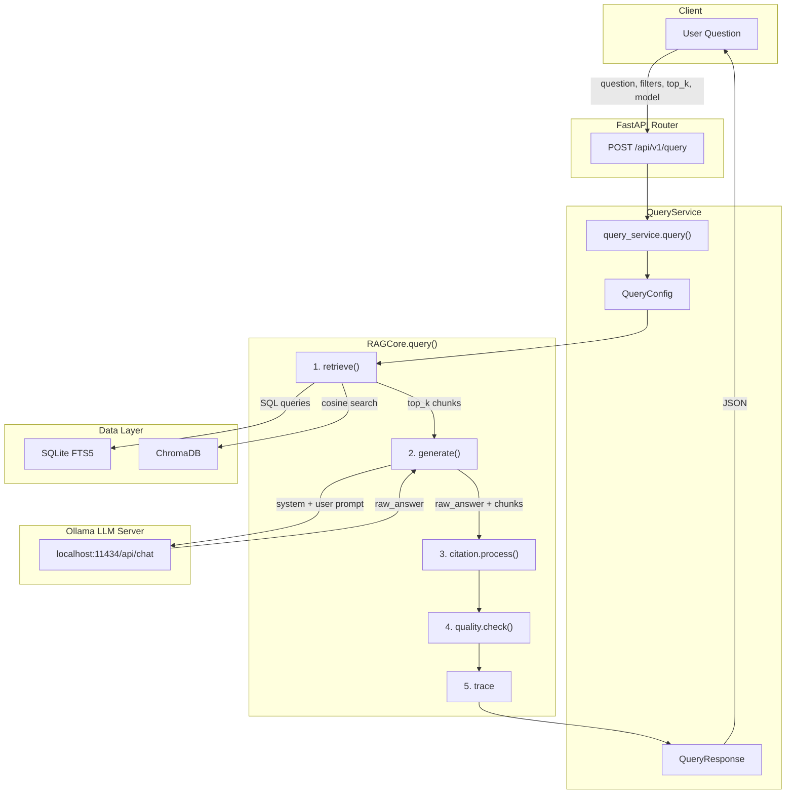
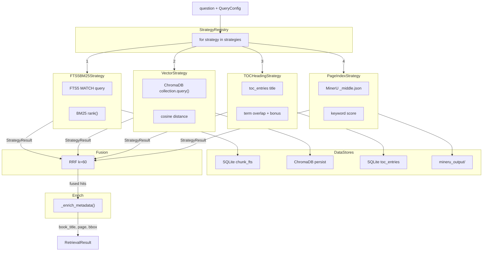
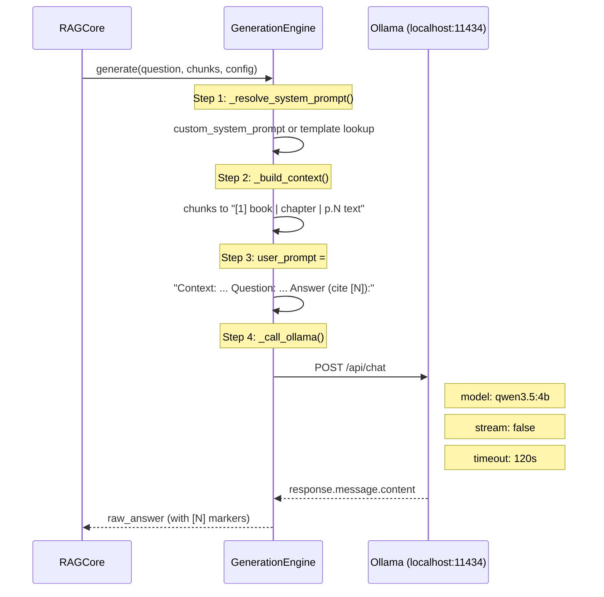
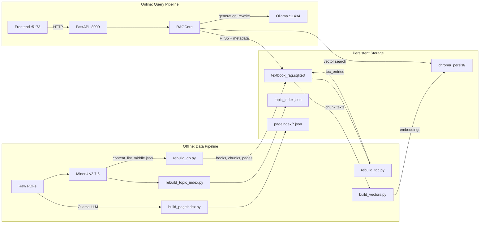

# RAG 查询流程图 / Query Flow Diagram

> 反映 v1.1 代码实际状态 (2026-03-18)
> 默认模型: qwen3.5:4b | 检索策略: 4 个已实现 (FTS5, Vector, TOC, PageIndex)
> 计划新增: Query Rewriter, Ripgrep Raw Search

---

## 1. 端到端全局流程 / End-to-End Pipeline



---

## 2. 检索阶段 / Retrieval Stage

当前实现: 4 个策略**串行执行**, 结果通过 RRF 融合



### 策略启用逻辑 (config.py)

| 策略 | name | default_enabled | 数据源 |
|:---|:---|:---|:---|
| FTS5 BM25 | `fts5_bm25` | True | SQLite `chunk_fts` |
| Vector | `vector` | True | ChromaDB |
| TOC Heading | `toc_heading` | True | SQLite `toc_entries` |
| PageIndex | `pageindex` | **False** | MinerU `_middle.json` |

DEFAULT_STRATEGIES = `[fts5_bm25, vector, toc_heading]`

---

## 3. 生成阶段 / Generation Stage (LLM 交互)



### Ollama 请求体

```json
{
    "model": "qwen3.5:4b",
    "messages": [
        {
            "role": "system",
            "content": "You are a knowledgeable assistant. Answer based ONLY on the provided context. Cite sources using [N] notation..."
        },
        {
            "role": "user",
            "content": "Context:\n[1] PRML | Ch3 | p.42\nBayesian inference allows...\n\n---\n\n[2] PRML | Ch3 | p.43\nThe posterior distribution...\n\nQuestion: What is Bayesian inference?\n\nAnswer (cite sources as [N]):"
        }
    ],
    "stream": false
}
```

### Prompt 模板

| ID | 名称 | 特点 |
|:---|:---|:---|
| `default` | Default | 通用问答, 基于 context, [N] 引用 |
| `concise` | Concise | 最多 3 句话 |
| `detailed` | Detailed | 全面回答, 带示例, 段落结构 |
| `academic` | Academic | 学术风格, 避免人称代词 |

---

## 4. 引用 + 质量检查 / Citation + Quality

```mermaid
flowchart LR
    subgraph Cit["CitationEngine.process()"]
        C1["regex: all [N] markers"]
        C2["validate N in 1..len(chunks)"]
        C3["remove invalid markers"]
        C4["map valid N to SourceInfo"]
    end

    subgraph Qual["QualityChecker.check()"]
        Q1["per-strategy hit count"]
        Q2["context emptiness"]
        Q3["valid citation count"]
        Q4["generate warnings"]
    end

    raw["raw_answer"] --> C1
    C1 --> C2
    C2 --> C3
    C3 --> C4
    C4 -->|"CitationResult"| Q1
    Q1 --> Q2
    Q2 --> Q3
    Q3 --> Q4
    Q4 --> W["warnings list"]
```



### Quality Warning 类型

| Code | 触发条件 |
|:---|:---|
| `NO_FTS_HITS` | FTS5 策略返回 0 hits |
| `NO_VECTOR_HITS` | Vector 策略返回 0 hits |
| `NO_TOC_HITS` | TOC 策略返回 0 hits |
| `NO_PAGEINDEX_HITS` | PageIndex 策略返回 0 hits |
| `NO_CONTEXT` | 所有策略合计 0 chunks |
| `NO_VALID_CITATIONS` | LLM 回答中无有效 [N] |
| `CITATIONS_REMOVED` | 有引用被清洗移除 |

---

## 5. 数据流总览 / Data Flow



---

## 6. 组件文件映射 / Component File Map

| 阶段 | 组件 | 文件 |
|:---|:---|:---|
| **路由** | Query Router | `backend/app/routers/query.py` |
| **服务适配** | Query Service | `backend/app/services/query_service.py` |
| **核心协调** | RAGCore | `backend/app/core/rag_core.py` |
| **配置** | RAGConfig / QueryConfig | `backend/app/core/config.py` |
| **检索编排** | RetrievalOrchestrator | `backend/app/core/retrieval.py` |
| **策略注册** | StrategyRegistry | `backend/app/core/strategies/registry.py` |
| **策略: FTS5** | FTS5BM25Strategy | `backend/app/core/strategies/fts5_strategy.py` |
| **策略: Vector** | VectorStrategy | `backend/app/core/strategies/vector_strategy.py` |
| **策略: TOC** | TOCHeadingStrategy | `backend/app/core/strategies/toc_strategy.py` |
| **策略: PageIndex** | PageIndexStrategy | `backend/app/core/strategies/pageindex_strategy.py` |
| **RRF 融合** | RRFusion | `backend/app/core/fusion.py` |
| **生成** | GenerationEngine | `backend/app/core/generation.py` |
| **引用处理** | CitationEngine | `backend/app/core/citation.py` |
| **质量检查** | QualityChecker | `backend/app/core/quality.py` |
| **向量存储** | vector_repo | `backend/app/repositories/vector_repo.py` |
| **Chunk 存储** | chunk_repo | `backend/app/repositories/chunk_repo.py` |
| **LLM 接口** | httpx POST | `backend/app/core/generation.py:_call_ollama()` |
| **PageIndex 构建** | build_pageindex | `scripts/build_pageindex.py` |

---

## 7. RRF 融合算法 / Reciprocal Rank Fusion

```
对于每个文档 d, 出现在排名列表 L1, L2, ..., Ln 中:

    RRF_score(d) = sum_i  1 / (k + rank_i(d))

    其中 k = 60 (默认, 可配置 1~200)
    rank_i(d) 是文档 d 在第 i 个策略中的排名 (1-indexed)

示例:
    文档 A 在 FTS5 中排名 1, 在 Vector 中排名 3:
    score = 1/(60+1) + 1/(60+3) = 0.01639 + 0.01587 = 0.03226

    文档 B 仅在 Vector 中排名 1:
    score = 1/(60+1) = 0.01639

    -> 文档 A 排在文档 B 前面 (多策略命中加分)

特殊情况:
    只有 1 个策略启用时, 跳过 RRF, 直接使用该策略结果
```

---

## 8. 关键代码路径 / Code Call Chain

```
POST /api/v1/query
  -> query_router.query()
    -> query_service.query(request)
      -> RAGConfig + QueryConfig 构建
      -> rag_core.query(question, config)
        -> retriever.retrieve(question, config, db)
          -> for strategy in registry.get_enabled():
              strategy.search(question, config, db)     # 串行
          -> RRFusion.fuse(all_hits, k=60)               # 或跳过
          -> _enrich_metadata(fused, db)                  # JOIN books/chapters/pages
        -> generator.generate(question, chunks, config)
          -> _resolve_system_prompt(config)               # 模板选择
          -> _build_context(chunks)                       # [1] book|ch|p.N  text
          -> _call_ollama(model, system, user)             # httpx POST
            -> POST http://127.0.0.1:11434/api/chat       # Ollama API
            <- response.message.content                    # raw_answer
        -> citation.process(raw_answer, chunks)
          -> regex [N] -> validate -> remove invalid -> SourceInfo
        -> quality.check(retrieval_result, citation_result)
          -> per-strategy warnings + context check
      -> _convert_to_legacy(rag_response)                 # QueryResponse schema
    <- JSON response
```
