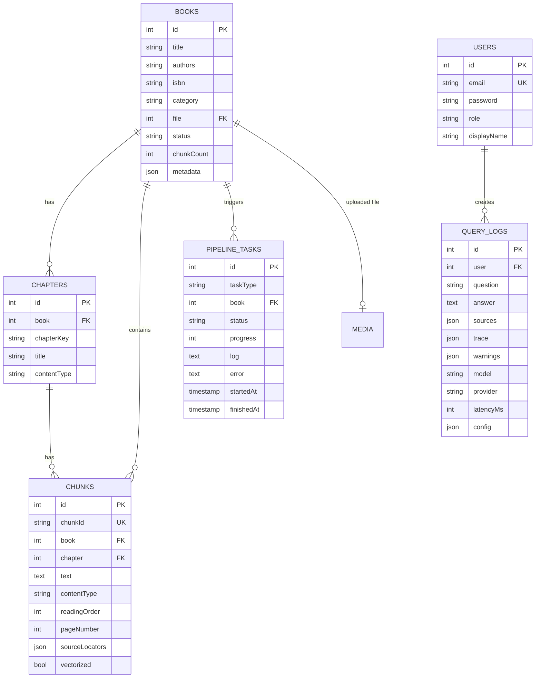

# Textbook RAG v2.0 — 数据库设计文档

> **版本**: 2.0 | **作者**: Bob (Architect) | **日期**: 2026-03-22
> **输入**: v2.0 system-architecture.md, v1.1 database.md, v1.1 SQLite schema

---

## 1. 数据库概述

v2.0 采用**双数据库**架构：

| 组件 | 技术 | 数据目录 | 用途 | 管理者 |
|------|------|----------|------|--------|
| **PostgreSQL 15+** | Payload CMS 自动管理 | `data/postgres/` | 内容元数据 + 用户 + 日志 | Payload |
| **SQLite** (Engine 内部) | textbook_rag.sqlite3 | `data/textbook_rag.sqlite3` | FTS5 全文搜索 + TOC 索引 + PageIndex | Engine |
| **ChromaDB** | chroma_persist/ | `data/chroma_persist/` | 向量嵌入 + 语义搜索 | Engine |

> **数据目录统一**: 所有持久化数据均存储在 `data/` 目录下，便于备份和管理。Docker Compose 中 PostgreSQL volume 映射为 `./data/postgres:/var/lib/postgresql/data`。

**设计原则**: Payload 管内容, Engine 管计算。PostgreSQL 由 Payload 自动创建表结构（无需手写 SQL），Engine 内部 SQLite 保留 v1.1 检索策略数据。

---

## 2. PostgreSQL — Payload Collections

> Payload 3.x 根据 Collection 定义自动创建和管理 PostgreSQL 表。表名由 `slug` 决定。

### 2.1 Books

```typescript
// payload/src/collections/Books.ts
slug: 'books'
```

| 字段 | Payload 类型 | PG 类型 | 约束 | v1.1 映射 | 说明 |
|------|-------------|---------|------|----------|------|
| id | (auto) | SERIAL | PK | id | 自增主键 |
| title | text | VARCHAR | NOT NULL | title | 书名 |
| authors | text | VARCHAR | — | authors | 作者 |
| isbn | text | VARCHAR | — | — | ISBN (新增) |
| category | select | VARCHAR | NOT NULL, DEFAULT 'textbook' | category | textbook/ecdev/real_estate |
| file | upload (media) | INTEGER FK | — | — | PDF 文件 (新增) |
| status | select | VARCHAR | DEFAULT 'pending' | — | pending/processing/indexed/error |
| chunkCount | number | INTEGER | — | chunk_count | chunk 数量 |
| metadata | json | JSONB | — | — | 扩展元数据 |
| createdAt | (auto) | TIMESTAMP | — | — | Payload 自动 |
| updatedAt | (auto) | TIMESTAMP | — | — | Payload 自动 |

**Access Control**:
- read: 所有人
- create/update: editor + admin
- delete: admin only

**Hooks**:
- `afterChange`: 当 file 字段有值且 status=pending 时 → `POST /engine/ingest`

### 2.2 Chapters

```typescript
slug: 'chapters'
```

| 字段 | Payload 类型 | PG 类型 | 约束 | v1.1 映射 | 说明 |
|------|-------------|---------|------|----------|------|
| id | (auto) | SERIAL | PK | id | — |
| book | relationship | INTEGER FK → books | NOT NULL | book_id | 所属书籍 |
| chapterKey | text | VARCHAR | NOT NULL | chapter_key | 章节标识 |
| title | text | VARCHAR | NOT NULL | title | 章节标题 |
| contentType | select | VARCHAR | — | content_type | 内容类型 |

### 2.3 Chunks

```typescript
slug: 'chunks'
```

| 字段 | Payload 类型 | PG 类型 | 约束 | v1.1 映射 | 说明 |
|------|-------------|---------|------|----------|------|
| id | (auto) | SERIAL | PK | id | — |
| chunkId | text | VARCHAR | UNIQUE, NOT NULL | chunk_id | chunk 唯一标识 |
| book | relationship | INTEGER FK → books | — | book_id | 所属书籍 |
| chapter | relationship | INTEGER FK → chapters | — | chapter_id | 所属章节 |
| text | textarea | TEXT | NOT NULL | text | chunk 文本 |
| contentType | select | VARCHAR | — | content_type | text/table/equation/code/image |
| readingOrder | number | INTEGER | — | reading_order | 阅读顺序 |
| pageNumber | number | INTEGER | — | pages.page_number | 合并 pages 表 |
| sourceLocators | json | JSONB | — | source_locators.* | [{x0,y0,x1,y1,page,w,h}] |
| vectorized | checkbox | BOOLEAN | DEFAULT false | — | 是否已向量化 |

**v1.1 → v2.0 合并说明**:
- `pages` 表 → 合并为 `chunks.pageNumber`
- `source_locators` 表 → 合并为 `chunks.sourceLocators` JSON 字段
- `chroma_document_id` → 不再存储（Engine 内部管理）

### 2.4 Users

```typescript
slug: 'users'
auth: true  // Payload 内置认证
```

| 字段 | Payload 类型 | PG 类型 | 约束 | 说明 |
|------|-------------|---------|------|------|
| id | (auto) | SERIAL | PK | — |
| email | (auth) | VARCHAR | UNIQUE, NOT NULL | Payload auth 自动管理 |
| password | (auth) | VARCHAR | NOT NULL, hashed | Payload auth 自动管理 |
| role | select | VARCHAR | DEFAULT 'reader' | admin/editor/reader |
| displayName | text | VARCHAR | — | 显示名称 |
| createdAt | (auto) | TIMESTAMP | — | — |
| updatedAt | (auto) | TIMESTAMP | — | — |

**Access Control**:
- read: admin 可读所有, 普通用户只读自己
- update: admin 可改所有, 普通用户只改自己
- role 字段: 只有 admin 能修改

### 2.5 PipelineTasks

```typescript
slug: 'pipeline-tasks'
```

| 字段 | Payload 类型 | PG 类型 | 约束 | 说明 |
|------|-------------|---------|------|------|
| id | (auto) | SERIAL | PK | — |
| taskType | select | VARCHAR | NOT NULL | ingest/vectorize/reindex/full |
| book | relationship | INTEGER FK → books | — | 关联书籍 |
| status | select | VARCHAR | DEFAULT 'queued' | queued/running/done/error |
| progress | number | INTEGER | DEFAULT 0, CHECK(0..100) | 进度百分比 |
| log | textarea | TEXT | — | 执行日志 |
| error | textarea | TEXT | — | 错误信息 |
| startedAt | date | TIMESTAMP | — | 开始时间 |
| finishedAt | date | TIMESTAMP | — | 完成时间 |

### 2.6 QueryLogs

```typescript
slug: 'query-logs'
```

| 字段 | Payload 类型 | PG 类型 | 约束 | 说明 |
|------|-------------|---------|------|------|
| id | (auto) | SERIAL | PK | — |
| user | relationship | INTEGER FK → users | — | 查询用户 |
| question | text | VARCHAR | NOT NULL | 用户问题 |
| answer | textarea | TEXT | — | 系统回答 |
| sources | json | JSONB | — | SourceInfo[] |
| trace | json | JSONB | — | v1.1 QueryTrace 完整快照 |
| warnings | json | JSONB | — | QualityWarning[] |
| model | text | VARCHAR | — | 使用的模型 |
| provider | text | VARCHAR | — | ollama/azure_openai |
| latencyMs | number | INTEGER | — | 响应延迟 |
| config | json | JSONB | — | QueryConfig 快照 |
| createdAt | (auto) | TIMESTAMP | — | — |

**Access Control**: admin 或 owner 可读

### 2.7 Media (Payload 内置)

Payload 内置的文件上传 Collection，用于存储上传的 PDF 文件。

---

## 3. Engine 内部 SQLite

Engine 保留轻量 SQLite 用于 FTS5 + TOC + PageIndex 检索策略，与 v1.1 行为一致。

### 3.1 保留的表

```sql
-- FTS5 虚拟表 (全文搜索策略)
CREATE VIRTUAL TABLE IF NOT EXISTS chunk_fts USING fts5(
    text,
    content='',  -- 不存储原文，对应 PG chunks
    tokenize='porter unicode61'
);

-- TOC 目录索引 (TOC 策略)
CREATE TABLE IF NOT EXISTS toc_entries (
    id          INTEGER PRIMARY KEY AUTOINCREMENT,
    book_id     INTEGER NOT NULL,
    level       INTEGER NOT NULL,
    number      TEXT,
    title       TEXT    NOT NULL,
    pdf_page    INTEGER,
    sort_order  INTEGER NOT NULL DEFAULT 0
);
CREATE INDEX IF NOT EXISTS idx_toc_entries_book ON toc_entries(book_id);

-- PageIndex 结构索引 (PageIndex 策略)
CREATE TABLE IF NOT EXISTS page_structure (
    id              INTEGER PRIMARY KEY AUTOINCREMENT,
    book_id         INTEGER NOT NULL,
    node_id         TEXT    NOT NULL,
    title           TEXT    NOT NULL,
    level           INTEGER NOT NULL,
    parent_node_id  TEXT,
    page_number     INTEGER,
    line_num        INTEGER,
    sort_order      INTEGER NOT NULL DEFAULT 0
);
CREATE INDEX IF NOT EXISTS idx_page_structure_book ON page_structure(book_id);

-- Prompt 模板 (Engine 内部配置)
CREATE TABLE IF NOT EXISTS prompt_templates (
    id          TEXT    PRIMARY KEY,
    name        TEXT    NOT NULL,
    description TEXT    NOT NULL DEFAULT '',
    system_prompt TEXT  NOT NULL,
    is_builtin  INTEGER NOT NULL DEFAULT 1,
    created_at  TEXT    DEFAULT (datetime('now')),
    updated_at  TEXT    DEFAULT (datetime('now'))
);

-- 评估运行 (Engine 内部)
CREATE TABLE IF NOT EXISTS evaluation_runs (
    id          INTEGER PRIMARY KEY AUTOINCREMENT,
    run_name    TEXT    NOT NULL,
    created_at  TEXT    DEFAULT (datetime('now')),
    config_json TEXT    NOT NULL DEFAULT '{}'
);

CREATE TABLE IF NOT EXISTS evaluation_questions (
    id          INTEGER PRIMARY KEY AUTOINCREMENT,
    run_id      INTEGER NOT NULL REFERENCES evaluation_runs(id),
    question    TEXT    NOT NULL,
    ground_truth TEXT,
    system_answer TEXT,
    score       REAL,
    top3_doc_ids TEXT,
    relevance_scores TEXT,
    trace_json  TEXT,
    created_at  TEXT    DEFAULT (datetime('now'))
);
```

### 3.2 FTS5 数据同步

Engine ingest 流程写入 FTS5 索引时，需要与 PostgreSQL chunks 保持同步：

```
Engine ingest pipeline:
  1. chunk_builder → chunks data
  2. Payload API → batch create Chunks (PG)
  3. fts5_builder → INSERT INTO chunk_fts (Engine SQLite)
  4. vector_builder → ChromaDB upsert
```

---

## 4. ChromaDB Schema (不变)

| 字段 | 说明 |
|------|------|
| id | UUID |
| document | chunk text (max 8000 chars) |
| metadata.book_id | 书目 key |
| metadata.chunk_id | chunk_id |
| metadata.page_idx | page index |
| metadata.content_type | text/table/image/equation |
| metadata.category | textbook/ecdev/real_estate |

---

## 5. ER 图



---

## 6. v1.1 → v2.0 数据迁移

### 6.1 迁移映射

| v1.1 SQLite 表 | v2.0 目标 | 迁移方式 |
|----------------|----------|----------|
| books | PG Books (Payload API) | 字段映射 + category 保留 |
| chapters | PG Chapters (Payload API) | 直接映射 |
| pages | PG Chunks.pageNumber | 合并到 chunks |
| chunks | PG Chunks (Payload API) | 含 sourceLocators 合并 |
| source_locators | PG Chunks.sourceLocators | 按 chunk_id GROUP → JSON |
| chunk_fts | Engine SQLite chunk_fts | 重建 FTS5 索引 |
| toc_entries | Engine SQLite toc_entries | 直接复制 |
| page_structure | Engine SQLite page_structure | 直接复制 |
| prompt_templates | Engine SQLite prompt_templates | 直接复制 |
| evaluation_runs | Engine SQLite evaluation_runs | 直接复制 |
| evaluation_questions | Engine SQLite evaluation_questions | 直接复制 |
| book_assets | (不迁移) | Payload Media 替代 |

### 6.2 迁移脚本流程

```python
# scripts/migrate_v11_to_v20.py
def migrate():
    """SQLite → PostgreSQL + Engine SQLite 迁移 (幂等)"""
    
    # 1. 读取 v1.1 SQLite
    v11_db = sqlite3.connect("data/textbook_rag.sqlite3")
    
    # 2. 迁移到 Payload PostgreSQL (via REST API)
    for book in v11_db.execute("SELECT * FROM books"):
        payload_api.create_or_update("books", map_book(book))
    
    for chapter in v11_db.execute("SELECT * FROM chapters"):
        payload_api.create_or_update("chapters", map_chapter(chapter))
    
    for chunk in v11_db.execute("SELECT * FROM chunks"):
        locators = v11_db.execute(
            "SELECT * FROM source_locators WHERE chunk_id=?", [chunk.id]
        )
        payload_api.create_or_update("chunks", map_chunk(chunk, locators))
    
    # 3. 复制检索数据到 Engine SQLite
    engine_db = sqlite3.connect("data/engine.sqlite3")
    copy_table(v11_db, engine_db, "toc_entries")
    copy_table(v11_db, engine_db, "page_structure")
    copy_table(v11_db, engine_db, "prompt_templates")
    copy_table(v11_db, engine_db, "evaluation_runs")
    copy_table(v11_db, engine_db, "evaluation_questions")
    rebuild_fts5(engine_db, payload_api)  # 从 PG chunks 重建 FTS5
    
    # 4. 验证
    assert_counts_match(v11_db, payload_api, engine_db)
```

---

## 7. 性能考虑

### 7.1 PostgreSQL 索引

Payload 自动为 PK、relationship FK、unique 字段创建索引。额外推荐：

```sql
-- 按 category 过滤 (高频)
CREATE INDEX idx_books_category ON books(category);

-- 按 status 过滤 (管理员查看)
CREATE INDEX idx_books_status ON books(status);

-- Chunks 按 book 过滤 (高频)
-- Payload relationship 自动创建

-- PipelineTasks 按 status (管理员监控)
CREATE INDEX idx_pipeline_tasks_status ON pipeline_tasks(status);

-- QueryLogs 按 user (历史查看)
-- Payload relationship 自动创建
```

### 7.2 大表优化

- **Chunks** 表可能有数万行 → Payload 分页默认 10, 合理
- **QueryLogs** 表持续增长 → 考虑定期归档或 TTL

### 7.3 迁移性能

- v1.1 SQLite 164MB, ~30K chunks → Payload batch API 批量写入
- 预估迁移时间: < 5 分钟
