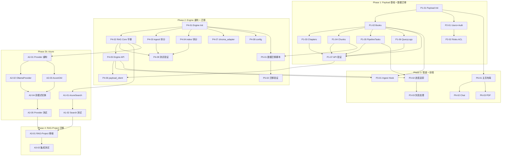

# Textbook RAG v2.0 — 开发任务清单 (Sprint Plan)

> **版本**: 2.0 | **日期**: 2026-03-22 | **输入**: prd.md, system-architecture.md

---

## 概览

- **Epic 数量**: 9 (6 Payload + 3 Azure)
- **Story 总数**: 47
- **预估总工时**: ~112h (6-8 周)

---

## Epic 列表

### EPIC-P1: Payload CMS 基础设施 (P0)

| ID | 标题 | 类型 | 优先级 | 预估 | 依赖 | 状态 |
|----|------|------|--------|------|------|------|
| P1-01 | 初始化 Payload 3.x + Next.js 项目 | Infra | P0 | 2h | — | pending |
| P1-02 | Books Collection 定义 | Backend | P0 | 2h | P1-01 | pending |
| P1-03 | Chapters Collection 定义 | Backend | P0 | 1h | P1-02 | pending |
| P1-04 | Chunks Collection 定义 | Backend | P0 | 2h | P1-02 | pending |
| P1-05 | PipelineTasks Collection 定义 | Backend | P0 | 1.5h | P1-02 | pending |
| P1-06 | QueryLogs Collection 定义 | Backend | P1 | 1.5h | P1-02 | pending |
| P1-07 | 验证自动 REST + GraphQL API | Testing | P0 | 1h | P1-02..06 | pending |

### EPIC-P2: 用户认证与权限 (P0)

| ID | 标题 | 类型 | 优先级 | 预估 | 依赖 | 状态 |
|----|------|------|--------|------|------|------|
| P2-01 | Users Collection + Auth 配置 | Backend | P0 | 2h | P1-01 | pending |
| P2-02 | 角色权限 Access Control (admin/editor/reader) | Backend | P0 | 3h | P2-01 | pending |
| P2-03 | 登录/注册页面 | Frontend | P0 | 2h | P2-01 | pending |

### EPIC-P3: 自动化入库管道 (P0)

| ID | 标题 | 类型 | 优先级 | 预估 | 依赖 | 状态 |
|----|------|------|--------|------|------|------|
| P3-01 | Books afterChange Hook → POST /engine/ingest | Backend | P0 | 2h | P1-02, P4-05 | pending |
| P3-02 | 入库进度追踪 (PipelineTask status/progress 更新) | Backend | P0 | 2h | P1-05, P4-05 | pending |
| P3-03 | 入库失败处理 + 重试机制 | Backend | P0 | 2h | P3-02 | pending |

### EPIC-P4: Engine 模块化重构 (P0)

| ID | 标题 | 类型 | 优先级 | 预估 | 依赖 | 状态 |
|----|------|------|--------|------|------|------|
| P4-01 | engine/ 包初始化 + pyproject.toml | Infra | P0 | 1h | — | pending |
| P4-02 | RAG Core 平移 (core→engine/rag/) | Backend | P0 | 3h | P4-01 | pending |
| P4-03 | scripts/rebuild_db.py → engine/ingest/ 模块拆分 | Backend | P0 | 6h | P4-01 | pending |
| P4-04 | scripts/ → engine/index/ 模块拆分 | Backend | P0 | 4h | P4-01 | pending |
| P4-05 | Engine FastAPI 薄层 (api/routes) | Backend | P0 | 3h | P4-02 | pending |
| P4-06 | payload_client adapter | Backend | P0 | 2h | P4-05, P1-07 | pending |
| P4-07 | chroma_adapter 重构 | Backend | P0 | 1.5h | P4-01 | pending |
| P4-08 | engine/config.py 统一配置 | Backend | P0 | 1.5h | P4-01 | pending |
| P4-09 | v1.1 测试平移 + 全部通过验证 | Testing | P0 | 4h | P4-02..04 | pending |

### EPIC-P5: 数据迁移 (P0)

| ID | 标题 | 类型 | 优先级 | 预估 | 依赖 | 状态 |
|----|------|------|--------|------|------|------|
| P5-01 | SQLite→PostgreSQL 迁移脚本 | Backend | P0 | 4h | P1-04, P4-01 | pending |
| P5-02 | 迁移验证 (数据完整性检查) | Testing | P0 | 2h | P5-01 | pending |

### EPIC-P6: 前端迁移 (P1)

| ID | 标题 | 类型 | 优先级 | 预估 | 依赖 | 状态 |
|----|------|------|--------|------|------|------|
| P6-01 | Next.js 主页布局 (PDF+Chat 双栏) | Frontend | P1 | 4h | P1-01 | pending |
| P6-02 | ChatPanel 组件迁移 | Frontend | P1 | 3h | P6-01 | pending |
| P6-03 | PdfViewer 组件迁移 | Frontend | P1 | 3h | P6-01 | pending |
| P6-04 | BookSelector 组件迁移 | Frontend | P1 | 2h | P6-01 | pending |
| P6-05 | TracePanel 组件迁移 | Frontend | P1 | 2h | P6-01 | pending |
| P6-06 | RetrievalConfig + GenerationConfig 迁移 | Frontend | P1 | 2h | P6-01 | pending |
| P6-07 | ResizeHandle 迁移 | Frontend | P1 | 1h | P6-01 | pending |
| P6-08 | EcDev Reports 页面迁移 | Frontend | P1 | 3h | P6-01 | pending |
| P6-09 | Admin Panel 路由集成 (/admin) | Frontend | P1 | 1h | P1-01 | pending |

~~### EPIC-P7: Docker 部署~~ — **已移除** (本地 VSCode Tasks 部署即可)

### EPIC-A1: Azure AI Search 策略 (P0)

| ID | 标题 | 类型 | 优先级 | 预估 | 依赖 | 状态 |
|----|------|------|--------|------|------|------|
| A1-01 | AzureSearchStrategy 实现 | Backend | P0 | 4h | P4-02 | pending |
| A1-02 | Azure AI Search 集成测试 | Testing | P0 | 2h | A1-01 | pending |
| A1-03 | Azure Blob Storage adapter (可选) | Backend | P1 | 2h | P4-01 | pending |

### EPIC-A2: Azure OpenAI GPT-4o (P0)

| ID | 标题 | 类型 | 优先级 | 预估 | 依赖 | 状态 |
|----|------|------|--------|------|------|------|
| A2-01 | GenerationEngine → Provider 模式重构 | Backend | P0 | 2h | P4-02 | pending |
| A2-02 | OllamaProvider 提取 | Backend | P0 | 1.5h | A2-01 | pending |
| A2-03 | AzureOpenAIProvider 实现 | Backend | P0 | 3h | A2-01 | pending |
| A2-04 | 双模式切换 + 回退机制 | Backend | P0 | 2h | A2-02, A2-03 | pending |
| A2-05 | Provider 集成测试 | Testing | P0 | 2h | A2-04 | pending |

### EPIC-A3: RAG-Project 迁移 (P1)

| ID | 标题 | 类型 | 优先级 | 预估 | 依赖 | 状态 |
|----|------|------|--------|------|------|------|
| A3-01 | Azure 模块移植到 RAG-Project | Backend | P1 | 4h | A1-02, A2-05 | pending |
| A3-02 | RAG-Project 集成测试 | Testing | P1 | 3h | A3-01 | pending |
| A3-03 | RAG-Project 端到端验证 | Testing | P1 | 2h | A3-02 | pending |

---

## 依赖图

---

## Sprint 规划

### Sprint 1 (Week 1-2): Payload 基础 + Engine 初始化

**目标**: Payload 全部 Collection 就绪 + Engine 包骨架建立

| Story | 预估 |
|-------|------|
| P1-01 Payload Init | 2h |
| P1-02~06 All Collections | 8h |
| P1-07 API 验证 | 1h |
| P2-01 Users+Auth | 2h |
| P2-02 Roles ACL | 3h |
| P4-01 Engine Init | 1h |
| P4-08 config.py | 1.5h |
| **小计** | **18.5h** |

### Sprint 2 (Week 3-4): Engine Core + 数据迁移

**目标**: RAG Core 平移完成，scripts 拆分完成，数据迁移完成

| Story | 预估 |
|-------|------|
| P4-02 RAG Core 平移 | 3h |
| P4-03 ingest/ 拆分 | 6h |
| P4-04 index/ 拆分 | 4h |
| P4-07 chroma_adapter | 1.5h |
| P4-05 Engine API | 3h |
| P4-06 payload_client | 2h |
| P4-09 测试验证 | 4h |
| P5-01 迁移脚本 | 4h |
| P5-02 迁移验证 | 2h |
| **小计** | **29.5h** |

### Sprint 3 (Week 5-6): Azure + 管道 + 前端

**目标**: Azure 策略和 Provider 完成，入库管道跑通，前端核心页面迁移

| Story | 预估 |
|-------|------|
| A1-01 AzureSearch | 4h |
| A1-02 Search 测试 | 2h |
| A2-01~05 Provider 全部 | 10.5h |
| P3-01~03 入库管道 | 6h |
| P6-01~04 核心前端 | 12h |
| **小计** | **34.5h** |

### Sprint 4 (Week 7-8): 前端完善 + Docker + RAG-Project

**目标**: 全部前端完成，Docker 一键启动，RAG-Project 迁移验证

| Story | 预估 |
|-------|------|
| P6-05~09 剩余前端 | 9h |
| P2-03 登录/注册页 | 2h |
| A1-03 Azure Blob | 2h |
| A3-01~03 RAG-Project 迁移 | 9h |
| **小计** | **22h** |

---

## Story 详情

### [P1-01] 初始化 Payload 3.x + Next.js 项目

**类型**: Infra | **Epic**: EPIC-P1 | **优先级**: P0 | **预估**: 2h

#### 描述
创建 `payload/` 目录，初始化 Payload 3.x + Next.js 15 项目。配置 PostgreSQL 连接。

#### 验收标准
- [ ] `payload/` 目录包含 Payload 3.x 项目骨架
- [ ] `payload.config.ts` 基础配置就绪
- [ ] PostgreSQL 连接配置 (DATABASE_URI from .env)
- [ ] `npm run dev` 能启动并访问 Admin Panel
- [ ] package.json 包含所有必要依赖

#### 文件
- `payload/package.json`
- `payload/src/payload.config.ts`
- `payload/tsconfig.json`
- `payload/.env`

---

### [P4-01] Engine 包初始化 + pyproject.toml

**类型**: Infra | **Epic**: EPIC-P4 | **优先级**: P0 | **预估**: 1h

#### 描述
创建 `engine/` 独立 Python 包，包含 pyproject.toml, 目录结构骨架。

#### 验收标准
- [ ] `engine/engine/__init__.py` 存在
- [ ] `engine/pyproject.toml` 定义包元数据和依赖
- [ ] 子目录 rag/, ingest/, index/, api/, adapters/ 均有 `__init__.py`
- [ ] `uv pip install -e engine/` 可安装

#### 文件
- `engine/pyproject.toml`
- `engine/engine/__init__.py`
- `engine/engine/rag/__init__.py`
- `engine/engine/ingest/__init__.py`
- `engine/engine/index/__init__.py`
- `engine/engine/api/__init__.py`
- `engine/engine/adapters/__init__.py`

---

### [P4-02] RAG Core 平移

**类型**: Backend | **Epic**: EPIC-P4 | **优先级**: P0 | **预估**: 3h

#### 描述
将 `backend/app/core/` 全部文件平移到 `engine/engine/rag/`，仅修改 import 路径。

#### 验收标准
- [ ] engine/rag/ 包含: core.py, retrieval.py, generation.py, citation.py, quality.py, fusion.py, trace.py, config.py, types.py
- [ ] engine/rag/strategies/ 包含 5 个策略文件 + base.py + registry.py
- [ ] 所有 import 路径从 `backend.app.core` → `engine.rag`
- [ ] 逻辑零修改

#### 依赖
- P4-01

---

### [P4-03] scripts/rebuild_db.py → engine/ingest/ 模块拆分

**类型**: Backend | **Epic**: EPIC-P4 | **优先级**: P0 | **预估**: 6h

#### 描述
将 28KB rebuild_db.py 拆分为独立模块: pdf_parser, chunk_builder, toc_extractor, metadata_enricher。

#### 验收标准
- [ ] engine/ingest/pdf_parser.py — MinerU 输出解析
- [ ] engine/ingest/chunk_builder.py — 分块逻辑
- [ ] engine/ingest/toc_extractor.py — TOC 提取
- [ ] engine/ingest/metadata_enricher.py — category/bbox 元数据
- [ ] 每个模块有独立单元测试
- [ ] 对比输出与 v1.1 rebuild_db.py 完全一致

#### 依赖
- P4-01

---

### [P4-05] Engine FastAPI 薄层

**类型**: Backend | **Epic**: EPIC-P4 | **优先级**: P0 | **预估**: 3h

#### 描述
创建仅供 Payload 内部调用的 FastAPI 应用，3 个端点。

#### 验收标准
- [ ] POST /engine/query → RAGCore.query()
- [ ] POST /engine/ingest → Ingest Pipeline
- [ ] GET /engine/health → 健康检查
- [ ] GET /engine/strategies → 策略列表
- [ ] GET /engine/models → Ollama 模型列表
- [ ] GET /engine/providers → Provider 列表

#### 依赖
- P4-02

---

### [P5-01] SQLite → PostgreSQL 迁移脚本

**类型**: Backend | **Epic**: EPIC-P5 | **优先级**: P0 | **预估**: 4h

#### 描述
编写迁移脚本，将 v1.1 的 164MB SQLite 数据迁移到 Payload PostgreSQL Collections。

#### 验收标准
- [ ] 迁移脚本读取 v1.1 SQLite，通过 Payload REST API 写入 PG
- [ ] Books, Chapters, Chunks 数量与 SQLite 一致
- [ ] 脚本支持重复运行（幂等）
- [ ] 迁移后 Admin Panel 可查看所有数据

#### 依赖
- P1-04, P4-01

---

### [A1-01] AzureSearchStrategy 实现

**类型**: Backend | **Epic**: EPIC-A1 | **优先级**: P0 | **预估**: 4h

#### 描述
实现 Azure AI Search 作为第 6 个可插拔检索策略。

#### 验收标准
- [ ] 继承 RetrievalStrategy 基类
- [ ] 使用 Azure AI Search REST API (semantic query)
- [ ] 返回统一 ChunkHit 格式
- [ ] is_available 基于环境变量判断
- [ ] 不配置 Azure 时优雅降级（不出现在策略列表）

#### 依赖
- P4-02

---

### [A2-01] GenerationEngine → Provider 模式重构

**类型**: Backend | **Epic**: EPIC-A2 | **优先级**: P0 | **预估**: 2h

#### 描述
将 v1.1 GenerationEngine 重构为 Provider 模式，支持 Ollama 和 Azure OpenAI 双模式。

#### 验收标准
- [ ] GenerationEngine 持有 providers dict
- [ ] 根据 config.provider 选择 provider
- [ ] Azure 失败时自动回退到 Ollama
- [ ] Trace 面板显示实际使用的 provider

#### 依赖
- P4-02
