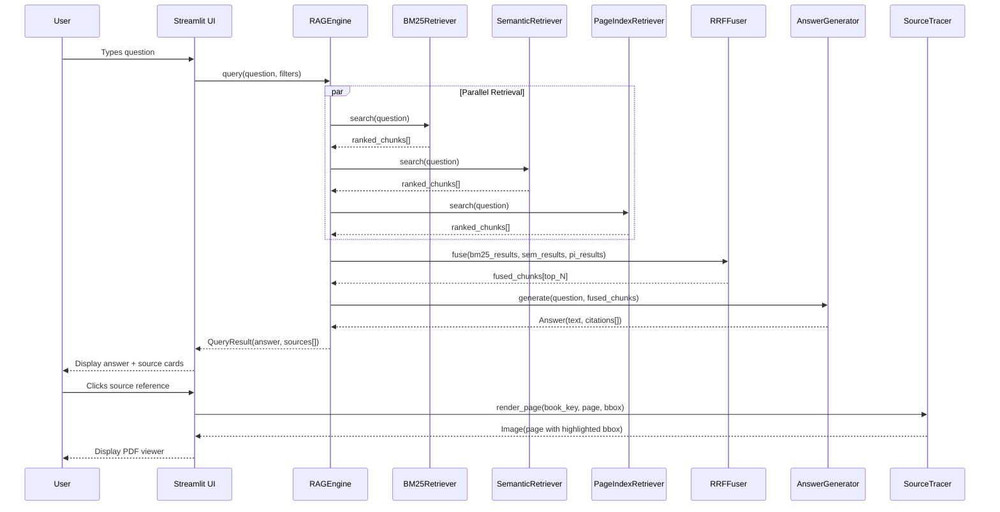

# AI Textbook Q&A System — System Architecture

> **Author**: Bob (Architect)
> **Phase**: 4/11 — System Architecture
> **Date**: 2026-03-04
> **Input**: `docs/requirements/prd.md`, `docs/design/ux-design.md`

---

## 1. Architecture Overview

### 1.1 Design Principles

1. **Modular Pipeline** — Each stage (parsing → chunking → indexing → retrieval → generation → display) is a separate module with clear interfaces
2. **Local-First** — All models and data stay on the local machine; no cloud dependency
3. **OOP-Ready** — Class-based design from the start to enable easy ROS 2 wrapping
4. **Configuration-Driven** — All tunable parameters (model names, paths, thresholds) in a central config
5. **Fail-Graceful** — Missing models or empty results produce informative messages, never crashes

### 1.2 Architecture Diagram

```
┌──────────────────────────────────────────────────────────────┐
│                    STREAMLIT UI (app.py)                      │
│  ┌──────────┐  ┌──────────────┐  ┌────────────────────────┐ │
│  │ Question │  │   Answer +   │  │  PDF Viewer + Bbox     │ │
│  │  Input   │  │  Citations   │  │  Highlight             │ │
│  └────┬─────┘  └──────▲───────┘  └──────────▲─────────────┘ │
│       │               │                      │               │
└───────┼───────────────┼──────────────────────┼───────────────┘
        │               │                      │
        ▼               │                      │
┌───────────────────────┼──────────────────────┼───────────────┐
│              RAG ENGINE (rag_engine.py)       │               │
│  ┌────────────────────┼───────┐              │               │
│  │    RETRIEVER        │      │              │               │
│  │  ┌──────────┐ ┌──────────┐ │ ┌──────────┐│               │
│  │  │  BM25    │ │ Semantic │ │ │ PageIndex ││               │
│  │  │ (SQLite  │ │(ChromaDB)│ │ │   Tree   ││               │
│  │  │  FTS5)   │ │          │ │ │  Search  ││               │
│  │  └────┬─────┘ └────┬─────┘ │ └────┬─────┘│               │
│  │       │             │       │      │      │               │
│  │       └──────┬──────┘       │      │      │               │
│  │              │              │      │      │               │
│  │        ┌─────▼─────┐       │      │      │               │
│  │        │    RRF     │◄─────┼──────┘      │               │
│  │        │   Fusion   │       │             │               │
│  │        └─────┬──────┘       │             │               │
│  └──────────────┼──────────────┘             │               │
│                 │                             │               │
│           ┌─────▼──────┐              ┌──────┴──────┐        │
│           │  GENERATOR │              │   SOURCE    │        │
│           │  (Ollama   │              │   TRACER    │        │
│           │ qwen2.5)   │              │  (PDF bbox) │        │
│           └─────┬──────┘              └─────────────┘        │
│                 │                                             │
└─────────────────┼─────────────────────────────────────────────┘
                  │
        ┌─────────▼──────────┐
        │   DATA STORES      │
        │  ┌──────────────┐  │
        │  │ SQLite + FTS5│  │     ┌─────────────────────────┐
        │  └──────────────┘  │     │  OFFLINE PIPELINE       │
        │  ┌──────────────┐  │     │  (preprocessing/)       │
        │  │   ChromaDB   │  │◄────│                         │
        │  └──────────────┘  │     │  PDF → MinerU → Chunks  │
        │  ┌──────────────┐  │     │      → Index            │
        │  │ PageIndex    │  │     │      → PageIndex Trees  │
        │  │ Trees (JSON) │  │     └─────────────────────────┘
        │  └──────────────┘  │
        │  ┌──────────────┐  │
        │  │ Original PDFs│  │
        │  └──────────────┘  │
        └────────────────────┘
```

---

## 2. Technology Stack

### 2.1 Core Stack

| Layer            | Technology            | Version | Rationale                                      |
| ---------------- | --------------------- | ------- | ---------------------------------------------- |
| Language         | Python                | 3.10+   | Project requirement; best ecosystem for NLP    |
| LLM Server       | Ollama                | 0.14+   | Local model serving; simple API                |
| LLM Model        | qwen2.5:0.5b          | latest  | 0.4 GB footprint; fits <1.5 GB budget          |
| Embedding        | sentence-transformers | latest  | all-MiniLM-L6-v2 (80 MB)                       |
| Vector Store     | ChromaDB              | latest  | Persistent, lightweight, Python-native         |
| Full-Text Search | SQLite + FTS5         | 3.35+   | BM25 ranking; zero config; built into Python   |
| PDF Parser       | MinerU (magic-pdf)    | latest  | DocLayout-YOLO; bbox coords preserved          |
| UI               | Streamlit             | latest  | Rapid prototyping; built-in components         |
| PDF Rendering    | PyMuPDF (fitz)        | latest  | Render PDF pages as images; draw bbox overlays |

### 2.2 Supporting Libraries

| Library                 | Purpose                             |
| ----------------------- | ----------------------------------- |
| `ollama`                | Python client for Ollama API        |
| `chromadb`              | ChromaDB client                     |
| `sentence-transformers` | Embedding model loading             |
| `fitz` (PyMuPDF)        | PDF page rendering + bbox drawing   |
| `Pillow`                | Image manipulation for bbox overlay |
| `pyyaml`                | Configuration loading               |
| `loguru`                | Structured logging                  |

---

## 3. System Components

### 3.1 Component List

| Component           | Module                             | Class                | Responsibility                                       |
| ------------------- | ---------------------------------- | -------------------- | ---------------------------------------------------- |
| Preprocessor        | `preprocessing/parser.py`          | `MinerUParser`       | Parse PDFs using MinerU, extract content_list.json   |
| Chunker             | `preprocessing/chunker.py`         | `LayoutAwareChunker` | Split content into chunks preserving tables/formulas |
| SQLite Indexer      | `indexing/sqlite_indexer.py`       | `SQLiteIndexer`      | Create/query FTS5 index                              |
| ChromaDB Indexer    | `indexing/chroma_indexer.py`       | `ChromaIndexer`      | Create/query vector index                            |
| PageIndex Builder   | `indexing/pageindex_builder.py`    | `PageIndexBuilder`   | Build TOC trees from content_list                    |
| BM25 Retriever      | `retrieval/bm25_retriever.py`      | `BM25Retriever`      | SQLite FTS5 keyword search                           |
| Semantic Retriever  | `retrieval/semantic_retriever.py`  | `SemanticRetriever`  | ChromaDB cosine similarity search                    |
| PageIndex Retriever | `retrieval/pageindex_retriever.py` | `PageIndexRetriever` | LLM-guided TOC navigation                            |
| RRF Fuser           | `retrieval/rrf_fuser.py`           | `RRFFuser`           | Reciprocal Rank Fusion                               |
| Generator           | `generation/generator.py`          | `AnswerGenerator`    | Ollama-based answer generation                       |
| Source Tracer       | `tracing/source_tracer.py`         | `SourceTracer`       | PDF rendering with bbox highlight                    |
| RAG Engine          | `rag_engine.py`                    | `RAGEngine`          | Orchestrates retrieval → fusion → generation         |
| Config              | `config.py`                        | `Config`             | Central configuration dataclass                      |
| Streamlit App       | `app.py`                           | —                    | UI entry point                                       |

### 3.2 Component Interaction (Data Flow)



---

## 4. Data Architecture

### 4.1 Data Model — Chunk

The fundamental data unit in the system is a **Chunk**:

```python
@dataclass
class Chunk:
    chunk_id: str           # Unique ID: "{book_key}_p{page}_{idx}"
    book_key: str           # e.g., "goodfellow_deep_learning"
    book_title: str         # e.g., "Deep Learning"
    chapter: str            # e.g., "8.5 Algorithms with Adaptive Learning Rates"
    section: str            # e.g., "8.5"
    page_number: int        # Original PDF page number
    content_type: str       # "text" | "table" | "formula" | "figure"
    text: str               # The chunk content (plain text / HTML / LaTeX)
    bbox: list[float]       # [x0, y0, x1, y1] on the PDF page
    text_level: int | None  # Heading level (1, 2, 3) if applicable
```

### 4.2 SQLite Schema

```sql
CREATE TABLE chunks (
    chunk_id      TEXT PRIMARY KEY,
    book_key      TEXT NOT NULL,
    book_title    TEXT NOT NULL,
    chapter       TEXT,
    section       TEXT,
    page_number   INTEGER NOT NULL,
    content_type  TEXT NOT NULL,
    text          TEXT NOT NULL,
    bbox_json     TEXT NOT NULL,  -- JSON: [x0, y0, x1, y1]
    text_level    INTEGER
);

-- FTS5 virtual table for full-text search
CREATE VIRTUAL TABLE chunks_fts USING fts5(
    chunk_id,
    book_title,
    chapter,
    text,
    content='chunks',
    content_rowid='rowid',
    tokenize='porter unicode61'
);
```

### 4.3 ChromaDB Collection

```python
# Collection: "textbook_chunks"
# Document: chunk.text
# Metadata: {
#     "chunk_id": str,
#     "book_key": str,
#     "book_title": str,
#     "chapter": str,
#     "section": str,
#     "page_number": int,
#     "content_type": str,
#     "bbox_json": str
# }
# Embedding: all-MiniLM-L6-v2 (384-dim)
```

### 4.4 PageIndex Tree (JSON)

```json
{
  "book_key": "goodfellow_deep_learning",
  "book_title": "Deep Learning",
  "tree": [
    {
      "title": "8 Optimization for Training Deep Models",
      "level": 1,
      "page_start": 274,
      "page_end": 329,
      "children": [
        {
          "title": "8.5 Algorithms with Adaptive Learning Rates",
          "level": 2,
          "page_start": 306,
          "page_end": 310,
          "children": []
        }
      ]
    }
  ]
}
```

### 4.5 Data Flow — Offline Pipeline

```
PDF files (textbooks/)
    ↓
MinerU (magic-pdf) → content_list.json per book (already in data/mineru_output/)
    ↓
LayoutAwareChunker → Chunk objects
    ↓  ↓  ↓
    │  │  └─→ PageIndexBuilder → pageindex_trees/{book_key}.json
    │  └────→ ChromaIndexer → chroma_db/ (persistent collection)
    └───────→ SQLiteIndexer → textbook_qa.db (FTS5 index)
```

---

## 5. API Design (Internal Python API)

Since this is a Streamlit app (not REST), the "API" is the internal Python interface:

### 5.1 RAGEngine Interface

```python
class RAGEngine:
    def __init__(self, config: Config):
        """Initialize all retrievers, generator, and tracer."""

    def query(
        self,
        question: str,
        book_filter: list[str] | None = None,
        content_type_filter: list[str] | None = None,
        top_k: int = 5
    ) -> QueryResult:
        """Execute full RAG pipeline: retrieve → fuse → generate."""

    def get_available_books(self) -> list[BookInfo]:
        """List all indexed books."""

@dataclass
class QueryResult:
    answer: str                    # Generated answer text with [1], [2] citations
    sources: list[SourceReference] # Source references for each citation
    retrieval_stats: dict          # Per-method timing and result counts

@dataclass
class SourceReference:
    citation_id: int       # [1], [2], etc.
    chunk: Chunk           # Full chunk data
    relevance_score: float # RRF fused score
```

### 5.2 SourceTracer Interface

```python
class SourceTracer:
    def render_page_with_highlight(
        self,
        book_key: str,
        page_number: int,
        bbox: list[float],
        zoom: float = 1.5
    ) -> PIL.Image:
        """Render PDF page as image with yellow bbox highlight."""

    def get_pdf_path(self, book_key: str) -> Path:
        """Resolve book_key to PDF file path."""
```

---

## 6. Security Architecture

### 6.1 Local-Only Policy

- **No outbound API calls** — Ollama runs on localhost:11434
- **No authentication needed** — single-user local app
- **No PII stored** — only textbook content in indexes

### 6.2 Input Sanitization

```python
def sanitize_query(query: str) -> str:
    """Prevent prompt injection by stripping control sequences."""
    # Strip system-prompt-like prefixes
    # Limit query length to 500 chars
    # Remove special tokens
```

### 6.3 File Access

- PDF files accessed by resolved `book_key` → path mapping (no user-controlled paths)
- No directory traversal possible; all paths are resolved from config

---

## 7. Directory Structure

```
textbook-rag/
├── nlp/assignment2/                   # Assignment workspace
│   ├── .dev-state.yaml                # Development workflow state
│   ├── assignment2_proposal.md        # Proposal document
│   ├── src/                           # Source code
│   │   ├── app.py                     # Streamlit entry point
│   │   ├── config.py                  # Central configuration
│   │   ├── rag_engine.py              # RAG orchestrator
│   │   ├── preprocessing/             # Offline pipeline
│   │   │   ├── __init__.py
│   │   │   ├── parser.py              # MinerU content_list parser
│   │   │   └── chunker.py             # Layout-aware chunking
│   │   ├── indexing/                   # Index builders
│   │   │   ├── __init__.py
│   │   │   ├── sqlite_indexer.py      # SQLite FTS5 indexer
│   │   │   ├── chroma_indexer.py      # ChromaDB indexer
│   │   │   └── pageindex_builder.py   # TOC tree builder
│   │   ├── retrieval/                 # Retrieval methods
│   │   │   ├── __init__.py
│   │   │   ├── bm25_retriever.py      # SQLite FTS5 BM25 search
│   │   │   ├── semantic_retriever.py  # ChromaDB vector search
│   │   │   ├── pageindex_retriever.py # LLM-guided TOC search
│   │   │   └── rrf_fuser.py          # Reciprocal Rank Fusion
│   │   ├── generation/               # LLM answer generation
│   │   │   ├── __init__.py
│   │   │   └── generator.py          # Ollama-based generator
│   │   └── tracing/                  # Source tracing
│   │       ├── __init__.py
│   │       └── source_tracer.py      # PDF page rendering + bbox
│   ├── data/                         # Generated data (gitignored)
│   │   ├── textbook_qa.db            # SQLite FTS5 index
│   │   ├── chroma_db/                # ChromaDB persistent store
│   │   └── pageindex_trees/          # JSON TOC trees per book
│   ├── scripts/                      # Utility scripts
│   │   ├── build_index.py            # Full indexing pipeline
│   │   └── evaluate.py              # 20-question evaluation
│   └── tests/                        # Test files
│       ├── test_chunker.py
│       ├── test_retrieval.py
│       └── test_rag_engine.py
├── data/mineru_output/               # Pre-existing MinerU output (50 books)
├── textbooks/                        # Original PDF files + topic_index.json
├── docs/                             # Project documentation
│   ├── requirements/
│   ├── design/
│   ├── architecture/
│   └── reviews/
└── scripts/                          # Global scripts (rebuild_topic_index.py)
```

---

## 8. Key Architectural Decisions

### ADR-1: Reuse Existing MinerU Output

**Decision**: Use the pre-existing `data/mineru_output/` content_list.json files instead of re-running MinerU.

**Rationale**: MinerU has already been run on all 50 books. The `content_list.json` files contain full text + bbox + page_idx + text_level data. Re-running is unnecessary and time-consuming.

**Consequence**: The "preprocessing" module only needs to parse `content_list.json`, not invoke MinerU directly.

### ADR-2: Parallel Retrieval with Timeout

**Decision**: Run BM25, Semantic, and PageIndex retrieval in parallel (using `concurrent.futures`), with a per-method timeout of 10 seconds.

**Rationale**: Total latency budget is 30s. Parallel execution reduces wall-clock time. A timeout ensures one slow method doesn't block the entire pipeline.

**Consequence**: If PageIndex times out (it uses an LLM call), RRF fusion proceeds with results from BM25 and Semantic only.

### ADR-3: PageIndex Tree Token Budget

**Decision**: Limit PageIndex tree prompt to top-2 levels of the TOC tree per book. Only expand selected branches for detailed navigation.

**Rationale**: qwen2.5:0.5b has limited context window. Full TOC trees for 30+ books would exceed the budget. Two-level summary (~50 tokens per book) is sufficient for initial filtering.

**Consequence**: PageIndex search does two LLM calls: (1) select relevant books/chapters from summaries, (2) drill into selected chapters' full subtrees.

### ADR-4: Metadata Filter as Structured Query (Not LLM)

**Decision**: Implement metadata filter search as a simple SQL query on the SQLite `chunks` table (WHERE clauses on book_key, chapter, page_number, content_type), not as a separate retrieval method requiring LLM.

**Rationale**: Metadata filtering is a structured query, not a ranking problem. SQL is faster, deterministic, and doesn't consume LLM budget.

**Consequence**: Metadata filter results are added to RRF fusion like any other method, but execution is sub-millisecond.

### ADR-5: PDF Rendering with PyMuPDF

**Decision**: Use PyMuPDF (fitz) to render PDF pages as images and overlay bbox highlights, rather than embedding a PDF.js viewer.

**Rationale**: Streamlit doesn't natively support PDF.js. Rendering to image with PyMuPDF is simpler, works cross-platform, and allows precise bbox overlay drawing. The `layout.pdf` or `span.pdf` files from MinerU output can be used as well.

**Consequence**: Zoom is implemented by rendering at higher DPI. Users cannot select text from the rendered image (acceptable for v1).

---

## 9. Configuration

```yaml
# config.yaml
ollama:
  host: "http://localhost:11434"
  model: "qwen2.5:0.5b"
  timeout: 30

embedding:
  model: "all-MiniLM-L6-v2"
  dimension: 384

retrieval:
  top_k: 5
  rrf_k: 60
  parallel_timeout: 10
  methods:
    bm25: true
    semantic: true
    pageindex: true
    metadata: true

chunking:
  max_tokens: 512
  overlap_tokens: 50

paths:
  mineru_output: "../../data/mineru_output"
  textbooks: "../../textbooks"
  sqlite_db: "data/textbook_qa.db"
  chroma_db: "data/chroma_db"
  pageindex_trees: "data/pageindex_trees"

books:
  # Auto-discovered from mineru_output directories
  # Can be filtered here
```

---

## 10. Scalability Considerations

| Concern           | Current Design            | Scaling Path                                   |
| ----------------- | ------------------------- | ---------------------------------------------- |
| More books        | Add PDFs + re-index       | Incremental indexing support                   |
| Larger context    | qwen2.5:0.5b (2K context) | Upgrade to qwen2.5:1.5b or 3b                  |
| Faster retrieval  | SQLite FTS5 + ChromaDB    | Add FAISS for faster ANN                       |
| Multi-user        | Single Streamlit session  | Deploy with Streamlit Cloud or FastAPI backend |
| Streaming answers | Full response wait        | Ollama streaming API + st.write_stream         |
