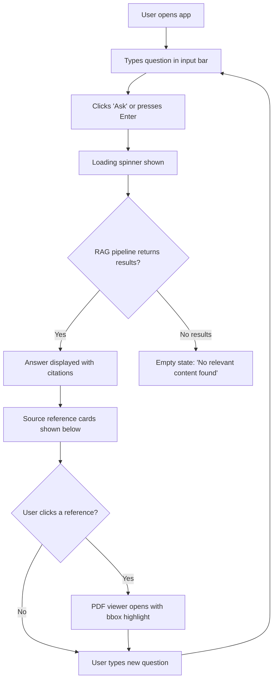
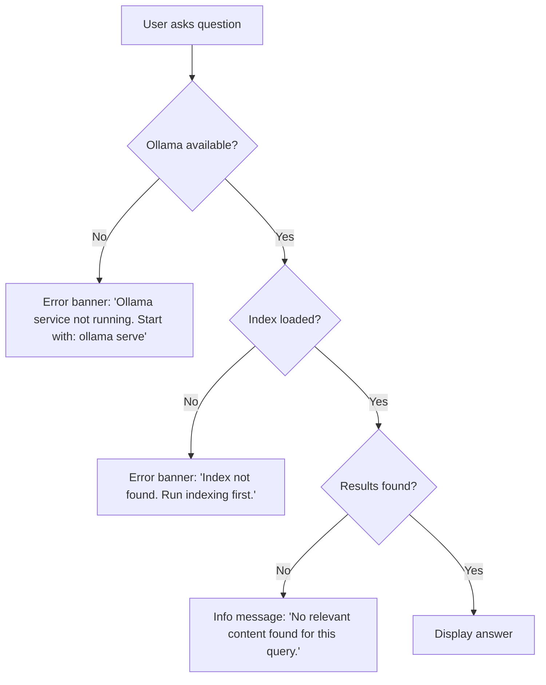

# AI Textbook Q&A System — UX Design

> **Author**: Bella (UI/UX Designer)
> **Phase**: 3/11 — UX Design
> **Date**: 2026-03-04
> **Input**: `docs/requirements/prd.md`

---

## 1. Information Architecture

### 1.1 Page Map (Streamlit Single-Page App)

This is a **single-page Streamlit application** with a sidebar + main content area layout.

```
App (single page)
├── Sidebar
│   ├── App Title & Logo
│   ├── Book Filter (multiselect)
│   ├── Content Type Filter (checkbox)
│   ├── Retrieval Method Toggle
│   └── Query History (expandable)
│
└── Main Content Area
    ├── Header Section
    │   └── Question Input Bar
    ├── Answer Section
    │   ├── Generated Answer (with inline citations)
    │   └── Source Reference Cards
    └── Source Viewer Section
        └── PDF Page Viewer with Bbox Overlay
```

### 1.2 Content Priority (Top → Bottom)

1. **Question Input** — always visible at top, primary action
2. **Generated Answer** — prominent display with citations
3. **Source Reference List** — compact cards below the answer
4. **PDF Source Viewer** — expandable panel, shown on reference click

---

## 2. User Flows

### 2.1 Primary Flow: Ask a Question



### 2.2 Source Tracing Flow

```mermaid
flowchart TD
    A[User sees citation e.g. '[1]' in answer] --> B[Scrolls to Source Reference section]
    B --> C[Clicks reference card]
    C --> D[PDF viewer panel expands]
    D --> E[Original PDF page rendered]
    E --> F[Yellow bbox highlights source region]
    F --> G{User action}
    G -->|Zoom in/out| H[Resize PDF view]
    G -->|Close viewer| I[Collapse PDF panel]
    G -->|Click another reference| C
```

### 2.3 Error Flow



---

## 3. Design System

### 3.1 Color Palette

```
Primary:        #6366F1  (Indigo-500 — main accent, buttons, links)
Primary Dark:   #4F46E5  (Indigo-600 — hover states)
Primary Light:  #EEF2FF  (Indigo-50 — backgrounds, highlights)

Background:     #FAFBFC  (Light gray — main bg)
Surface:        #FFFFFF  (White — cards, panels)
Surface Dark:   #F3F4F6  (Gray-100 — alternate sections)

Text Primary:   #111827  (Gray-900 — body text)
Text Secondary: #6B7280  (Gray-500 — labels, metadata)

Success:        #10B981  (Emerald-500 — correct answer indicator)
Warning:        #F59E0B  (Amber-500 — partial match)
Error:          #EF4444  (Red-500 — errors, no results)
Info:           #3B82F6  (Blue-500 — informational)

Bbox Highlight: rgba(250, 204, 21, 0.35)  (Yellow overlay on PDF)
Bbox Border:    #FACC15  (Yellow-400 — bbox border)

Content Type Badges:
  Text:         #6366F1 / #EEF2FF  (Indigo)
  Table:        #8B5CF6 / #F5F3FF  (Violet)
  Formula:      #EC4899 / #FDF2F8  (Pink)
  Figure:       #14B8A6 / #F0FDFA  (Teal)
```

### 3.2 Typography

```
Heading Font:   "Inter", sans-serif  (via st.markdown + Google Fonts CSS)
Body Font:      "Inter", sans-serif
Code Font:      "JetBrains Mono", monospace
Formula Font:   KaTeX default

Sizes:
  H1:           28px / 700 weight  (App title)
  H2:           22px / 600 weight  (Section headers)
  H3:           18px / 600 weight  (Card titles)
  Body:         16px / 400 weight  (Answer text)
  Small:        14px / 400 weight  (Metadata, labels)
  Caption:      12px / 400 weight  (Badges, timestamps)
```

### 3.3 Spacing

```
Base unit:      4px
xs:             4px   (badge padding)
sm:             8px   (card internal padding)
md:             16px  (section spacing)
lg:             24px  (between major sections)
xl:             32px  (page margins)
```

### 3.4 Border Radius & Shadow

```
Card radius:    8px
Badge radius:   4px
Input radius:   8px
Button radius:  8px

Shadow (cards):     0 1px 3px rgba(0,0,0,0.1), 0 1px 2px rgba(0,0,0,0.06)
Shadow (elevated):  0 4px 6px rgba(0,0,0,0.1), 0 2px 4px rgba(0,0,0,0.06)
```

---

## 4. Wireframes

### 4.1 Main Layout

```
┌─────────────────────────────────────────────────────────┐
│ 📚 AI Textbook Q&A              [Settings ⚙️]          │ ← Sidebar toggle
├──────────┬──────────────────────────────────────────────┤
│ SIDEBAR  │  MAIN CONTENT                               │
│          │                                               │
│ 📖 Books │  ┌────────────────────────────────────────┐  │
│ ☑ PRML   │  │ 🔍 Ask a question about AI/ML...  [Ask]│  │ ← Input bar
│ ☑ DL     │  └────────────────────────────────────────┘  │
│ ☑ SLP3   │                                               │
│ ☑ ISLR   │  ┌────────────────────────────────────────┐  │
│ ☑ ...    │  │ 💡 ANSWER                              │  │
│          │  │                                         │  │
│ Content  │  │ The Adam optimizer combines momentum    │  │
│ ☑ Text   │  │ and RMSProp [1]. It maintains running  │  │
│ ☑ Table  │  │ averages of both the gradient (first    │  │
│ ☑ Formula│  │ moment) and squared gradient (second    │  │
│ ☑ Figure │  │ moment) [2].                           │  │
│          │  │                                         │  │
│ ─────── │  └────────────────────────────────────────┘  │
│ History  │                                               │
│ ▸ What   │  ┌─────────────────┐ ┌─────────────────┐    │
│   is...  │  │ [1] 📖 Deep      │ │ [2] 📖 PRML     │    │ ← Source cards
│ ▸ How    │  │ Learning Ch8.5  │ │ Bishop Ch5.4    │    │
│   does   │  │ p.301 [Formula] │ │ p.267 [Text]    │    │
│   ...    │  │ [View Source →] │ │ [View Source →] │    │
│          │  └─────────────────┘ └─────────────────┘    │
│          │                                               │
│          │  ┌────────────────────────────────────────┐  │
│          │  │ 📄 SOURCE VIEWER                       │  │
│          │  │ ┌──────────────────────────────────┐   │  │ ← Expandable
│          │  │ │                                   │   │  │
│          │  │ │   [PDF Page Image]                │   │  │
│          │  │ │   ┌─────────────────────┐        │   │  │
│          │  │ │   │▒▒▒▒ HIGHLIGHTED ▒▒▒▒│        │   │  │ ← Yellow bbox
│          │  │ │   │▒▒▒▒ REGION     ▒▒▒▒│        │   │  │
│          │  │ │   └─────────────────────┘        │   │  │
│          │  │ │                                   │   │  │
│          │  │ └──────────────────────────────────┘   │  │
│          │  │ 📖 Deep Learning, Ch8.5, p.301  [−][+] │  │
│          │  └────────────────────────────────────────┘  │
└──────────┴──────────────────────────────────────────────┘
```

### 4.2 Source Reference Card (Detail)

```
┌──────────────────────────────────────┐
│ [1]                    [Formula] 🏷️ │ ← Citation # + content type badge
│ 📖 Deep Learning (Goodfellow et al.) │ ← Book title
│ Chapter 8.5 — Adam Optimizer         │ ← Chapter/section
│ Page 301                             │ ← Page number
│                                      │
│ "...the Adam optimizer update rule   │ ← Preview snippet (truncated)
│  m_t = β₁m_{t-1} + (1-β₁)g_t..."   │
│                                      │
│              [View Source →]          │ ← Click to open PDF viewer
└──────────────────────────────────────┘
```

### 4.3 States

#### Loading State

```
┌────────────────────────────────────────┐
│ 🔍 "What is the Adam optimizer?"       │
└────────────────────────────────────────┘

    ⏳ Searching across 30+ textbooks...
    ████████░░░░░░░░ 53%

    🔎 BM25 search............. ✅
    🧠 Semantic search......... ✅
    🌳 PageIndex tree search... ⏳
    📋 Metadata filter......... ⏳
```

#### Empty State (No Results)

```
┌────────────────────────────────────────┐
│  📭                                    │
│                                        │
│  No relevant content found             │
│                                        │
│  The textbooks in our knowledge base   │
│  don't appear to cover this topic.     │
│                                        │
│  Try:                                  │
│  • Rephrasing your question            │
│  • Using more specific terms           │
│  • Checking the book filter sidebar    │
└────────────────────────────────────────┘
```

#### Error State (Ollama Unavailable)

```
┌────────────────────────────────────────┐
│  ⚠️ Ollama Service Not Running         │
│                                        │
│  The LLM service is not available.     │
│  Start it with:                        │
│                                        │
│  $ ollama serve                        │
│                                        │
│  Then reload this page.                │
│                          [Retry]       │
└────────────────────────────────────────┘
```

---

## 5. Interaction Design

### 5.1 Question Input

| Interaction    | Behavior                                         |
| -------------- | ------------------------------------------------ |
| Focus          | Input bar border changes to Primary color        |
| Typing         | Real-time character count (optional)             |
| Submit         | Press Enter or click "Ask" button                |
| During query   | Input disabled + loading spinner replaces button |
| Query complete | Input re-enabled, cleared for next question      |

### 5.2 Answer Display

| Interaction    | Behavior                                             |
| -------------- | ---------------------------------------------------- |
| Appear         | Smooth fade-in animation (200ms)                     |
| Citations      | Inline `[1]`, `[2]` styled as clickable badges       |
| Click citation | Scrolls to corresponding source card + highlights it |

### 5.3 Source Reference Card

| Interaction         | Behavior                                             |
| ------------------- | ---------------------------------------------------- |
| Default             | Compact card with book title, chapter, page, badge   |
| Hover               | Subtle shadow elevation (shadow → shadow-elevated)   |
| Click "View Source" | PDF viewer panel expands below with smooth animation |
| Active card         | Left border turns Primary (indigo)                   |

### 5.4 PDF Viewer

| Interaction    | Behavior                                                                  |
| -------------- | ------------------------------------------------------------------------- |
| Open           | Panel slides down (300ms ease-out)                                        |
| Bbox highlight | Yellow overlay (rgba) with 2px solid border, pulse animation once on load |
| Zoom           | `[−]` and `[+]` buttons adjust rendering scale (0.5× to 2.0×)             |
| Close          | Click `[×]` or click another source card                                  |

### 5.5 Loading States

| Context           | Loading Type                                                            |
| ----------------- | ----------------------------------------------------------------------- |
| Initial page load | Skeleton cards for sidebar                                              |
| Query processing  | Step-by-step progress: BM25 ✅ → Semantic ⏳ → PageIndex ⏳ → Filter ⏳ |
| PDF rendering     | Placeholder with spinner                                                |

### 5.6 Error States

| Error         | Message                                         | Recovery                 |
| ------------- | ----------------------------------------------- | ------------------------ |
| Ollama down   | "Ollama service not running" + command          | Retry button             |
| Index missing | "Index not found. Run indexing pipeline first." | Link to docs             |
| No results    | "No relevant content found" + suggestions       | Rephrase tips            |
| PDF not found | "Original PDF not available for viewing"        | Show text-only reference |

---

## 6. Responsive Considerations

Since Streamlit handles most responsive behavior natively:

| Breakpoint          | Behavior                                               |
| ------------------- | ------------------------------------------------------ |
| Desktop (>1024px)   | Sidebar visible, 2-column source cards                 |
| Tablet (768–1024px) | Sidebar collapsed by default, 1-column cards           |
| Mobile (<768px)     | Sidebar hidden, single-column layout, full-width cards |

---

## 7. Streamlit Implementation Notes

### 7.1 Key Components Mapping

| UX Component    | Streamlit Component                                   |
| --------------- | ----------------------------------------------------- |
| Question input  | `st.text_input()` or `st.chat_input()`                |
| Answer display  | `st.markdown()` with custom CSS                       |
| Source cards    | `st.container()` + `st.columns()`                     |
| PDF viewer      | `st.image()` (rendered page) or custom HTML component |
| Sidebar filters | `st.sidebar.multiselect()`, `st.sidebar.checkbox()`   |
| Loading         | `st.spinner()` + `st.progress()`                      |
| Error banner    | `st.error()`, `st.warning()`, `st.info()`             |
| Content badges  | Custom CSS-styled `st.markdown()` spans               |
| Query history   | `st.sidebar.expander()` with `st.session_state`       |

### 7.2 Custom CSS Strategy

Inject custom CSS via `st.markdown(unsafe_allow_html=True)` for:

- Google Fonts (Inter) import
- Source reference card styling
- Content type badge colors
- Bbox highlight overlay styling
- Smooth transitions and animations
