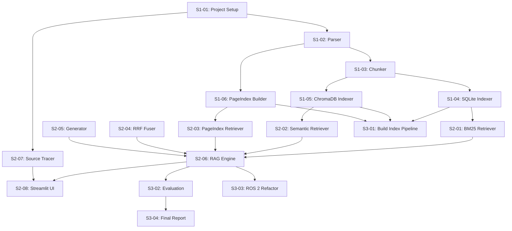

# AI Textbook Q&A System — Sprint Plan & Task Breakdown

> **Author**: Charlie (Tech Lead)
> **Phase**: 5/11 — Task Breakdown
> **Date**: 2026-03-04
> **Input**: `docs/architecture/system-architecture.md`, `docs/requirements/prd.md`

---

## Sprint Overview

Based on the 5-week timeline (Mar 3 – Apr 3, 2026), structured into 3 sprints:

| Sprint   | Duration              | Focus                                       | Story Points |
| -------- | --------------------- | ------------------------------------------- | ------------ |
| Sprint 1 | Week 1–2 (Mar 3–16)   | Infrastructure: Parsing, Chunking, Indexing | 18           |
| Sprint 2 | Week 3–4 (Mar 17–30)  | Core: Retrieval, Generation, UI             | 20           |
| Sprint 3 | Week 5 (Mar 31–Apr 3) | Polish: Evaluation, ROS 2, Report           | 10           |

---

## Sprint 1: Infrastructure (Mar 3–16, 18 SP)

### S1-01: Project Setup & Configuration (3 SP)

**Priority**: P0 | **Assignee**: Both | **US**: —
**DoD**: Project structure created, dependencies installed, config loading works

- [ ] Create directory structure per architecture doc §7
- [ ] Create `pyproject.toml` with all dependencies
- [ ] Implement `config.py` — `Config` dataclass loading from `config.yaml`
- [ ] Create `config.yaml` with defaults
- [ ] Verify `uv run python -c "from src.config import Config; print(Config.load())"` works

**Files**: `src/config.py`, `config.yaml`, `pyproject.toml`

---

### S1-02: Content List Parser (3 SP)

**Priority**: P0 | **Assignee**: Wang Peng | **US**: US-001, US-002
**DoD**: Parse all `content_list.json` files into structured Python objects

- [ ] Implement `MinerUParser.parse_content_list(path) -> list[ContentItem]`
- [ ] Define `ContentItem` dataclass: `type, text, text_level, bbox, page_idx`
- [ ] Filter out `type="discarded"` entries
- [ ] Handle edge cases: empty text, missing bbox, missing text_level
- [ ] Test: parse `goodfellow_deep_learning_content_list.json`, verify item count and types

**Files**: `src/preprocessing/parser.py`, `tests/test_parser.py`
**Depends on**: S1-01

---

### S1-03: Layout-Aware Chunker (4 SP)

**Priority**: P0 | **Assignee**: Wang Peng | **US**: US-003
**DoD**: Chunks produced with correct metadata; tables/formulas preserved intact

- [ ] Implement `LayoutAwareChunker.chunk(content_items, book_key, book_meta) -> list[Chunk]`
- [ ] Text chunking: merge consecutive text items up to 512 tokens, 50-token overlap
- [ ] Table/formula preservation: each table/formula = single chunk (never split)
- [ ] Chapter/section tracking: detect headings (text_level=1,2) and assign to subsequent chunks
- [ ] `chunk_id` generation: `"{book_key}_p{page}_{idx}"`
- [ ] Test: verify PRML table chunk is intact, formula chunk is not split

**Files**: `src/preprocessing/chunker.py`, `tests/test_chunker.py`
**Depends on**: S1-02

---

### S1-04: SQLite FTS5 Indexer (3 SP)

**Priority**: P0 | **Assignee**: Yoo Hye Ran | **US**: US-005
**DoD**: All chunks indexed in SQLite; BM25 search returns results

- [ ] Implement `SQLiteIndexer.create_index(chunks: list[Chunk])`
- [ ] Create `chunks` table and `chunks_fts` FTS5 virtual table per architecture §4.2
- [ ] Implement `SQLiteIndexer.search(query: str, top_k: int) -> list[Chunk]`
- [ ] Support incremental indexing (skip already-indexed books)
- [ ] Test: index 100 chunks, BM25 search for "gradient descent" returns relevant results

**Files**: `src/indexing/sqlite_indexer.py`, `tests/test_sqlite_indexer.py`
**Depends on**: S1-03

---

### S1-05: ChromaDB Vector Indexer (3 SP)

**Priority**: P0 | **Assignee**: Yoo Hye Ran | **US**: US-006
**DoD**: All chunks embedded and stored in ChromaDB; semantic search works

- [ ] Implement `ChromaIndexer.create_index(chunks: list[Chunk])`
- [ ] Use `all-MiniLM-L6-v2` for embeddings (384-dim)
- [ ] Persistent ChromaDB collection at `data/chroma_db/`
- [ ] Implement `ChromaIndexer.search(query: str, top_k: int) -> list[Chunk]`
- [ ] Handle batch embedding (100 chunks per batch to avoid OOM)
- [ ] Test: index 100 chunks, semantic search for "avoiding overfitting" returns relevant results

**Files**: `src/indexing/chroma_indexer.py`, `tests/test_chroma_indexer.py`
**Depends on**: S1-03

---

### S1-06: PageIndex Tree Builder (2 SP)

**Priority**: P1 | **Assignee**: Wang Peng | **US**: US-007
**DoD**: TOC trees generated for all books as JSON files

- [ ] Implement `PageIndexBuilder.build_tree(content_items, book_key) -> PageIndexTree`
- [ ] Extract heading hierarchy from `text_level` field (1 = chapter, 2 = section)
- [ ] Compute `page_start` and `page_end` for each node
- [ ] Save trees as `data/pageindex_trees/{book_key}.json`
- [ ] Test: verify `goodfellow_deep_learning` tree has ~20 top-level chapters

**Files**: `src/indexing/pageindex_builder.py`, `tests/test_pageindex_builder.py`
**Depends on**: S1-02

---

## Sprint 2: Core Pipeline (Mar 17–30, 20 SP)

### S2-01: BM25 Retriever (2 SP)

**Priority**: P0 | **Assignee**: Yoo Hye Ran | **US**: US-008
**DoD**: BM25 search exposed as retriever interface; <100ms latency

- [ ] Implement `BM25Retriever` wrapping `SQLiteIndexer.search()`
- [ ] Add book/content_type filtering support
- [ ] Return ranked `list[RetrievedChunk]` with BM25 scores
- [ ] Test: query "Adam optimizer" returns Goodfellow Ch8.5 chunks

**Files**: `src/retrieval/bm25_retriever.py`
**Depends on**: S1-04

---

### S2-02: Semantic Retriever (2 SP)

**Priority**: P0 | **Assignee**: Yoo Hye Ran | **US**: US-009
**DoD**: Semantic search with cosine similarity; paraphrased queries work

- [ ] Implement `SemanticRetriever` wrapping `ChromaIndexer.search()`
- [ ] Add book/content_type filter via ChromaDB `where` clause
- [ ] Return ranked `list[RetrievedChunk]` with cosine similarity score
- [ ] Test: query "how to prevent model from memorizing training data" returns overfitting chunks

**Files**: `src/retrieval/semantic_retriever.py`
**Depends on**: S1-05

---

### S2-03: PageIndex Tree Retriever (3 SP)

**Priority**: P1 | **Assignee**: Wang Peng | **US**: US-010
**DoD**: LLM navigates TOC tree to find relevant sections

- [ ] Implement `PageIndexRetriever.search(query, trees) -> list[RetrievedChunk]`
- [ ] Stage 1: Summarize top-2 levels of all book trees → LLM selects relevant chapters
- [ ] Stage 2: Expand selected chapters' full subtrees → LLM selects specific sections
- [ ] Retrieve chunks from selected page ranges via SQLite
- [ ] Implement 10s timeout (architecture ADR-2)
- [ ] Test: query "convolutional neural networks" navigates to Goodfellow Ch9

**Files**: `src/retrieval/pageindex_retriever.py`
**Depends on**: S1-06, S2-04 (needs Ollama client)

---

### S2-04: RRF Fuser (2 SP)

**Priority**: P0 | **Assignee**: Wang Peng | **US**: US-011
**DoD**: Combine results from all methods into single ranked list

- [ ] Implement `RRFFuser.fuse(results_per_method: dict[str, list]) -> list[RetrievedChunk]`
- [ ] RRF formula: `score(d) = Σ 1/(k + rank_i(d))` with k=60
- [ ] Deduplicate by chunk_id, keep highest fused score
- [ ] Return top_k results (default 5)
- [ ] Test: verify fusion of 3 result lists produces correct ordering

**Files**: `src/retrieval/rrf_fuser.py`, `tests/test_rrf_fuser.py`
**Depends on**: —

---

### S2-05: Answer Generator (3 SP)

**Priority**: P0 | **Assignee**: Wang Peng | **US**: US-012
**DoD**: Grounded answers generated with inline citations

- [ ] Implement `AnswerGenerator.generate(question, chunks) -> Answer`
- [ ] System prompt: "Answer based only on the provided context. Cite sources as [1], [2]."
- [ ] Context window management: truncate chunks if total > model context limit
- [ ] Handle "no relevant context" case → fallback message
- [ ] Implement `QueryResult` dataclass (answer + sources + stats)
- [ ] Test: ask "What is backpropagation?" with Goodfellow chunks, verify cited answer

**Files**: `src/generation/generator.py`, `tests/test_generator.py`
**Depends on**: S2-04

---

### S2-06: RAG Engine Orchestrator (3 SP)

**Priority**: P0 | **Assignee**: Both | **US**: US-011, US-012
**DoD**: End-to-end query pipeline works: question → answer + sources

- [ ] Implement `RAGEngine.__init__(config)` — loads all retrievers + generator
- [ ] Implement `RAGEngine.query(question, filters) -> QueryResult`
- [ ] Parallel retrieval using `concurrent.futures.ThreadPoolExecutor`
- [ ] Per-method timeout (10s) with graceful fallback
- [ ] Implement `get_available_books()` from SQLite
- [ ] Integration test: ask 3 questions, verify answers have sources

**Files**: `src/rag_engine.py`, `tests/test_rag_engine.py`
**Depends on**: S2-01, S2-02, S2-03, S2-05

---

### S2-07: Source Tracer (2 SP)

**Priority**: P0 | **Assignee**: Yoo Hye Ran | **US**: US-016
**DoD**: PDF page rendered as image with yellow bbox highlight

- [ ] Implement `SourceTracer.render_page_with_highlight(book_key, page, bbox, zoom)`
- [ ] Use PyMuPDF to open PDF → render page to image at specified zoom
- [ ] Draw yellow overlay rectangle (semi-transparent fill + solid border)
- [ ] Resolve `book_key` → PDF path using config
- [ ] Handle missing PDF gracefully (return placeholder image)
- [ ] Test: render Goodfellow p.306 with bbox for formula, verify highlight visible

**Files**: `src/tracing/source_tracer.py`, `tests/test_source_tracer.py`
**Depends on**: S1-01

---

### S2-08: Streamlit UI (3 SP)

**Priority**: P0 | **Assignee**: Both | **US**: US-013–US-017
**DoD**: Full interactive UI per wireframes; multi-turn sessions work

- [ ] Question input bar with "Ask" button
- [ ] Answer display with styled inline citations
- [ ] Source reference cards (book, chapter, page, content type badge)
- [ ] PDF viewer panel with bbox highlight on reference click
- [ ] Sidebar: book filter (multiselect), content type filter (checkbox)
- [ ] Loading states (spinner + progress per retrieval method)
- [ ] Error states (Ollama down, no results, PDF missing)
- [ ] Custom CSS for design system tokens (colors, fonts, badges)
- [ ] Session state for multi-turn Q&A history

**Files**: `src/app.py`
**Depends on**: S2-06, S2-07

---

## Sprint 3: Polish & Delivery (Mar 31–Apr 3, 10 SP)

### S3-01: Build Index Pipeline (2 SP)

**Priority**: P0 | **Assignee**: Wang Peng | **US**: US-004
**DoD**: Single script processes all books and builds all indexes

- [ ] Implement `scripts/build_index.py` — batch pipeline
- [ ] Progress logging: "Processing 5/50: bishop_prml"
- [ ] Error recovery: skip failed books, report at end
- [ ] Book whitelist support from config
- [ ] Verify: all indexes populated, no missing data

**Files**: `scripts/build_index.py`
**Depends on**: S1-04, S1-05, S1-06

---

### S3-02: 20-Question Evaluation (3 SP)

**Priority**: P0 | **Assignee**: Both | **US**: US-018, US-019
**DoD**: Evaluation report with ≥80% accuracy

- [ ] Prepare 20 questions spanning ML, NLP, math, RL, CV, Python
- [ ] Run each question through RAG pipeline
- [ ] Record answer + top-3 chunks per question
- [ ] Manual scoring: 1 / 0.5 / 0 per answer
- [ ] Mark top-3 chunks as relevant/not-relevant
- [ ] Generate report: average accuracy, per-question breakdown

**Files**: `scripts/evaluate.py`, `docs/evaluation/evaluation_report.md`
**Depends on**: S2-06

---

### S3-03: OOP Refactor for ROS 2 (2 SP)

**Priority**: P1 | **Assignee**: Wang Peng | **US**: US-020, US-021
**DoD**: RAGEngine importable as standalone class; ROS 2 node template ready

- [ ] Verify `RAGEngine` is fully self-contained (no Streamlit dependencies)
- [ ] Create `ollama_publisher.py` ROS 2 node template
- [ ] ROS 2 node subscribes to `words`, publishes to `ollama_reply`
- [ ] Model name and knowledge path as ROS 2 parameters
- [ ] Document ROS 2 setup instructions

**Files**: `src/ros2/ollama_publisher.py`, docs update
**Depends on**: S2-06

---

### S3-04: Final Report & Presentation (3 SP)

**Priority**: P0 | **Assignee**: Both | **US**: —
**DoD**: 6–10 page report + 10-minute presentation

- [ ] Abstract, Introduction, Dataset, Method, Results
- [ ] Reproducibility details (setup, execution steps, source code)
- [ ] Challenges and Solutions
- [ ] Discussion and Future Work
- [ ] References
- [ ] PowerPoint: 8–10 slides per assignment spec

**Files**: `docs/report/final_report.md`, `docs/report/presentation.pptx`
**Depends on**: S3-02

---

## Dependency Graph

---

## Work Distribution

| Member      | Sprint 1 Tasks                  | Sprint 2 Tasks                  | Sprint 3 Tasks       | Total SP |
| ----------- | ------------------------------- | ------------------------------- | -------------------- | -------- |
| Wang Peng   | S1-02 (3), S1-03 (4), S1-06 (2) | S2-03 (3), S2-04 (2), S2-05 (3) | S3-01 (2), S3-03 (2) | 21       |
| Yoo Hye Ran | S1-04 (3), S1-05 (3)            | S2-01 (2), S2-02 (2), S2-07 (2) | S3-02 (3)            | 15       |
| Both        | S1-01 (3)                       | S2-06 (3), S2-08 (3)            | S3-04 (3)            | 12       |
